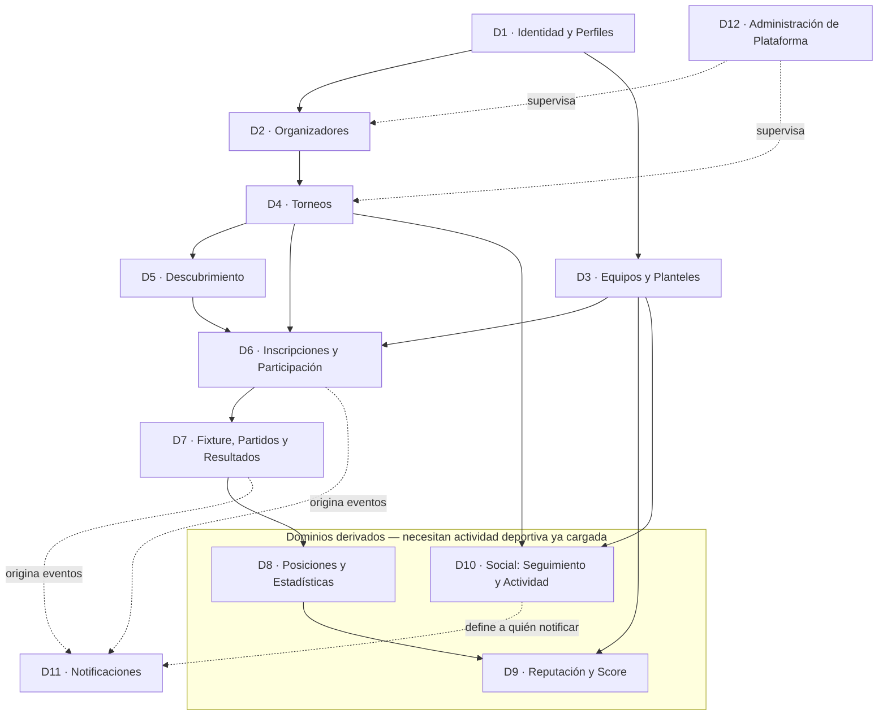
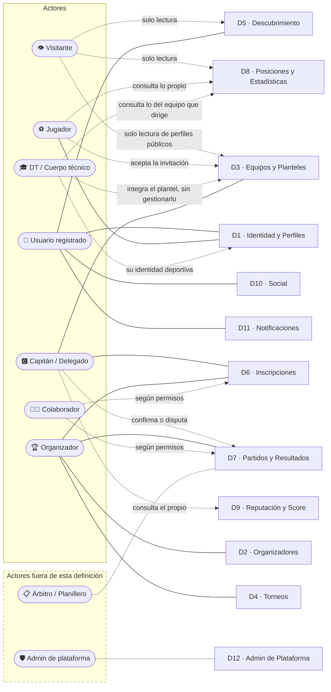

# Arquitectura funcional y mapa de actores — INVICTOS

> **Nombre del producto: INVICTOS** (`06`, D-84). En los documentos "la plataforma" se conserva donde funciona como sustantivo común; el nombre propio se usa en los títulos y donde se habla del producto como marca.

## 1. Objetivo del documento

Este documento define **de qué está hecho el producto**: qué dominios funcionales existen, qué responsabilidad tiene cada uno, cómo dependen entre sí, y quiénes son los actores que lo usan. Es la vista de conjunto que se lee **antes** de los Casos de Uso — responde "qué partes tiene el sistema", no todavía "qué hace cada parte paso a paso".

Se apoya en, y debe leerse junto con:
- **`00-analisis-documentacion-referencia.md`**: de dónde sale la metodología usada y qué significan las marcas de estado de decisión — `[Definido]` y `[Supuesto]`.
- **`02-casos-de-uso.md`**: el detalle funcional de cada dominio listado acá.
- **`03-diagrama-entidad-relacion.md`**: qué información maneja cada dominio.
- **`06-reglas-negocio-y-decisiones-pendientes.md`**: las decisiones que este documento da por tomadas, y los supuestos y valores de arranque que quedan por confirmar o calibrar.

---

## 2. Visión del producto

**[Definido]** La plataforma combina dos cosas que hoy viven separadas:

1. **Una herramienta de gestión operativa** para que un organizador pueda administrar sus torneos de principio a fin — equipos, jugadores, inscripciones, fixture, resultados y posiciones.
2. **Un espacio público de descubrimiento y comunidad**, donde jugadores y equipos encuentran torneos, se inscriben, siguen competencias y construyen un historial deportivo propio.

**[Definido]** La visión de largo plazo no es un administrador de torneos: es un **ecosistema de fútbol** donde la actividad de los torneos genera información, historial, reputación y conexiones entre usuarios.

**[Definido]** Los dos productos conviven en una **plataforma pública única**: los torneos publicados son descubribles por cualquiera, no viven encerrados en el espacio privado de cada organizador. Esta decisión es la que habilita el descubrimiento, el seguimiento y un score comparable entre equipos de distintos torneos — ver `06`, D-02.

**[Definido]** El caso base es el **fútbol amateur** (torneos de complejo, ligas de barrio, F5 a F11). El modelo se diseña para soportar más adelante **ligas formales o federadas**, marcando en cada dominio qué requeriría esa extensión — ver `06`, D-03.

**[Definido] El producto arranca gratis para todos, y la monetización llega en cuatro etapas** (`06`, D-31): publicidad servida por una red externa (Google) desde el inicio; publicidad de sponsors vendida directamente, más adelante; suscripción para grandes organizadores; y comisión sobre las transacciones de pago que ocurran dentro de la plataforma. Nada de eso se cobra hoy. La consecuencia de producto es directa: si el producto tiene que sostenerse siendo gratis, la métrica que importa en la primera etapa **no es la facturación sino el tráfico de las superficies de consulta** — ficha pública del torneo, fixture, descubrimiento —, que son exactamente las que después sostienen la publicidad. Es el mismo activo que ya justifica el descubrimiento como motor del producto, mirado desde el lado del ingreso.

### 2.1 Los tres motores del producto

Toda funcionalidad de este set responde a uno de estos tres motores. Sirve como criterio para decidir si algo pertenece al producto o no:

| Motor | Para quién | Qué tiene que lograr |
|---|---|---|
| **Gestión operativa** | Organizador | Que administrar un torneo sea más simple que hacerlo con planillas y grupos de mensajería. Si el organizador no viene, no hay contenido. |
| **Experiencia de participación** | Equipos y jugadores | Que descubrir, inscribirse y seguir una competencia sea inmediato. Si los equipos no vienen, el organizador no tiene a quién convocar. |
| **Comunidad y reputación** | Todos | Que la actividad deje huella: perfiles, historial, estadísticas, score, seguimiento. Es lo que hace que alguien vuelva cuando no está jugando ningún torneo. |

**[Definido] Orden de construcción sugerido:** los tres motores no arrancan a la vez. El primero es el que genera el dato (gestión operativa), el segundo lo consume (participación), el tercero lo acumula (comunidad). Un score sin partidos cargados no vale nada. Ver `07-roadmap-funcional.md`.

---

## 3. Dominios funcionales

**[Definido]** El producto se organiza en **12 dominios** (`06`, D-16). La lista de referencia del pedido inicial tenía 14 ítems; los cambios respecto de esa lista, con su fundamento, están en 3.3.

| # | Dominio | Responsabilidad | Motor |
|---|---|---|---|
| **D1** | **Identidad y Perfiles** | Quién es cada persona en la plataforma: cuenta, perfil de jugador, visibilidad y privacidad. | Comunidad |
| **D2** | **Organizadores** | Quién administra torneos: la entidad organizadora, su equipo de trabajo, sus roles y su perfil público. | Gestión |
| **D3** | **Equipos y Planteles** | El equipo como sujeto permanente de la plataforma, su plantel, sus roles internos y su identidad pública. | Participación |
| **D4** | **Torneos** | La competencia: creación, configuración, formato, publicación y ciclo de vida. | Gestión |
| **D5** | **Descubrimiento** | Cómo un equipo o jugador encuentra un torneo al que no fue invitado. | Participación |
| **D6** | **Inscripciones y Participación** | El vínculo entre un equipo y un torneo puntual: solicitud, aprobación, plantel habilitado, baja. | Participación |
| **D7** | **Competencia: Fixture, Partidos y Resultados** | La ejecución deportiva: generar el fixture, programar partidos, cargar y confirmar resultados. | Gestión |
| **D8** | **Posiciones y Estadísticas** | Todo lo que se deriva de los resultados: tabla, goleadores, historial de equipos y jugadores. | Comunidad |
| **D9** | **Reputación y Score** | El indicador de desempeño acumulado de un equipo, y los rankings que se construyen con él. | Comunidad |
| **D10** | **Social: Seguimiento y Actividad** | Seguir torneos y equipos, y ver qué pasó con lo que uno sigue. | Comunidad |
| **D11** | **Notificaciones** | Cómo se entera cada actor de lo que le importa, dentro y fuera de la plataforma. | Transversal |
| **D12** | **Administración de Plataforma** | Moderación, verificación de organizadores, resolución de conflictos y configuración global. | Transversal |

### 3.1 Mapa de dominios y dependencias

> **Cómo leerlo:** una flecha de A hacia B significa "B necesita que A exista para poder funcionar". El bloque punteado agrupa lo que depende de que ya haya actividad deportiva cargada — no puede construirse antes.

**Lecturas clave del mapa:**

- **D1 es la raíz de todo.** No hay organizador sin cuenta, no hay equipo sin capitán, no hay jugador sin identidad. Es el equivalente estructural a lo que `Tenant` era en el sistema de referencia, pero con una diferencia central: acá la raíz es **la persona**, no la organización.
- **D7 es el corazón del dato.** Todo lo derivado (posiciones, estadísticas, score, feed, notificaciones) sale de que un partido tenga un resultado cargado y confirmado. Si D7 no es confiable, D8, D9 y D10 heredan esa falta de confiabilidad.
- **D6 es la bisagra entre los dos productos**: es donde el descubrimiento público se convierte en gestión operativa.
- **D9 depende de D8 y de D3**, no de D7 directamente: el score se calcula sobre resultados ya consolidados en la tabla, no sobre cada partido suelto. Ver `06`, 5.3: solo alimenta el score lo confirmado.

### 3.2 Dependencias funcionales explícitas entre dominios

| Si cambia esto… | …impacta directamente en |
|---|---|
| El formato del torneo (D4) | La generación del fixture (D7), el cálculo de la tabla (D8) y qué significa "posición final" para el score (D9) |
| El estado del torneo (D4) | Si se aceptan inscripciones (D6), si se pueden cargar resultados (D7), si el torneo aparece en descubrimiento (D5) |
| El **nivel de verificación de la organización** (D2) | Si el torneo puede publicarse en el descubrimiento (D5): sin verificar, sus torneos quedan accesibles por link pero no aparecen en la búsqueda (`06`, D-51) — y, por lo tanto, si el torneo puede recibir inscripciones (D6) de equipos que no conocen al organizador. No condiciona nada de la gestión: crear, configurar, cargar equipos, generar el fixture y cargar resultados funcionan igual |
| La aprobación o baja de una inscripción (D6) | El fixture (D7) — un equipo que se va con el torneo empezado deja partidos huérfanos: los jugados se mantienen y los pendientes se dan por ganados a sus rivales, configurable por torneo (`06`, D-08b) |
| El reglamento del torneo (D4) | La resolución de disputas (D7) — es el texto contra el que se justifica una decisión, y por eso importa **qué versión regía** cuando ocurrió el hecho (`06`, D-28) — y lo que muestra la ficha pública (D5), donde un capitán lee las reglas antes de inscribirse |
| La confirmación o disputa de un resultado (D7) | Tabla (D8), estadísticas de jugador (D8), score del equipo (D9), feed y notificaciones (D10, D11) |
| El plantel habilitado de un equipo en un torneo (D6) | Quién puede figurar en los eventos de un partido (D7) y a quién se le acreditan las estadísticas (D8) |
| La visibilidad del perfil (D1) | Qué muestra el perfil público de jugador (D1), y si el jugador aparece en estadísticas públicas (D8) |
| El resultado de un partido (D7) | El score del equipo (D9), que a su vez alimenta rankings públicos (D9) — un error de carga es visible mucho más allá del torneo donde ocurrió |
| La asignación de colaboradores a un torneo (D2) | Quién puede operar ese torneo (D7): cargar resultados y eventos, programar y reprogramar partidos, registrar partidos no disputados — y quién puede intervenir en la resolución de inscripciones (D6). El vínculo es **con el torneo, no con la organización** (`06`, D-32), así que sacar a alguien de un torneo no lo saca de los demás |

### 3.3 Diferencias respecto de la lista de módulos inicial, y su fundamento

| Módulo de la lista inicial | Qué se hizo | Fundamento |
|---|---|---|
| "Gestión de usuarios y perfiles" | Se conserva como **D1** | — |
| "Gestión de organizadores" | Se conserva como **D2** | — |
| "Gestión de equipos" + "Gestión de jugadores" | **Se fusionan en D3 (Equipos y Planteles)**, con el perfil individual del jugador viviendo en D1 | Un jugador tiene dos facetas distintas: su **identidad** (perfil, historial, seguidores — es siempre suya, existe aunque no juegue en ningún equipo) y su **pertenencia a un plantel** (es del equipo, cambia con el tiempo, y puede tener varias simultáneas). Separarlas por naturaleza y no por nombre evita que "gestionar jugadores" signifique dos cosas distintas según quién lo diga. |
| "Gestión de torneos" | Se conserva como **D4** | — |
| "Descubrimiento y búsqueda de torneos" | Se conserva como **D5** | Aunque técnicamente sea "una búsqueda sobre D4", funcionalmente es un producto distinto: D4 le sirve al organizador, D5 le sirve a alguien que no conoce al organizador. Tienen usuarios, objetivos y criterios de éxito diferentes. |
| "Inscripciones y participación" | Se conserva como **D6** | — |
| "Gestión de partidos y resultados" | Se conserva y **se amplía a D7**, incluyendo la generación del fixture | Programar partidos y generarlos no son cosas separables: el fixture es lo que crea los partidos que después se programan y se resuelven. |
| "Posiciones, estadísticas y rankings" | **Se parte en dos:** D8 (posiciones y estadísticas) y D9 (score y rankings) | No son lo mismo. **D8 es un cálculo cerrado y no opinable** dentro de un torneo (reglamento del torneo: 3 puntos por ganar, diferencia de gol). **D9 es un modelo de producto, atravesado por decisiones de negocio abiertas** (qué pondera, cómo se compara un equipo de un torneo chico con uno de un torneo grande, si decae con el tiempo). Mezclarlas haría que una decisión de producto todavía no tomada contamine un cálculo que sí está claro. |
| "Score o reputación de equipos" | Se fusiona en **D9** | Es el mismo dominio que los rankings: el ranking es el score ordenado. |
| "Seguimiento de equipos y torneos" + "Funcionalidades sociales" | **Se fusionan en D10** | Seguir *es* la funcionalidad social del MVP. Mantenerlas separadas sugeriría que hay un dominio social ya definido más allá del seguimiento, y no lo hay: lo social se acota a seguir y consultar actividad derivada de hechos del sistema — ver `06`, D-11b. |
| "Notificaciones" | Se conserva como **D11** | Se declara explícitamente **transversal**: no genera eventos propios, los consume de D6, D7 y D10. |
| "Administración y configuración" | Se conserva como **D12** | Se acota a lo que es de la plataforma (moderación, verificación, conflictos). La configuración *del torneo* es de D4 y la *del perfil* es de D1 — juntarlas en un módulo "configuración" genérico dispersa reglas que pertenecen a su dominio. |

---

## 4. Mapa de actores

### 4.1 Los actores y su relación con la plataforma

| Actor | Quién es | Qué busca | Qué lo distingue |
|---|---|---|---|
| **Visitante** | Cualquiera sin sesión iniciada | Ver un torneo, un fixture o una tabla que le compartieron | **[Definido]** Es un actor de pleno derecho, no un usuario incompleto: la mayor parte del contenido de esta plataforma se comparte por link. Consulta todo el contenido público; el registro se pide solo para actuar. Ver `06`, D-04b. |
| **Usuario registrado** | Persona con cuenta | Seguir torneos y equipos, guardar preferencias | Es la base sobre la que se apoyan los demás roles: todos los actores autenticados son, primero, un usuario registrado. |
| **Jugador** | Usuario registrado con perfil deportivo | Encontrar dónde jugar, pertenecer a un equipo, tener historial y estadísticas propias | **[Definido]** Su perfil es suyo y sobrevive a los equipos por los que pasó. |
| **Capitán / Delegado de equipo** | Jugador con responsabilidad sobre un equipo | Armar el plantel, inscribir el equipo, gestionar la participación | Es el rol operativo más importante del lado de los equipos: es quien toma decisiones que comprometen a todo un grupo. |
| **DT / Cuerpo técnico** | Persona que dirige a un equipo: entrenador, ayudante, preparador físico. Puede tener cuenta o ser un perfil cargado por el capitán | Figurar en el equipo y en la lista de buena fe de cada torneo, seguir el fixture y los resultados de sus equipos | **[Definido]** Es **un rol más dentro del equipo, no obligatorio**, y un equipo puede tener varios (`06`, D-18, D-27). Su rol es **deportivo, no administrativo**: por sí solo no habilita gestionar el plantel ni inscribir al equipo — para eso hay que darle además el rol de Delegado o ser Capitán (`06`, D-25). Una misma persona puede ser **DT en un equipo y jugador en otro**, porque el rol vive en el vínculo con cada equipo y no en la cuenta (`06`, D-23). Entra en la lista de buena fe pero **no ocupa cupo de jugadores** (`06`, D-24). |
| **Organizador** | Persona o entidad que administra torneos | Publicar y administrar sus competencias, llenar cupos, reducir trabajo manual | **[Definido]** Puede administrar varios torneos y tener un equipo de colaboradores. **[Definido]** Su organización tiene un **nivel de verificación** que **no condiciona armar ni gestionar el torneo, sino aparecer en el descubrimiento**: sin verificar puede crear, configurar y publicar, pero sus torneos quedan accesibles por link y no listados en la búsqueda (`06`, D-51). El fundamento es que el activo a proteger de la basura es el descubrimiento; poner la fricción en el alta castigaría al organizador legítimo justo cuando todavía no invirtió nada. |
| **Colaborador del organizador** | Persona invitada por un organizador para ayudar en **un torneo puntual** | Ayudar en la operación (cargar resultados, atender inscripciones) sin control total | **[Definido]** Existe desde el MVP porque cargar resultados es la tarea más frecuente y menos delegable si no hay roles. Sus permisos son **fijos**, no configurables: cargar resultados y eventos, programar y reprogramar partidos, y registrar partidos no disputados. **Se asigna por torneo, no por organización** (UC-52), así que una misma persona puede colaborar en varios torneos a la vez, incluso de organizaciones distintas — ver `06`, D-32 y D-34. **[Definido]** Lo puede asignar y quitar **el Titular o un Administrador**, este último en los torneos que administra; lo que ninguno de los dos hace es repartir roles de organización — crear o quitar Administradores queda reservado al Titular (`06`, D-64). |
| **Administrador de plataforma** | Equipo del producto | Moderar, verificar organizadores, resolver conflictos | Fuera del alcance funcional de esta entrega, igual que el back-office en el set de referencia. |
| **Árbitro / Planillero** | Tercero que carga el resultado en la cancha | Cargar el resultado del partido que dirigió | **[Definido]** **No existe como actor propio**: sus tareas las cubre el Colaborador del organizador. Un rol más, con sus permisos y su ciclo de invitación, no se justificaba sin un caso que lo distinguiera del Colaborador — ver `06`, D-06b. Se lo deja anotado en el mapa como extensión posible hacia ligas formales. |

### 4.2 Diagrama de actores y dominios

> **Cómo leerlo:** línea sólida = interacción principal del actor con ese dominio. Línea punteada = interacción parcial, de solo consulta o condicionada. El bloque punteado agrupa a los actores fuera del alcance de esta primera definición funcional.

### 4.3 Un mismo usuario, varios actores a la vez

**[Definido]** Los actores **no son excluyentes**: la misma persona puede ser jugador en un equipo, capitán de otro, y organizador de su propio torneo. Es el caso típico del fútbol amateur, no una excepción.

**[Definido] Consecuencia de diseño, heredada del criterio del set de referencia:** los permisos no viven en la cuenta de la persona, sino en **su vínculo con cada cosa** — su rol *en ese equipo*, su rol *en esa organización*. Igual que la `Membresía` del sistema de referencia conectaba usuario ↔ comercio ↔ rol, acá hay tres vínculos análogos: `INTEGRANTE_EQUIPO` (usuario ↔ equipo ↔ rol), `MIEMBRO_ORGANIZACION` (usuario ↔ organización ↔ rol) y `COLABORADOR_TORNEO` (usuario ↔ torneo). Ver `03-diagrama-entidad-relacion.md`.

**[Definido] El Colaborador de Torneo es el tercer vínculo, y confirma la regla.** Su permiso no vive en la cuenta ni en la organización, sino en el vínculo con **un torneo puntual** (`06`, D-32, D-34): por eso una misma persona puede colaborar en varios torneos a la vez, incluso de organizaciones distintas, y sacarla de uno no la saca de los demás. El patrón es siempre el mismo — el permiso vive en el vínculo con una cosa concreta (un equipo, una organización, un torneo), nunca en la persona.

**[Definido] El cuerpo técnico es el caso más claro de todos.** Una misma persona puede ser **DT de un equipo y jugador de otro** —o las dos cosas en el mismo equipo, que en el amateur es habitual— sin que eso obligue a duplicar su identidad ni a inventar un tipo de usuario nuevo: hay un vínculo `INTEGRANTE_EQUIPO` por cada combinación de equipo, persona y rol. Por eso el requerimiento del cuerpo técnico **se absorbió sin ningún cambio estructural del modelo** — ver `06`, D-23. Es también lo que permite que sumar un DT **no** le entregue el control del equipo: el rol de DT es deportivo, y el permiso de gestión viaja en otro vínculo (`06`, D-25).

**[Definido] Consecuencia de UX:** la interfaz no debería pedirle a la persona que "elija un modo" al entrar. El contexto lo da la cosa que está mirando, no un selector global. Ver `05-flujos-ux-user-journeys.md`.

### 4.4 Criterio de validación funcional por actor

Heredado del set de referencia (donde se validaba que "el Cajero cubre el área de Ventas" y "el Depósito cubre el área de Compras"), se define el equivalente para este producto. Sirve para decidir rápido, ante un caso de uso nuevo, si un actor debería tener acceso:

- El **Capitán** cubre *todo lo necesario para que su equipo compita*: armar plantel, descubrir torneos, inscribirse, confirmar la lista, ver el fixture propio, confirmar o disputar resultados propios.
- El **Organizador** cubre *todo lo necesario para que su torneo exista y avance*: configurarlo, publicarlo, resolver inscripciones, generar y programar el fixture, cerrar resultados, cambiar el estado del torneo.
- El **Jugador** cubre *todo lo relativo a su propia identidad deportiva*: su perfil, su historial, sus estadísticas, sus invitaciones.
- El **DT / Cuerpo técnico** cubre *todo lo necesario para dirigir, y nada de lo que compromete al equipo*: aceptar la invitación, figurar en el plantel y en la lista habilitada, ver el fixture, los resultados y las estadísticas del equipo que dirige. Ante un caso de uso nuevo, la pregunta es si la acción compromete al equipo frente al torneo: si lo compromete, es del Capitán o del Delegado, no del DT.
- El **Colaborador** cubre *la operación de los torneos a los que está asignado, y nada más*: cargar resultados y eventos, programar y reprogramar partidos, registrar partidos no disputados. Ante un caso de uso nuevo, la pregunta es doble: si la acción define el torneo en vez de operarlo (configurarlo, publicarlo, cancelarlo, resolver inscripciones), es del Organizador; y si toca un torneo al que no está asignado, no es suya aunque sea de la misma organización.
- El **Usuario registrado** cubre *todo lo relativo a qué le interesa seguir*: búsquedas, seguimientos, notificaciones.

---

## 5. Fuera de alcance de esta definición funcional

- **El detalle de implementación de la monetización** (pasarela de pago, facturación, límites por plan). **[Definido]** El **modelo** está definido en cuatro etapas (`06`, D-31) y resumido en la sección 2, y la Inscripción se modela desde el día uno con un costo asociado, hoy siempre cero (`06`, D-33). **[Definido]** También están definidas las **superficies con publicidad**: ficha pública del torneo, fixture y descubrimiento sí; los flujos de tarea del organizador y el flujo de inscripción del capitán, no (`06`, D-63). Lo que queda fuera de esta definición funcional es cómo se cobra — y **qué define a un "gran organizador" y qué incluye su suscripción se resuelve con datos de uso reales, no sobre el papel** (`06`, D-62): no es una decisión pendiente, es un límite que solo tiene sentido fijar cuando se sabe cuánto usa cada quién.
- **Gestión de canchas y sedes como producto propio** (disponibilidad, reservas). **[Definido]** Se modela solo el dato mínimo de dónde se juega un partido —nombre, dirección y zona—, porque la disponibilidad y las reservas son un producto entero aparte — ver `06`, D-12b.
- **Cobertura en vivo del partido** (minuto a minuto, tiempo real).
- **Contenido social más allá del seguimiento** (publicaciones, comentarios, mensajería directa, fotos). **[Definido]** Queda fuera: el contenido generado por usuarios trae moderación, y sin masa crítica un feed vacío hace parecer abandonado al producto — ver `06`, D-11b.
- **Sanciones deportivas automáticas** (suspensión por acumulación de tarjetas). **[Definido]** El reglamento del torneo (UC-51) puede establecerlas, pero la plataforma no las aplica sola en esta versión — ver `06`, D-34b.
- **Todo lo técnico**: stack, arquitectura, endpoints, modelo de despliegue.
- **Todo lo visual**: identidad de marca, paleta, tipografía, diseño de pantallas.
