# Casos de Uso — INVICTOS

## 1. Objetivo del documento

Este documento describe **cómo funciona la plataforma desde la perspectiva del negocio**: quién puede iniciar cada interacción, qué sucede paso a paso, y qué reglas la gobiernan. Es intencionalmente **funcional, no técnico** — no menciona endpoints, bases de datos ni tecnologías.

Se apoya en, y es consistente con:
- **`01-arquitectura-funcional-y-actores.md`**: de dónde salen los dominios y los actores que se mencionan acá.
- **`03-diagrama-entidad-relacion.md`**: qué entidades y atributos participan en cada caso de uso.
- **`04-catalogo-enumeraciones.md`**: los valores exactos de cada estado o tipo mencionado.
- **`06-reglas-negocio-y-decisiones-pendientes.md`**: el detalle de cada decisión abierta referenciada como `P-nn` o `D-nn`.

**Cómo leer cada caso de uso** *(misma estructura que el set de referencia)*:
- **Actor(es) / Iniciador(es):** quién puede disparar la interacción.
- **Descripción:** resumen de una línea de qué logra.
- **Precondiciones:** qué tiene que ser cierto antes de ejecutarlo.
- **Flujo principal:** la secuencia esperada cuando todo sale bien.
- **Flujos alternativos / excepciones:** qué pasa cuando algo se desvía.
- **Entidades involucradas:** qué información de negocio participa.
- **Reglas de negocio:** las condiciones que el sistema debe respetar siempre.
- **Resultado esperado:** cómo queda el sistema al concluir.

**Marcas de estado de la decisión** *(ver `00`, sección 3.2)*: **[Definido]** · **[Supuesto]** · **[Pendiente de definición]**. Desde la revisión 5 **todas las reglas de este documento están `[Definido]`**: no queda ninguna decisión abierta ni ningún supuesto sin confirmar (`06`, sección 2).

> La marca `[Propuesta]` de la revisión anterior fue adoptada por completo: todas sus recomendaciones pasaron a **[Definido]** y quedaron registradas, con su alternativa elegida y su fundamento, en `06`, sección 4.

> **Revisión 4:** con las 16 decisiones que quedaban abiertas ya tomadas (`06`, 4.3 y 4.4), **este documento no tiene ninguna decisión marcada como pendiente**: la tercera marca se conserva en la lista de arriba para lo que aparezca de acá en adelante, pero no se usa en ningún caso de uso. Lo que queda son **valores de arranque a calibrar** con datos de uso y **catálogos a completar** con los valores del primer mercado; ambas cosas están señaladas como tales donde aparecen, y ninguna bloquea la construcción.

**Alcance:** los casos de uso marcados *(fase futura)* están documentados pero explícitamente fuera de la primera entrega. La clasificación completa está en `07-roadmap-funcional.md`.

---

## 2. Vista general — Casos de uso por dominio

```mermaid
flowchart LR
    subgraph ACTORES["Actores"]
        VIS(["👁️ Visitante"])
        USR(["👤 Usuario registrado"])
        JUG(["⚽ Jugador"])
        DT(["🎓 DT / Cuerpo técnico"])
        CAP(["🅲 Capitán"])
        ORG(["🏆 Organizador"])
        COL(["🧑‍💼 Colaborador"])
    end

    subgraph D1["D1 · Identidad y Perfiles"]
        UC01(["UC-01 Registrarse"])
        UC02(["UC-02 Perfil deportivo"])
        UC03(["UC-03 Ver perfil público"])
        UC04(["UC-04 Visibilidad del perfil"])
        UC05(["UC-05 Reclamar perfil"])
    end

    subgraph D2["D2 · Organizadores"]
        UC06(["UC-06 Crear organización"])
        UC07(["UC-07 Equipo de trabajo"])
        UC08(["UC-08 Perfil del organizador"])
        UC09(["UC-09 Transferir titularidad"])
    end

    subgraph D3["D3 · Equipos y Planteles"]
        UC10(["UC-10 Crear equipo"])
        UC11(["UC-11 Invitar integrantes"])
        UC12(["UC-12 Responder invitación"])
        UC13(["UC-13 Roles y bajas"])
        UC14(["UC-14 Perfil del equipo"])
        UC15(["UC-15 Archivar equipo"])
    end

    subgraph D4["D4 · Torneos"]
        UC16(["UC-16 Crear torneo"])
        UC17(["UC-17 Definir formato"])
        UC18(["UC-18 Publicar torneo"])
        UC19(["UC-19 Modificar torneo"])
        UC20(["UC-20 Avanzar el estado"])
        UC21(["UC-21 Cancelar o suspender"])
        UC51(["UC-51 Reglamento del torneo"])
        UC52(["UC-52 Asignar colaboradores"])
    end

    subgraph D5["D5 · Descubrimiento"]
        UC22(["UC-22 Buscar torneos"])
        UC23(["UC-23 Ficha del torneo"])
    end

    subgraph D6["D6 · Inscripciones"]
        UC24(["UC-24 Solicitar inscripción"])
        UC25(["UC-25 Resolver solicitud"])
        UC26(["UC-26 Inscribir manualmente"])
        UC27(["UC-27 Confirmar plantel"])
        UC28(["UC-28 Baja del torneo"])
    end

    subgraph D7["D7 · Partidos y Resultados"]
        UC29(["UC-29 Generar fixture"])
        UC30(["UC-30 Programar partido"])
        UC31(["UC-31 Cargar resultado"])
        UC32(["UC-32 Confirmar o disputar"])
        UC33(["UC-33 Partido no disputado"])
        UC34(["UC-34 Eventos del partido"])
    end

    subgraph D8["D8 · Posiciones y Estadísticas"]
        UC35(["UC-35 Tabla de posiciones"])
        UC36(["UC-36 Estadísticas del torneo"])
        UC37(["UC-37 Historial de equipo"])
        UC38(["UC-38 Historial de jugador"])
    end

    subgraph D9["D9 · Reputación y Score"]
        UC39(["UC-39 Calcular score"])
        UC40(["UC-40 Consultar score"])
        UC41(["UC-41 Rankings"])
    end

    subgraph D10["D10 · Social"]
        UC42(["UC-42 Seguir torneo"])
        UC43(["UC-43 Seguir equipo"])
        UC44(["UC-44 Actividad"])
        UC45(["UC-45 Seguir jugadores"])
    end

    subgraph D11["D11 · Notificaciones"]
        UC46(["UC-46 Recibir notificación"])
        UC47(["UC-47 Preferencias"])
    end

    VIS -.->|"solo lectura"| UC22
    VIS -.->|"solo lectura"| UC23
    VIS -.->|"solo lectura"| UC35
    USR --- UC01
    USR --- UC42
    USR --- UC43
    USR --- UC44
    USR --- UC47
    JUG --- UC02
    JUG --- UC04
    JUG --- UC05
    JUG --- UC12
    JUG --- UC38
    DT --- UC12
    DT --- UC02
    CAP --- UC10
    CAP --- UC11
    CAP --- UC13
    CAP --- UC24
    CAP --- UC27
    CAP --- UC28
    CAP -.->|"carga"| UC31
    CAP -.->|"confirma o disputa"| UC32
    ORG --- UC06
    ORG --- UC07
    ORG --- UC16
    ORG --- UC18
    ORG --- UC20
    ORG --- UC51
    ORG --- UC52
    ORG --- UC25
    ORG --- UC29
    ORG --- UC31
    COL -.->|"queda asignado"| UC52
    COL -.->|"si está asignado al torneo"| UC31
    COL -.->|"si está asignado al torneo"| UC30
    ORG -.- UC09

    style D9 stroke-dasharray: 5 5
```

---

## Dominio D1 — Identidad y Perfiles

### UC-01 — Registrarse y crear la cuenta

- **Actor(es) / Iniciador(es):** cualquier persona sin cuenta.
- **Descripción:** crea la identidad de una persona en la plataforma, base de cualquier otra participación (jugar, capitanear, organizar, seguir).
- **Precondiciones:** ninguna.
- **Flujo principal:**
  1. La persona indica sus datos mínimos de identidad y una forma de autenticarse.
  2. El sistema crea la cuenta y le da acceso.
  3. La cuenta queda habilitada para seguir torneos y equipos de inmediato, sin ningún paso adicional.
- **Flujos alternativos / excepciones:**
  - Si el identificador ya está registrado, el sistema lo lleva al ingreso en vez de crear una cuenta duplicada.
  - **[Definido]** Si la persona llega desde una invitación (a un plantel, o para reclamar un perfil), el registro debe **resolver esa invitación en el mismo movimiento** — no dejarla en la bandeja para que la busque después. Es el momento de mayor intención y el de mayor riesgo de abandono.
- **Entidades involucradas:** **Usuario**.
- **Reglas de negocio:**
  - **[Definido]** Una cuenta es de una persona, no de un equipo ni de una organización. Equipos y organizaciones se crean *desde* una cuenta, y siempre tienen una persona responsable detrás.
  - **[Definido]** El registro **no pregunta "qué tipo de usuario sos"**. Todos los actores del producto son la misma cuenta con distintos vínculos; preguntarlo al inicio obliga a la persona a decidir algo que todavía no entiende y que además puede cambiar el mismo día (ver `01`, 4.3).
  - **[Definido — D-52]** El registro pide **únicamente un identificador de acceso y un nombre visible**. Cualquier otro dato se pide más adelante, y solo cuando alguna acción lo necesite. Cada campo agregado al alta es una oportunidad de abandono en el único momento en que la persona todavía no recibió nada a cambio. Ver `06`, D-52 y D-13b.
- **Resultado esperado:** la persona tiene una identidad propia en la plataforma y puede empezar a usar el producto sin haber declarado todavía ningún rol.

---

### UC-02 — Completar y mantener el perfil deportivo

- **Actor(es) / Iniciador(es):** Usuario registrado, sobre su propia cuenta.
- **Descripción:** permite que una persona construya su identidad deportiva — la cara pública con la que otros equipos y organizadores la ven.
- **Precondiciones:** la persona tiene cuenta (UC-01).
- **Flujo principal:**
  1. El usuario completa o corrige los datos de su perfil deportivo (por ejemplo: nombre visible, posición, ciudad, foto).
  2. El sistema guarda los cambios.
  3. El perfil queda visible según la configuración de visibilidad elegida (UC-04).
- **Flujos alternativos / excepciones:** un perfil incompleto es perfectamente usable — nunca bloquea unirse a un equipo ni jugar un torneo.
- **Entidades involucradas:** **Usuario**, **Perfil deportivo**.
- **Reglas de negocio:**
  - **[Definido]** El perfil pertenece a la persona, no al equipo: sobrevive a los equipos por los que pasó y acumula su historial (ver UC-38).
  - **[Definido]** Ningún dato del perfil es obligatorio más allá de un nombre visible, y un perfil incompleto nunca bloquea nada. En el fútbol amateur, exigir datos completos al inicio es una barrera de entrada sin contrapartida — el perfil se enriquece solo a medida que la persona juega (`06`, D-13b).
  - **[Definido]** El perfil deportivo representa la **identidad deportiva** de una persona, con independencia del rol que cumpla en cada equipo: la misma entidad sostiene a quien juega, dirige o gestiona. Es lo que evita tener que modelar a un DT como "un jugador que no juega" (`06`, D-22).
  - **[Definido — D-52]** El atributo **posición existe y es opcional**, con cinco valores: **arquero, defensor, mediocampista, delantero** y **sin especificar**. Cinco valores cubren la única búsqueda real de un capitán —"me falta un arquero"—; abrir el catálogo a puestos más finos multiplicaría los valores sin cambiar ninguna decisión en el amateur. Ver `06`, D-52, y `04-catalogo-enumeraciones.md`.
- **Resultado esperado:** la persona tiene una identidad deportiva reconocible dentro de la plataforma.

---

### UC-03 — Consultar el perfil público de un jugador

- **Actor(es) / Iniciador(es):** Visitante, Usuario registrado, Jugador, Capitán, Organizador.
- **Descripción:** permite ver quién es un jugador, en qué equipos jugó y cómo le fue.
- **Precondiciones:** el perfil existe y su visibilidad lo permite (UC-04).
- **Flujo principal:**
  1. El actor accede al perfil desde un plantel, una estadística, un resultado o una búsqueda.
  2. El sistema muestra la información pública del jugador y su historial deportivo (ver UC-38).
- **Flujos alternativos / excepciones:** si el perfil está restringido, el sistema muestra una versión reducida (nombre visible y poco más), nunca un error — el jugador existe, simplemente eligió mostrar menos.
- **Entidades involucradas:** **Perfil deportivo**, **Integrante de Equipo**, **Estadística de Jugador**.
- **Reglas de negocio:**
  - **[Definido]** Un jugador es visible por defecto: es lo que hace que un capitán pueda encontrar gente y que un torneo tenga sentido como vidriera. La restricción es la excepción, no el default — pero debe existir (ver UC-04).
- **Resultado esperado:** cualquiera puede entender quién es un jugador y qué hizo dentro de la plataforma.

---

### UC-04 — Configurar la visibilidad del perfil

- **Actor(es) / Iniciador(es):** Usuario registrado, sobre su propio perfil.
- **Descripción:** permite que una persona decida cuánto de su información deportiva es visible para el resto.
- **Precondiciones:** la persona tiene un perfil (UC-02).
- **Flujo principal:**
  1. El usuario elige el nivel de visibilidad de su perfil.
  2. El sistema aplica el cambio de inmediato en todos los lugares donde el perfil aparece.
- **Flujos alternativos / excepciones:** **[Definido]** restringir el perfil **no borra** al jugador de las estadísticas del torneo en el que jugó: el resultado deportivo de una competencia pública sigue siendo público. Lo que se restringe es el perfil, no el hecho de haber jugado. Esta distinción hay que comunicarla explícitamente, o genera una expectativa incumplida.
- **Entidades involucradas:** **Perfil deportivo** (visibilidad).
- **Reglas de negocio:**
  - **[Definido]** La visibilidad del perfil es **binaria**: público o restringido. Cada nivel adicional se multiplica por cada pantalla donde el perfil aparece, y es una fuente clásica de fugas de información. Ver `06`, D-14b.
- **Resultado esperado:** la persona controla su exposición sin perder la posibilidad de participar.

---

### UC-05 — Reclamar un perfil deportivo creado por un tercero

- **Actor(es) / Iniciador(es):** Jugador (reclama); Capitán u Organizador (crearon el perfil originalmente).
- **Descripción:** resuelve el caso, muy frecuente en el fútbol amateur, de un jugador que fue cargado en un plantel por su capitán antes de tener cuenta propia — y que después quiere apropiarse de ese historial.
- **Precondiciones:** existe un perfil deportivo sin cuenta asociada, creado por un capitán u organizador (ver UC-11).
- **Flujo principal:**
  1. La persona se registra o inicia sesión (UC-01).
  2. El sistema le ofrece vincularse al perfil existente, o la persona lo solicita desde ese perfil.
  3. El reclamo lo confirma el capitán u organizador que creó el perfil (ver reglas).
  4. El perfil pasa a estar asociado a esa cuenta, conservando todo su historial deportivo previo.
- **Flujos alternativos / excepciones:**
  - Si nadie confirma el reclamo, el perfil sigue existiendo sin cuenta asociada — el historial no se pierde, solo no tiene dueño.
  - Si dos personas reclaman el mismo perfil, el conflicto escala a quien lo creó.
- **Entidades involucradas:** **Perfil deportivo** (estado de reclamo, usuario asociado), **Usuario**, **Integrante de Equipo**.
- **Reglas de negocio:**
  - **[Definido]** Un perfil deportivo puede existir sin cuenta. Exigir que todos los jugadores se registren antes de armar un plantel haría inviable el alta de un equipo real — ver `03`, entidad Perfil deportivo.
  - **[Definido]** Un perfil deportivo está asociado como máximo a **una** cuenta, y una cuenta a como máximo **un** perfil deportivo. Es el mismo criterio de "unicidad garantizada estructuralmente" del set de referencia: modelarlo como un campo único vuelve estructuralmente imposible que dos cuentas se apropien del mismo historial.
  - **[Definido]** El reclamo lo confirma **el capitán u organizador que creó el perfil**, con escalamiento a soporte como excepción. Es quien está en condiciones de saber si esa persona es realmente quien dice ser; resolverlo siempre desde la plataforma no escalaría. Ver `06`, D-15b.
- **Resultado esperado:** el historial deportivo que otros generaron sobre una persona pasa a pertenecerle a ella.

---

## Dominio D2 — Organizadores

### UC-06 — Crear una organización organizadora

- **Actor(es) / Iniciador(es):** Usuario registrado.
- **Descripción:** habilita a una persona o entidad a publicar y administrar torneos.
- **Precondiciones:** la persona tiene cuenta (UC-01).
- **Flujo principal:**
  1. El usuario crea la organización indicando su nombre y sus datos públicos básicos.
  2. El sistema la registra y lo establece como su **titular**.
  3. La organización queda habilitada para crear torneos (UC-16).
- **Flujos alternativos / excepciones:** **[Definido]** si un organizador administra un solo torneo y no le interesa el concepto de "organización", la interfaz no debería obligarlo a pensarlo: la organización se crea igual, en segundo plano, con el nombre que él le dé al torneo o a sí mismo. El modelo necesita la entidad; el usuario no necesita el trámite.
- **Entidades involucradas:** **Organización** (nivel de verificación), **Usuario**, **Miembro de Organización**.
- **Reglas de negocio:**
  - **[Definido]** Los torneos pertenecen a una organización, no a una persona suelta: es lo que permite que un colaborador siga operando el torneo si el titular no está, y que el historial del organizador sobreviva a los cambios de personas.
  - **[Definido]** Toda organización tiene **exactamente un titular**, siempre, desde que se crea. Se modela como un campo único en la propia organización (mismo criterio que `usuario_dueño_id` en el sistema de referencia), lo que vuelve estructuralmente imposible que quede sin titular o con dos.
  - **[Definido]** El rol de titular **no se asigna ni se quita** por la gestión normal del equipo de trabajo (UC-07); solo cambia por transferencia explícita (UC-09) — mismo criterio que el rol Dueño del set de referencia.
  - **[Definido]** Crear una organización y publicar torneos **no tiene costo**. El producto arranca gratis para todos y los ingresos llegan después, en etapas: primero publicidad, después suscripción para grandes organizadores y comisión sobre pagos. Ver `06`, D-31.
  - **[Definido — D-62]** **Qué define a un "gran organizador" y qué incluye su suscripción se define con datos de uso reales** —torneos activos, equipos, colaboradores—, no ahora. Fijar hoy el corte sería inventar un límite antes de saber si separa a alguien: recién con volumen se ve dónde está la diferencia entre un organizador chico y uno grande. Ver `06`, D-62.
  - **[Definido — D-51]** **Crear una organización es libre y automático**: no requiere verificación ni aprobación previa de la plataforma. La organización nace en nivel **sin verificar**, que ya habilita todo el producto de gestión —crear, configurar y publicar torneos, cargar equipos, fixture y resultados—. Lo que la verificación condiciona es **aparecer en el descubrimiento** (UC-18, UC-22), no poder trabajar: poner la fricción en el alta castiga al organizador legítimo justo cuando todavía no invirtió nada y es más fácil que abandone. Ver `06`, D-51 (4.3).
  - **[Definido — D-51]** Los niveles de verificación son tres: **sin verificar** (automático al crear), **verificado básico** (automático, confirmando la dirección de correo de acceso — por email, no por SMS, `06`, D-76) y **verificado** (manual, por documentación del complejo o de la entidad, o bien por trayectoria: haber finalizado al menos un torneo con resultados cargados). Que el nivel más alto también se alcance por trayectoria evita montar una cola de revisión manual justo en el momento en que el producto más necesita oferta. Ver `06`, D-51 (4.3), y `04-catalogo-enumeraciones.md`, 3.9.
- **Resultado esperado:** existe una entidad organizadora capaz de publicar torneos, con un responsable inequívoco.

---

### UC-07 — Invitar y gestionar el equipo de trabajo de la organización

- **Actor(es) / Iniciador(es):** Titular de la organización.
- **Descripción:** suma personas a la organización con un **rol de organización** —Administrador—, que las habilita a operar sobre todos sus torneos.
- **Precondiciones:** la organización existe (UC-06).
- **Flujo principal:**
  1. El titular indica a quién quiere sumar como Administrador de la organización.
  2. Si la persona no tiene cuenta, el sistema la crea en estado *invitada* y le envía una forma de acceder.
  3. La persona queda vinculada a la organización y puede operar dentro de los límites de su rol.
  4. El titular puede después quitarle el rol o desvincularla.
- **Flujos alternativos / excepciones:**
  - **[Definido]** Invitar dos veces a la misma persona con el mismo rol no genera un duplicado ni un error: reenvía el acceso. Es el mecanismo natural para "no le llegó el correo" — criterio tomado directamente del set de referencia (UC-04 de aquel sistema).
  - No se puede asignar el rol de titular por esta vía (ver UC-06, UC-09).
  - Sumar a alguien para un torneo puntual **no se resuelve acá**: es una asignación por torneo (UC-52).
- **Entidades involucradas:** **Organización**, **Usuario**, **Miembro de Organización** (un vínculo por cada rol).
- **Reglas de negocio:**
  - **[Definido]** Los roles **de la organización** son dos: **Titular** y **Administrador**. El **Colaborador ya no es un rol de organización**: tiene permisos fijos y se asigna **por torneo** (UC-52), así que queda fuera de este caso de uso. Su alcance exacto está en `04-catalogo-enumeraciones.md`, sección 3.2. Ver `06`, D-32 y D-34.
  - **[Definido]** El Administrador opera sobre **todos los torneos** de la organización; es el rol con el que se comparte la gestión, no una tarea suelta. Delegar una tarea de una fecha no debería costar el acceso a toda la operación — para eso está UC-52.
  - **[Definido]** Una persona puede integrar el equipo de trabajo de más de una organización — el permiso vive en el vínculo, no en la cuenta.
  - **[Definido — D-64]** El **Administrador puede asignar y quitar colaboradores** en los torneos que administra (UC-52), pero **no puede crear ni quitar Administradores**: eso queda reservado al Titular. Se delega la operación, no la capacidad de repartir poder — un Administrador que nombra Administradores vuelve indistinguibles los dos roles. Ver `06`, D-64.
- **Resultado esperado:** el organizador puede compartir la gestión de su organización sin ceder la titularidad.

---

### UC-08 — Consultar el perfil público del organizador

- **Actor(es) / Iniciador(es):** Visitante, Usuario registrado, Capitán, Jugador.
- **Descripción:** permite ver quién está detrás de un torneo y qué otros torneos organizó.
- **Precondiciones:** la organización existe y tiene al menos un torneo publicado.
- **Flujo principal:**
  1. El actor accede al perfil desde la ficha de un torneo o desde una búsqueda.
  2. El sistema muestra los datos públicos de la organización, sus torneos publicados (en curso, próximos y pasados), **[Definido]** su trayectoria factual —cantidad de torneos organizados y finalizados— y, si corresponde, su **distintivo de verificado** (ver reglas).
- **Flujos alternativos / excepciones:** ninguno relevante.
- **Entidades involucradas:** **Organización**, **Torneo**.
- **Reglas de negocio:**
  - **[Definido]** El perfil del organizador es una pieza de **confianza**, no un dato administrativo: un capitán decide si inscribe a su equipo (y, si hubiera costo, si paga) en función de si el organizador parece serio.
  - **[Definido]** En el MVP **no existe un indicador de reputación del organizador** análogo al score de equipos: solo se muestra **trayectoria factual** (torneos organizados y finalizados). Los torneos cancelados se hacen visibles recién cuando haya volumen, porque una cancelación aislada y sin contexto funciona como condena pública. Ver `06`, D-03b y UC-21.
  - **[Definido — D-51]** El perfil muestra el **distintivo de organizador verificado** cuando la organización alcanzó ese nivel, sea por documentación o por trayectoria (UC-06). Es la pieza que traduce en confianza visible un trabajo que la organización ya hizo, en lugar de obligar al capitán a deducirla de la lista de torneos. Ver `06`, D-51 (4.3).
  - **[Definido — D-51]** El distintivo **no reemplaza a la trayectoria factual**: conviven. Uno dice que la plataforma comprobó quién está detrás; la otra, cuántos torneos terminó. Son dos preguntas distintas y un capitán suele hacerse las dos.
- **Resultado esperado:** quien evalúa inscribirse en un torneo puede formarse una idea de quién lo organiza.

---

### UC-09 — Transferir la titularidad de la organización *(fase futura)*

> **Nota de alcance:** documentado pero fuera de la primera entrega. Surge como consecuencia directa de la protección definida en UC-06 (el titular no puede quitarse su propio rol) — necesita una vía legítima para el caso real de que una organización cambie de responsable. Mismo razonamiento que UC-23 del set de referencia.

- **Actor(es) / Iniciador(es):** Titular actual (inicia); persona destinataria (debe aceptar).
- **Descripción:** transfiere el rol de titular a otra persona, con doble confirmación.
- **Reglas de negocio:**
  - **[Definido]** Es la única vía por la que el titular cambia — ni invitar ni gestionar roles (UC-07) pueden tocarlo.
  - **[Definido]** Requiere confirmación del titular actual y aceptación explícita del destinatario; mientras la solicitud está pendiente, nada cambia.
  - **[Definido — D-56]** El titular anterior **conserva el rol de Administrador** (UC-07) y puede desvincularse él mismo más adelante, cuando quiera. Es la salida menos destructiva: retirarle todo el acceso el mismo día del cambio puede dejar a la organización sin la única persona que sabe cómo se opera. Ver `06`, D-56.
- **Resultado esperado:** la organización cambia de responsable con trazabilidad de que ambas partes lo aceptaron.

---

## Dominio D3 — Equipos y Planteles

### UC-10 — Crear un equipo

- **Actor(es) / Iniciador(es):** Usuario registrado (queda como Capitán).
- **Descripción:** da de alta un equipo como sujeto permanente de la plataforma — no como una inscripción a un torneo puntual.
- **Precondiciones:** la persona tiene cuenta (UC-01).
- **Flujo principal:**
  1. El usuario crea el equipo indicando su nombre, sus datos de identidad (escudo, colores, ciudad) y su **categoría de género** — masculino, femenino o mixto **[Definido — D-81]**.
  2. El sistema registra el equipo y establece a quien lo creó como su **Capitán**.
  3. El equipo queda disponible para sumar jugadores (UC-11) e inscribirse en torneos (UC-24).
- **Flujos alternativos / excepciones:**
  - **[Definido]** El equipo puede inscribirse en un torneo con el plantel incompleto o vacío — la exigencia de plantel mínimo, si existe, es una regla del torneo (UC-27), no del equipo. Bloquear la creación del equipo hasta tener el plantel completo es el error más probable de este flujo: en la práctica el capitán arma el equipo *para después* invitar a la gente.
- **Entidades involucradas:** **Equipo**, **Usuario**, **Integrante de Equipo**.
- **Reglas de negocio:**
  - **[Definido]** El equipo es **permanente y transversal a los torneos**: el mismo equipo puede jugar varios torneos, de distintos organizadores, y su historial y su score se acumulan sobre esa identidad única. Es la diferencia central con una planilla de inscripción y la condición necesaria para que exista el score (UC-39).
  - **[Definido]** Todo equipo tiene **exactamente un Capitán**, siempre — mismo criterio de unicidad estructural que el titular de la organización (UC-06).
  - **[Definido]** El nombre del equipo **no es único globalmente**: el sistema avisa —sin bloquear— si ya existe uno igual en la misma ciudad. Hay miles de equipos con el mismo nombre, y bloquear el alta sería falso rigor; el aviso alcanza para evitar la confusión real, que es la de la ciudad. Ver `06`, D-16b.
  - **[Definido — D-81]** La **categoría de género es obligatoria** y usa la misma lista que el torneo (`04`, 5.2). Es el único dato de identidad que no es opcional además del nombre, y el motivo es concreto: sin él no se puede calcular el recorte del ranking —ciudad + modalidad + categoría (UC-41)— ni advertir una inscripción cruzada (UC-25). Inferirla de los torneos jugados no funciona: un equipo recién creado no jugó ninguno.
  - **[Definido — D-83]** Una institución con equipo masculino y femenino crea **dos equipos**, que comparten nombre y escudo pero son independientes: cada uno con su plantel, su historial y su score. **El "club" como agrupador es de la segunda etapa** (`07`), y no se resuelve creando una organización — esa entidad es la que publica torneos (UC-05), no la que compite.
- **Resultado esperado:** existe un equipo con identidad propia, capaz de acumular historial más allá de cualquier torneo puntual.

---

### UC-11 — Invitar integrantes al plantel

- **Actor(es) / Iniciador(es):** Capitán y Delegado.
- **Descripción:** suma integrantes al plantel permanente del equipo — jugadores y cuerpo técnico.
- **Precondiciones:** el equipo existe (UC-10).
- **Flujo principal:**
  1. El capitán busca a la persona dentro de la plataforma y la invita indicando **con qué rol** la suma (jugador, DT o delegado), o la carga con sus datos mínimos si todavía no está.
  2. Si la persona existe y tiene cuenta, recibe una invitación que debe aceptar (UC-12).
  3. Si no tiene cuenta, el sistema crea un **perfil deportivo sin cuenta asociada**, que queda en el plantel y podrá ser reclamado más adelante (UC-05).
  4. El plantel queda actualizado.
- **Flujos alternativos / excepciones:**
  - Invitar dos veces a la misma persona con el mismo rol no duplica el vínculo.
  - Si la persona rechaza la invitación, no queda en el plantel (UC-12).
  - **[Definido — D-85]** Si esa persona **ya había solicitado sumarse** (UC-53) y su solicitud está pendiente, invitarla equivale a **aceptar la solicitud**: el vínculo pasa a activo sin pedirle a nadie un paso más. Las dos partes ya dijeron que sí, en distinto orden.
- **Entidades involucradas:** **Equipo**, **Perfil deportivo**, **Integrante de Equipo** (rol, estado del vínculo).
- **Reglas de negocio:**
  - **[Definido]** Un capitán puede cargar integrantes que no usan la plataforma. Es la única forma de que un equipo real quede completo sin depender de que doce personas se registren el mismo día. La contrapartida es UC-05.
  - **[Definido]** Una persona con cuenta **nunca queda en un plantel sin haberlo aceptado**. Sumar a alguien a un equipo tiene consecuencias públicas (aparece en su perfil, en las estadísticas, en el historial) y no debería poder hacerse sin su consentimiento. Alguien **sin** cuenta, en cambio, entra directo — no hay a quién preguntarle, y el reclamo posterior (UC-05) es el momento en que da su consentimiento.
  - **[Definido]** **El rol vive en el vínculo, no en la persona.** Cada integrante del plantel es un vínculo `equipo + perfil + rol`, así que la misma persona puede tener roles distintos en equipos distintos (DT en uno, jugador en otro) y varios roles en el mismo equipo (dos vínculos, por ejemplo jugador y DT). Ver `06`, D-23.
  - **[Definido]** Un jugador puede pertenecer a **varios equipos a la vez** — es normal en el fútbol amateur. La restricción de "un solo equipo" rige **por torneo** (UC-27), no en general. Ver `06`, D-17b.
  - **[Definido — D-57]** Las invitaciones **no vencen**. El capitán ve **hace cuánto está pendiente cada una** y **puede cancelarlas** cuando ya no le sirven. Lo que le falta al capitán no es que la invitación caduque sola, sino saber si puede contar con esa persona — y eso lo resuelve ver la antigüedad, no un vencimiento. Ver `06`, D-57 y UC-12.
- **Resultado esperado:** el plantel refleja quiénes son parte del equipo y con qué rol, tengan o no cuenta en la plataforma.

---

### UC-12 — Responder a una invitación a un plantel

- **Actor(es) / Iniciador(es):** persona invitada — Jugador o DT / Cuerpo técnico.
- **Descripción:** permite aceptar o rechazar formar parte de un equipo, en el rol con el que se la invitó.
- **Precondiciones:** existe una invitación pendiente (UC-11).
- **Flujo principal:**
  1. La persona ve la invitación, con el rol que se le propone (en la plataforma y/o vía notificación, ver UC-46).
  2. La acepta o la rechaza.
  3. Si la acepta, pasa a integrar el plantel con ese rol y el equipo aparece en su perfil.
- **Flujos alternativos / excepciones:**
  - **[Definido]** Aplica igual a una invitación como **DT**: el cuerpo técnico entra al plantel por el mismo circuito de consentimiento que un jugador, porque la consecuencia pública (figurar en el equipo) es la misma. Ver `06`, D-18.
  - **[Definido — D-57]** Una invitación **no vence**: sigue pendiente hasta que la persona la responda o el capitán la cancele (UC-11). Una invitación a un plantel no es una credencial —por sí sola no da acceso a nada—, así que vencerla no protegería nada y agregaría un estado más al flujo. Ver `06`, D-57.
  - Un integrante puede abandonar un equipo después de haberlo aceptado (UC-13).
- **Entidades involucradas:** **Integrante de Equipo** (rol, estado del vínculo), **Notificación**.
- **Reglas de negocio:**
  - **[Definido]** Rechazar una invitación no deja rastro público — no es información que le sirva a nadie y expone innecesariamente a quien la rechazó.
- **Resultado esperado:** el plantel refleja únicamente vínculos consentidos por ambas partes.

---

### UC-13 — Gestionar roles internos y bajas del plantel

- **Actor(es) / Iniciador(es):** Capitán (gestiona a todos); Jugador o DT (pueden darse de baja a sí mismos).
- **Descripción:** mantiene el plantel al día: designa delegados y cuerpo técnico, quita integrantes que ya no están, y permite que un integrante se retire por su cuenta.
- **Precondiciones:** el equipo tiene plantel (UC-11, UC-12).
- **Flujo principal:**
  1. El capitán ajusta el rol de un integrante (por ejemplo, lo designa Delegado o DT) o lo quita del plantel.
  2. El sistema aplica el cambio de inmediato.
- **Flujos alternativos / excepciones:**
  - **[Definido]** El Capitán no puede quitarse a sí mismo del plantel ni quitarse el rol: primero debe designar a otro capitán. Mismo criterio de protección que el rol Dueño del set de referencia — evita que un equipo quede sin responsable.
  - **[Definido]** Quitar a un jugador del plantel **no borra su historial**: los partidos que jugó, los goles que hizo y los torneos que disputó con ese equipo siguen existiendo tal cual ocurrieron. Es el mismo criterio de baja lógica del set de referencia, y acá es especialmente importante porque el historial es el producto.
  - **[Definido]** Si se quita del plantel a alguien **habilitado en un torneo en curso** (UC-27), **sale del plantel permanente pero sigue habilitado en ese torneo** hasta que termine, salvo baja explícita de la lista. Evita que un cambio administrativo del equipo altere en silencio quién podía jugar. Ver `06`, D-18b.
- **Entidades involucradas:** **Integrante de Equipo** (rol, estado), **Estadística de Jugador**.
- **Reglas de negocio:**
  - **[Definido]** Roles internos del equipo: **Capitán** (uno, obligatorio), **Delegado** (varios, opcional), **DT / Cuerpo técnico** (opcional) y **Jugador**. El Delegado existe porque en el fútbol amateur quien gestiona la inscripción y quien juega no siempre son la misma persona.
  - **[Definido]** El rol de **DT es deportivo, no administrativo**: por sí solo **no habilita gestionar el plantel ni inscribir al equipo**. Si además tiene que gestionar, se le asigna **también** el rol de Delegado, o es el Capitán. Sumar a un DT no debería entregarle el control del equipo sin que el capitán lo haya decidido. Ver `06`, D-25.
  - **[Definido]** Un equipo puede tener **cero, uno o varios DT** (DT, ayudante, preparador físico), a diferencia del Capitán, que es uno y obligatorio. Ninguna regla del sistema depende de que haya un solo DT, así que imponer unicidad sería una restricción sin fundamento. Ver `06`, D-27.
  - **[Definido — D-87] Darse de baja de un equipo es inmediato y no requiere confirmación de nadie.** No hay solicitud de baja, ni aprobación del capitán, ni plazo: la persona se retira y el vínculo pasa a *dejó el equipo* en el acto. **Es deliberadamente asimétrico respecto de la entrada** (UC-11, UC-53), que sí necesita el consentimiento de las dos partes. El fundamento es que estar en un plantel es público y tiene consecuencias —figurar en el equipo, poder ser anotado en una lista de buena fe (UC-27)—, así que nadie puede ser puesto ahí sin aceptar **ni mantenido ahí sin querer**. Un capitán que pudiera retener a alguien en su plantel convertiría un dato deportivo en una atadura.
  - **[Definido — D-87] Las dos únicas excepciones ya están definidas y no son confirmaciones**, son consecuencias: el **Capitán no puede irse sin designar reemplazo** (regla de arriba), y quien esté **habilitado en un torneo en curso sigue habilitado hasta que ese torneo termine** (`06`, D-18b) — sale del plantel permanente, no de la competencia en la que ya está jugando.
- **Resultado esperado:** el plantel está al día sin que ninguna baja destruya información histórica.

---

### UC-14 — Consultar el perfil público de un equipo

- **Actor(es) / Iniciador(es):** Visitante, Usuario registrado, Jugador, Capitán, Organizador.
- **Descripción:** muestra la identidad del equipo, su plantel y su cuerpo técnico, su actividad y su desempeño acumulado.
- **Precondiciones:** el equipo existe.
- **Flujo principal:**
  1. El actor accede al perfil desde un torneo, una tabla, un resultado o una búsqueda.
  2. El sistema muestra: identidad del equipo, **plantel actual y cuerpo técnico** con el rol de cada integrante, torneos en los que participa y participó, últimos resultados, estadísticas acumuladas (UC-37) y su score (UC-40).
  3. **[Definido]** Desde acá se puede **seguir al equipo** (UC-43) y **solicitar sumarse a su plantel** (UC-53). **[Definido — D-85]** Son dos acciones de peso muy distinto sobre la misma pantalla y el diseño no puede presentarlas como equivalentes: seguir es inmediato y no compromete a nadie; sumarse abre una solicitud que el capitán tiene que resolver.
- **Flujos alternativos / excepciones:** un equipo recién creado, sin actividad, muestra su identidad y su plantel — no un vacío ni un error. Un equipo sin cuerpo técnico simplemente no muestra esa sección: el DT es opcional (`06`, D-18).
- **Entidades involucradas:** **Equipo**, **Integrante de Equipo** (rol), **Inscripción**, **Partido**, **Score de Equipo**.
- **Reglas de negocio:**
  - **[Definido]** El perfil del equipo es **la pantalla más importante del componente social** del producto: es donde converge todo lo que el resto del sistema genera. Cualquier dato que el producto acumule y no aparezca acá, probablemente no le sirve a nadie.
- **Resultado esperado:** cualquiera puede entender quién es un equipo, cómo juega y cómo le fue.

---

### UC-15 — Archivar un equipo

- **Actor(es) / Iniciador(es):** Capitán.
- **Descripción:** retira de circulación un equipo que ya no juega, sin perder su historial.
- **Precondiciones:** el equipo existe y no está participando de un torneo en curso **[Definido — D-68, ver excepciones]**.
- **Flujo principal:**
  1. El capitán archiva el equipo.
  2. El equipo deja de poder inscribirse en torneos nuevos y de aparecer en búsquedas activas.
  3. Su perfil, su historial y sus estadísticas siguen existiendo y siendo consultables.
- **Flujos alternativos / excepciones:** **[Definido — D-68]** si el equipo está participando de un torneo en curso, archivarlo queda bloqueado: primero hay que resolverlo como una baja del torneo (UC-28). No puede desaparecer un equipo en medio de un fixture, porque su tabla y la de sus rivales dependen de que siga existiendo.
- **Entidades involucradas:** **Equipo** (estado).
- **Reglas de negocio:**
  - **[Definido]** Nunca se borra un equipo. Es baja lógica, mismo criterio que el set de referencia: borrarlo dejaría partidos, tablas e historiales de otros equipos apuntando al vacío.
- **Resultado esperado:** el equipo deja de estar activo sin que se pierda ni un dato de lo que hizo.

---

## Dominio D4 — Torneos

### UC-16 — Crear un torneo

- **Actor(es) / Iniciador(es):** Organizador (Titular o Administrador de la organización).
- **Descripción:** da de alta una competencia y su información general, todavía en borrador y no visible para nadie más.
- **Precondiciones:** la organización existe (UC-06).
- **Flujo principal:**
  1. El organizador carga la información general del torneo: nombre, modalidad (F5/F7/F11), categoría, fechas previstas, **ciudad y dirección**, cupo de equipos y descripción.
  2. El sistema crea el torneo en estado **borrador**, visible solo para la organización.
  3. El organizador define el formato de competencia (UC-17).
  4. Opcionalmente carga el reglamento del torneo desde la misma configuración (UC-51).
  5. El torneo queda listo para publicarse (UC-18).
- **Flujos alternativos / excepciones:**
  - Un torneo puede quedar en borrador indefinidamente, sin consecuencias.
- **Entidades involucradas:** **Torneo**, **Organización**, **Ciudad**.
- **Reglas de negocio:**
  - **[Definido]** Un torneo pertenece siempre a una organización — nunca queda huérfano.
  - **[Definido — D-91]** El torneo lleva **ciudad y dirección**, y son dos datos con dos usos: la **ciudad** sale del catálogo y sirve para **encontrarlo**; la **dirección** es texto libre y sirve para **llegar**. Ninguno cubre al otro.
  - **[Definido — D-91]** La dirección del torneo **no reemplaza a la de la Sede de cada partido** (`03`, 3.17): es la referencia general —el complejo habitual—, y la de un partido puntual manda sobre ella. Con una sola sede, coinciden.
  - **[Definido — D-88]** El catálogo de ciudades **es nacional y lo administra la plataforma**, no el organizador. Que cualquiera pueda agregar deja de ser un catálogo —aparecen "Centro", "centro" y "Zona Centro" como tres lugares—, que es exactamente lo que D-25b evitó al no usar texto libre. Al ser completo desde el día uno, **ningún organizador se queda sin la suya**.
  - **[Definido]** El torneo nace en borrador y **no es descubrible hasta que se publica explícitamente** (UC-18). Separar "crear" de "publicar" es lo que le permite al organizador armarlo con calma sin exponer un torneo a medio configurar.
  - **[Definido]** En esta versión **no existen competencias recurrentes con ediciones**: cada torneo es independiente. El modelo deja previsto un vínculo opcional hacia una competencia agrupadora, de modo que se pueda agregar más adelante sin migrar todos los dominios derivados. Ver `06`, D-19b.
- **Resultado esperado:** existe un torneo configurable, todavía privado.

---

### UC-17 — Definir el formato de competencia

- **Actor(es) / Iniciador(es):** Organizador.
- **Descripción:** define cómo se compite: cuántas fases hay, de qué tipo es cada una, y cómo se avanza entre ellas. Es la decisión que determina cómo se genera el fixture (UC-29) y cómo se calcula la tabla (UC-35).
- **Precondiciones:** el torneo existe en borrador (UC-16).
- **Flujo principal:**
  1. El organizador elige el formato del torneo entre los soportados.
  2. Configura los parámetros propios de ese formato (cantidad de grupos, si es ida y vuelta, cuántos clasifican, criterios de desempate).
  3. El sistema guarda la configuración y la usa como base del fixture.
- **Flujos alternativos / excepciones:**
  - **[Definido]** El formato **no se puede cambiar una vez que el torneo empezó** (hay partidos jugados). Cambiarlo invalidaría la tabla y el fixture ya disputados.
- **Entidades involucradas:** **Torneo** (formato y parámetros), **Fase**, **Grupo**.
- **Reglas de negocio:**
  - **[Definido]** Formatos soportados en la primera versión: **liga (todos contra todos)**, **eliminación directa** y **grupos + eliminatoria**. Fundamento: cubren la enorme mayoría de los torneos amateur; cualquier formato adicional (doble eliminación, sistema suizo, triangulares) agrega complejidad de generación de fixture sin cubrir un caso frecuente. Ver `04-catalogo-enumeraciones.md`, sección 4.
  - **[Definido]** Los criterios de desempate son configurables por torneo, con un default razonable (puntos → diferencia de gol → goles a favor → enfrentamiento directo). En el fútbol amateur cada reglamento tiene el suyo, e imponerlo genera discusiones que el organizador después tiene que resolver a mano.
  - **[Definido]** Los puntos que otorga cada resultado son **configurables por torneo**, con default 3 / 1 / 0. Cuesta poco y evita el primer reclamo de un reglamento distinto. Ver `06`, D-20b.
- **Resultado esperado:** el torneo tiene una estructura de competencia definida y suficiente para generar su fixture.

---

### UC-18 — Publicar un torneo

- **Actor(es) / Iniciador(es):** Organizador.
- **Descripción:** hace visible el torneo en la plataforma para que pueda ser descubierto por equipos y jugadores. Es el momento en que el producto de gestión se conecta con el producto público.
- **Precondiciones:** el torneo tiene su información general (UC-16) y su formato (UC-17) definidos.
- **Flujo principal:**
  1. El organizador solicita publicar el torneo.
  2. El sistema valida que estén los datos mínimos para que alguien pueda decidir si inscribirse.
  3. El torneo pasa a estado **publicado / inscripciones abiertas**. Si la organización tiene al menos **verificación básica** (UC-06), queda visible en el descubrimiento (UC-22) y por link directo (UC-23); si no, queda **no listado** — accesible por link, no por búsqueda (ver reglas).
- **Flujos alternativos / excepciones:**
  - Si falta información mínima, el sistema indica exactamente qué falta, sin publicar.
  - **[Definido — D-58]** **No existe** un estado intermedio "publicado pero con inscripciones todavía cerradas". Publicar abre las inscripciones; el organizador que quiere anunciar el torneo antes de convocar lo publica y las cierra desde UC-20. El estado *publicado / inscripciones cerradas* ya describe exactamente esa situación —visible, sin recibir equipos— y no cambia nada según cómo se haya llegado a él; un estado más multiplicaría condiciones en todo el ciclo de vida a cambio de un matiz que nadie percibe. Ver `06`, D-58, y `04-catalogo-enumeraciones.md`, 4.1.
  - **[Definido — D-51]** Si la organización **no está verificada**, el sistema publica igual y avisa que el torneo queda no listado, indicando cómo obtener la verificación básica. Bloquear la publicación dejaría al organizador con el trabajo hecho y sin salida; avisarle le da el motivo y el camino en el mismo momento.
- **Entidades involucradas:** **Torneo** (estado, visibilidad).
- **Reglas de negocio:**
  - **[Definido]** Publicar significa **público en toda la plataforma**, no solo para los contactos del organizador. Es la decisión que sostiene todo el motor de descubrimiento (ver `06`, D-02).
  - **[Definido]** Datos mínimos para publicar: nombre, modalidad, formato, **ciudad y dirección**, fecha estimada de inicio y cupo. Fundamento: son exactamente los datos que un capitán necesita para decidir si le sirve. Menos que eso genera un torneo publicado que nadie puede evaluar.
  - **[Definido]** El **reglamento no forma parte de los datos mínimos** para publicar (UC-51): es opcional. La mayoría de los torneos de barrio no tienen reglamento escrito, y exigirlo sería una barrera de entrada sin contrapartida. Ver `06`, D-29.
  - **[Definido]** Existe el torneo **no listado**, mediante el atributo de visibilidad: accesible por link, no por búsqueda. El torneo cerrado entre equipos conocidos es un caso real y frecuente, y **sí alimenta el score** — se jugó igual, así que cuenta. Ver `06`, D-21b.
  - **[Definido — D-51]** **Publicar en el descubrimiento requiere verificación básica** de la organización (UC-06). Una organización **sin verificar publica igual**, pero su torneo nace **no listado**: se comparte por link y funciona completo, solo no aparece en la búsqueda. El activo que hay que proteger de la basura es el descubrimiento, que es el motor del producto; un torneo que nadie ve no ensucia nada. Ver `06`, D-51 (4.3).
  - **[Definido — D-51]** Por eso la **visibilidad del torneo ya no depende solo de la elección del organizador**: para una organización sin verificar, "no listado" no es una opción sino el único resultado posible de publicar. Ver `06`, D-21b y D-51, y `04-catalogo-enumeraciones.md`, 4.1.
  - **[Definido — D-51]** Una organización **sin verificar puede tener un solo torneo publicado a la vez**. Es lo que vuelve poco rentable abrir cuentas descartables para ensuciar el descubrimiento, sin tocar al organizador real, que en general tiene un torneo por vez. **Es un valor de arranque a calibrar**, no una regla de negocio: se ajusta mirando cuántos torneos legítimos quedan atrapados. Ver `06`, D-51 y sección 2.
  - **[Definido — D-51]** Un torneo publicado que pasa **30 días sin inscripciones ni fixture vuelve a no listado**, con aviso al organizador. La basura del descubrimiento no suele ser malintencionada: son torneos de prueba que nadie limpió, y despublicarlos solos evita que el organizador tenga que ordenar algo que ya abandonó. **También es un valor de arranque a calibrar.** Ver `06`, D-51 y sección 2.
- **Resultado esperado:** el torneo es descubrible —o accesible por link, según el nivel de verificación de su organización— y puede recibir inscripciones.

---

### UC-19 — Modificar un torneo publicado

- **Actor(es) / Iniciador(es):** Organizador (Titular o Administrador de la organización).
- **Descripción:** permite corregir o actualizar la información de un torneo que ya es público.
- **Precondiciones:** el torneo está publicado.
- **Flujo principal:**
  1. El organizador modifica la información del torneo.
  2. El sistema guarda el cambio y lo refleja en la ficha pública.
  3. **[Definido]** Si el cambio afecta a quienes ya están inscriptos o siguiendo el torneo, se les notifica (UC-46).
- **Flujos alternativos / excepciones:** ciertos cambios están restringidos según el estado del torneo — el formato no se cambia con el torneo empezado (UC-17), y el cupo no puede bajarse por debajo de la cantidad de equipos ya aprobados **[Definido — D-68]**, porque no hay forma de decidir automáticamente a qué equipo se le da de baja la inscripción.
- **Entidades involucradas:** **Torneo**, **Reglamento**, **Inscripción**, **Seguimiento**, **Notificación**.
- **Reglas de negocio:**
  - **[Definido]** No todos los cambios son iguales: corregir una descripción no es lo mismo que mover la fecha de inicio. Los **cambios relevantes que disparan notificación** son **fecha de inicio, sede, formato, cupo y reglamento** (UC-51); el resto no notifica. Notificar todo entrena a la gente a ignorar las notificaciones. Ver `06`, D-22b.
  - **[Definido]** El **Colaborador de torneo no puede reconfigurar el torneo**, aunque esté asignado a él (UC-52). Sus permisos son fijos y cubren la operación de la fecha —resultados, programación y partidos no disputados—, no las condiciones bajo las que se compite. Ver `06`, D-32.
- **Resultado esperado:** la información pública del torneo está al día y quienes dependen de ella se enteran de lo que cambió.

---

### UC-20 — Gestionar el estado y el avance del torneo

- **Actor(es) / Iniciador(es):** Organizador.
- **Descripción:** hace avanzar el torneo por su ciclo de vida: cerrar inscripciones, iniciar la competencia, avanzar de fase y finalizarlo.
- **Precondiciones:** el torneo está publicado (UC-18).
- **Flujo principal:**
  1. El organizador cierra las inscripciones cuando tiene los equipos que necesita.
  2. Genera el fixture (UC-29) e inicia el torneo.
  3. A medida que se completan las fechas, el torneo avanza; si el formato tiene varias fases, avanza a la siguiente (UC-29).
  4. Cuando se juega el último partido, el organizador finaliza el torneo.
- **Flujos alternativos / excepciones:**
  - **[Definido]** Las inscripciones se cierran solas al llegar al cupo, sin esperar al organizador — pero él puede reabrirlas o cerrarlas antes.
  - Si el torneo no puede continuar, se suspende o se cancela (UC-21).
- **Entidades involucradas:** **Torneo** (estado), **Fase**, **Inscripción**, **Partido**.
- **Reglas de negocio:**
  - **[Definido]** El estado del torneo es lo que habilita o bloquea al resto del sistema: si se aceptan inscripciones (D6), si se pueden cargar resultados (D7) y si el torneo aparece como activo en el descubrimiento (D5). Ver el mapa de dependencias en `01`, 3.2.
  - **[Definido]** El torneo no puede iniciarse sin fixture generado, y el fixture no puede generarse sin inscripciones cerradas — es la secuencia que evita que un equipo se sume cuando el calendario ya está armado.
  - **[Definido]** Finalizar el torneo es una **acción manual del organizador**, con sugerencia del sistema cuando no quedan partidos pendientes. El organizador suele tener algo más que hacer —definir premios, resolver una disputa— antes de dar por cerrado el torneo, y la finalización es lo que acredita la posición final en el score (UC-39). Ver `06`, D-23b.
- **Resultado esperado:** el torneo avanza de forma ordenada y su estado es siempre coherente con lo que se puede hacer en él.

---

### UC-21 — Cancelar o suspender un torneo

- **Actor(es) / Iniciador(es):** Organizador.
- **Descripción:** interrumpe un torneo, de forma temporal (suspendido) o definitiva (cancelado).
- **Precondiciones:** el torneo está publicado o en curso.
- **Flujo principal:**
  1. El organizador cancela o suspende el torneo, indicando el motivo.
  2. El sistema cambia el estado y **[Definido]** notifica a los equipos inscriptos y a quienes lo siguen.
  3. El torneo deja de aceptar inscripciones y de admitir carga de resultados.
- **Flujos alternativos / excepciones:** un torneo suspendido puede retomarse; uno cancelado no.
- **Entidades involucradas:** **Torneo** (estado, motivo), **Inscripción**, **Seguimiento**, **Notificación**.
- **Reglas de negocio:**
  - **[Definido]** Un torneo cancelado **no se borra** y sigue siendo consultable: los partidos que sí se jugaron ocurrieron de verdad.
  - **[Definido — D-66]** El motivo se elige de una **lista cerrada mínima más "Otro" con texto libre**, y la lista **crece con los casos reales**. La lista es lo que permite entender por qué se abandonan torneos, y el texto libre evita forzar un motivo que no encaja; arrancar con veinte opciones inventadas garantiza que todo termine cayendo en "Otro". Los valores concretos son un **catálogo a completar** con el primer mercado (`04`, sección 8). Ver `06`, D-66 y D-39b.
  - **[Definido]** En un torneo cancelado, a efectos del **score** de los equipos (UC-39) **cuentan los partidos jugados, pero no se acredita posición final**. Premia haber jugado sin castigar a equipos que no tuvieron ninguna responsabilidad en la cancelación. Ver `06`, D-24b.
  - **[Definido]** Un torneo cancelado **no impacta hoy en un indicador de reputación del organizador**, porque ese indicador no existe en el MVP: la trayectoria que muestra UC-08 es factual, y los cancelados se harán visibles recién cuando haya volumen que les dé contexto. Ver `06`, D-03b.
- **Resultado esperado:** el torneo queda formalmente interrumpido, con todos los involucrados enterados y sin pérdida de información.

---

## Dominio D5 — Descubrimiento

### UC-22 — Buscar y filtrar torneos

- **Actor(es) / Iniciador(es):** Visitante, Usuario registrado, Jugador, Capitán.
- **Descripción:** permite encontrar torneos a los que inscribirse o que seguir, sin conocer previamente al organizador. Es el caso de uso que define si la plataforma es un ecosistema o un conjunto de herramientas privadas.
- **Precondiciones:** existen torneos publicados (UC-18).
- **Flujo principal:**
  1. El actor busca torneos, con o sin criterios.
  2. Filtra por los criterios que le importan.
  3. El sistema muestra los torneos que coinciden, con la información mínima para decidir si le sirven.
  4. El actor entra a la ficha del torneo (UC-23).
- **Flujos alternativos / excepciones:** si no hay resultados, el sistema ofrece caminos alternativos (ver los de la provincia, avisar cuando se publique uno que coincida) — **[Definido]**, ver `05-flujos-ux-user-journeys.md`.
- **Entidades involucradas:** **Torneo**, **Organización**.
- **Reglas de negocio:**
  - **[Definido]** Criterios de filtro de la primera versión: **ciudad** *(el contexto por defecto, D-90)*, **modalidad** (F5/F7/F11), **categoría**, **estado de inscripción** (abiertas / próximas), **fecha de inicio** y **día u horario habitual**. Fundamento: son las preguntas que un capitán se hace, en ese orden — dónde, de cuántos, para quién, ¿llego a tiempo?, ¿me sirve el día?
  - **[Definido]** La **ubicación es el filtro primario** y no debería estar escondido detrás de una búsqueda por texto: nadie viaja dos horas para jugar un torneo amateur.
  - **[Definido — D-90] La ubicación no es un filtro, es el contexto por defecto.** La pantalla **abre mostrando los torneos de la ciudad de la persona**, sin que pida nada. Cambiar de ciudad para explorar otra es una acción explícita. El descubrimiento **deja de ser un buscador**: nadie tiene que aprender a filtrar para ver algo útil.
  - **[Definido — D-88]** La ciudad sale de un **catálogo nacional agrupado por provincia** (`03`, 3.22), no de texto libre. Filtrar por cercanía es el primer criterio de un capitán, y el texto libre lo vuelve imposible. **El catálogo está completo desde el día uno**, así que nadie se queda sin la suya; lo que la interfaz ordena es **cuáles ofrece primero** — las que tienen torneos (`08`, 11.3).
  - **[Definido — D-88] Dos niveles y solo dos: provincia → ciudad.** No hay barrios ni zonas intermedias: la ciudad es la unidad con la que la gente piensa dónde juega, y cada nivel adicional obliga a decidir en cuál se etiqueta cada torneo.
  - **[Definido — D-89] No hay coordenadas, distancias ni radios.** Con la ciudad propia como vista por defecto, ordenar por cercanía deja de tener sentido: ya no se está mirando el país. Cuando la ciudad no alcanza, el paso siguiente es **su provincia**.
  - **[Definido — D-90]** La ciudad se pide **en el primer uso del descubrimiento, no en el registro** (D-52), y se recuerda. Un visitante sin cuenta la elige ahí mismo, **sin que sea un paso previo que bloquee** — sigue vigente que el contenido va antes que la cuenta (D-04b).
  - **[Definido] Sin resultados no es un error**, y con una lista nacional va a pasar seguido: la mayoría de las ciudades no va a tener torneos durante mucho tiempo. Ofrece, en orden: **los torneos de la provincia** con su cantidad, **avisar cuando se publique uno acá**, y **publicar uno**. Ver `05`, sección 5.
  - **[Definido]** Los otros cuatro filtros —modalidad, categoría, estado de inscripción y fecha— **operan dentro de la ciudad** y son secundarios.
- **Resultado esperado:** un equipo o jugador encuentra dónde jugar sin depender de conocer al organizador.

---

### UC-23 — Consultar la ficha pública de un torneo

- **Actor(es) / Iniciador(es):** Visitante, Usuario registrado, Jugador, Capitán, Organizador.
- **Descripción:** muestra toda la información pública de un torneo: de qué se trata, quién lo organiza, quiénes juegan, cuándo, cómo va y cómo inscribirse.
- **Precondiciones:** el torneo está publicado.
- **Flujo principal:**
  1. El actor accede a la ficha desde una búsqueda (UC-22), un link compartido o su feed (UC-44).
  2. El sistema muestra la información general, el organizador (UC-08), los equipos participantes, el fixture (UC-30), la tabla de posiciones (UC-35) y las estadísticas (UC-36), según el estado del torneo.
  3. Si el torneo tiene reglamento cargado (UC-51), la ficha muestra su **versión vigente**.
  4. Desde acá el actor puede seguir el torneo (UC-42) o iniciar la inscripción de su equipo (UC-24).
- **Flujos alternativos / excepciones:** el contenido de la ficha cambia según el estado del torneo — un torneo con inscripciones abiertas destaca la inscripción; uno en curso destaca la próxima fecha y la tabla; uno finalizado destaca el campeón y las estadísticas finales. Un torneo sin reglamento no muestra esa sección: es opcional (`06`, D-29).
- **Entidades involucradas:** **Torneo**, **Organización**, **Reglamento**, **Inscripción**, **Equipo**, **Partido**, **Posición**.
- **Reglas de negocio:**
  - **[Definido]** La ficha es **accesible sin cuenta**, igual que el resto del contenido público de la plataforma (fichas, fixtures, tablas, estadísticas y perfiles): el registro se pide solo para **acciones**. Es la pieza que se comparte por mensajería y la principal puerta de entrada de usuarios nuevos al producto — exigir registro para verla cierra esa puerta. Ver `06`, D-04b.
  - **[Definido]** La ficha muestra siempre el **reglamento vigente** (la última versión publicada), no el que regía al inscribirse. Las versiones anteriores se conservan para poder responder qué reglamento regía cuando pasó algo (UC-51, `06`, D-28).
  - **[Definido]** Las acciones que requieren cuenta (seguir, inscribirse) se muestran igual a un visitante: el registro se pide en el momento de la acción, no antes.
  - **[Definido]** La ficha es **la superficie de mayor tráfico** del producto —es la pieza que se comparte— y, por eso, la principal elegida para alojar **publicidad**, la primera fuente de ingresos prevista (`06`, D-31 y D-35).
  - **[Definido — D-63]** Las **superficies con publicidad** son **la ficha pública, el fixture y el descubrimiento** (UC-22): las tres son de consulta —se miran, no se opera en ellas—. **Quedan sin publicidad** los flujos de tarea del organizador (UC-25, UC-29, UC-31) y el flujo de inscripción del capitán (UC-24). Publicidad en el *fixture* significa en la pantalla donde se lo consulta, no en la de armarlo. Ver `06`, D-63.
- **Resultado esperado:** cualquiera entiende de qué se trata un torneo y qué puede hacer con él.

---

## Dominio D6 — Inscripciones y Participación

### UC-24 — Solicitar la inscripción de un equipo en un torneo

- **Actor(es) / Iniciador(es):** Capitán o Delegado del equipo.
- **Descripción:** postula al equipo para participar de un torneo publicado. Es la bisagra entre el producto público y el producto de gestión.
- **Precondiciones:** el torneo tiene las inscripciones abiertas (UC-18, UC-20); el equipo existe (UC-10).
- **Flujo principal:**
  1. El capitán, desde la ficha del torneo (UC-23), elige con qué equipo inscribirse.
  2. Confirma la solicitud, con los datos que el torneo pida.
  3. El sistema registra la inscripción en estado **pendiente** y notifica al organizador (UC-46). **[Definido — D-93]** Siempre queda pendiente: **la inscripción nunca es directa**, sin excepción ni configuración que lo permita.
  4. El organizador la resuelve (UC-25).
- **Flujos alternativos / excepciones:**
  - Si el torneo llegó a su cupo, la solicitud entra en **lista de espera** (ver reglas).
  - Si el equipo ya tiene una inscripción vigente en ese torneo, el sistema no crea una segunda.
  - Si el capitán no tiene un equipo creado, el flujo debería permitirle crearlo sin perder el contexto del torneo (**[Definido]**, ver `05-flujos-ux-user-journeys.md`).
  - **[Definido — D-82]** Si la **categoría de género del equipo no coincide con la del torneo**, el sistema lo advierte antes de confirmar y **deja continuar**. La misma advertencia viaja con la inscripción hasta la ficha que ve el organizador (UC-25). Un torneo mixto no genera advertencia.
- **Entidades involucradas:** **Inscripción** (estado, versión de reglamento aceptada), **Equipo**, **Torneo**, **Reglamento**, **Notificación**.
- **Reglas de negocio:**
  - **[Definido]** Un equipo tiene como máximo **una inscripción vigente por torneo** — modelado con identidad determinística `torneo + equipo`, mismo criterio de unicidad estructural del set de referencia. Vuelve imposible que un equipo aparezca dos veces en la misma tabla.
  - **[Definido]** Solo el Capitán o un Delegado pueden inscribir al equipo: es una decisión que compromete a todo el plantel (y, si hubiera costo, económicamente).
  - **[Definido]** Existe **lista de espera** al llegar al cupo. Cubrir una baja sin salir a buscar equipos es exactamente el trabajo manual que el producto promete evitar. Ver `06`, D-27b.
  - **[Definido]** **Hoy la inscripción no tiene costo dentro de la plataforma**: el producto arranca gratis para todos, y la comisión sobre transacciones de pago es la última de las cuatro etapas de monetización. No hay pago que ocurra dentro del producto. Ver `06`, D-31.
  - **[Definido]** Aun así, el caso de uso **se modela contemplando que la inscripción pueda tener un costo asociado**, hoy siempre cero. El fee de D-31 se cobra sobre una transacción que todavía no existe, y lo caro no es agregar la entidad de pago cuando llegue: es descubrir que la inscripción se modeló como un vínculo sin importe y tener que rehacer todo el dominio. Ver `06`, D-33.
  - **[Definido — D-54]** Si el torneo tiene reglamento cargado (UC-51), el capitán **lo acepta de forma explícita, de un clic, al inscribirse**, y el sistema **registra qué versión aceptó**. Cuesta un solo paso y es lo único que le da respaldo al organizador cuando después hay que resolver una disputa (UC-32). Ver `06`, D-54.
  - **[Definido — D-54]** Si el reglamento **cambia después**, **no se pide re-aceptarlo**: se notifica el cambio (UC-51, UC-46) y queda registrado que la versión vigente es posterior a la aceptada. Lo que resuelve una discusión no es un clic nuevo, sino poder mostrar que el texto se movió después de la inscripción; re-aceptar en cada cambio agregaría fricción sin agregar información. Ver `06`, D-54.
  - **[Definido — D-54]** Un torneo **sin reglamento** no agrega ningún paso a la inscripción: la aceptación existe solo si hay texto que aceptar (`06`, D-29).
- **Resultado esperado:** el organizador recibe una postulación formal y el equipo queda a la espera de una respuesta.

---

### UC-25 — Resolver una solicitud de inscripción

- **Actor(es) / Iniciador(es):** Organizador (Titular o Administrador de la organización).
- **Descripción:** permite aprobar o rechazar la participación de un equipo en el torneo.
- **Precondiciones:** existe una inscripción pendiente (UC-24).
- **Flujo principal:**
  1. El organizador revisa las inscripciones pendientes, con la información del equipo (UC-14) y su score (UC-40).
  2. Aprueba o rechaza cada una.
  3. El sistema actualiza el estado de la inscripción y notifica al capitán (UC-46).
- **Flujos alternativos / excepciones:**
  - Si al aprobar se alcanza el cupo, el torneo cierra sus inscripciones automáticamente (UC-20).
  - **[Definido — D-82]** Si la **categoría de género del equipo no coincide con la del torneo**, la inscripción llega con una advertencia visible en su ficha. **No se bloquea**: el organizador aprueba o rechaza con ese dato a la vista. Un torneo mixto no genera advertencia con ningún equipo.
  - **[Definido]** El rechazo debería poder acompañarse de un motivo — un rechazo sin explicación en un producto de comunidad genera más fricción de la que ahorra.
- **Entidades involucradas:** **Inscripción** (estado), **Torneo**, **Equipo**, **Notificación**.
- **Reglas de negocio:**
  - **[Definido]** El organizador **siempre** decide quién entra a su torneo. Aunque haya cupo disponible, la inscripción no es automática: el organizador conoce a los equipos de su ciudad y tiene criterios propios (nivel, antecedentes, cercanía).
  - **[Definido]** El score del equipo (UC-40) es **información para esta decisión** — es uno de los usos más concretos que justifica que el score exista. Con D-93 no queda ningún camino en el que esa información, ni la advertencia de categoría cruzada (D-82), pasen sin que nadie las mire.
  - **[Definido — D-93] No existe la aprobación automática de inscripciones.** Toda inscripción solicitada por un equipo (UC-24) queda **pendiente** hasta que el organizador o un administrador la resuelva; no hay opción por torneo que permita saltear ese paso. **Fundamento:** mientras el costo de inscripción se paga **fuera de la aplicación** (`06`, D-31), la aprobación del organizador es la única señal de que el equipo está realmente adentro — en el amateur, casi siempre significa "confirmo que pagaron". Un equipo aprobado solo porque se anotó entra al fixture (UC-29) y el organizador se entera el domingo, cuando no se presenta. Ver `06`, D-93, que supera a D-28b.
  - **[Definido — D-93]** El daño de una aprobación equivocada **no se queda en la inscripción**: el fixture se genera desde las inscripciones aprobadas, así que se propaga al calendario, a la tabla y al score. Es lo que convierte este paso en una validación y no en un trámite.
  - **[Definido — D-93] Se revisa cuando la plataforma procese el pago** (etapa 4 de la monetización, `06`, D-31). Recién ahí el sistema sabe si el equipo pagó, y la forma correcta no sería "aprobar sin mirar" sino **aprobar al confirmarse el pago**.
  - **[Definido]** El **Colaborador de torneo no resuelve inscripciones**, aunque esté asignado a ese torneo (UC-52). Sus permisos son fijos y cubren la operación de la fecha; decidir quién entra al torneo es una potestad del organizador y no se delega junto con la planilla. Ver `06`, D-32.
- **Resultado esperado:** la nómina de equipos del torneo refleja una decisión explícita del organizador.

---

### UC-26 — Inscribir un equipo manualmente

- **Actor(es) / Iniciador(es):** Organizador (Titular o Administrador de la organización).
- **Descripción:** permite que el organizador sume un equipo al torneo por su cuenta, sin esperar una solicitud.
- **Precondiciones:** el torneo admite inscripciones.
- **Flujo principal:**
  1. El organizador busca el equipo en la plataforma o lo crea con sus datos mínimos.
  2. Lo agrega al torneo.
  3. El equipo queda inscripto y aprobado en un solo paso.
- **Flujos alternativos / excepciones:** si el equipo creado por el organizador ya existía en la plataforma con capitán propio, se reconcilia con el **mismo mecanismo de reclamo** que el perfil deportivo (UC-05). Es el mismo problema, y resolverlo dos veces distinto sería una inconsistencia — ver `06`, D-29b.
- **Entidades involucradas:** **Inscripción**, **Equipo**, **Torneo**.
- **Reglas de negocio:**
  - **[Definido]** Es indispensable desde el MVP: la mayoría de los organizadores llegan con sus equipos ya conocidos y no van a esperar a que doce capitanes se registren para poder armar el fixture. Sin este caso de uso, el producto no sirve para el primer torneo de nadie.
  - **[Definido]** Un equipo creado por el organizador es un equipo real de la plataforma, con perfil público (UC-14), que su capitán podrá reclamar más adelante — mismo criterio que el perfil deportivo sin cuenta (UC-05).
  - **[Definido]** El **Colaborador de torneo no inscribe equipos**, aunque esté asignado a ese torneo (UC-52). Es la misma potestad que UC-25 —definir quién compite— y sigue el mismo criterio. Ver `06`, D-32.
- **Resultado esperado:** el organizador puede armar su torneo completo aunque sus equipos todavía no usen la plataforma.

---

### UC-27 — Confirmar el plantel habilitado del torneo

- **Actor(es) / Iniciador(es):** Capitán o Delegado (presenta); Organizador (valida, si el torneo lo requiere).
- **Descripción:** define qué integrantes del equipo quedan habilitados para ese torneo puntual — jugadores y cuerpo técnico — el equivalente digital de la "lista de buena fe".
- **Precondiciones:** la inscripción está aprobada (UC-25).
- **Flujo principal:**
  1. El capitán selecciona, de su plantel permanente (UC-11), quiénes participan de este torneo y **con qué rol** (jugador, DT o delegado).
  2. Agrega integrantes nuevos si hace falta, que se suman también al plantel permanente.
  3. Confirma la lista.
  4. El sistema la registra como el plantel habilitado del equipo **para ese torneo**.
- **Flujos alternativos / excepciones:**
  - **[Definido]** Si la lista puede modificarse con el torneo empezado es **configurable por torneo** (fecha de cierre de incorporaciones), con **"siempre abierta"** como default. En el amateur los planteles se completan sobre la marcha; en las ligas formales hay cierre de pases. Ver `06`, D-30b.
  - **[Definido — D-59]** El organizador puede fijar un **máximo de jugadores** en la lista, **configurable y opcional**, y un **mínimo que avisa pero no bloquea** el inicio del torneo. El máximo es una regla de reglamento real y trivial de validar; un mínimo bloqueante castigaría al organizador por algo que depende del equipo, y chocaría con que la lista está abierta por default hasta el final (`06`, D-30b). Ver `06`, D-59.
- **Entidades involucradas:** **Inscripción**, **Integrante Habilitado** (rol en el torneo), **Integrante de Equipo**, **Perfil deportivo**.
- **Reglas de negocio:**
  - **[Definido]** El plantel del equipo (permanente, UC-11) y el plantel habilitado en un torneo (puntual) son **dos cosas distintas**. Fundamento: un equipo con 20 jugadores puede anotar 12 en un torneo y 15 en otro; y las estadísticas de un jugador se acreditan por su participación en un torneo, no por pertenecer al equipo. Confundirlos haría imposible responder "quién estaba habilitado en aquel torneo".
  - **[Definido]** La lista habilitada incluye **jugadores y cuerpo técnico**, cada uno con su rol en el torneo. En la planilla real del partido figuran ambos, y un DT también puede ser sancionado. Ver `06`, D-24.
  - **[Definido]** El **cuerpo técnico no ocupa cupo de jugadores**: contarlo dentro del cupo rompería las validaciones de mínimo y de máximo de plantel (D-59, más arriba). Ver `06`, D-24.
  - **[Definido]** Un mismo jugador **no puede estar habilitado en dos equipos del mismo torneo**: está prohibido por default y es configurable por torneo. El sistema lo detecta **al confirmar la lista**, no cuando el partido ya se jugó — detectarlo tarde convierte un aviso en un conflicto. Ver `06`, D-17b.
- **Resultado esperado:** queda registrado quién está habilitado por cada equipo en ese torneo y con qué rol, y sobre esa base se acreditan las estadísticas.

---

### UC-28 — Dar de baja un equipo del torneo

- **Actor(es) / Iniciador(es):** Capitán (se retira); Organizador (lo excluye).
- **Descripción:** retira a un equipo de un torneo, por decisión propia o del organizador.
- **Precondiciones:** el equipo tiene una inscripción aprobada.
- **Flujo principal:**
  1. El capitán o el organizador solicita la baja, indicando el motivo.
  2. El sistema cambia el estado de la inscripción.
  3. El equipo deja de aparecer como participante activo y sus partidos pendientes se resuelven según lo configurado en el torneo (ver reglas).
- **Flujos alternativos / excepciones:** la baja **antes** de que el torneo empiece es simple: libera un cupo y no afecta a nadie más. La baja **con el torneo en curso** es el caso complejo.
- **Entidades involucradas:** **Inscripción** (estado, motivo), **Partido**, **Posición**, **Score de Equipo**.
- **Reglas de negocio:**
  - **[Definido]** Qué pasa con los partidos de un equipo que abandona es **configurable por torneo**, con default: **los jugados se mantienen y los pendientes se dan por ganados a sus rivales**. Es lo más habitual en los reglamentos reales, y hacerlo configurable evita imponer una regla única sobre algo que cambia de torneo a torneo. Ver `06`, D-08b.
  - **[Definido — D-66]** El motivo de la baja se elige de una **lista cerrada mínima más "Otro" con texto libre**, y la lista crece con los casos reales. La lista es lo que permite analizar por qué se abandonan torneos; el texto libre evita forzar un motivo equivocado cuando ninguno describe lo que pasó. Los valores concretos son un **catálogo a completar** (`04`, sección 8). Ver `06`, D-66 y D-39b.
  - **[Definido]** Abandonar un torneo en curso tiene consecuencia visible: además del score deportivo existe un **indicador de confiabilidad separado** (torneos terminados vs. abandonados), que se muestra solo cuando hay algo que mostrar. Un solo número confundiría "qué tan bien juegan" con "si se van a bajar a mitad de torneo". Ver `06`, 5.2 (S-05).
- **Resultado esperado:** el torneo puede continuar de forma coherente sin ese equipo, y queda registro de qué pasó.

---

## Dominio D7 — Competencia: Fixture, Partidos y Resultados

### UC-29 — Generar el fixture

- **Actor(es) / Iniciador(es):** Organizador.
- **Descripción:** crea los partidos del torneo a partir del formato definido (UC-17) y de los equipos inscriptos (UC-25). Es el caso de uso que más trabajo manual le ahorra al organizador y, por eso, uno de los principales motivos de adopción del producto.
- **Precondiciones:** el torneo tiene formato definido, inscripciones cerradas y equipos aprobados.
- **Flujo principal:**
  1. El organizador solicita generar el fixture de la fase actual.
  2. El sistema arma los enfrentamientos según el formato (y, en formatos con grupos, el sorteo o la distribución de equipos).
  3. El organizador revisa la propuesta y la ajusta si hace falta.
  4. Confirma, y los partidos quedan creados en estado *programado* o *pendiente de programación* (UC-30).
- **Flujos alternativos / excepciones:**
  - **[Definido]** El fixture generado es siempre **una propuesta editable**, no un resultado cerrado. Ningún generador automático conoce las restricciones reales del organizador (canchas, disponibilidad, clásicos que conviene separar) — un fixture que no se puede tocar se abandona en la primera excepción.
  - En formatos con varias fases, el fixture de la siguiente fase se genera cuando la anterior termina, con los clasificados ya definidos.
  - Si la cantidad de equipos es impar en una liga, el sistema debe resolver las fechas libres.
- **Entidades involucradas:** **Torneo**, **Fase**, **Grupo**, **Inscripción**, **Partido**.
- **Reglas de negocio:**
  - **[Definido]** No se genera fixture con las inscripciones abiertas: un equipo que entra después obliga a rehacerlo todo.
  - **[Definido]** Regenerar el fixture con partidos ya jugados debe estar bloqueado o requerir una confirmación explícita e inequívoca sobre lo que se pierde — es una acción destructiva (mismo criterio que la anulación de venta en el set de referencia).
  - **[Definido]** El sorteo **no admite criterios** (cabezas de serie, separar equipos del mismo club, zonas geográficas): el fixture generado es **editable a mano**, y eso resuelve todos los casos. Ningún generador conoce las restricciones reales del organizador, y la edición manual las cubre todas con menos complejidad. Ver `06`, D-31b.
- **Resultado esperado:** el torneo tiene su calendario de partidos armado y listo para programarse.

---

### UC-30 — Programar o reprogramar un partido

- **Actor(es) / Iniciador(es):** Organizador; Colaborador asignado a ese torneo (UC-52).
- **Descripción:** asigna o cambia la fecha, la hora y el lugar de un partido.
- **Precondiciones:** el partido existe (UC-29).
- **Flujo principal:**
  1. El organizador asigna fecha, hora y lugar a los partidos de la fecha.
  2. El sistema los publica en el fixture del torneo.
  3. **[Definido]** Si el partido se reprograma, el sistema conserva la fecha original junto a la nueva y notifica a ambos equipos y a quienes siguen el torneo (UC-46).
- **Flujos alternativos / excepciones:**
  - Un partido puede quedar pendiente de programación sin bloquear al resto del fixture.
  - Un partido suspendido se reprograma con este mismo caso de uso (UC-33).
- **Entidades involucradas:** **Partido** (fecha programada, fecha original, hora, lugar, estado), **Sede**, **Notificación**.
- **Reglas de negocio:**
  - **[Definido]** Las fechas de los partidos **se pueden ajustar durante el torneo**, mientras el torneo esté en curso y el partido no se haya jugado. Reprogramar es lo normal en el fútbol amateur, no una excepción: un calendario que se congela al iniciar el torneo se abandona en la primera lluvia. Ver `06`, D-20 y D-30.
  - **[Definido]** Se **conserva la fecha originalmente programada** junto a la nueva. Es lo que permite que un equipo entienda qué se movió, y el insumo de cualquier discusión sobre por qué no se presentó. Ver `06`, D-30.
  - **[Definido]** Cada reprogramación **notifica a ambos equipos y a los seguidores del torneo** (UC-46). Es de las notificaciones más valiosas del producto: es exactamente el mensaje que hoy se pierde en un grupo de mensajería, y debería llegar también por fuera de la plataforma.
  - **[Definido]** Programar y reprogramar está entre los **permisos fijos del Colaborador**, que puede ejercerlos **únicamente en los torneos a los que está asignado** (UC-52). No hay permisos configurables: o está asignado al torneo y puede, o no lo está y no puede. Ver `06`, D-32.
  - **[Definido]** En el MVP la reprogramación es **potestad del organizador**. Que los equipos puedan **proponer** una reprogramación para que el organizador la apruebe queda para la **segunda etapa**: coordinar reprogramaciones es de las tareas más pesadas del amateur, pero primero tiene que existir el fixture. Ver `06`, D-32b.
- **Resultado esperado:** todos saben cuándo y dónde se juega cada partido, y se enteran si cambia.

---

### UC-31 — Cargar el resultado de un partido

- **Actor(es) / Iniciador(es):** Capitán o Delegado de cualquiera de los dos equipos (cargan); Organizador y Colaborador asignado a ese torneo (UC-52) (confirman, y pueden cargar ellos mismos).
- **Descripción:** registra cómo terminó un partido. Es el caso de uso más frecuente de todo el sistema una vez que un torneo está en marcha, y del que dependen la tabla, las estadísticas y el score.
- **Precondiciones:** el partido está programado y su fecha ya ocurrió **[Definido — D-68]**; el torneo está en curso. Es una regla de validación puntual y revisable: si aparece el caso real del partido adelantado, se ajusta sin arrastrar nada más del modelo.
- **Flujo principal:**
  1. Quien carga indica el resultado del partido (goles de cada equipo).
  2. Opcionalmente carga los eventos del partido (UC-34).
  3. El sistema registra el resultado, actualiza la tabla de posiciones (UC-35) y las estadísticas (UC-36).
  4. **[Definido]** Se notifica a ambos equipos y a los seguidores del torneo (UC-46).
- **Flujos alternativos / excepciones:**
  - Si el partido no se jugó, se registra como no disputado (UC-33).
  - Un resultado cargado puede corregirse; **[Definido]** toda corrección queda registrada con quién la hizo y cuándo — es el dato que permite resolver una discusión, y el equivalente directo del "historial de movimientos" del set de referencia.
- **Entidades involucradas:** **Partido** (resultado, estado), **Evento de Partido**, **Posición**, **Estadística de Jugador**, **Score de Equipo**, **Notificación**.
- **Reglas de negocio:**
  - **[Definido]** El resultado y sus efectos derivados (tabla, estadísticas) quedan siempre consistentes entre sí: nunca puede existir un resultado cargado que no se refleje en la tabla, ni una tabla que no se explique por los resultados cargados. Es el mismo criterio de atomicidad que el set de referencia aplicaba a "venta y descuento de stock".
  - **[Definido]** La tabla de posiciones es un **dato calculado y guardado**, actualizado con cada resultado — no una suma que se rehace en cada consulta. Mismo criterio que el `Stock.cantidad_disponible` del sistema de referencia: la consulta es constante, el recálculo es caro, y el historial de partidos ya existe aparte para auditar.
  - **[Definido — D-95]** **Si lo carga el organizador o un colaborador asignado, el resultado nace `confirmed`** y computa en la tabla desde el primer momento: quien confirma es quien cargó, así que esperar no agrega nada. **Pero el equipo rival conserva la objeción durante 72 horas** (UC-32) — lo que cambia es cuándo cuenta el resultado, no hasta cuándo se puede objetar. Cargado por un **capitán**, en cambio, queda `loaded` con el plazo de D-60. Ver `06`, D-95.
  - **[Definido]** **Los capitanes cargan y el organizador confirma**, y el organizador tiene la última palabra (UC-32). Además puede configurar el torneo para cargar él mismo todos los resultados. Reduce la carga del organizador —que es quien abandona el producto si le resulta trabajoso— sin renunciar a que alguien decida. Ver `06`, D-07b. El plazo tras el cual un resultado sin confirmar se da por confirmado quedó definido en **D-60** (UC-32).
  - **[Definido]** Cargar resultados está entre los **permisos fijos del Colaborador**, que puede hacerlo **únicamente en los torneos a los que está asignado** (UC-52). Es el caso que motiva el rol: el planillero contratado para un torneo. Ver `06`, D-32.
  - **[Definido — D-63]** Este flujo **no lleva publicidad**, igual que el resto de las tareas del organizador (UC-25, UC-29) y que la inscripción del capitán (UC-24). Es el flujo más repetido del producto y el que decide si el organizador se queda: degradarlo para monetizar pondría en riesgo justamente el dato del que vive todo lo demás. Las superficies que sí llevan publicidad son de consulta (UC-22, UC-23). Ver `06`, D-35 y D-63.
- **Resultado esperado:** el partido tiene un resultado registrado y todo lo que depende de él queda actualizado.

---

### UC-32 — Confirmar o disputar un resultado

- **Actor(es) / Iniciador(es):** Capitán o Delegado de cualquiera de los dos equipos.
- **Descripción:** permite que los equipos validen el resultado cargado, o lo objeten si no coincide con lo que pasó en la cancha.
- **Precondiciones:** el partido tiene un resultado cargado (UC-31).
- **Flujo principal:**
  1. El capitán ve el resultado cargado de su partido.
  2. Lo confirma, o lo disputa indicando el motivo.
  3. Si lo disputa, el resultado queda marcado como **en disputa** y el organizador es notificado para resolverlo.
  4. El organizador corrige el resultado o lo ratifica; su decisión cierra la disputa, contrastándola contra el **reglamento vigente** del torneo si tiene uno (UC-51).
- **Flujos alternativos / excepciones:**
  - **[Definido — D-95]** También se objeta un resultado que **nació confirmado** porque lo cargó el organizador o un colaborador: la ventana de objeción es **la misma de 72 horas desde la carga**, y objetarlo lo lleva a *en disputa* igual que en cualquier otro caso. En el amateur el organizador no siempre es neutral, y sin esta ventana un resultado que él cargó quedaría fuera de discusión. Ver `06`, D-95.
  - **[Definido — D-60]** Un resultado sin confirmar **se da por confirmado a las 72 horas de haberse cargado** —contadas desde la carga, no desde la fecha del partido—. Sin vencimiento, la mitad de los resultados quedaría eternamente "sin confirmar" y la tabla nunca sería definitiva; 72 horas cubren el fin de semana largo típico del amateur y siguen siendo menos que la semana entre fechas, así que la tabla queda firme antes de que se juegue la siguiente. Ver `06`, D-60.
  - **[Definido — D-60]** Con una **disputa abierta, el plazo se congela** hasta que el organizador la resuelva. De lo contrario el vencimiento automático cerraría a favor de quien cargó el resultado justo en el caso que el mecanismo tiene que proteger. Ver `06`, D-60.
  - **[Definido]** Un resultado en disputa **igual impacta en la tabla provisoriamente**, marcado como provisorio. Congelar la tabla ante cada disputa la vuelve inútil justo cuando más se la consulta.
- **Entidades involucradas:** **Partido** (estado del resultado), **Disputa**, **Reglamento**, **Inscripción**, **Notificación**.
- **Reglas de negocio:**
  - **[Definido]** El organizador tiene **la última palabra** sobre el resultado de un partido de su torneo. Es la única forma de que exista un mecanismo de cierre; sin árbitro digital, alguien tiene que decidir.
  - **[Definido]** Si el torneo tiene reglamento cargado (UC-51), el organizador resuelve la disputa **contra la versión vigente** de ese reglamento. Es lo que le da respaldo a su decisión frente a los dos equipos; por eso las versiones anteriores se conservan y se puede saber qué texto regía en cada momento (`06`, D-28).
  - **[Definido — D-54]** Para resolver, el organizador dispone además de **qué versión del reglamento aceptó cada equipo al inscribirse** (UC-24) y de si la vigente es **posterior** a esa. Es el dato que separa una discusión sobre el hecho de una discusión sobre el texto, que se resuelven de forma distinta. Ver `06`, D-54.
  - **[Definido]** Un resultado **en disputa no alimenta el score** (UC-39) hasta resolverse: la tabla del torneo es información provisoria de un torneo puntual, pero el score es reputación permanente y comparable entre torneos. Es aceptable que uno sea provisorio; no lo es que el otro lo sea. Ver `06`, 5.1 y 5.3.
- **Resultado esperado:** los resultados que sostienen la tabla y el score están validados por las partes o resueltos por el organizador.

---

### UC-33 — Registrar un partido no disputado

- **Actor(es) / Iniciador(es):** Organizador; Colaborador asignado a ese torneo (UC-52).
- **Descripción:** registra qué pasó con un partido que no se jugó: suspendido, cancelado o ganado por presentación (walkover).
- **Precondiciones:** el partido está programado y no se disputó.
- **Flujo principal:**
  1. El organizador indica el motivo por el que el partido no se jugó.
  2. Elige la resolución: reprogramarlo (UC-30), darlo por ganado a uno de los equipos, o anularlo.
  3. El sistema aplica el efecto correspondiente en la tabla (UC-35).
- **Flujos alternativos / excepciones:** ninguno relevante.
- **Entidades involucradas:** **Partido** (estado, motivo, resultado por presentación), **Posición**.
- **Reglas de negocio:**
  - **[Definido]** El walkover debe distinguirse visualmente de un resultado jugado, tanto en el fixture como en la tabla: no es lo mismo ganar 3 a 0 que ganar por presentación, ni para la lectura de un rival ni para el score.
  - **[Definido]** El walkover se computa con un resultado **configurable por torneo, con default 3-0**. Cuenta para la diferencia de gol, pero **no** para las estadísticas individuales: los goles no los hizo nadie. Ver `06`, D-33b.
  - **[Definido]** Los partidos no disputados **no se computan como partidos jugados en el score** del equipo (UC-39) — inflar el historial con partidos que nadie jugó desvirtúa el indicador. Ver `06`, D-33b.
  - **[Definido]** Registrar un partido no disputado está entre los **permisos fijos del Colaborador**, que puede hacerlo **únicamente en los torneos a los que está asignado** (UC-52). Es parte de la misma tarea que cargar el resultado: cerrar la fecha con lo que efectivamente pasó. Ver `06`, D-32.
- **Resultado esperado:** el torneo refleja con precisión qué se jugó y qué no, sin agujeros en el fixture.

---

### UC-34 — Cargar los eventos del partido *(fase 2)*

- **Actor(es) / Iniciador(es):** Organizador; Colaborador asignado a ese torneo (UC-52); Capitán o Delegado, junto con la carga del resultado (UC-31, `06`, D-07b).
- **Descripción:** registra qué pasó dentro del partido — goles con su autor, tarjetas — para alimentar las estadísticas individuales y el registro disciplinario.
- **Precondiciones:** el partido tiene resultado cargado (UC-31) y ambos equipos tienen plantel habilitado (UC-27).
- **Flujo principal:**
  1. Quien carga indica los goles y a qué jugador corresponde cada uno, y las tarjetas si las hubo, indicando a qué integrante.
  2. El sistema acredita esos eventos al integrante y actualiza las estadísticas del torneo (UC-36) y del jugador (UC-38).
- **Flujos alternativos / excepciones:**
  - **[Definido]** La carga de eventos es **siempre opcional**. El resultado del partido es obligatorio; el detalle no. Exigir la planilla completa en un torneo amateur garantiza que nadie cargue nada.
  - Si la suma de goles individuales no coincide con el resultado, el sistema debería avisar sin bloquear (puede haber goles en contra o un dato incompleto).
- **Entidades involucradas:** **Evento de Partido**, **Integrante Habilitado**, **Estadística de Jugador**.
- **Reglas de negocio:**
  - **[Definido]** Solo se pueden acreditar eventos a integrantes **habilitados en ese torneo** por el equipo correspondiente (UC-27). Es lo que hace que las estadísticas individuales sean confiables y no una lista de nombres sueltos.
  - **[Definido]** Los **goles** solo se acreditan a integrantes habilitados con rol de **jugador**; las **tarjetas** pueden acreditarse también al **cuerpo técnico**. Un DT no hace goles, pero sí puede ser amonestado o expulsado: sin esta distinción, o se pierde su registro disciplinario, o aparecería un DT en la tabla de goleadores. Ver `06`, D-26.
  - **[Definido]** Las tarjetas **no generan sanciones automáticas** por acumulación en esta versión: son un registro estadístico y disciplinario. La sanción automática exige reglas de acumulación configurables y afecta a quién puede jugar la fecha siguiente; es muy valorada por ligas formales y poco relevante en amateur, así que queda como extensión. Ver `06`, D-34b.
  - **[Definido]** Cargar eventos está entre los **permisos fijos del Colaborador**, que puede hacerlo **únicamente en los torneos a los que está asignado** (UC-52): va junto con la carga del resultado, que es la misma planilla. Ver `06`, D-32.
- **Resultado esperado:** el torneo tiene estadísticas individuales y no solo resultados.

---

## Dominio D8 — Posiciones y Estadísticas

### UC-35 — Consultar la tabla de posiciones

- **Actor(es) / Iniciador(es):** Visitante, Usuario registrado, Jugador, Capitán, Organizador.
- **Descripción:** muestra cómo va el torneo, ordenado según el reglamento configurado.
- **Precondiciones:** el torneo está en curso o finalizado y tiene resultados cargados.
- **Flujo principal:**
  1. El actor accede a la tabla desde la ficha del torneo (UC-23).
  2. El sistema muestra, por fase y grupo: posición, equipo, partidos jugados, ganados, empatados, perdidos, goles a favor y en contra, diferencia y puntos.
- **Flujos alternativos / excepciones:** en formatos de eliminación directa no hay tabla, sino cuadro de llaves — el sistema muestra la vista que corresponda al formato (UC-17).
- **Entidades involucradas:** **Posición**, **Fase**, **Grupo**, **Partido**, **Inscripción**.
- **Reglas de negocio:**
  - **[Definido]** La tabla se calcula exclusivamente a partir de los resultados registrados y de los criterios de desempate configurados en el torneo (UC-17). No es editable a mano.
  - **[Definido]** Si hay resultados en disputa (UC-32), la tabla debe indicarlo — un dato provisorio presentado como definitivo es peor que no mostrarlo.
  - **[Definido]** El organizador **puede aplicar quitas o bonificaciones de puntos**, y se reflejan como **campo separado** en la tabla. Es una necesidad real de las ligas amateur (equipo que no se presenta, sanción disciplinaria), y mantenerlo separado deja la tabla explicable: se ve cuántos puntos ganó en la cancha y cuántos le sacaron. Ver `06`, D-35b.
- **Resultado esperado:** cualquiera entiende cómo va el torneo de un vistazo.

---

### UC-36 — Consultar las estadísticas del torneo

- **Actor(es) / Iniciador(es):** Visitante, Usuario registrado, Jugador, Capitán, Organizador.
- **Descripción:** muestra los datos agregados de la competencia: goleadores, equipos más goleadores, tarjetas.
- **Precondiciones:** el torneo tiene resultados cargados (UC-31) y, para las estadísticas individuales, eventos cargados (UC-34).
- **Flujo principal:**
  1. El actor accede a las estadísticas desde la ficha del torneo.
  2. El sistema muestra las tablas disponibles según los datos cargados.
- **Flujos alternativos / excepciones:** si nadie cargó eventos, las estadísticas individuales no existen — la pantalla debe explicarlo, no mostrar una tabla vacía.
- **Entidades involucradas:** **Evento de Partido**, **Estadística de Jugador**, **Partido**, **Posición**.
- **Reglas de negocio:**
  - **[Definido]** La tabla de goleadores es, después de la tabla de posiciones, **el contenido más consultado y más compartido** de un torneo amateur — es el principal motivo por el que un jugador entra a mirar un torneo que ya terminó.
- **Resultado esperado:** el torneo tiene una lectura más rica que solo su tabla.

---

### UC-37 — Consultar el historial y desempeño de un equipo

- **Actor(es) / Iniciador(es):** Visitante, Usuario registrado, Jugador, Capitán, Organizador.
- **Descripción:** muestra el desempeño acumulado de un equipo a lo largo de todos sus torneos, no solo del actual.
- **Precondiciones:** el equipo participó de al menos un torneo.
- **Flujo principal:**
  1. El actor accede desde el perfil del equipo (UC-14).
  2. El sistema muestra: torneos disputados y su posición final, partidos jugados/ganados/empatados/perdidos, goles a favor y en contra, y evolución en el tiempo.
- **Flujos alternativos / excepciones:** ninguno relevante.
- **Entidades involucradas:** **Equipo**, **Inscripción**, **Partido**, **Posición**, **Torneo**.
- **Reglas de negocio:**
  - **[Definido]** Este caso de uso es el que **conecta torneos entre sí** y da sentido a que el equipo sea una entidad permanente (UC-10). Es también el insumo directo del score (UC-39).
  - **[Definido]** El historial debe distinguir el desempeño **por torneo**, no solo el acumulado: ganar 8 de 10 en un torneo de principiantes no es lo mismo que ganar 5 de 10 en uno competitivo, y el acumulado plano borra esa diferencia. Es también el argumento central para que el score no sea un simple porcentaje de victorias (ver `06`, sección 5).
- **Resultado esperado:** se puede evaluar a un equipo por su trayectoria completa dentro de la plataforma.

---

### UC-38 — Consultar el historial y desempeño de un jugador

- **Actor(es) / Iniciador(es):** Visitante, Usuario registrado, Jugador, Capitán, Organizador.
- **Descripción:** muestra por qué equipos pasó un jugador, en qué torneos jugó y qué números tiene.
- **Precondiciones:** el jugador participó de al menos un torneo con plantel habilitado (UC-27).
- **Flujo principal:**
  1. El actor accede desde el perfil del jugador (UC-03).
  2. El sistema muestra sus equipos, sus torneos, y sus estadísticas acumuladas (según lo que se haya cargado, UC-34).
- **Flujos alternativos / excepciones:** un jugador cuyos torneos nunca tuvieron eventos cargados muestra su participación, sin números individuales.
- **Entidades involucradas:** **Perfil deportivo**, **Integrante de Equipo**, **Integrante Habilitado**, **Estadística de Jugador**.
- **Reglas de negocio:**
  - **[Definido]** Es el equivalente individual de UC-37 y el principal motivo por el que una persona querría tener perfil propio.
  - **[Definido]** **No existe score de jugador** hasta que el de equipos esté validado: un indicador individual en un deporte colectivo es mucho más discutible y más sensible socialmente. Ver `06`, D-10b.
  - **[Definido — D-55]** El **cuerpo técnico tiene historial público propio** —torneos dirigidos, equipos y resultados—, que se publica en la **segunda etapa**. Mostrarlo no exige ninguna decisión nueva: el dato ya se registra desde que el DT entra a la lista habilitada (UC-27). Ver `06`, D-55.
  - **[Definido — D-55]** **No existe score de DT.** Heredaría todos los problemas del score de equipo y sumaría el de atribuirle a una persona el resultado de un colectivo — el mismo motivo por el que tampoco hay score de jugador (`06`, D-10b). Ver `06`, D-55.
- **Resultado esperado:** una persona tiene una carrera deportiva registrada, más allá del equipo en el que esté hoy.

---

## Dominio D9 — Reputación y Score

> **Nota de alcance:** la **dirección** del modelo de score está **[Definido]** (`06`, 5.2) y sus **umbrales de arranque** también (**[Definido — D-61]**): se muestra score con **10 partidos confirmados y 2 torneos** como mínimo, sobre una ventana de **24 meses con decaimiento lineal**. Lo que **no se fija sobre el papel son las ponderaciones de cada componente**: se calibran con datos reales de uso (`06`, 5.4). Lo que sigue documenta cómo se construye el concepto, no cuál es la fórmula. El detalle está en `06-reglas-negocio-y-decisiones-pendientes.md`, sección 5.

### UC-39 — Calcular y actualizar el score de un equipo

- **Actor(es) / Iniciador(es):** el sistema (automático, sin intervención de una persona).
- **Descripción:** mantiene actualizado un indicador de desempeño deportivo acumulado por equipo, comparable entre equipos de distintos torneos.
- **Precondiciones:** el equipo tiene al menos un resultado confirmado (UC-32).
- **Flujo principal:**
  1. Se confirma un resultado, se cierra una fase o finaliza un torneo (UC-20, UC-32).
  2. El sistema recalcula el score del equipo a partir de sus componentes.
  3. El nuevo valor queda disponible en el perfil del equipo (UC-40) y en los rankings (UC-41).
- **Flujos alternativos / excepciones:**
  - Si un resultado se corrige o una disputa se resuelve, el score se recalcula.
  - Un equipo sin actividad suficiente no tiene score todavía — **[Definido]** mostrar "sin score" es preferible a mostrar un número construido con dos partidos, que sería engañoso y comparable con nada.
- **Entidades involucradas:** **Score de Equipo** (valor y desglose de componentes), **Equipo**, **Partido**, **Posición**, **Inscripción**.
- **Reglas de negocio:**
  - **[Definido] Componentes del modelo**, sin ponderación definida todavía: partidos jugados, ganados, empatados y perdidos; diferencia de gol, que participa acotada; cantidad de torneos disputados; posición final en cada torneo, acreditada al finalizarlo (UC-20); antigüedad de los resultados, que participa mediante decaimiento; y, como indicador separado, la confiabilidad (torneos terminados vs. abandonados, ver UC-28). Los seguidores **no participan** (`06`, D-40b). Ver `06`, 5.1.
  - **[Definido] El score debe ser explicable.** Cualquiera que lo vea tiene que poder abrir el desglose y entender de dónde sale (UC-40). Un número opaco en un producto de comunidad genera desconfianza y discusiones que el organizador termina teniendo que responder.
  - **[Definido] El score se guarda como valor calculado, junto con el desglose que lo produjo** — no se recalcula en cada consulta. Mismo criterio que la tabla de posiciones (UC-31) y que el `Stock` del set de referencia. Guardar el desglose permite además explicar un valor histórico aunque la fórmula haya cambiado después.
  - **[Definido] La fórmula va a cambiar.** El modelo tiene que estar versionado desde el día uno: cada score guardado debe registrar con qué versión de la fórmula se calculó. Sin esto, el primer ajuste de la fórmula reescribe silenciosamente la historia de todos los equipos.
  - **[Definido] La dirección del modelo está definida** (`06`, 5.2): desempeño **absoluto**, rankings **acotados** por ciudad, modalidad y categoría, **decaimiento** de los resultados viejos, **sin score** hasta un mínimo de partidos, y **dos indicadores separados** (deportivo y de confiabilidad).
  - **[Definido — D-61] Umbrales de arranque:** el score se calcula y se muestra a partir de **10 partidos confirmados y 2 torneos**, sobre una ventana de **24 meses con decaimiento lineal**. Son **valores de arranque a calibrar**, no una fórmula cerrada: los umbrales se pueden anticipar por sentido común, las **ponderaciones de cada componente no** — se ajustan con datos reales, mirando si el score ordena a los equipos de una forma que la gente reconoce como justa. Un score que ordena mal es peor que no tener score. Ver `06`, D-61 y 5.4.
- **Resultado esperado:** cada equipo tiene un indicador de desempeño comparable, explicable y trazable.

---

### UC-40 — Consultar el score y su desglose

- **Actor(es) / Iniciador(es):** Visitante, Usuario registrado, Jugador, Capitán, Organizador.
- **Descripción:** muestra el score de un equipo y de qué está compuesto.
- **Precondiciones:** el equipo tiene score calculado (UC-39).
- **Flujo principal:**
  1. El actor ve el score en el perfil del equipo (UC-14) o en un ranking (UC-41).
  2. Abre el desglose y ve qué componentes lo forman y cuánto aporta cada uno.
- **Flujos alternativos / excepciones:** un equipo sin actividad suficiente muestra su estado ("sin score todavía") y qué le falta para tenerlo.
- **Entidades involucradas:** **Score de Equipo**.
- **Reglas de negocio:**
  - **[Definido]** El score es **información pública**: su valor principal es servir de referencia a organizadores que evalúan inscripciones (UC-25) y a equipos que buscan rivales de nivel parecido.
  - **[Definido — D-61]** El score se muestra a partir de **10 partidos confirmados y 2 torneos**, y el desglose se lee sobre una ventana de **24 meses con decaimiento lineal**. Por eso el desglose tiene que explicar también por qué un score puede **bajar sin haber perdido** —los resultados viejos pesan menos— y qué le falta a un equipo para tener score. Son **valores de arranque a calibrar**, no una fórmula cerrada. Ver `06`, D-61 y 5.2 (S-03, S-04).
- **Resultado esperado:** el score se entiende, y por lo tanto se acepta.

---

### UC-41 — Consultar rankings

- **Actor(es) / Iniciador(es):** Visitante, Usuario registrado, Jugador, Capitán, Organizador.
- **Descripción:** muestra equipos ordenados por score, dentro de un recorte que tenga sentido.
- **Precondiciones:** hay equipos con score calculado.
- **Flujo principal:**
  1. El actor accede al ranking y elige el recorte (ciudad, modalidad, categoría).
  2. El sistema muestra los equipos ordenados con su score.
- **Flujos alternativos / excepciones:** ninguno relevante.
- **Entidades involucradas:** **Score de Equipo**, **Equipo**.
- **Reglas de negocio:**
  - **[Definido]** Un ranking global de toda la plataforma **no le sirve a nadie**: comparar un equipo de F5 de una ciudad con uno de F11 de otra no significa nada. Los rankings tienen que ser **acotados** (por ciudad, modalidad y categoría) para ser interpretables. Es la misma lógica por la que existen los filtros de descubrimiento (UC-22).
  - **[Definido]** Los recortes son **ciudad + modalidad + categoría**, y **no existe un ranking global**. Comparar un equipo de F5 de una ciudad con uno de F11 de otra no significa nada, y un ranking que no significa nada desgasta la credibilidad del score entero. Ver `06`, D-36b.
  - **[Definido — D-92]** El recorte es **por ciudad**, que es la única unidad de ubicación del producto (`03`, 3.22): no hay nada que derivar ni que elegir. **Fundamento del nivel:** con el umbral de score vigente —10 partidos confirmados y 2 torneos (D-61)—, un recorte más fino estaría casi siempre vacío y uno por provincia mezclaría equipos que no se cruzan nunca.
  - **[Definido — D-81]** Las tres dimensiones del recorte se leen **del equipo**: `ciudad_id`, `modalidad_habitual` y `categoria_genero` (`03`, 3.5). No se derivan de los torneos que jugó — un equipo que jugó uno masculino y uno mixto aparecería en dos rankings a la vez, y el ranking dejaría de significar algo. Es el motivo por el que la categoría del equipo es obligatoria (UC-10).
- **Resultado esperado:** un equipo puede ubicarse respecto de sus pares reales.

---

## Dominio D10 — Social: Seguimiento y Actividad

### UC-42 — Seguir o dejar de seguir un torneo

- **Actor(es) / Iniciador(es):** Usuario registrado.
- **Descripción:** permite que una persona reciba la actividad de un torneo que le interesa, sin participar de él.
- **Precondiciones:** el torneo está publicado; la persona tiene cuenta.
- **Flujo principal:**
  1. Desde la ficha del torneo (UC-23), el usuario lo sigue.
  2. La actividad relevante del torneo pasa a aparecer en su feed (UC-44) y a generarle notificaciones según sus preferencias (UC-47).
  3. Puede dejar de seguirlo en cualquier momento.
- **Flujos alternativos / excepciones:** si un visitante intenta seguir sin cuenta, el sistema le ofrece registrarse y **completa la acción al terminar el registro** (ver UC-01).
- **Entidades involucradas:** **Seguimiento**, **Torneo**, **Usuario**.
- **Reglas de negocio:**
  - **[Definido]** Seguir es **la acción de conversión más importante para un visitante**: es el compromiso más bajo posible que justifica crear una cuenta. Todo el flujo debería estar diseñado alrededor de que sea trivial.
  - **[Definido]** Los equipos inscriptos en un torneo lo siguen **automáticamente** — es información que les concierne directamente y no debería requerir una acción aparte.
- **Resultado esperado:** la persona se mantiene al día de un torneo sin tener que buscarlo cada vez.

---

### UC-43 — Seguir o dejar de seguir un equipo

- **Actor(es) / Iniciador(es):** Usuario registrado.
- **Descripción:** permite seguir la actividad de un equipo a través de los distintos torneos que juegue.
- **Precondiciones:** el equipo existe; la persona tiene cuenta.
- **Flujo principal:**
  1. Desde el perfil del equipo (UC-14), el usuario lo sigue.
  2. Los resultados y la participación en torneos de ese equipo pasan a su feed (UC-44).
- **Flujos alternativos / excepciones:** mismos que UC-42.
- **Entidades involucradas:** **Seguimiento**, **Equipo**, **Usuario**.
- **Reglas de negocio:**
  - **[Definido]** Los integrantes del plantel siguen a su equipo automáticamente.
  - **[Definido]** La cantidad de seguidores de un equipo es información pública, pero **no entra en el score** (UC-39): es una métrica de popularidad, no de desempeño deportivo, y mezclarlas cambiaría la naturaleza del indicador y lo volvería manipulable. Ver `06`, D-40b.
- **Resultado esperado:** una persona sigue al equipo de sus amigos, sus hijos o su barrio sin tener que rastrear en qué torneo está jugando.

---

### UC-44 — Consultar la actividad de lo que sigo

- **Actor(es) / Iniciador(es):** Usuario registrado.
- **Descripción:** reúne en un solo lugar lo que pasó con los torneos y equipos que la persona sigue, y con los que participa.
- **Precondiciones:** la persona sigue al menos un torneo o equipo, o participa de alguno.
- **Flujo principal:**
  1. El usuario entra a su actividad.
  2. El sistema muestra, ordenado por relevancia temporal: resultados, próximos partidos, cambios de programación, inicios y finales de torneo, novedades de sus equipos.
- **Flujos alternativos / excepciones:** un usuario sin seguimientos ve una invitación a descubrir torneos (UC-22), no una pantalla vacía.
- **Entidades involucradas:** **Seguimiento**, **Partido**, **Torneo**, **Equipo**, **Inscripción**.
- **Reglas de negocio:**
  - **[Definido]** La actividad es **derivada, no editorial**: se construye a partir de hechos del sistema (un resultado, una reprogramación), no de contenido publicado por usuarios. **No hay publicaciones, comentarios ni mensajería** en esta versión: el contenido generado por usuarios trae moderación, y sin masa crítica un feed social vacío hace parecer abandonado al producto. Ver `06`, D-11b.
  - **[Definido]** Lo primero que debería mostrar es **el próximo partido propio**. Para un jugador, esa es la pregunta que trae a la app.
- **Resultado esperado:** la persona entra una vez y se entera de todo lo que le importa.

---

### UC-45 — Seguir jugadores *(fase futura)*

- **Actor(es) / Iniciador(es):** Usuario registrado.
- **Descripción:** extiende el seguimiento a personas, no solo a equipos y torneos.
- **Reglas de negocio:**
  - **[Definido]** Explícitamente diferido a una iteración posterior.
  - **[Definido]** Su fundamento para diferirlo no es técnico sino de producto: seguir a una persona introduce dinámicas sociales (asimetría, exposición individual, privacidad) que el seguimiento de equipos y torneos no tiene. Conviene resolverlo cuando exista masa de perfiles reclamados (UC-05) y una política de visibilidad madura (UC-04).
- **Resultado esperado:** el componente social se extiende de la entidad colectiva a la individual.

---

## Dominio D11 — Notificaciones

### UC-46 — Recibir una notificación

- **Actor(es) / Iniciador(es):** el sistema (dispara); cualquier actor autenticado (recibe).
- **Descripción:** avisa a cada actor de los hechos que le conciernen, dentro y fuera de la plataforma.
- **Precondiciones:** ocurrió un hecho notificable y hay destinatarios interesados.
- **Flujo principal:**
  1. Ocurre un hecho en algún dominio (una inscripción, una aprobación, un resultado, una reprogramación).
  2. El sistema determina a quién le concierne: partes directamente involucradas y seguidores (UC-42, UC-43).
  3. Envía la notificación según las preferencias de cada destinatario (UC-47).
- **Flujos alternativos / excepciones:** si un destinatario desactivó ese tipo de notificación, el hecho igual queda registrado en su actividad (UC-44) — no se pierde, solo no interrumpe.
- **Entidades involucradas:** **Notificación**, **Seguimiento**, y las entidades del hecho de origen.
- **Reglas de negocio:**
  - **[Definido]** Hay dos categorías con umbrales distintos: las **accionables** (te invitaron a un equipo, tu inscripción fue aprobada, tu partido cambió de horario), que deberían llegar por fuera de la plataforma; y las **informativas** (un resultado del torneo que seguís), que pueden vivir solo en el feed. Tratarlas igual es la forma más rápida de que la gente desactive todo.
  - **[Definido]** El aviso de **reprogramación de partido** es la notificación de mayor valor del producto: es exactamente el mensaje que hoy se pierde en un grupo de mensajería, y probablemente la mejor demostración concreta de para qué sirve la plataforma.
  - **[Definido — D-53, D-67]** Los canales son **dos**: la **notificación push de la aplicación** —el uso principal del producto es móvil, así que "dentro del producto" significa push— y el **email**. Las **accionables van por ambas**; las **informativas, solo por push**. El email existe porque es el único que sobrevive a que alguien desinstale la app o tenga las notificaciones apagadas: sin él, un capitán puede no enterarse nunca de que le aprobaron la inscripción. Ver `06`, D-53 y D-67.
  - **[Definido — D-53]** **WhatsApp queda para la segunda etapa y solo para reprogramaciones** (UC-30). Es donde hoy vive esa conversación, pero tiene costo por mensaje y aprobación de plantillas: es una integración, no una configuración, y no se puede prometer desde el primer día. Ver `06`, D-53.
- **Resultado esperado:** nadie se pierde algo que le concierne por no haber entrado a la plataforma.

---

### UC-47 — Configurar preferencias de notificación

- **Actor(es) / Iniciador(es):** Usuario registrado, sobre su propia cuenta.
- **Descripción:** permite elegir qué avisos recibir y por qué canal.
- **Precondiciones:** la persona tiene cuenta.
- **Flujo principal:**
  1. El usuario ajusta qué tipos de notificación quiere recibir y por dónde.
  2. El sistema aplica las preferencias a partir de ese momento.
- **Flujos alternativos / excepciones:** ninguno relevante.
- **Entidades involucradas:** **Usuario** (preferencias de notificación).
- **Reglas de negocio:**
  - **[Definido]** Las notificaciones accionables sobre las que la persona tiene una responsabilidad directa (una invitación pendiente, una inscripción a resolver) **no deberían poder desactivarse por completo** — como máximo, cambiar de canal. Si se desactivan, el flujo del que forman parte se rompe para otras personas.
  - **[Definido — D-53]** Los canales que la persona puede configurar son **dentro del producto y email** (UC-46). Las accionables llegan por ambos y las informativas solo dentro del producto, así que la preferencia opera sobre un conjunto acotado y comprensible en vez de una matriz de tipo por canal. Ver `06`, D-53.
  - **[Definido — D-53]** **WhatsApp no aparece en esta pantalla en esta versión**: llega en la segunda etapa y solo para reprogramaciones (UC-30). Ofrecer un canal que el producto todavía no puede enviar promete algo que no se cumple. Ver `06`, D-53.
- **Resultado esperado:** cada persona recibe lo que le sirve, sin ruido.

---

## Dominio D12 — Administración de Plataforma *(fase futura)*

> **Nota de alcance:** documentado pero fuera de esta entrega, igual que el back-office de plataforma en el set de referencia. Se lista para que quede constancia de que existe la necesidad y de qué casos de uso la componen.

- **UC-48 — Verificar un organizador.** **[Definido — D-51]** Es el circuito de **verificación manual** del nivel más alto: revisar la documentación del complejo o de la entidad y otorgar el distintivo (UC-08). Los otros dos niveles no dependen de este caso de uso —*sin verificar* es automático al crear la organización (UC-06) y *verificado básico* se obtiene solo, con un segundo factor de contacto—, y el nivel alto también se alcanza **por trayectoria**, sin intervención de nadie. Por eso el circuito manual puede esperar. Ver `06`, D-51 (4.3) y D-31.
- **UC-49 — Reportar y moderar contenido.** Nombres de equipos ofensivos, perfiles falsos, torneos inexistentes. **[Definido]** Cualquier plataforma con perfiles públicos y contenido cargado por usuarios lo necesita antes de lo que parece. **[Definido — D-51]** Es además el tercero de los controles que acompañan a la verificación de organizadores —junto con el límite de torneos publicados y la despublicación por inactividad (UC-18)—, y probablemente haya que adelantarlo si el descubrimiento crece rápido.
- **UC-50 — Resolver conflictos escalados.** Disputas de resultado que el organizador no resuelve (UC-32), reclamos de perfil en conflicto (UC-05), reclamos de titularidad de equipo (UC-26).

---

## Dominio D4 — Torneos *(continuación)*

### UC-51 — Cargar y actualizar el reglamento del torneo

> **Nota de numeración:** este caso de uso pertenece temáticamente al **dominio D4 — Torneos**, junto a UC-16 y UC-19. Se numera al final para no reordenar los casos de uso ya existentes y no romper las referencias del set — **no** porque sea fase futura: es parte del alcance actual (`06`, D-19). Mismo criterio con que el set de referencia numeró UC-24 y UC-25 fuera del orden de su dominio.

- **Actor(es) / Iniciador(es):** Organizador (Titular o Administrador de la organización).
- **Descripción:** carga y mantiene el texto normativo del torneo — el documento contra el que se resuelven las discusiones sobre lo que pasa en la cancha.
- **Precondiciones:** el torneo existe (UC-16), en cualquier estado: borrador, publicado o en curso.
- **Flujo principal:**
  1. El organizador carga el reglamento desde la configuración del torneo (UC-16), como texto en la plataforma y/o como archivo adjunto.
  2. El sistema lo registra como la **versión vigente** y conserva las anteriores, si las hubiera.
  3. El reglamento vigente queda visible en la ficha pública del torneo (UC-23).
  4. Si el torneo ya tiene equipos inscriptos, el sistema les notifica el cambio (UC-46).
- **Flujos alternativos / excepciones:**
  - Un torneo puede publicarse y jugarse **sin reglamento**: la ficha simplemente no muestra esa sección (UC-18).
  - Modificar el reglamento **con el torneo en curso** está permitido; lo que no está permitido es que cambie en silencio.
  - El organizador resuelve una disputa de resultado contra el reglamento vigente (UC-32); conservar las versiones anteriores es lo que permite saber qué texto regía cuando ocurrió el hecho.
- **Entidades involucradas:** **Torneo**, **Reglamento** (versión, texto, archivo adjunto, vigencia), **Inscripción**, **Notificación**.
- **Reglas de negocio:**
  - **[Definido]** El reglamento es **opcional** y **no forma parte de los datos mínimos para publicar** un torneo (UC-18). La mayoría de los torneos de barrio no tienen reglamento escrito, y exigirlo sería una barrera de entrada sin contrapartida. Ver `06`, D-29.
  - **[Definido]** Se admiten **las dos formas**: texto cargado en la plataforma y/o archivo adjunto. Exigir una sola obligaría a transcribir un PDF que ya existe, o a adjuntar un archivo para tres párrafos. Ver `06`, D-28.
  - **[Definido]** **Cada publicación crea una versión nueva.** La vigente es la última y **las anteriores se conservan**. En un dominio donde las decisiones se justifican contra un texto, tiene que poder responderse "qué reglamento regía cuando pasó esto". Ver `06`, D-28.
  - **[Definido]** Modificar el reglamento con el torneo **en curso está permitido**, y **notifica a los equipos inscriptos** (UC-19, UC-46). Un reglamento que cambia en silencio a mitad de torneo es la peor versión posible de esta funcionalidad. Ver `06`, D-22b y D-28.
  - **[Definido — D-54]** La aceptación del reglamento por parte del equipo **es explícita y registrada**: al inscribirse, el capitán acepta de un clic y queda guardada **la versión aceptada** (UC-24). Es lo que permite responder no solo "qué decía el reglamento", sino "qué texto había aceptado este equipo" — y eso es lo único que le da respaldo al organizador en una disputa. Ver `06`, D-54.
  - **[Definido — D-54]** Una versión nueva **no dispara una re-aceptación**: se notifica el cambio a los equipos inscriptos y, en una disputa (UC-32), queda visible que la versión vigente es **posterior** a la aceptada. Pedir un clic nuevo en cada cambio agregaría fricción sin aportar nada: lo que importa es poder mostrar que el texto se movió después. Ver `06`, D-54.
- **Resultado esperado:** el torneo tiene un texto normativo público y versionado, y cualquier decisión del organizador puede justificarse contra él.

---

### UC-52 — Asignar colaboradores a un torneo

> **Nota de numeración:** este caso de uso pertenece temáticamente al **dominio D4 — Torneos**, junto a UC-16 y UC-51. Se numera al final para no reordenar los casos de uso ya existentes y no romper las referencias del set — **no** porque sea fase futura: es parte del alcance actual (`06`, D-32). Mismo criterio que UC-51.

- **Actor(es) / Iniciador(es):** Titular de la organización; **Administrador**, en los torneos que administra (**[Definido — D-64]**, ver reglas).
- **Descripción:** asigna a una persona como **colaboradora de un torneo puntual**, con un conjunto de permisos fijos que le alcanzan para operar la fecha y nada más.
- **Precondiciones:** el torneo existe (UC-16) y pertenece a una organización de la que quien asigna es Titular o Administrador (UC-06, UC-07).
- **Flujo principal:**
  1. El Titular o un Administrador elige el torneo y indica a quién quiere sumar como colaborador.
  2. Si la persona no tiene cuenta, el sistema la crea en estado *invitada* y le envía una forma de acceder — igual que en UC-07.
  3. La persona queda vinculada **a ese torneo** y puede ejercer los permisos del rol dentro de él (UC-30, UC-31, UC-33, UC-34).
  4. Quien la asignó —o cualquier otro Titular o Administrador de esa organización— puede desasignarla en cualquier momento.
- **Flujos alternativos / excepciones:**
  - **[Definido]** La misma persona puede estar asignada a **varios torneos a la vez**, incluso de **organizaciones distintas**: cada asignación es un vínculo independiente.
  - **[Definido]** **Sacar a alguien de un torneo no lo saca de los demás.** Es consecuencia directa de que el vínculo sea por torneo y no por organización (`06`, D-34).
  - **[Definido]** Asignar dos veces a la misma persona al mismo torneo no genera un duplicado ni un error: reenvía el acceso — mismo criterio que UC-07.
- **Entidades involucradas:** **Colaborador de Torneo**, **Torneo**, **Usuario**, **Organización**.
- **Reglas de negocio:**
  - **[Definido]** Los permisos del colaborador son **fijos y no configurables**: cargar resultados y eventos del partido (UC-31, UC-34), programar y reprogramar partidos (UC-30) y registrar partidos no disputados (UC-33). Una matriz de permisos configurable es una configuración que nadie va a mantener y que multiplica los estados posibles del sistema por cada persona invitada. Ver `06`, D-32.
  - **[Definido]** El colaborador **no puede** crear, publicar, reconfigurar ni cancelar el torneo (UC-16, UC-18, UC-19, UC-21), **ni resolver inscripciones** (UC-25, UC-26), **ni asignar a otras personas** (este caso de uso). El rol cubre la operación de la fecha, no las condiciones bajo las que se compite ni quién compite.
  - **[Definido]** El alcance del vínculo es **un torneo**, no la organización. El caso real es el planillero contratado para un torneo puntual: darle acceso a toda la operación de la organización por una tarea de una fecha es una exposición que nadie pidió. Los roles de organización —Titular y Administrador— siguen viviendo en UC-07. Ver `06`, D-32 y D-34.
  - **[Definido]** El colaborador no es un rol de organización: no aparece en el equipo de trabajo de la organización (UC-07) y su vínculo se extingue con el torneo, no con la organización.
  - **[Definido — D-64]** El **Administrador puede asignar y quitar colaboradores** en los torneos que administra. Lo que **no puede** es **crear ni quitar Administradores** (UC-07): eso sigue siendo potestad exclusiva del Titular. Se delega la operación, no la capacidad de repartir poder — si un Administrador pudiera nombrar Administradores, la distinción entre los dos roles dejaría de significar algo. Ver `06`, D-64.
- **Resultado esperado:** el organizador puede delegar la operación de un torneo puntual sin entregar el control de su organización ni de las decisiones del torneo.

---

## Dominio D3 — Equipos y Planteles *(continuación)*

### UC-53 — Solicitar sumarse a un equipo

> **Nota de numeración:** pertenece temáticamente al **dominio D3 — Equipos y Planteles**, junto a UC-11 y UC-12. Se numera al final para no reordenar los casos de uso existentes ni romper las referencias del set — **no** porque sea fase futura: es parte del alcance del MVP (`06`, D-85). Mismo criterio que UC-51 y UC-52.

- **Actor(es) / Iniciador(es):** Usuario registrado (Jugador).
- **Descripción:** permite que una persona pida sumarse al plantel de un equipo, en vez de esperar a que la inviten. Es **el camino inverso a UC-11**, y existe porque en el amateur el que busca equipo se mueve tanto como el que busca jugadores.
- **Precondiciones:** la persona tiene cuenta y perfil deportivo (UC-01, UC-02); el equipo existe y está activo; la persona no está ya en ese plantel.
- **Flujo principal:**
  1. Desde el perfil del equipo (UC-14), la persona solicita sumarse.
  2. El sistema crea el vínculo en estado **solicitado** y notifica al Capitán y a los Delegados (UC-46).
  3. **La persona no aparece en el plantel** mientras la solicitud esté pendiente.
  4. El Capitán o un Delegado la acepta o la rechaza.
  5. Si la acepta, el vínculo pasa a **activo** con rol de Jugador, y la persona pasa a seguir al equipo automáticamente (UC-43). Si la rechaza, el vínculo queda **rechazado**.
- **Flujos alternativos / excepciones:**
  - **[Definido]** La persona puede **retirar su solicitud** mientras esté pendiente, sin que nadie la resuelva. El vínculo queda **cancelado**.
  - **[Definido]** Si ya existe una solicitud pendiente de esa persona en ese equipo, **repetirla no crea una segunda**: confirma la existente (misma identidad determinística `equipo + perfil + rol`).
  - **[Definido]** Si la persona **ya fue invitada** por el capitán y la invitación está pendiente, solicitar equivale a **aceptar la invitación** (UC-12): el consentimiento de las dos partes ya está, y pedir un paso más sería pedirle a alguien que confirme algo que acaba de pedir.
  - **[Definido]** Tras un rechazo **se puede volver a solicitar**: la misma fila vuelve a *solicitado* y el capitán ve que hubo un rechazo previo. Las situaciones cambian —un equipo que estaba completo deja de estarlo— y bloquear para siempre por un rechazo sería desproporcionado.
- **Entidades involucradas:** **Integrante de Equipo** (estado del vínculo), **Perfil Deportivo**, **Equipo**, **Notificación**, **Seguimiento**.
- **Reglas de negocio:**
  - **[Definido — D-85] Sumarse requiere confirmación; seguir no.** Son dos acciones distintas sobre la misma pantalla y **no pueden parecer la misma**: seguir a un equipo (UC-43) es inmediato y no compromete a nadie; sumarse al plantel tiene consecuencias públicas —la persona pasa a figurar en el equipo y puede ser anotada en una lista de buena fe (UC-27)—, así que necesita el consentimiento del equipo.
  - **[Definido — D-85] La solicitud siempre pide el rol de Jugador.** No se puede solicitar ser Capitán, Delegado ni DT: esos roles son **designaciones que hace el capitán** (UC-13), no algo que se pida. Después de entrar al plantel, el capitán puede cambiarle el rol como a cualquier integrante.
  - **[Definido — D-86] La resuelven el Capitán o un Delegado**, los mismos que pueden invitar (UC-11). Que invitar y aceptar tuvieran permisos distintos obligaría al capitán a estar presente para completar algo que un delegado ya podía empezar.
  - **[Definido]** El estado *rechazado* **no se muestra públicamente**, igual que el rechazo de una invitación (`04`, 3.6). Nadie tiene que enterarse de que a alguien no lo aceptaron.
  - **[Definido]** Un equipo **no puede cerrarse a las solicitudes** en el MVP (`06`, D-87). Si el volumen de solicitudes sin sentido se vuelve un problema real, el interruptor se agrega; hoy sería una configuración más que mantener para un problema que todavía no existe.
- **Resultado esperado:** una persona sin equipo puede pedir entrar a uno desde el perfil público, y el capitán decide, sin que nadie quede en un plantel sin haberlo aceptado.

---

## 3. Matriz de trazabilidad — Caso de uso ↔ Actor

*✅ = acceso completo · 👁️ = solo consulta · 🔸 = acceso parcial o condicionado · — = sin acceso*

| Caso de uso | Visitante | Usuario reg. | Jugador | DT | Capitán | Organizador | Colaborador |
|---|:---:|:---:|:---:|:---:|:---:|:---:|:---:|
| UC-01 Registrarse | ✅ | — | — | — | — | — | — |
| UC-02 Perfil deportivo | — | ✅ | ✅ | ✅ | ✅ | ✅ | ✅ |
| UC-03 Ver perfil público de jugador | 👁️ | 👁️ | 👁️ | 👁️ | 👁️ | 👁️ | 👁️ |
| UC-04 Visibilidad del perfil | — | ✅ | ✅ | ✅ | ✅ | ✅ | ✅ |
| UC-05 Reclamar perfil | — | ✅ | ✅ | ✅ | 🔸 confirma | 🔸 confirma | — |
| UC-06 Crear organización | — | ✅ | ✅ | ✅ | ✅ | ✅ | ✅ |
| UC-07 Equipo de trabajo de la organización | — | — | — | — | — | ✅ titular | — |
| UC-08 Perfil del organizador | 👁️ | 👁️ | 👁️ | 👁️ | 👁️ | 👁️ | 👁️ |
| UC-09 Transferir titularidad *(futuro)* | — | — | — | — | — | ✅ titular | — |
| UC-10 Crear equipo | — | ✅ | ✅ | ✅ | ✅ | ✅ | ✅ |
| UC-11 Invitar integrantes al plantel | — | — | — | — | ✅ | — | — |
| UC-12 Responder invitación | — | ✅ | ✅ | ✅ | ✅ | ✅ | ✅ |
| UC-13 Roles y bajas del plantel | — | — | 🔸 propia baja | 🔸 propia baja | ✅ | — | — |
| UC-14 Perfil público del equipo | 👁️ | 👁️ | 👁️ | 👁️ | 👁️ | 👁️ | 👁️ |
| UC-15 Archivar equipo | — | — | — | — | ✅ | — | — |
| UC-16 Crear torneo | — | — | — | — | — | ✅ | — |
| UC-17 Definir formato | — | — | — | — | — | ✅ | — |
| UC-18 Publicar torneo | — | — | — | — | — | ✅ | — |
| UC-19 Modificar torneo | — | — | — | — | — | ✅ | — |
| UC-20 Avanzar el estado | — | — | — | — | — | ✅ | — |
| UC-21 Cancelar o suspender | — | — | — | — | — | ✅ | — |
| UC-22 Buscar torneos | 👁️ | ✅ | ✅ | ✅ | ✅ | ✅ | ✅ |
| UC-23 Ficha del torneo | 👁️ | 👁️ | 👁️ | 👁️ | 👁️ | 👁️ | 👁️ |
| UC-24 Solicitar inscripción | — | — | — | — | ✅ | — | — |
| UC-25 Resolver inscripción | — | — | — | — | — | ✅ | — |
| UC-26 Inscribir manualmente | — | — | — | — | — | ✅ | — |
| UC-27 Confirmar plantel del torneo | — | — | — | — | ✅ | 🔸 valida | — |
| UC-28 Baja del torneo | — | — | — | — | ✅ propia | ✅ excluye | — |
| UC-29 Generar fixture | — | — | — | — | — | ✅ | — |
| UC-30 Programar partido | — | — | — | — | 🔸 propone *(2ª etapa, D-32b)* | ✅ | ✅ |
| UC-31 Cargar resultado | — | — | — | — | ✅ carga | ✅ confirma | ✅ |
| UC-32 Confirmar o disputar | — | — | — | — | ✅ | ✅ resuelve | — |
| UC-33 Partido no disputado | — | — | — | — | — | ✅ | ✅ |
| UC-34 Eventos del partido *(fase 2)* | — | — | — | — | 🔸 con el resultado | ✅ | ✅ |
| UC-35 Tabla de posiciones | 👁️ | 👁️ | 👁️ | 👁️ | 👁️ | 👁️ | 👁️ |
| UC-36 Estadísticas del torneo | 👁️ | 👁️ | 👁️ | 👁️ | 👁️ | 👁️ | 👁️ |
| UC-37 Historial del equipo | 👁️ | 👁️ | 👁️ | 👁️ | 👁️ | 👁️ | 👁️ |
| UC-38 Historial del jugador | 👁️ | 👁️ | 👁️ | 👁️ | 👁️ | 👁️ | 👁️ |
| UC-39 Calcular score | — | — | — | — | — | — | — *(sistema)* |
| UC-40 Consultar score | 👁️ | 👁️ | 👁️ | 👁️ | 👁️ | 👁️ | 👁️ |
| UC-41 Rankings | 👁️ | 👁️ | 👁️ | 👁️ | 👁️ | 👁️ | 👁️ |
| UC-42 Seguir torneo | — | ✅ | ✅ | ✅ | ✅ | ✅ | ✅ |
| UC-43 Seguir equipo | — | ✅ | ✅ | ✅ | ✅ | ✅ | ✅ |
| UC-44 Actividad | — | ✅ | ✅ | ✅ | ✅ | ✅ | ✅ |
| UC-45 Seguir jugadores *(futuro)* | — | ✅ | ✅ | ✅ | ✅ | ✅ | ✅ |
| UC-46 Recibir notificación | — | ✅ | ✅ | ✅ | ✅ | ✅ | ✅ |
| UC-47 Preferencias de notificación | — | ✅ | ✅ | ✅ | ✅ | ✅ | ✅ |
| UC-51 Reglamento del torneo | 👁️ | 👁️ | 👁️ | 👁️ | 👁️ | ✅ | — |
| UC-52 Asignar colaboradores a un torneo | — | — | — | — | — | ✅ titular · 🔸 admin *(sus torneos, D-64)* | — |
| UC-53 Solicitar sumarse a un equipo | — | ✅ | ✅ | ✅ | ✅ solicita · **resuelve** *(con el Delegado, D-86)* | ✅ | ✅ |

**Sobre la columna Colaborador** *(revisada en esta revisión)*: el Colaborador **ya no tiene permisos configurables**. Sus permisos son **fijos** —cargar resultados y eventos, programar y reprogramar partidos, registrar partidos no disputados— y se ejercen **únicamente en los torneos a los que la persona fue asignada** (UC-52). Un ✅ en esta columna significa, entonces, "puede, en los torneos que tiene asignados"; el rol no habilita nada fuera de ellos. Configurar el torneo (UC-19), resolver o cargar inscripciones (UC-25, UC-26) y el reglamento (UC-51) **no** están entre sus permisos. Ver `06`, D-32 y D-34.

**Sobre la columna DT** *(nueva en la revisión anterior)*: el **DT / Cuerpo técnico** tiene exactamente el mismo acceso que un Jugador —su perfil propio, las consultas públicas, responder invitaciones y seguir torneos y equipos— y **no tiene acceso de gestión**, ni del equipo ni del torneo. El rol de DT es deportivo, no administrativo: si además tiene que gestionar, se le asigna también Delegado o es el Capitán (`06`, D-25).

**[Definido] Criterio de validación funcional** *(heredado del set de referencia, ver `01`, 4.4)*: ante cualquier caso de uso nuevo, chequear si el actor es el responsable natural del área a la que pertenece — el Capitán cubre *todo lo necesario para que su equipo compita*, el Organizador *todo lo necesario para que su torneo exista y avance*, el Jugador *todo lo relativo a su identidad deportiva*, el Usuario registrado *todo lo relativo a qué le interesa seguir*. Fue aplicando este criterio como se detectó que faltaban UC-05 (reclamar perfil), UC-26 (inscripción manual) y UC-33 (partido no disputado), que no estaban en la lista inicial de funcionalidades. En la revisión 2 el mismo criterio hizo aparecer **UC-51** (reglamento del torneo): el reglamento es parte de *todo lo necesario para que el torneo exista y avance*, y sin él el organizador no tiene contra qué justificar una decisión disputada.

---

## 4. Fuera de alcance de este documento

- Cualquier detalle técnico: endpoints, modelo de persistencia, stack.
- Cualquier detalle visual: pantallas, componentes, identidad de marca.
- La fórmula del score: la dirección y los **umbrales de arranque** están definidos (`06`, sección 5 y D-61); las **ponderaciones de cada componente** se calibran con datos reales de uso y no se fijan acá.
- El detalle de la monetización y de los pagos: el modelo por etapas está definido (`06`, D-31), las superficies con y sin publicidad también (`06`, D-63), y acá solo se registra dónde toca a un caso de uso (UC-06, UC-22, UC-23, UC-24, UC-31). Las entidades de suscripción y de pago quedan previstas y sin modelar (`06`, D-33), y **qué define a un "gran organizador" y qué incluye su suscripción se resuelve con datos de uso reales** (`06`, D-62).
- Los valores concretos de los catálogos que dependen del primer mercado: la carga nacional de provincias y ciudades (`06`, D-88) y los motivos de baja y de cancelación (`06`, D-66), cuyo criterio y forma sí están definidos — ver `04-catalogo-enumeraciones.md`, sección 8.
- Los casos de uso de administración de plataforma (UC-48 a UC-50), listados sin desarrollar.
