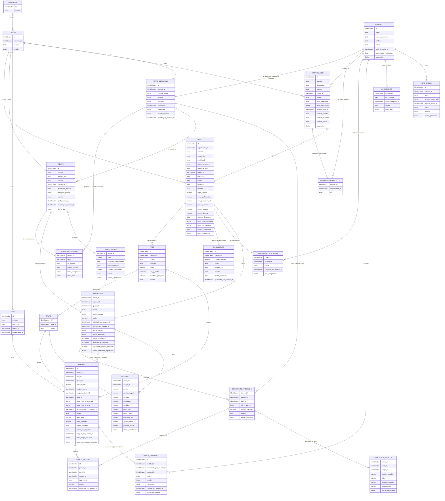

# Diagrama de Entidad-Relación — INVICTOS

## 1. Objetivo del documento

Este documento presenta el **modelo conceptual de datos** de la plataforma: qué entidades de negocio existen, qué información describe a cada una, y cómo se relacionan entre sí. Es intencionalmente **agnóstico a la tecnología** — no asume base relacional ni NoSQL, ni ningún proveedor. El objetivo es que cualquier persona del proyecto, técnica o no, pueda entender **qué modela el sistema y por qué**.

Se apoya en:
- **`02-casos-de-uso.md`**: cada entidad existe porque algún caso de uso la necesita; se referencia cuál.
- **`04-catalogo-enumeraciones.md`**: los valores exactos de cada atributo de valores cerrados (estados, tipos, roles).
- **`06-reglas-negocio-y-decisiones-pendientes.md`**: el detalle de cada decisión referenciada como `D-nn`. **Desde la revisión 4 este documento no tiene ninguna decisión abierta**: todas las pendientes que lo afectaban quedaron cerradas en `06`, secciones 4.3 y 4.4.

**[Definido] Convención sobre relaciones y claves** *(heredada del set de referencia)*: la línea que conecta dos entidades declara **que existe** un vínculo y su cardinalidad — no reemplaza declarar la clave foránea como atributo propio de la entidad "hija". Toda relación del diagrama debe poder rastrearse hasta un atributo `_id` concreto. Además: si la relación es **1 a 1** (solo puede existir un registro por combinación), la entidad **no tiene `id` propio** — la combinación de claves foráneas *es* su identidad. Si es **1 a muchos**, mantiene su `id` propio.

---

## 2. Diagrama

> **Cómo leerlo:** cada rectángulo es una entidad (un concepto de negocio). Las líneas indican relación, con una etiqueta que explica el motivo. `||` significa "uno", `o{` significa "cero o muchos", `o|` significa "cero o uno".

---

## 3. Definiciones — Objetivo y fundamento de cada entidad y atributo

### 3.1 Usuario

**Objetivo de la entidad:** representa a una persona con acceso a la plataforma. **[Definido]** Es la raíz de todo el modelo — el equivalente estructural a lo que `Tenant` era en el sistema de referencia, con la diferencia central de que acá la raíz es **la persona**, no una organización (ver `01`, 3.1). Toda otra entidad con responsables (equipo, organización) se apoya en un Usuario.

| Atributo | Objetivo / Fundamento |
|---|---|
| `email` | Identifica y autentica a la persona. |
| `nombre_completo` | Permite identificar quién hizo cada operación (quién cargó un resultado, quién resolvió una inscripción). |
| `telefono` | **[Definido]** Opcional. Canal de notificación alternativo y, a futuro, forma de que un capitán encuentre a un jugador que ya conoce. |
| `estado` | Distingue a alguien recién invitado que no definió su acceso, de alguien que ya opera normalmente, y permite desactivar el acceso sin borrar el historial. Valores en `04`, 3.1. |
| `perfil_deportivo_id` **[Definido]** | Referencia al perfil deportivo que esta persona reclamó, si reclamó alguno. Se modela como **un único campo** — mismo criterio de unicidad estructural que `tenant_principal_id` en el set de referencia — para que sea imposible que una cuenta se apropie de dos historiales deportivos distintos (ver UC-05). Es opcional: alguien que solo sigue torneos nunca tiene perfil deportivo. |
| `preferencias_notificacion` | Qué avisos recibe y por qué canal (UC-47). Se guarda como atributo de lista dentro del propio Usuario, no como entidad aparte: no necesita identidad propia ni consulta independiente. |
| `fecha_alta` | Traza cuándo se sumó a la plataforma. |

**[Definido] Un Usuario no tiene "tipo".** No existe un atributo `rol` a nivel cuenta. Todos los actores del producto (jugador, capitán, organizador, colaborador) son la misma cuenta con distintos vínculos hacia distintas entidades — ver `01`, 4.3. Modelar el rol en la cuenta obligaría a la persona a elegir uno solo, cuando en el fútbol amateur lo normal es ser varios a la vez.

### 3.2 Perfil deportivo

**Objetivo de la entidad:** representa la **identidad deportiva** de una persona: por qué equipos pasó, en qué torneos jugó o dirigió, qué números tiene. Está separada de Usuario por una razón concreta y no técnica: **un perfil deportivo puede existir sin cuenta**.

| Atributo | Objetivo / Fundamento |
|---|---|
| `usuario_id` **[Definido]** | La cuenta que reclamó este perfil, si alguna. Queda vacío mientras el perfil no fue reclamado (ver UC-05). Es el espejo de `Usuario.perfil_deportivo_id`. |
| `nombre_visible` | El nombre con el que se lo conoce en la cancha, que no siempre es su nombre legal. |
| `foto_url` / `posicion` / `ciudad_id` | Datos de perfil, todos opcionales (UC-02). **[Definido — D-52]** El atributo `posicion` **existe y es opcional**, con **cinco valores** (arquero, defensor, mediocampista, delantero, sin especificar). **Fundamento:** cinco valores es exactamente lo que un capitán necesita para buscar a quien le falta; más granularidad —lateral derecho, volante central— no cambia ninguna decisión en el fútbol amateur y solo multiplica el catálogo. Valores en `04`, 3.10. |
| `visibilidad` | Cuánto de su información es pública (UC-04). **[Definido]** Es **binaria**: público o restringido (`06`, D-14b). Valores en `04`, 3.4. |
| `estado_reclamo` | Distingue un perfil sin cuenta asociada de uno ya reclamado, y permite representar un reclamo en curso. Valores en `04`, 3.3. |
| `creado_por_usuario_id` | Quién cargó este perfil. **Fundamento:** es el dato que permite resolver un reclamo (UC-05) — sin él, no hay a quién preguntarle si esa persona es realmente quien dice ser. |

**[Definido] Por qué la entidad se llama Perfil deportivo y no Jugador (`06`, D-22).** La entidad ya representaba "la identidad deportiva de una persona", no un rol. Llamarla `Jugador` obligaba a modelar a un DT como "un jugador que no juega", que es exactamente el tipo de contradicción que este set evita. **El rol que la persona tiene en cada equipo** es lo que define si actúa como jugador, DT, delegado o capitán — y ese rol vive en el vínculo (ver 3.6), no en la persona. El cambio es de nombre y de alcance conceptual, no de estructura.

**[Definido] Por qué el Perfil deportivo está separado de Usuario.** Si el perfil deportivo viviera dentro de Usuario, cargar un plantel exigiría crear una cuenta por cada integrante — es decir, exigirle a un capitán que consiga que quince personas se registren antes de poder inscribir a su equipo. En el fútbol amateur eso hace inviable el alta. Separarlos permite que el capitán arme el plantel completo el primer día, y que cada persona reclame su perfil cuando quiera (o nunca, sin que el equipo deje de funcionar).

**[Definido] La relación Usuario ↔ Perfil deportivo es 1 a 1 y se declara en ambos lados.** Es redundante a propósito, y responde al mismo criterio que el set de referencia aplicó a `Tenant.usuario_dueño_id`: garantizar estructuralmente que no puedan existir dos cuentas apropiándose del mismo historial, ni un perfil apuntando a una cuenta que apunta a otro perfil.

### 3.3 Organización

**Objetivo de la entidad:** representa a quien organiza torneos — un complejo deportivo, una liga, un grupo de amigos que arma un torneo al año.

| Atributo | Objetivo / Fundamento |
|---|---|
| `nombre` / `descripcion` / `logo_url` / `ciudad_id` | Identidad pública del organizador, insumo de la decisión de un capitán de inscribirse o no (UC-08). La ciudad sale del catálogo de 3.22. |
| `estado` | Permite suspender o dar de baja una organización sin perder el historial de sus torneos. |
| `nivel_verificacion` **[Definido — D-51]** | Cuánta confianza acreditó esta organización (UC-48). **Fundamento:** la verificación **no gatea crear ni gestionar un torneo — gatea aparecer en el descubrimiento**. El activo que hay que proteger de la basura es el descubrimiento (D5), que es el motor del producto; el resto del sistema no se ensucia con un torneo de prueba que nadie ve. Poner la fricción en el alta, en cambio, castiga al organizador legítimo justo cuando todavía no invirtió nada y es más fácil que abandone. Valores en `04`, 3.9. |
| `fecha_verificacion` **[Definido — D-51]** | Desde cuándo tiene el nivel que tiene. **Fundamento:** el nivel se puede obtener de tres formas distintas (automática, manual o por trayectoria) y se puede revisar; sin la fecha no hay forma de leer el distintivo público (UC-08) contra el momento en que se otorgó. Queda vacío mientras la organización esté sin verificar. |
| `usuario_titular_id` **[Definido]** | El único Usuario titular de esta organización. Se modela como un único campo — mismo criterio que `Tenant.usuario_dueño_id` en el set de referencia — para que sea estructuralmente imposible que quede sin titular o con dos. Solo cambia por transferencia explícita (UC-09), nunca por la gestión general de miembros (UC-07). |
| `contacto_*` | Datos de contacto administrativo, opcionales e independientes del email de acceso del titular — mismo criterio que los datos de contacto de Tenant en el set de referencia. |
| `fecha_alta` | Insumo de la trayectoria mostrada en el perfil público (UC-08). |

**[Definido — D-51] La verificación tiene tres niveles y gatea el descubrimiento, no la gestión.** Una organización **sin verificar** usa todo el producto de gestión —crea, configura y publica torneos, carga equipos, fixture y resultados—, pero sus torneos nacen **no listados**: accesibles por link, no por búsqueda (reutiliza el mecanismo ya definido en `06`, D-21b). El nivel **verificado** se obtiene **automáticamente**, con un segundo factor de contacto, y es lo que habilita publicar en el descubrimiento (UC-22): es el nivel operativo normal. El nivel **verificado con distintivo** se otorga de forma manual o por trayectoria —haber finalizado al menos un torneo con resultados cargados— y suma distintivo visible en la ficha y en el perfil (UC-08) más mejor posición en el orden por defecto del descubrimiento (`06`, D-26b). **Fundamento:** una revisión manual previa a publicar convierte el alta en una cola con un humano del otro lado, justo en el arranque, cuando el problema no es que sobren organizadores sino que faltan. La verificación por trayectoria se paga sola: quien terminó un torneo con resultados cargados **ya demostró** lo que una revisión manual intentaría adivinar. Valores en `04`, 3.9.

**[Definido — D-51] Dos controles automáticos acompañan al modelo, y hacen la mayor parte del trabajo.** Primero, una organización **sin verificar** puede tener **un solo torneo publicado a la vez**: es lo que hace que crear cuentas descartables deje de ser rentable para quien quiera ensuciar el descubrimiento. Segundo, un torneo publicado que pasa **30 días sin inscripciones ni fixture** vuelve a no listado, con aviso al organizador: la basura del descubrimiento no suele ser malintencionada, es mayormente torneos de prueba que nadie limpió. **Esos dos números son valores de arranque a calibrar, no reglas de negocio** (`06`, sección 2): se fijaron para poder construir y se ajustan mirando cuántos torneos legítimos quedan atrapados y cuánta basura pasa igual.

### 3.4 Miembro de Organización

**Objetivo de la entidad:** conecta a una persona con una organización a través de **un rol puntual**. Es el análogo directo de la `Membresía` del set de referencia. **[Definido]** Sostiene **solo dos roles: Titular (`owner`) y Administrador (`admin`)** — los dos vínculos cuyo alcance es la organización entera (`06`, D-32).

| Atributo | Objetivo / Fundamento |
|---|---|
| `rol` | El rol de esa persona en esa organización: Titular o Administrador. Valores en `04`, 3.2. |

**[Definido] Un registro por cada combinación persona + organización + rol**, con **identidad determinística** construida sobre esa combinación (no un identificador al azar). Es la misma decisión, con el mismo fundamento, que el set de referencia documentó para Membresía: invitar dos veces a la misma persona con el mismo rol no crea un segundo registro, actualiza el mismo — la condición de carrera deja de ser posible, no solo inofensiva.

**[Definido] El rol de titular existe como registro espejo** de `Organizacion.usuario_titular_id`, para que aparezca de forma consistente al listar el equipo de trabajo — pero se crea y se actualiza únicamente junto con ese campo, nunca de forma independiente.

**[Definido] El Colaborador ya no vive acá (`06`, D-32 y D-34).** El rol `staff` salió de esta entidad y pasó a `COLABORADOR_TORNEO` (ver 3.21), porque su alcance no es la organización sino **un torneo puntual**. Mantenerlo en `MIEMBRO_ORGANIZACION` obligaría a un campo "torneo" que quedaría vacío para Titular y Administrador — exactamente el tipo de campo condicional que este set evita.

### 3.5 Equipo

**Objetivo de la entidad:** representa a un equipo como **sujeto permanente de la plataforma**, no como una inscripción a un torneo puntual.

| Atributo | Objetivo / Fundamento |
|---|---|
| `nombre` / `escudo_url` / `colores` | Identidad visible del equipo. **[Definido]** El nombre **no es único globalmente**: el sistema avisa —sin bloquear— si ya existe uno igual en la misma ciudad (`06`, D-16b). Hay miles de equipos con el mismo nombre; bloquear sería falso rigor. |
| `ciudad_id` | Dónde juega habitualmente — insumo del descubrimiento (UC-22) y de los rankings acotados (UC-41). **[Definido — D-88]** Referencia a una ciudad del catálogo (3.22). **[Definido — D-92]** Es directamente el nivel del ranking: no hay nada que derivar. |
| `modalidad_habitual` | F5/F7/F11. **[Definido]** Es orientativo, no restrictivo: un mismo equipo puede jugar un torneo de F7 y otro de F11. |
| `categoria_genero` **[Definido — D-81]** | Masculino, femenino o mixto — **la misma enumeración que `Torneo.categoria_genero`** (`04`, 5.2). **Obligatorio al crear el equipo** (UC-10). **Fundamento:** es lo que hace calculable el recorte del ranking, que es por ciudad + modalidad + **categoría** (`06`, D-36b; UC-41). Inferirlo de los torneos jugados no sirve: un equipo nuevo no tendría categoría, y uno que jugó un torneo masculino y uno mixto aparecería en dos rankings. A diferencia de `modalidad_habitual`, este campo **sí participa de una validación**: al inscribirse a un torneo de otra categoría el sistema avisa, sin bloquear (`06`, D-82). |
| `estado` | Activo o archivado (UC-15). Baja lógica siempre: borrar un equipo dejaría partidos, tablas e historiales de sus rivales apuntando al vacío. |
| `perfil_capitan_id` **[Definido]** | El único capitán del equipo, referenciado por su perfil deportivo. Campo único, mismo criterio de unicidad estructural que el titular de la organización — vuelve imposible que un equipo quede sin responsable. |
| `creado_por_usuario_id` | Quién lo creó. **Fundamento:** un equipo puede ser creado por su capitán (UC-10) o por un organizador que lo carga a mano (UC-26); saber cuál de los dos casos es determina si el equipo tiene dueño real o está esperando ser reclamado. |

**[Definido] El equipo es transversal a los torneos.** Es la decisión de modelado más importante de todo el producto: es lo que permite que el historial (UC-37) y el score (UC-39) existan. Si el equipo fuera una fila dentro de un torneo, no habría nada que acumular y el componente de reputación no sería construible.

**[Definido — D-83] No existe la entidad "club" en el MVP.** Una institución con equipo masculino y femenino se modela como **dos equipos independientes** que comparten nombre y escudo; una persona los ve juntos en su inicio porque es integrante de ambos (3.6). El agrupador queda para la segunda etapa (`07`). **No se resuelve con `ORGANIZACION` (3.3):** esa entidad es quien *organiza torneos* y su nivel de verificación habilita a publicarlos (`06`, D-51); un club es quien *compite*. Unificarlas haría que verificar a un club lo habilite a publicar, que es justo lo que la verificación existe para evitar.

### 3.6 Integrante de Equipo

**Objetivo de la entidad:** conecta a un **perfil deportivo** con el **plantel permanente** de un equipo, con un rol y un estado de vínculo.

| Atributo | Objetivo / Fundamento |
|---|---|
| `perfil_id` | Qué persona integra el plantel, referenciada por su identidad deportiva (ver 3.2) y no por su cuenta — porque puede no tener cuenta. |
| `rol_equipo` | Con qué rol integra el equipo: capitán, delegado, jugador o cuerpo técnico (UC-13). Valores en `04`, 3.5. |
| `estado_vinculo` | Distingue un vínculo pendiente de un integrante activo y de una baja — necesario porque **nadie entra a un plantel sin que las dos partes hayan aceptado** (UC-11, UC-12, UC-53). **[Definido — D-85]** Hay **dos estados pendientes distintos**, `invited` y `requested`, según **quién haya propuesto**: en el primero espera la persona, en el segundo espera el capitán. Valores en `04`, 3.6. |
| `fecha_incorporacion` / `fecha_baja` | Permiten reconstruir quién estaba en el plantel en un momento dado, sin borrar el vínculo cuando alguien se va. |

**[Definido] Su identidad es la combinación `equipo + perfil + rol`**, con **identidad determinística** construida sobre esa combinación (no un identificador al azar): **un registro por cada rol**. Es el mismo patrón, con el mismo fundamento, que `MIEMBRO_ORGANIZACION` (3.4) y que la Membresía del set de referencia — con un rol por registro, un duplicado como mucho coincide consigo mismo, nunca se contradice.

**Fundamento (`06`, D-23):** es lo que permite que alguien sea **DT en un equipo y jugador en otro sin ningún cambio estructural** — el rol vive en el vínculo, no en la persona. Y como efecto lateral, que alguien sea **jugador y DT del mismo equipo** con dos vínculos, que es habitual en el amateur.

**[Definido] El rol de cuerpo técnico es opcional y admite varios por equipo (`06`, D-27).** A diferencia del Capitán —uno, obligatorio, con campo propio en Equipo—, el rol de DT no tiene restricción de unicidad: un equipo puede tener cero, uno o varios (DT, ayudante, preparador físico). Ninguna regla del sistema depende de que haya un solo DT, así que imponer unicidad sería una restricción sin fundamento.

**[Definido] El rol de cuerpo técnico no otorga permisos de gestión por sí mismo (`06`, D-25).** Es un rol **deportivo, no administrativo**: por sí solo no habilita gestionar el plantel ni inscribir al equipo. Si además tiene que gestionar, se le asigna **también** el rol de Delegado (o es el Capitán). Fundamento: evita que sumar a un DT le entregue el control del equipo sin que el capitán lo haya decidido — algo posible justamente porque los roles son vínculos independientes.

**[Definido] La baja no borra el registro.** Se marca con estado y fecha. Fundamento: el historial de una persona (UC-38) y las estadísticas de un torneo (UC-36) dependen de saber que integró ese equipo, aunque hoy ya no esté.

**[Definido — D-85, D-87] El vínculo se puede proponer desde los dos lados, pero cortar desde uno solo.** El equipo invita (UC-11) o la persona solicita (UC-53), y en ambos casos hace falta que la otra parte acepte para llegar a `active`. **Salir, en cambio, es unilateral e inmediato** (UC-13): no hay estado intermedio de "baja pendiente" ni nada que aprobar. **Fundamento:** integrar un plantel es público y arrastra consecuencias —figurar en el equipo, poder ser anotado en una lista de buena fe (3.10)—, así que nadie puede ser puesto ahí sin aceptar ni retenido sin querer.

**[Definido — D-85] Como la identidad es determinística, una invitación y una solicitud cruzadas son la misma fila.** Si el capitán invita a alguien que ya había solicitado —o al revés—, no se crean dos registros: el único que existe pasa a `active`. La condición de carrera **deja de ser posible**, no solo inofensiva, que es el mismo fundamento del patrón en 3.4.

### 3.7 Torneo

**Objetivo de la entidad:** representa una competencia puntual, con su configuración, su estado y su información pública.

| Atributo | Objetivo / Fundamento |
|---|---|
| `organizacion_id` | A qué organización pertenece — nunca queda huérfano (UC-16). |
| `nombre` / `descripcion` | Identidad pública del torneo. |
| `modalidad` / `categoria_genero` / `categoria_edad` | Los tres ejes por los que un equipo decide si un torneo le sirve — y por lo tanto, los filtros centrales del descubrimiento (UC-22). Valores en `04`, sección 5. `categoria_edad` es una **lista fija** con `open` (Libre) por defecto (`06`, D-38b). |
| `ciudad_id` | **Dónde se juega, y el dato que ordena todo el descubrimiento.** Referencia a una ciudad del catálogo nacional (3.22). **[Definido — D-90]** No es solo un filtro: la vista por defecto de cada persona son **los torneos de su ciudad** (UC-22). **[Definido — D-88]** El catálogo es nacional y completo, así que ningún organizador se queda sin la suya — lo que se ordena en la interfaz es cuáles se ofrecen primero (`08`, 11.3). |
| `direccion` | Dónde se juega, en texto libre. **[Definido]** Es la **referencia general** del torneo —el complejo o la dirección habitual—, y no reemplaza a la de cada Sede (3.17), que es la que manda para un partido puntual. **Fundamento (`06`, D-25b):** la ciudad sirve para **encontrar** el torneo, la dirección para **llegar**. Son dos usos distintos y ninguno cubre al otro. |
| `estado` | Dónde está el torneo en su ciclo de vida. **Es el atributo que habilita o bloquea al resto del sistema**: si se aceptan inscripciones, si se pueden cargar resultados, si aparece como activo en el descubrimiento. Valores en `04`, 4.1. **[Definido — D-58]** **No se agrega** un estado intermedio "publicado, con inscripciones todavía cerradas": `registration_closed` ya significa "visible, no recibe equipos", y da igual cómo se llegó ahí. |
| `visibilidad` | Si el torneo es público o **no listado** (accesible por link, no por búsqueda). **[Definido]** Los torneos no listados existen y **sí alimentan el score** (`06`, D-21b): el torneo cerrado entre equipos conocidos es un caso real y frecuente, y se jugó igual. **[Definido — D-51]** El valor **no depende solo de la elección del organizador: también del `nivel_verificacion` de su organización** (ver 3.3). Los torneos de una organización sin verificar quedan no listados aunque el organizador quiera publicarlos, y pasan a públicos cuando la organización se verifica. Valores en `04`, 4.1. |
| `min_jugadores_lista` / `max_jugadores_lista` **[Definido — D-59]** | Mínimo y máximo de jugadores que el organizador puede exigir en la lista de buena fe (ver 3.10). **Ambos opcionales**: un torneo puede no fijar ninguno. **Fundamento:** el máximo es una regla de reglamento real y trivial de validar, así que se valida. El mínimo **avisa pero no bloquea** el inicio del torneo: bloquearlo castigaría al organizador por algo que depende del equipo, y choca de frente con que la lista está abierta por default hasta el final (`06`, D-30b). El cuerpo técnico no cuenta para ninguno de los dos (`06`, D-24). |
| `formato` | Liga, eliminación directa, o grupos + eliminatoria (UC-17). Determina cómo se genera el fixture y cómo se lee la tabla. Valores en `04`, 4.2. |
| `cupo_equipos` | Cuántos equipos admite. Al alcanzarse, las inscripciones se cierran automáticamente (UC-20). |
| `puntos_victoria` / `puntos_empate` / `puntos_derrota` **[Definido]** | Configurables por torneo, con default 3/1/0 (`06`, D-20b). Fundamento: en el fútbol amateur cada reglamento tiene el suyo; la flexibilidad cuesta poco y evita el primer reclamo de un reglamento distinto. |
| `criterios_desempate` | Lista ordenada de criterios (diferencia de gol, goles a favor, enfrentamiento directo). Se guarda como lista dentro del propio Torneo: no necesita identidad propia ni edición independiente. |
| `fecha_inicio_estimada` / `fecha_fin_estimada` | Insumo de la decisión de inscribirse y del filtro de descubrimiento. Son estimadas: en el fútbol amateur las fechas reales las define el fixture. |
| `motivo_cancelacion` | Por qué se canceló o suspendió (UC-21) — información pública, no un dato interno: es lo que le permite a un equipo entender qué pasó. **[Definido — D-66]** Misma forma que el motivo de baja: **lista cerrada mínima más `other` con texto libre**, que crece con los casos reales. Valores en `04`, 4.16. |
| `fecha_publicacion` | Cuándo pasó a ser descubrible (UC-18). |

### 3.8 Fase y Grupo

**Objetivo de las entidades:** representan la estructura interna de la competencia. **Fase** es una etapa del torneo (fase de grupos, cuartos, final); **Grupo** es una zona dentro de una fase.

| Atributo | Objetivo / Fundamento |
|---|---|
| `Fase.tipo_fase` | Si esa etapa se juega como liga o como eliminación — determina si tiene tabla o llaves (UC-35). Valores en `04`, 4.3. |
| `Fase.orden` | En qué orden se juegan las fases; también define qué fase está activa. |
| `Fase.ida_y_vuelta` | Si los enfrentamientos se juegan una o dos veces — afecta directamente la generación del fixture (UC-29). |
| `Fase.clasifican_por_grupo` | Cuántos equipos de cada grupo pasan a la fase siguiente. |
| `Fase.estado` | Si la fase está pendiente, en curso o cerrada — el torneo avanza fase por fase (UC-20). |
| `Grupo.nombre` | "Zona A", "Zona B". |

**[Definido] Fase y Grupo existen incluso en el formato más simple.** Un torneo de liga tiene una única fase con un único grupo. Fundamento: sin esta uniformidad, cada consulta de tabla o de fixture necesitaría un camino distinto según el formato, y agregar un formato nuevo obligaría a tocar todo lo derivado.

### 3.9 Inscripción

**Objetivo de la entidad:** conecta a un **Equipo** con un **Torneo** — es el vínculo que representa "este equipo participa de esta competencia". Es la entidad bisagra entre el producto público y el de gestión.

| Atributo | Objetivo / Fundamento |
|---|---|
| `estado` | Pendiente, aprobada, rechazada, retirada, excluida o en lista de espera. **[Definido]** La lista de espera existe (`06`, D-27b): cubrir una baja sin salir a buscar equipos es exactamente el trabajo manual que el producto promete evitar. Valores en `04`, 4.4. |
| `motivo_estado` | Por qué se rechazó o por qué se retiró (UC-25, UC-28) — necesario para que la decisión sea explicable a quien la recibe. **[Definido — D-66]** Es una **lista cerrada mínima más `other` con texto libre**, que crece con los casos reales: la lista permite entender por qué se abandonan torneos, el texto libre evita forzar un motivo equivocado. Valores en `04`, 4.15. |
| `costo` **[Definido]** | El importe asociado a esta inscripción. **Hoy es siempre cero**: la inscripción no tiene costo dentro de la plataforma, porque el producto arranca gratis para todos (`06`, D-31). Existe desde el día uno igual. **Fundamento (`06`, D-33):** la comisión futura se cobra sobre una transacción que todavía no existe, y lo caro no es agregar la entidad de pago cuando llegue — es descubrir que la Inscripción se modeló como un vínculo sin importe y tener que tocar todo el dominio de inscripciones para corregirlo. |
| `grupo_id` | En qué zona quedó el equipo al generarse el fixture (UC-29). Vacío hasta ese momento. |
| `solicitada_por_usuario_id` / `resuelta_por_usuario_id` | Quién pidió y quién resolvió. **Fundamento:** en una plataforma donde varias personas pueden operar el mismo torneo (UC-07), sin este dato una decisión discutida no tiene responsable. |
| `plantel_confirmado` | Si el equipo ya presentó su lista de habilitados (UC-27). |
| `advertencia_categoria` **[Definido — D-82]** | Si la categoría de género del equipo **no coincidía** con la del torneo al momento de inscribirse (3.5). No bloquea nada: es lo que hace que la advertencia llegue a la ficha que ve el organizador al resolver (UC-25). **Fundamento:** se calcula una vez y se guarda, no se deriva al leer — si el equipo cambia su categoría después, la advertencia que el organizador tuvo a la vista cuando aprobó tiene que seguir siendo la misma. Con un torneo `mixed` nunca se levanta. |
| `reglamento_version_aceptada` **[Definido — D-54]** | **Qué versión** del reglamento aceptó el equipo al inscribirse (ver 3.20). **Fundamento:** guardar la versión —y no un simple "aceptó sí/no"— es lo que le da respaldo al organizador en una disputa, y lo que permite mostrar que el texto se movió **después** de la aceptación sin tener que pedir una re-aceptación. Si el torneo no tiene reglamento cargado, queda vacío. |
| `fecha_aceptacion_reglamento` **[Definido — D-54]** | Cuándo se aceptó esa versión. **Fundamento:** es el dato que ubica la aceptación en la línea de tiempo del reglamento versionado (3.20) y permite responder qué texto regía en ese momento. Vacío si el torneo no tiene reglamento. |

**[Definido] La Inscripción no tiene `id` propio: su identidad es la combinación `torneo + equipo`.** Es una relación 1 a 1 (un equipo no puede tener dos inscripciones vigentes en el mismo torneo), así que la clave compuesta *es* la identidad — mismo criterio que Stock y Membresía en el set de referencia. Esto vuelve estructuralmente imposible que un equipo aparezca dos veces en la misma tabla de posiciones.

**[Definido] El Partido apunta a la Inscripción, no al Equipo.** Es una decisión deliberada: garantiza que un partido de un torneo solo pueda involucrar equipos efectivamente inscriptos en ese torneo. Si apuntara al Equipo directamente, nada impediría (por un error de datos) que un equipo no inscripto apareciera en el fixture.

**[Definido — D-54] La aceptación del reglamento se registra acá, con la versión aceptada.** Al inscribirse, el equipo acepta el reglamento vigente de forma **explícita y de un clic**, y la Inscripción guarda qué versión aceptó y cuándo. Si el reglamento cambia después, **no se pide re-aceptar**: se notifica (`06`, D-22b) y, si hay disputa, se ve que la versión vigente es posterior a la aceptada. **Fundamento:** el clic cuesta nada y es lo único que le da respaldo al organizador ante una objeción. Re-aceptar en cada cambio agregaría fricción a cambio de nada — lo que importa no es un clic nuevo, sino poder mostrar que el texto se movió después.

### 3.10 Integrante Habilitado

**Objetivo de la entidad:** representa la **lista de buena fe**: qué integrantes de un equipo están habilitados a participar de un torneo puntual (UC-27). **[Definido]** La lista incluye **jugadores y cuerpo técnico** (`06`, D-24): en la planilla real del partido figuran ambos, y en un torneo con sanciones el DT también puede ser sancionado.

| Atributo | Objetivo / Fundamento |
|---|---|
| `perfil_id` | Qué persona queda habilitada, referenciada por su perfil deportivo (ver 3.2). |
| `rol_en_torneo` | Con qué rol participa de *este* torneo: jugador, cuerpo técnico o delegado. **Fundamento:** es lo que permite validar qué eventos se le pueden acreditar (ver 3.12) y contar el cupo de plantel sin mezclar. **[Definido]** El cuerpo técnico **no ocupa cupo de jugadores** (`06`, D-24): contarlo dentro del cupo rompería cualquier validación de mínimo o máximo de plantel. Valores en `04`, 3.7. |
| `numero_camiseta` | Opcional. Identifica al jugador en la planilla del partido, cuando el torneo lo usa. No aplica al cuerpo técnico. |
| `estado` | Habilitado, o dado de baja durante el torneo. Valores en `04`, 4.5. |
| `fecha_habilitacion` | Cuándo se sumó. **[Definido]** El cierre de incorporaciones es **configurable por torneo**, con "siempre abierta" como default amateur (`06`, D-30b): en el amateur los planteles se completan sobre la marcha, en las ligas formales hay cierre de pases. |

**[Definido] Por qué existe separada de Integrante de Equipo.** Son dos cosas distintas: el **plantel permanente** (quién es del equipo) y el **plantel habilitado** (quién puede participar de *este* torneo). Un equipo con 20 jugadores puede anotar 12 en un torneo y 15 en otro. Sin esta separación sería imposible responder "quién estaba habilitado en aquel torneo" — y las estadísticas individuales (UC-34) no tendrían contra qué validarse.

**[Definido] Su identidad es la combinación `torneo + equipo + perfil + rol_en_torneo`** — la misma persona no puede estar habilitada dos veces con el mismo rol por el mismo equipo en el mismo torneo, y puede figurar como jugador y como cuerpo técnico con dos registros (mismo patrón que 3.6).

**[Definido] Una persona no puede estar habilitada por dos equipos del mismo torneo** — prohibido por default y **configurable por torneo** (`06`, D-17b). El sistema lo detecta **al confirmar la lista** (UC-27), no cuando el partido ya se jugó: detectarlo tarde convierte un aviso en un conflicto.

**[Definido — D-59] El organizador puede fijar un máximo y un mínimo de jugadores, y solo el máximo bloquea.** Ambos son atributos opcionales del Torneo (`min_jugadores_lista` / `max_jugadores_lista`, ver 3.7). El **máximo** se valida al confirmar la lista: es una regla de reglamento real y trivial de verificar. El **mínimo avisa pero no bloquea** el inicio del torneo. **Fundamento:** bloquear por el mínimo castigaría al organizador por algo que depende del equipo, y choca con que la lista está abierta por default hasta el final del torneo (`06`, D-30b) — un equipo que arranca con nueve puede tener catorce en la fecha 3.

### 3.11 Partido

**Objetivo de la entidad:** representa un enfrentamiento entre dos equipos dentro de un torneo, con su programación y su resultado. **Es la entidad central del producto**: todo lo derivado (tabla, estadísticas, score, feed, notificaciones) sale de acá.

| Atributo | Objetivo / Fundamento |
|---|---|
| `torneo_id` / `fase_id` / `grupo_id` | Ubican al partido en la estructura de la competencia. `torneo_id` es redundante respecto de `fase_id` a propósito: es el filtro más frecuente de todo el sistema. |
| `numero_fecha` | A qué fecha o jornada pertenece — es cómo la gente se refiere a los partidos ("la fecha 4"), no por su identificador. |
| `equipo_local_id` / `equipo_visitante_id` | Los dos participantes, referenciados a través de su Inscripción (ver 3.9). |
| `sede_id` | Dónde se juega (ver 3.16). Opcional. |
| `fecha_hora_programada` | Cuándo se juega **hoy** (UC-30). Vacío mientras el partido esté pendiente de programación. |
| `fecha_hora_original` | La **primera** fecha programada, que se conserva aunque el partido se reprograme. **Fundamento (`06`, D-30):** reprogramar es lo normal en el fútbol amateur, no una excepción; conservar la fecha original es lo que permite que un equipo entienda qué se movió, y es el insumo de cualquier discusión sobre una no presentación. |
| `reprogramado_por_usuario_id` | Quién movió el partido. **Fundamento:** misma trazabilidad que la carga de resultado — un cambio de fecha que perjudica a un equipo tiene que tener responsable. |
| `estado` | Programado, jugado, suspendido, cancelado, ganado por presentación. Valores en `04`, 4.6. |
| `goles_local` / `goles_visitante` | El resultado (UC-31). |
| `estado_resultado` | Si el resultado está pendiente de carga, cargado, confirmado o en disputa (UC-32). **Fundamento:** es el atributo que separa "un dato que alguien escribió" de "un dato que las partes validaron" — la distinción central de este dominio, y la que decide qué alimenta el score. Valores en `04`, 4.7. |
| `motivo_no_disputado` | Por qué no se jugó (UC-33). |
| `cargado_por_usuario_id` / `fecha_carga_resultado` | Quién cargó el resultado y cuándo. **Fundamento:** es el dato que permite resolver una discusión. En un dominio donde el resultado lo declara una de las partes interesadas, la trazabilidad de quién lo declaró no es auditoría opcional: es parte del mecanismo de confianza. **[Definido — D-60]** `fecha_carga_resultado` es además el punto desde el que corre el plazo de confirmación automática. |
| `fecha_confirmacion_resultado` **[Definido — D-60]** | Cuándo el resultado quedó firme. **Fundamento:** un resultado sin confirmar se da por confirmado **a las 72 horas de haberse cargado** —no desde la fecha del partido—, y con una disputa abierta el plazo **se congela** hasta que el organizador resuelva. Con un plazo que corre, se pausa y se reanuda, hace falta registrar el momento en que efectivamente quedó firme: es lo que decide desde cuándo ese partido alimenta la tabla y el score, y sin el dato guardado no se puede explicar por qué. |

**[Definido] Un walkover se distingue estructuralmente de un resultado jugado** — vía `estado`, no solo por los goles. Fundamento: ganar por presentación no es lo mismo que ganar en la cancha, ni para la lectura de un rival ni para el score (UC-33, UC-39). El resultado con que se computa es configurable, con default 3-0, y **no** cuenta como partido jugado a efectos del score (`06`, D-33b).

**[Definido — D-60] Un resultado cargado y no objetado se confirma solo a las 72 horas.** El plazo corre desde `fecha_carga_resultado`, no desde la fecha del partido, y se **congela mientras haya una disputa abierta** (3.13). Fundamento: 72 horas cubren el fin de semana largo típico del amateur —partido el sábado, vence el martes— y son menos que la semana entre fechas, así que la tabla queda firme antes de que se juegue la siguiente. Sin confirmación automática, el organizador que no persigue a nadie termina con media tabla sin computar.

**[Definido] Un partido se puede reprogramar mientras el torneo esté en curso y el partido no se haya jugado** (`06`, D-30). Cada reprogramación notifica a ambos equipos y a los seguidores del torneo (UC-30).

### 3.12 Evento de Partido

**Objetivo de la entidad:** registra qué pasó dentro de un partido — goles, tarjetas (UC-34). Es lo que hace posible que existan estadísticas individuales.

| Atributo | Objetivo / Fundamento |
|---|---|
| `perfil_id` / `equipo_id` | A quién se le acredita el evento. Solo puede ser alguien habilitado en ese torneo por ese equipo (ver 3.10) — es lo que hace confiables las estadísticas. |
| `tipo_evento` | Gol, gol en contra, amarilla, roja. Valores en `04`, 4.8. |
| `minuto` | Opcional — casi nadie lo carga en el fútbol amateur, pero cuesta poco tenerlo. |
| `registrado_por_usuario_id` | Trazabilidad, mismo fundamento que en Partido. |

**[Definido] Qué se le puede acreditar a quién (`06`, D-26).** Los **goles** solo se acreditan a integrantes habilitados con **rol de jugador**. Las **tarjetas** pueden acreditarse también al **cuerpo técnico**. Fundamento: un DT no hace goles, pero sí puede ser amonestado o expulsado; sin esta distinción, o se pierde el registro disciplinario del DT, o aparecería un DT en la tabla de goleadores.

**[Definido] Los eventos son siempre opcionales.** El resultado del partido es obligatorio; el detalle no. Exigir la planilla completa garantiza que nadie cargue nada.

### 3.13 Disputa de Resultado

**Objetivo de la entidad:** sostiene el proceso de objeción de un resultado mientras está abierto (UC-32).

| Atributo | Objetivo / Fundamento |
|---|---|
| `presentada_por_usuario_id` / `equipo_id` | Quién objeta y en representación de qué equipo. |
| `motivo` | Qué se objeta — sin esto, el organizador no tiene con qué resolver. |
| `estado` / `resolucion` / `resuelta_por_usuario_id` | El resultado del proceso y quién lo decidió. Valores en `04`, 4.9. |

**[Definido] Existe como entidad propia y no como un par de campos en Partido** por el mismo criterio con que el set de referencia modeló la "Solicitud de Transferencia": es un **proceso con estado propio**, que puede repetirse (dos disputas sobre el mismo partido en momentos distintos) y que debe quedar registrado aunque se resuelva a favor del resultado original.

### 3.14 Posición

**Objetivo de la entidad:** es la **foto actual de la tabla** de un grupo: cuántos puntos y qué diferencia de gol tiene cada equipo en este momento.

| Atributo | Objetivo / Fundamento |
|---|---|
| `puntos`, `partidos_jugados`, `ganados`, `empatados`, `perdidos`, `goles_favor`, `goles_contra`, `diferencia_gol` | El contenido de la tabla (UC-35). |
| `ajuste_puntos` **[Definido]** | Quita o bonificación aplicada por el organizador por sanción (`06`, D-35b). Se guarda **separado** de `puntos` para que la tabla siga siendo explicable: se ve cuántos puntos ganó en la cancha y cuántos le sacaron. |
| `posicion_actual` | En qué lugar está, ya aplicados los criterios de desempate del torneo. |
| `ultima_actualizacion` | Qué tan reciente es el dato mostrado. |

**[Definido] La tabla es un valor calculado y guardado, no una suma que se rehace en cada consulta.** Es exactamente el mismo criterio que el set de referencia aplicó a `Stock.cantidad_disponible`, y por el mismo fundamento: la consulta es constantísima (es la pantalla más visitada del producto), el recálculo es caro, y el historial completo ya existe aparte — los Partidos — para poder auditar cómo se llegó a ese número.

**[Definido] Su identidad es la combinación `grupo + equipo`** — no tiene `id` propio, por la misma convención de la sección 1: nunca puede haber dos filas del mismo equipo en la misma tabla.

### 3.15 Estadística de Jugador

**Objetivo de la entidad:** acumula los números de una persona **en un torneo puntual** (UC-36, UC-38). **[Definido]** Conserva su nombre porque solo acumula para integrantes con **rol de jugador**: el cuerpo técnico figura en la lista de buena fe y puede recibir tarjetas (3.12), pero no tiene estadística deportiva propia. **[Definido — D-55]** El cuerpo técnico tiene **historial público** (torneos dirigidos, equipos, resultados) en la **segunda etapa**, y **no tiene score de DT**: el historial no requiere ninguna decisión nueva porque el dato ya se registra acá, mientras que un score de DT heredaría todos los problemas del score de equipo más el de atribuirle a una persona el resultado de un colectivo.

**[Definido] Su identidad es la combinación `torneo + perfil + equipo`.** Se acumula por torneo y no globalmente, por el mismo fundamento que se documenta en UC-37: el desempeño acumulado plano borra la diferencia entre torneos de distinto nivel. El total histórico de una persona se obtiene sumando sus torneos, no reemplazándolos por un único número.

### 3.16 Sede

**Objetivo de la entidad:** representa dónde se juega un partido.

**[Definido] Se mantiene deliberadamente mínima** — **nombre, dirección y ciudad** (`06`, D-12b), más la organización que la usa —, como el set de referencia hizo con la entidad Plan. La dirección es **texto libre**; la ciudad sale del catálogo (3.22) y es la que permite filtrar (`06`, D-25b). Fundamento: la gestión de canchas (disponibilidad, reservas, superposición de horarios) es un producto entero por sí mismo, y no es lo que se está construyendo. Lo que hace falta hoy es que un jugador sepa dónde ir.

### 3.17 Score de Equipo

**Objetivo de la entidad:** guarda el indicador de reputación deportiva de un equipo, junto con la explicación de cómo se llegó a él (UC-39).

| Atributo | Objetivo / Fundamento |
|---|---|
| `valor` | El score. |
| `desglose_componentes` | Cuánto aporta cada componente al valor. **Fundamento:** el score tiene que ser explicable (UC-40); guardar el desglose permite mostrar de dónde sale sin recalcularlo, y explicar un valor histórico aunque la fórmula haya cambiado desde entonces. |
| `version_formula` **[Definido]** | Con qué versión del modelo se calculó. **Fundamento:** la fórmula va a cambiar — es inevitable en un indicador de producto que se ajusta con datos reales. Sin este campo, el primer ajuste reescribe silenciosamente la historia de todos los equipos y nadie puede explicar por qué su score bajó de un día para otro. |
| `partidos_computados` | Cuántos partidos **confirmados** lo sostienen — insumo para decidir si el equipo tiene actividad suficiente para mostrar score. **[Definido]** Solo alimenta el score lo confirmado (`06`, 5.3, regla 2): la tabla de un torneo puede ser provisoria, la reputación permanente y comparable no. |
| `estado` | Si el score está vigente o si el equipo todavía no tiene actividad suficiente. Valores en `04`, 4.10. **[Definido — D-61]** El umbral de arranque de "actividad suficiente" es **10 partidos confirmados y 2 torneos**. |

**[Definido — D-61] Los umbrales de arranque del score.** El score se muestra a partir de **10 partidos confirmados y 2 torneos**; por debajo de eso el equipo aparece como "sin score todavía" (`06`, S-04). La ventana considerada es de **24 meses, con decaimiento lineal**: un resultado de hace dos años pesa cerca de cero, y un equipo que dejó de jugar pierde posición frente a equipos activos (`06`, S-03). **Son valores de arranque, no una fórmula.** Se fijaron para poder construir, porque son de sentido común y se pueden anticipar; **las ponderaciones de cada componente no se fijan acá**: se calibran con datos reales, mirando si el score ordena a los equipos de una forma que la gente reconoce como justa (`06`, 5.4). Fundamento del umbral: un equipo con dos partidos ganados encabezaría cualquier ranking, y eso invalida el indicador completo.

**[Definido] Su identidad es el propio `equipo_id`** — un equipo tiene un solo score vigente, guardado calculado junto con el desglose y la versión de fórmula que lo produjeron (`06`, 5.3, reglas 3 y 4). Mostrar la evolución histórica del score es una decisión de producto aparte, fuera del alcance de esta versión.

### 3.18 Seguimiento

**Objetivo de la entidad:** representa que un usuario sigue a un torneo o a un equipo (UC-42, UC-43).

| Atributo | Objetivo / Fundamento |
|---|---|
| `tipo_seguido` | Torneo o equipo — y, a futuro, jugador (UC-45). Valores en `04`, 4.11. |
| `entidad_seguida_id` | Qué torneo o qué equipo. |
| `origen` **[Definido]** | Si la persona lo siguió explícitamente o si el sistema la suscribió automáticamente (por estar inscripta o por integrar el plantel). **Fundamento:** un seguimiento automático no debería contar como "seguidor" a efectos de popularidad, y probablemente merezca un tratamiento distinto en notificaciones. Sin este dato, ambas cosas se mezclan y ninguna se puede corregir después. |

**[Definido] Una entidad única para los tres tipos de seguimiento**, en vez de una por tipo. Fundamento: el feed (UC-44) necesita consultar "todo lo que esta persona sigue" en una sola lectura; con entidades separadas, cada tipo nuevo obligaría a tocar el feed.

### 3.19 Notificación

**Objetivo de la entidad:** representa un aviso generado para una persona (UC-46).

| Atributo | Objetivo / Fundamento |
|---|---|
| `tipo` | Qué clase de hecho la originó. Valores en `04`, 4.12. |
| `entidad_origen_tipo` / `entidad_origen_id` | A qué hecho concreto corresponde — permite llevar a la persona directo a lo que pasó, en vez de a una lista genérica. |
| `canal` **[Definido — D-53]** | Por dónde salió efectivamente este aviso. Valores en `04`, 4.14. **Fundamento:** la preferencia de la persona vive en `Usuario.preferencias_notificacion`, pero eso es lo que *quiere recibir*, no lo que *se envió*. Un mismo hecho puede generar un aviso dentro del producto y otro por email (las accionables van por ambos), así que sin este dato no se puede responder "¿le llegó el mail o solo lo vio en la app?" — que es la pregunta típica cuando alguien dice que no se enteró de una reprogramación. Un registro por canal, no un registro con una lista de canales. |
| `estado` | Pendiente, entregada, leída. |

### 3.20 Reglamento

**Objetivo de la entidad:** guarda **el texto contra el que se justifican las decisiones de un torneo** (UC-51). **[Definido]** Es **opcional**: no forma parte de los datos mínimos de publicación (`06`, D-29) — la mayoría de los torneos de barrio no tienen reglamento escrito, y exigirlo sería una barrera de entrada sin contrapartida.

| Atributo | Objetivo / Fundamento |
|---|---|
| `torneo_id` | De qué torneo es. Un reglamento no existe por fuera de su competencia. |
| `numero_version` | Qué número de versión es. **Fundamento:** es lo que permite referirse sin ambigüedad a "el reglamento que regía cuando pasó esto". |
| `texto` | El reglamento cargado en la plataforma. **Fundamento:** un texto consultable desde el celular en la cancha es más útil que un archivo que hay que descargar. |
| `archivo_url` | El reglamento como archivo adjunto. **Fundamento:** la mayoría de los organizadores ya lo tienen escrito en un documento; obligarlos a transcribirlo garantiza que no lo carguen. Texto y archivo **no son excluyentes** (`06`, D-28). |
| `estado` | Si esta versión es la vigente o quedó reemplazada por una posterior. Valores en `04`, 4.13. |
| `fecha_publicacion` | Desde cuándo rige esta versión — el dato que responde qué texto estaba vigente en la fecha de un partido o de una sanción. |
| `publicado_por_usuario_id` | Quién la publicó. **Fundamento:** misma trazabilidad que la carga de resultado; una regla que cambió a mitad de torneo tiene que tener responsable. |

**[Definido] Cada publicación crea una versión nueva y las anteriores se conservan (`06`, D-28).** La vigente es la última; las anteriores quedan como historia consultable, no se pisan. **Fundamento:** en un dominio donde las decisiones (disputas, sanciones) se justifican contra un texto, tiene que poder responderse "qué reglamento regía cuando pasó esto" — es el mismo criterio de trazabilidad con que se tratan las correcciones de resultado (3.11, 3.13).

**[Definido] Modificar el reglamento con el torneo en curso está permitido, y notifica a los equipos inscriptos** (`06`, D-28 y D-22b). Fundamento: prohibirlo no evita el problema real —los reglamentos se corrigen sobre la marcha—, y un reglamento que cambia en silencio a mitad de torneo es la peor versión posible de esta funcionalidad.

**[Definido — D-54] La aceptación del reglamento es explícita, de un clic, y se registra en la Inscripción con la versión aceptada.** Los atributos viven en la Inscripción (3.9), no acá: lo que se guarda no es una propiedad del texto sino del vínculo entre un equipo y un torneo. Ante un cambio posterior **no se pide re-aceptar** — se notifica, y en una disputa se ve que la versión vigente es posterior a la aceptada. Fundamento: el clic cuesta nada y es lo único que le da respaldo al organizador; lo que resuelve la discusión no es un clic nuevo, sino poder mostrar que el texto se movió después.

### 3.21 Colaborador de Torneo

**Objetivo de la entidad:** conecta a una **persona** con **un torneo puntual** para que pueda operarlo en el día a día — cargar resultados, programar partidos — sin darle ningún poder sobre la organización que lo organiza. **[Definido]** Es el vínculo del rol Colaborador, que **se asigna por torneo y no por organización** (`06`, D-32). Es lo que resuelve el caso del planillero contratado para un torneo, y también el motivo por el que no existe un rol de árbitro o planillero aparte (`06`, D-06b).

| Atributo | Objetivo / Fundamento |
|---|---|
| `torneo_id` | De qué torneo puede ocuparse esta persona. **Es el alcance completo de su acceso:** no alcanza a ningún otro torneo de la misma organización. |
| `usuario_id` | Quién colabora, referenciado por su **cuenta** y no por su perfil deportivo — a diferencia del plantel (3.6), acá hace falta que la persona pueda entrar y operar, y eso solo existe si tiene cuenta. |
| `estado` | Si el colaborador fue asignado y todavía no definió su acceso, si está operando, o si se lo sacó del torneo. Valores en `04`, 3.8. **Fundamento:** sacar a alguien es un cambio de estado, nunca un borrado — su historial de cargas tiene que seguir siendo atribuible (ver 3.11). |
| `asignado_por_usuario_id` | Quién lo asignó (UC-52). **Fundamento:** misma trazabilidad que el resto del set — si un colaborador carga un resultado discutido, tiene que poder responderse quién le dio acceso a ese torneo. |
| `fecha_asignacion` | Desde cuándo opera el torneo. Permite leer el historial de cargas contra el período en que efectivamente tuvo acceso. |

**[Definido] No tiene `id` propio: su identidad es la combinación `torneo + usuario`**, construida de forma determinística sobre esos dos datos. Es la misma convención de la sección 1 y el mismo patrón que Inscripción (3.9) y Posición (3.14): es una relación **1 a 1** entre un torneo y una persona —nadie puede ser colaborador dos veces del mismo torneo—, así que la clave compuesta *es* la identidad. Como efecto directo, asignar a la misma persona dos veces actualiza el mismo registro en vez de crear uno nuevo.

**[Definido] Una misma persona puede colaborar en varios torneos a la vez**, incluso de **organizaciones distintas** (`06`, D-32). Son vínculos independientes: asignarla a cinco torneos son cinco registros, y sacarla de uno **no la saca de los demás**. Fundamento: en el fútbol amateur la persona que carga las planillas suele trabajar para más de un complejo, y un modelo que la obligara a elegir uno no describiría el caso real.

**[Definido] Los permisos del Colaborador son fijos y no configurables (`06`, D-32).** Son siempre los mismos, en todos los torneos:

| Puede | No puede |
|---|---|
| Cargar resultados y eventos de partido (UC-31, UC-34) | Crear, publicar, cancelar o reconfigurar el torneo |
| Programar y reprogramar partidos (UC-30) | Resolver inscripciones |
| Registrar partidos no disputados (UC-33) | Gestionar miembros de la organización ni asignar otros colaboradores |

**[Definido] Por eso la entidad no tiene atributo de rol ni de permisos.** No es un olvido: es la consecuencia directa de la decisión. Si los permisos son idénticos para todos los colaboradores de todos los torneos, un campo que los describa solo puede repetir lo mismo en cada registro. Fundamento: una matriz de permisos por persona y por torneo no la mantiene nadie, y el alcance por torneo ya resuelve el caso real que la motivaba.

**[Definido] Por qué es una entidad propia y no un rol más de Miembro de Organización (`06`, D-34).** Son **dos vínculos con alcance distinto**: uno es con la organización (Titular, Administrador — ver 3.4) y el otro es con un torneo puntual. Mezclarlos en `MIEMBRO_ORGANIZACION` obligaría a agregarle un campo "torneo" que quedaría **vacío para los roles de organización** — exactamente el tipo de campo condicional que este set evita, porque cada regla que lo consulte tendría que preguntar antes de qué rol se trata.

**[Definido — D-64] El Administrador puede asignar y quitar colaboradores en los torneos que administra.** Lo que **no** puede es crear ni quitar Administradores: eso queda reservado al Titular (ver 3.4 y `04`, 3.2). Fundamento: es el mismo criterio con que el rol de Titular es reservado — **se delega la operación, no la capacidad de repartir poder**. Un Administrador que puede nombrar Administradores vuelve inútil la distinción entre los dos roles.

### 3.22 Provincia y Ciudad

**Objetivo de las entidades:** son el **catálogo de ubicaciones** del producto, y lo que hace posible tanto el filtro más usado (UC-22) como el recorte de los rankings (UC-41). **[Definido — D-88]** Son **dos niveles y solo dos: provincia → ciudad**. No hay barrios, comunas ni zonas intermedias.

| Entidad | Atributos | Objetivo / Fundamento |
|---|---|---|
| **Provincia** | `nombre` | Las 24 jurisdicciones argentinas. **No es un nivel de búsqueda sino de agrupación**: ordena la lista de ciudades, desambigua los nombres repetidos —hay más de una San Martín— y es el escalón al que se amplía cuando una ciudad no tiene torneos. |
| **Ciudad** | `provincia_id`, `nombre`, `estado` | **La unidad de ubicación del producto.** Todo lo que tiene lugar —torneo, equipo, sede, organización, persona— se ubica en una ciudad, nunca en algo más fino ni más grueso. `estado` permite desactivar una entrada sin borrarla: nunca puede quedar huérfano un torneo ya publicado. |

**[Definido — D-88] El catálogo es nacional y completo desde el día uno**, cargado con las ciudades de Argentina agrupadas por provincia. **Fundamento:** es lo que garantiza que **nadie se quede nunca sin su ciudad**. Con un catálogo parcial, el primer organizador de cada mercado nuevo se topaba con un lugar inexistente y había que decidir si bloquearlo o dejarlo publicar en otro lado; con el catálogo completo el problema no existe.

**[Definido — D-88] Esto reemplaza el criterio de D-65.** Aquella decisión hacía arrancar el catálogo por el primer mercado para que el filtro no se llenara de lugares vacíos. **La preocupación sigue siendo válida y se resuelve en la interfaz, no en el modelo**: el selector muestra primero las ciudades **con torneos** y distingue las que no tienen (`08`, 11.3). El dato está completo; lo que se ordena es qué se ofrece primero.

**[Definido — D-92] El ranking se calcula por ciudad.** Es el único nivel que existe, así que no hay nada que elegir: el recorte de UC-41 es ciudad + modalidad + categoría. **Fundamento del nivel:** con el umbral de score vigente —10 partidos confirmados y 2 torneos (D-61)— un recorte más fino estaría casi siempre vacío, y uno por provincia mezclaría equipos que no se cruzan nunca.

**[Definido — D-89] No hay coordenadas ni distancias.** La cercanía no se calcula: **la vista por defecto ya es la ciudad de la persona** (D-90), y cuando esa ciudad no alcanza, el paso siguiente es **su provincia**, no un radio en kilómetros. **Cuándo se revisa:** si el AMBA obliga a cruzar límites de partido de forma habitual — ver la nota de abajo.

**[Definido] La ciudad no reemplaza la dirección.** Son dos datos con dos usos: **la ciudad sirve para encontrar, la dirección para llegar** (`06`, D-25b). El Torneo lleva `direccion` como **texto libre de referencia** —dónde se juega en general—, y la **Sede** conserva la suya para cada partido (3.17). Cuando el torneo tiene una sola sede, coinciden; cuando tiene varias, la del torneo es la principal y la de cada partido manda sobre ella.

**[Pendiente de definición] El Gran Buenos Aires no encaja del todo en "una ciudad".** Alguien de Vicente López juega habitualmente en San Isidro y en CABA, que son ciudades distintas del catálogo, y con una sola seleccionada ve una porción chica de lo que le sirve. Es el mercado más denso del país, así que conviene resolverlo antes de fijar el selector. **Las tres salidas posibles:** permitir seleccionar **más de una ciudad**; tratar al **AMBA como una entrada propia**; o dejar que el escalón a provincia lo cubra —que funciona mal, porque Buenos Aires como provincia incluye Bahía Blanca—. **No se decide acá.**

---

## 4. Notas de lectura para perfiles no técnicos

- Este diagrama **no representa tablas de una base de datos** — representa conceptos del negocio. Cómo se guarde finalmente esa información es una decisión técnica que se documentará aparte.
- Las líneas se leen con su etiqueta como una frase: "una Organización organiza Torneos", "un Torneo recibe Inscripciones".
- Hay cuatro pares de entidades que a primera vista parecen lo mismo y no lo son. Son las distinciones que sostienen todo el modelo:
  - **Usuario vs. Perfil deportivo**: la cuenta vs. la identidad deportiva. Un perfil deportivo puede existir sin cuenta, y el rol —jugador, DT, delegado, capitán— no está en la persona sino en su vínculo con cada equipo (3.2, 3.6).
  - **Integrante de Equipo vs. Integrante Habilitado**: quién es del equipo vs. quién puede participar de *este* torneo (3.10).
  - **Equipo vs. Inscripción**: el equipo permanente vs. su participación en un torneo puntual (3.9).
  - **Miembro de Organización vs. Colaborador de Torneo**: quién forma parte del organizador vs. quién opera *un* torneo. El Titular y el Administrador tienen alcance sobre toda la organización; el Colaborador, sobre un único torneo — y puede colaborar en torneos de organizaciones distintas sin pertenecer a ninguna (3.4, 3.21).
- El atributo `estado` aparece en muchas entidades y siempre cumple la misma función: permitir que algo deje de estar vigente **sin borrarlo**, para no perder el historial. En este producto el historial *es* el producto.

---

## 5. Entidades previstas y todavía no modeladas

**[Definido]** El producto arranca **gratis para todos** y los ingresos llegan por etapas: publicidad primero, después sponsors, después suscripción de grandes organizadores y por último comisión sobre pagos dentro de la plataforma (`06`, D-31). **Nada de eso se cobra hoy y nada de eso se modela hoy.**

Las dos entidades siguientes se listan **para que quede constancia de que se las tuvo en cuenta al modelar**, no porque se construyan ahora. Es el mismo criterio con que el sistema de referencia mantuvo su entidad Plan **deliberadamente mínima, con crecimiento previsto** (`06`, D-33): lo caro no es agregar la entidad cuando llegue, es descubrir tarde que el modelo existente no la admite sin rehacerse.

| Entidad prevista | Con qué se vincularía | Qué sostendría | Estado |
|---|---|---|---|
| **Suscripción / Plan** | Organización (3.3) | El plan contratado por un gran organizador y los **límites de uso** que le corresponden (torneos activos, equipos, colaboradores) | No modelada. **[Definido — D-62]** Qué define a un "gran organizador" y qué incluye su suscripción **se define con datos de uso reales** (torneos activos, equipos, colaboradores), no antes: fijar el límite ahora sería inventar un corte y después descubrir que no separa a nadie — ver `06`, D-62 |
| **Pago / Transacción** | Inscripción (3.9) | El pago concreto de una inscripción y la **comisión** que la plataforma retiene sobre él (`06`, D-31, etapa 4) | No modelada. El punto de anclaje ya existe: el atributo `costo` de la Inscripción (3.9), hoy siempre cero |

**[Definido] Lo único que se aplicó hoy es el atributo `costo` en la Inscripción (`06`, D-33).** Es la pieza mínima que evita rehacer el dominio de inscripciones más adelante: la comisión de D-31 se cobra sobre una transacción que todavía no existe, y esa transacción va a colgar de una inscripción que ya tiene importe. Ninguna otra estructura de pagos se agrega en esta versión.

**[Definido] La publicidad no genera entidades.** Se sirve por una red externa y su decisión es de **superficies**, no de modelo de datos: qué pantallas la muestran y cuáles no (`06`, D-35). **[Definido — D-63]** Las superficies con publicidad son **ficha pública del torneo, fixture y descubrimiento** — las tres de consulta, donde se mira y no se opera. **No la llevan** los flujos de tarea del organizador —cargar resultados, armar el fixture, resolver inscripciones— ni los del capitán al inscribirse: agregarle fricción a la tarea más repetida del producto pondría en riesgo justamente el dato del que vive todo lo demás.
