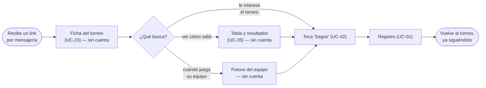
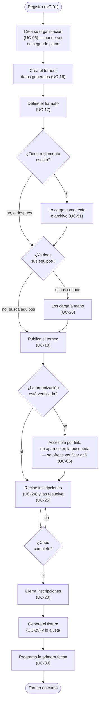
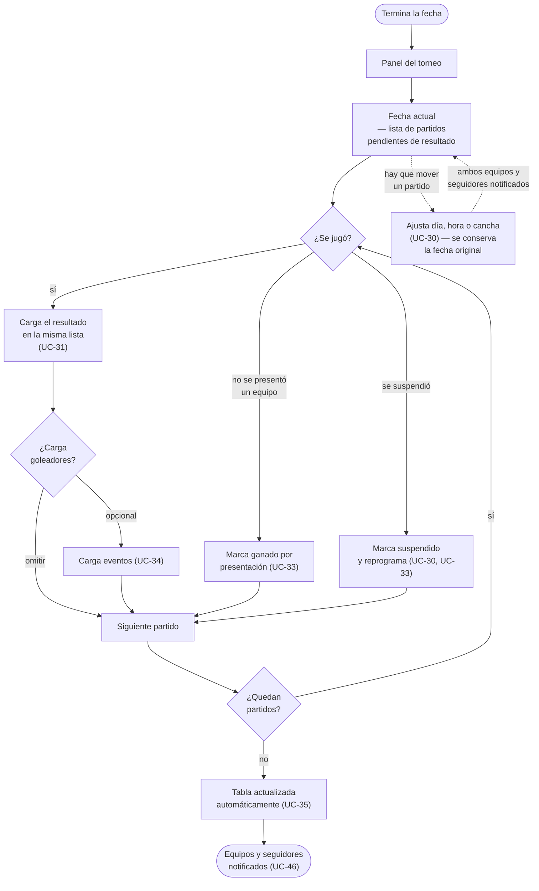
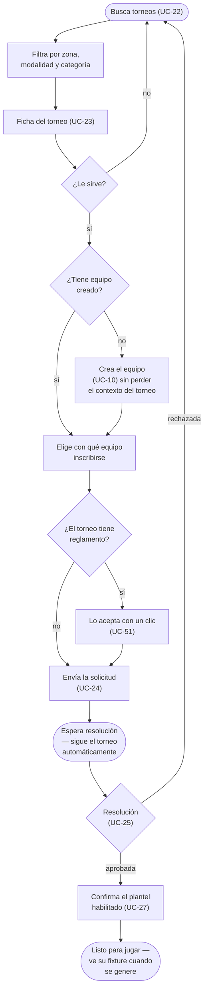
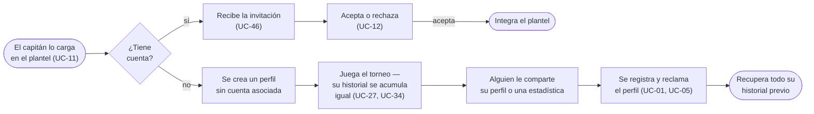
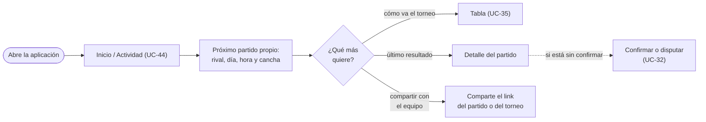

# Flujos de UX y Recorridos de Usuario — INVICTOS

> **Nombre del producto: INVICTOS** (`06`, D-84). En los documentos "la plataforma" se conserva donde funciona como sustantivo común; el nombre propio se usa en los títulos y donde se habla del producto como marca.

## 1. Objetivo del documento

Este documento traduce los **Casos de Uso** (qué hace el sistema y por qué) en **recorridos de pantalla a pantalla** (cómo se navega para lograrlo). Define **qué pantallas existen, en qué orden aparecen y qué decisiones toma el usuario en cada paso**, sin definir un solo color ni tipografía — eso vive en el **Brief de Diseño** (`08`), que se apoya en este documento.

Se apoya en:
- **`02-casos-de-uso.md`**: cada paso referencia el UC que lo origina.
- **`01-arquitectura-funcional-y-actores.md`**: quién es cada actor de estos recorridos.
- **`03-diagrama-entidad-relacion.md`**: qué datos existen para mostrar o pedir en cada pantalla.

---

## 2. Principios de UX para este proyecto **[Definido]**

1. **El contenido va primero, la cuenta después.** La ficha de un torneo, su fixture y su tabla se ven sin sesión iniciada (UC-23). El registro se pide en el momento de la acción (seguir, inscribirse), nunca antes. La mayor parte del tráfico va a llegar por un link compartido en un grupo de mensajería, y ese es el momento en que se gana o se pierde un usuario.
2. **Nadie elige "qué tipo de usuario es".** Una misma persona es jugador de un equipo, capitán de otro, DT de un tercero y organizador de su propio torneo, todo al mismo tiempo (`01`, 4.3; `06`, D-23). El contexto lo da la cosa que está mirando, no un selector global de modo.
3. **Prioridad a lo frecuente.** El recorrido más repetido de todo el sistema es **cargar el resultado de una fecha** (UC-31): un organizador lo hace todas las semanas, varias veces seguidas. Merece la menor fricción de todo el producto, igual que el flujo de venta en el sistema de referencia.
4. **La segunda pantalla más importante es "mi próximo partido".** Para un jugador o un capitán, esa es la pregunta que lo trae a la aplicación.
5. **Ninguna pantalla vacía sin salida.** Un equipo sin torneos, un torneo sin inscriptos, una búsqueda sin resultados: cada uno de esos estados debe ofrecer el siguiente paso concreto, no un mensaje de "no hay nada".
6. **Los datos declarados por las partes se muestran como tales, y lo que cambió se muestra como cambio.** Un resultado sin confirmar y uno confirmado no se ven igual (UC-32); un partido que se movió de fecha y uno que siempre se jugó ese día tampoco (UC-30, `06`, D-30); un reglamento que se modificó con el torneo empezado tiene que decir qué cambió y desde cuándo rige (UC-51, `06`, D-28). Es lo que sostiene la credibilidad del producto: en este dominio, todo lo que se corrige en silencio termina siendo una discusión.
7. **La publicidad va donde se consulta, no donde se trabaja.** **[Definido]** Las superficies que pueden alojar publicidad son las tres de consulta: **ficha pública del torneo, fixture y descubrimiento**. No la llevan **los flujos de tarea del organizador** —cargar resultados, armar el fixture, resolver inscripciones— **ni el flujo de inscripción del capitán** (`06`, D-35, D-63). Fundamento: el flujo de carga de resultados es el más repetido del producto y el que decide si el organizador se queda (principio 3), así que degradarlo para monetizar pondría en riesgo justamente el dato del que vive todo lo demás; y meter publicidad en la inscripción le agregaría fricción a la conversión que el descubrimiento acaba de producir.

### 2.1 Perfiles de uso **[Definido — D-67]**

**El producto es mobile-first para todos los actores.** La configuración del organizador puede aprovechar una pantalla grande, pero **ninguna tarea puede requerir escritorio**: ni armar el torneo, ni generar el fixture, ni resolver inscripciones. Eso convierte el principio 3 —prioridad a lo frecuente— de recomendación en restricción: la carga de resultados tiene que resolverse de pie, con una mano y en pocos toques, porque ese es el contexto real y no hay una versión de escritorio a la que caerse.

| Actor | Contexto de uso real | Implicancia de diseño |
|---|---|---|
| **Organizador** | Sentado, planificando (armar el torneo, generar el fixture) o parado en el complejo cargando resultados de varias canchas seguidas | Dos contextos opuestos: la configuración puede aprovechar pantalla grande; la carga de resultados tiene que funcionar de pie, con una mano, en pocos toques |
| **Capitán** | En movimiento, coordinando gente por mensajería en paralelo | Todo lo suyo debe poder resolverse desde el teléfono y compartirse hacia afuera con un toque |
| **Jugador** | Consulta rápida: ¿cuándo juego?, ¿cómo salimos?, ¿quién es el goleador? | Consultas de un vistazo, sin navegación profunda |
| **Visitante** | Llegó por un link, sin contexto previo | La primera pantalla tiene que explicarse sola |

---

## 3. Mapa de navegación general (Arquitectura de Información)

> **Cómo leerlo:** es el "esqueleto" de la aplicación — qué secciones existen y cómo se llega a cada una. No representa decisiones visuales, solo estructura. Los nodos punteados requieren sesión iniciada.

```mermaid
flowchart TB
    ENTRADA(["Entrada: link compartido,<br/>búsqueda o app"])
    HOME["Inicio / Actividad<br/>(UC-44)"]
    DESCUBRIR["Torneos de mi ciudad<br/>(UC-22)"]
    TORNEO["Ficha del torneo<br/>(UC-23)"]

    ENTRADA --> TORNEO
    ENTRADA --> DESCUBRIR
    ENTRADA --> HOME
    DESCUBRIR --> TORNEO
    DESCUBRIR -.-> CIUDAD["Cambiar de ciudad<br/>para explorar (UC-22)"]

    TORNEO --> T_FIXTURE["Fixture y resultados"]
    TORNEO --> T_TABLA["Tabla de posiciones (UC-35)"]
    TORNEO --> T_EQUIPOS["Equipos participantes"]
    TORNEO --> T_STATS["Estadísticas (UC-36)"]
    TORNEO --> T_ORG["Perfil del organizador (UC-08)"]
    TORNEO --> T_REGLA["Reglamento, si lo hay<br/>(UC-51)"]
    TORNEO -.-> T_INSCRIBIR["Inscribir mi equipo (UC-24)"]
    TORNEO -.-> T_SEGUIR["Seguir torneo (UC-42)"]

    T_EQUIPOS --> EQUIPO["Perfil del equipo (UC-14)"]
    T_FIXTURE --> PARTIDO["Detalle del partido"]
    PARTIDO -.-> P_CONFIRMAR["Confirmar o disputar (UC-32)"]

    EQUIPO --> E_PLANTEL["Plantel"]
    EQUIPO --> E_HISTORIAL["Historial y estadísticas (UC-37)"]
    EQUIPO --> E_SCORE["Score y desglose (UC-40)"]
    EQUIPO -.-> E_SEGUIR["Seguir equipo (UC-43)"]
    EQUIPO -.-> E_SUMARSE["Solicitar sumarme<br/>al plantel (UC-53)"]
    E_PLANTEL --> JUGADOR["Perfil del jugador (UC-03, UC-38)"]

    HOME -.-> MIS_EQUIPOS["Mis equipos"]
    HOME -.-> MIS_TORNEOS["Mis torneos (organizador)"]
    HOME -.-> MI_ORG["Mi organización (UC-06, UC-08)"]
    HOME -.-> MI_PERFIL["Mi perfil (UC-02, UC-04)"]
    HOME -.-> NOTIF["Notificaciones (UC-46, UC-47)"]

    MI_ORG -.-> ORG_MIEMBROS["Miembros de la organización<br/>— titular y administradores<br/>(UC-07)"]

    MIS_EQUIPOS -.-> EQ_GESTION["Gestionar equipo<br/>(UC-11, UC-13)"]
    MIS_EQUIPOS -.-> EQ_NUEVO["Crear equipo (UC-10)"]
    EQ_GESTION -.-> EQ_SOLIC["Solicitudes de ingreso<br/>(UC-53)"]

    MIS_TORNEOS -.-> ORG_PANEL["Panel del torneo"]
    MIS_TORNEOS -.-> ORG_NUEVO["Crear torneo (UC-16, UC-17)"]
    ORG_PANEL -.-> ORG_INSC["Inscripciones (UC-25, UC-26)"]
    ORG_PANEL -.-> ORG_FIXTURE["Fixture (UC-29, UC-30)"]
    ORG_PANEL -.-> ORG_RESULT["Cargar resultados (UC-31, UC-33)"]
    ORG_PANEL -.-> ORG_CONFIG["Configuración y estado<br/>(UC-19, UC-20, UC-21)"]
    ORG_PANEL -.-> ORG_REGLA["Reglamento (UC-51)"]
    ORG_PANEL -.-> ORG_COLAB["Colaboradores de este torneo<br/>(UC-52)"]
```

**[Definido — D-90] El descubrimiento no es un buscador: es la vista de una ciudad.** Se entra y ya se están viendo los torneos de la ciudad propia, sin pedir nada. Por eso la ciudad **no es uno de los filtros** sino el encabezado de la pantalla, y cambiarla es una acción de exploración con vuelta fácil a la propia.

**[Definido — D-85] El perfil del equipo tiene dos salidas hacia la acción, y son de peso distinto.** Seguir (UC-43) es inmediato; solicitar sumarse (UC-53) abre una pendiente que resuelve el capitán o un delegado. Del otro lado, las solicitudes recibidas cuelgan de la gestión del equipo, **separadas de las invitaciones enviadas**: en unas espera el capitán y en las otras espera la otra persona.

**[Definido] La gestión de miembros vive en la organización; la de colaboradores, en el torneo.** UC-07 administra los roles de **organización** —titular y administradores— y por eso cuelga de "Mi organización". UC-52 asigna **colaboradores a un torneo puntual** y por eso cuelga del panel de ese torneo (`06`, D-32, D-34). Son dos pantallas distintas porque son dos alcances distintos: una misma persona puede colaborar en varios torneos a la vez, incluso de organizaciones distintas, y sacarla de uno no la saca de los demás.

**[Definido] Dos vistas del mismo torneo, no dos torneos.** La *ficha pública* (UC-23) y el *panel del organizador* son la misma competencia con dos capas de acceso. El organizador debería poder saltar de una a otra en un toque — necesita ver su torneo como lo ve un capitán que evalúa inscribirse.

---

## 4. Recorridos por actor

### 4.1 Visitante — De un link compartido a usuario registrado

> Es el recorrido de adquisición del producto. La mayoría de los usuarios nuevos van a entrar por acá, sin haber buscado nada.

**[Definido] La regla que sostiene este recorrido:** el registro nunca interrumpe una consulta, solo una acción. Y cuando interrumpe, **completa la acción al terminar** — quien tocó "seguir" y se registró vuelve al torneo ya siguiéndolo, no a una pantalla de inicio genérica.

### 4.2 Organizador — Del torneo en borrador al torneo publicado

> Es el recorrido más largo del producto y el que decide si un organizador adopta la plataforma o vuelve a su planilla.

**[Definido] El reglamento es un paso del armado, no un requisito de publicación.** El organizador puede cargarlo como texto, como archivo o de las dos formas (UC-51), pero **su ausencia no bloquea publicar el torneo** (`06`, D-29): la mayoría de los torneos de barrio no tienen reglamento escrito, y exigirlo sería una barrera de entrada sin contrapartida. En el diseño esto significa que el paso se ofrece —porque es lo que le da respaldo al organizador cuando aparece una disputa— pero se puede saltear y volver a él con el torneo ya publicado.

**[Definido] La verificación no bloquea armar el torneo: bloquea aparecer en la búsqueda.** Una organización sin verificar recorre todo lo anterior sin fricción —crea el torneo, lo configura, carga equipos, genera el fixture— y se encuentra con el límite recién al publicar: el torneo queda publicado y accesible por link, pero no listado en el descubrimiento hasta que la organización se verifique (`06`, D-51). El diseño tiene dos obligaciones en ese momento, y es el punto clave de todo este recorrido: **explicar bien qué significa** —el torneo existe y se puede compartir; lo que falta es que aparezca en la búsqueda— y **ofrecer la verificación ahí mismo**, sin mandar al organizador a buscarla en otra pantalla. El fundamento es de oportunidad: ese es el momento de mayor motivación del recorrido, porque el organizador ya invirtió el trabajo y está a un paso de mostrarlo. Pedirle lo mismo al principio, cuando todavía no invirtió nada, es cuando más barato le sale abandonar.

**[Definido] El equipo de trabajo se arma por torneo, no de una vez para toda la organización.** Los colaboradores se asignan **al torneo** (UC-52), desde su propio panel, y sus permisos son fijos: cargar resultados y eventos, programar y reprogramar partidos, registrar partidos no disputados (`06`, D-32). Los roles de organización —titular y administradores— se gestionan aparte, en la organización (UC-07). En el recorrido esto significa que asignar colaboradores es un paso que aparece **cuando el torneo ya existe**, típicamente junto con el fixture, y no un requisito del alta de la organización: el organizador delega recién cuando tiene trabajo que delegar.

**[Definido] El punto crítico de este recorrido es la bifurcación de E.** Un organizador que llega con sus doce equipos ya conocidos no debería tener que esperar a que doce capitanes se registren — por eso UC-26 (inscripción manual) es MVP y no una funcionalidad de conveniencia. Si ese camino no existe, el producto no sirve para el primer torneo de nadie.

### 4.3 Organizador — Ciclo semanal de carga de resultados (el recorrido más frecuente)

> Es al ciclo de venta del sistema de referencia lo que este flujo es a este producto: el que más se repite, el que más atención de diseño merece, y el que debe resolverse en la menor cantidad de pasos posible.

**[Definido] Cuatro decisiones de diseño que se desprenden de este flujo:**
- La carga debe ocurrir **en la propia lista de partidos**, no entrando y saliendo de una pantalla de detalle por cada uno. Un organizador con seis partidos en una tarde hace ese recorrido seis veces.
- **Reprogramar es parte del ciclo, no una excepción.** Ajustar el día, la hora o la cancha de un partido con el torneo en curso está permitido mientras el partido no se haya jugado (UC-30, `06`, D-30), y en el fútbol amateur pasa todas las semanas. Tiene que resolverse desde la misma lista de partidos, con el mismo esfuerzo que cargar un resultado: si el organizador tiene que salir del ciclo para mover un partido, termina moviéndolo por mensajería y la plataforma queda desactualizada. Se conserva la fecha original y se notifica a los dos equipos y a los seguidores.
- La carga de goleadores (UC-34) es un paso **claramente omitible**, no un formulario que hay que atravesar. Si estorba, deja de cargarse el resultado también.
- La tabla se actualiza sola y **debe verse actualizarse**: es la recompensa inmediata del trabajo de carga, y el mejor argumento para que el organizador siga usando la plataforma en vez de su planilla.

### 4.4 Capitán — De descubrir un torneo a estar inscripto

**[Definido] Aceptar el reglamento es parte del paso de inscripción, no una pantalla más.** Cuando el torneo tiene reglamento cargado, inscribirse incluye **aceptarlo explícitamente con un clic**, y el sistema guarda **qué versión** se aceptó (`06`, D-54). Si el reglamento cambia después no se pide volver a aceptarlo: se notifica, y ante una disputa se ve que la versión vigente es posterior a la que el capitán aceptó. Es la fricción más barata del recorrido —un clic— y lo único que le da respaldo al organizador cuando la discusión llega; si el torneo no tiene reglamento, el paso directamente no aparece (`06`, D-29).

**[Definido] El paso F es el que más se suele romper en productos de este tipo.** Un capitán que encontró el torneo que buscaba y descubre que primero tiene que salir a crear un equipo, cargar un plantel y recién después volver, se pierde en el camino. Crear el equipo tiene que ocurrir **dentro** del flujo de inscripción, con el torneo esperándolo del otro lado, y con el plantel como paso posterior y opcional (UC-10).

### 4.5 Jugador — De invitado a perfil propio

**[Definido] El mismo recorrido aplica a quien es invitado como DT.** El cuerpo técnico entra al equipo por la misma puerta que un jugador —lo carga el capitán, recibe la invitación, la acepta— y también puede existir como perfil sin cuenta y reclamarlo después (`06`, D-18, D-22). Lo único que cambia es el rol del vínculo, no el recorrido: no hay un flujo de alta distinto ni una pantalla aparte para el cuerpo técnico. Sí cambia lo que ve al entrar —dirige, no juega—, y sobre todo lo que **no** puede hacer: ser DT no habilita gestionar el plantel ni inscribir al equipo (`06`, D-25), así que la interfaz no debería ofrecerle esas acciones y después negárselas.

**[Definido] El camino inferior es el de mayor potencial de crecimiento del producto** y conviene diseñarlo como tal: una persona descubre que la plataforma ya tiene registrado que hizo cuatro goles en un torneo, y se registra para quedarse con eso. Es el equivalente futbolero de encontrarse etiquetado en una foto.

### 4.6 Jugador o capitán — Consulta rápida ("¿cuándo juego?")

**[Definido]** El paso H no es un detalle: **compartir hacia afuera es la función social real de este producto en su primera versión**, mucho más que cualquier feed interno. Todo lo que se consulta (un partido, una tabla, un torneo, un perfil) debería tener un link compartible que se vea bien pegado en un grupo de mensajería.

---

## 5. Casos especiales y manejo de excepciones

Estos son los puntos donde el sistema tiene que comunicar algo delicado sin generar confusión. Requieren atención específica en el diseño visual.

| Situación | Dónde ocurre | Qué necesita comunicar el diseño |
|---|---|---|
| Un resultado está cargado pero sin confirmar | UC-31, UC-32, UC-35 | Debe distinguirse visualmente de uno confirmado, tanto en el partido como en la tabla. Un dato provisorio presentado como definitivo es peor que no mostrarlo — y es lo que sostiene la credibilidad del producto. |
| Un resultado está en disputa | UC-32 | La tabla igual lo computa, pero marcado como provisorio. Congelar la tabla ante cada disputa la vuelve inútil justo cuando más se la consulta. El organizador debe ver la disputa como una tarea pendiente, no como una notificación más. |
| Un partido se ganó por presentación | UC-33 | Distinto de un resultado jugado, en el fixture y en la tabla. No es lo mismo ganar 3 a 0 que ganar porque el rival no vino. |
| Un equipo abandona el torneo en curso | UC-28 | **[Definido]** (`06`, D-08b) Los partidos jugados se mantienen y los pendientes se dan por ganados a sus rivales, salvo que el torneo esté configurado de otra forma. El diseño tiene que poder explicárselo a los rivales afectados — es su tabla la que cambia por algo que ellos no hicieron. |
| Un torneo se cancela | UC-21 | El motivo debe ser visible para los equipos inscriptos y los seguidores. Un torneo que desaparece sin explicación destruye la confianza en el organizador y en la plataforma. |
| Un jugador restringe su perfil | UC-04 | Aclarar que **no** desaparece de las estadísticas del torneo en el que jugó: lo que se restringe es el perfil, no el hecho de haber jugado. Sin esta aclaración, se genera una expectativa incumplida. |
| Un equipo todavía no tiene score | UC-39, UC-40 | Mostrar "sin score todavía" y qué le falta, nunca un cero. Un cero se lee como "es malísimo"; la ausencia de score se lee como "todavía no jugó lo suficiente". |
| La ciudad de la persona no tiene torneos | UC-22 | **[Definido]** (`06`, D-90) **Va a pasar seguido**, no es excepcional: el catálogo es nacional y la mayoría de las ciudades va a estar vacía por mucho tiempo. Ofrece, en este orden: **ver los torneos de la provincia** diciendo cuántos hay, **avisar cuando se publique uno acá**, y **publicar uno**. Lo que no puede hacer es parecer un error ni sugerir que el producto entero está vacío porque lo está una ciudad. |
| La persona todavía no indicó su ciudad | UC-22 | **[Definido]** (`06`, D-90) Pasa con cualquier visitante que llegó por un link y con quien recién se registra — la ciudad **no se pide en el alta** (D-52), se pide acá. Se resuelve **dentro de la pantalla, como su primer elemento**, nunca como un paso previo que bloquee: el contenido va antes que la configuración. |
| Alguien quiere mirar torneos de otra ciudad | UC-22 | **[Definido]** (`06`, D-90) Es **explorar, no filtrar**: la intención es mirar otro lado, no acotar lo que ya se ve. Tiene que ser evidente en qué ciudad se está parado en todo momento, y **volver a la propia tiene que ser trivial** — si alguien queda mirando otra ciudad sin darse cuenta, va a creer que su ciudad tiene torneos que no tiene. |
| Un torneo publicado no aparece en la búsqueda porque la organización no está verificada | UC-18, UC-22 | **[Definido]** (`06`, D-51) Hay que distinguir con precisión **"no aparecés en la búsqueda"** de **"tu torneo no existe"**: el torneo está publicado, es accesible por link y se puede compartir en un grupo de mensajería como cualquier otro; lo único que falta es el listado en el descubrimiento. Si el mensaje no lo dice así, el organizador va a leer lo segundo y abandonar con el trabajo ya hecho. El mismo lugar donde se da la noticia tiene que ofrecer la verificación. |
| Un resultado quedó confirmado por vencimiento del plazo | UC-31, UC-32, UC-35 | **[Definido]** (`06`, D-60) Un resultado sin confirmar se da por confirmado **a las 72 horas de haberse cargado**. La tabla y el detalle del partido tienen que poder mostrar que ese resultado quedó firme **porque venció el plazo**, no porque alguien lo haya confirmado: ante un reclamo son dos informaciones distintas, y la diferencia es justamente lo que se discute. Con una disputa abierta el plazo se congela hasta que el organizador resuelva, y ese estado también tiene que verse. |
| Un torneo publicado sin inscripciones | UC-18, UC-25 | Para el organizador, sugerir cómo difundirlo (compartir el link). Para el visitante, no debe verse como un torneo fracasado. |
| Un equipo sin plantel se inscribe | UC-10, UC-27 | Es un camino válido, no un error: el equipo se inscribe y confirma su plantel después. El diseño no debe presentarlo como algo incompleto. |
| Un equipo se inscribe a un torneo de otra categoría de género | UC-24, UC-25 | **[Definido]** (`06`, D-82) **Avisa, no bloquea**, en los dos extremos: el capitán lo ve antes de confirmar y el organizador lo ve marcado en la solicitud. Los dos mensajes tienen que decir lo mismo —qué categoría es cada una— y **ninguno puede parecer un error del sistema**: el caso legítimo existe (un equipo mixto en un torneo masculino) y el reglamento del torneo es el que manda. Un torneo mixto no genera aviso con ningún equipo. |
| Una institución tiene equipo masculino y femenino | UC-10, UC-14 | **[Definido]** (`06`, D-83) Son **dos equipos**, y así se ven: dos tarjetas en "Mis equipos" y dos resultados en la búsqueda, con el mismo nombre y el mismo escudo. Lo único que los distingue a simple vista es la **etiqueta de categoría**, así que tiene que estar presente y ser legible en cada lugar donde aparezcan juntos. **No hay vista de club ni encabezado común**: el agrupador es de la segunda etapa (`07`), y sugerirlo en el diseño promete una navegación que no existe. |
| "Seguir" y "sumarme al plantel" conviven en la misma pantalla | UC-14, UC-43, UC-53 | **[Definido]** (`06`, D-85) Son dos acciones de peso muy distinto y **no pueden verse equivalentes**: seguir es inmediato, reversible y no compromete a nadie; sumarse abre una **solicitud** que alguien tiene que resolver y que, si se acepta, pone a la persona en un plantel público. La jerarquía visual y el texto tienen que dejar claro cuál es cuál **antes** del toque, no después. Mientras la solicitud está pendiente, la pantalla lo dice y ofrece retirarla. |
| Al capitán le llegan solicitudes y también tiene invitaciones sin responder | UC-11, UC-53 | **[Definido]** (`06`, D-85) En el plantel conviven dos pendientes que se ven parecidos y exigen cosas opuestas: *"lo invitamos y no contesta"* —donde no hay nada que hacer salvo esperar o cancelar— y *"nos pidió entrar y no le contestamos"* —donde la acción es del capitán—. **Tienen que estar separados y etiquetados**, no mezclados en una lista de "pendientes": es la única forma de que el capitán sepa de un vistazo qué depende de él. |
| Alguien se va de un equipo estando en un torneo en curso | UC-13, UC-27 | **[Definido]** (`06`, D-87, D-18b) La baja es inmediata y no la confirma nadie, pero **la persona sigue habilitada en ese torneo hasta que termine**. El producto tiene que decirlo en el momento de la baja, con esas palabras: salió del equipo, no de la competencia. Sin ese aviso, el jugador cree que dejó de estar disponible y el capitán cree que perdió a alguien que en realidad todavía puede jugar. |
| El equipo se inscribió y no pasa nada visible | UC-24, UC-25 | **[Definido]** (`06`, D-93) La inscripción **nunca es directa**: queda pendiente hasta que el organizador la resuelva, y eso puede tardar días. La pantalla tiene que dejar claro **que el paso siguiente no es del capitán** —no hay nada que completar ni que pagar dentro de la aplicación— y que va a llegar un aviso cuando se resuelva. Sin eso, el capitán cree que hizo algo mal y vuelve a inscribirse, o llama al organizador. |
| El capitán quiere dejar el equipo | UC-13 | Bloqueado hasta designar otro capitán, con la explicación de por qué (el equipo no puede quedar sin responsable), no con un error genérico. |
| Se corrige un resultado ya cargado | UC-31 | La corrección es visible y trazable (quién y cuándo). En un dominio donde el resultado lo declara una de las partes, esconder una corrección es lo peor que puede hacer el producto. |
| Un jugador es cargado en dos equipos del mismo torneo | UC-27 | **[Definido]** (`06`, D-17b) Está prohibido por default y es configurable por torneo. El aviso aparece **al confirmar la lista** (UC-27), no cuando el partido ya se jugó: detectarlo tarde convierte un aviso en un conflicto. |
| El reglamento se modifica con el torneo en curso | UC-51 | **[Definido]** (`06`, D-28) Está permitido, pero hay que comunicar **qué cambió y desde cuándo rige**, y dejar accesible la versión anterior. Un reglamento que cambia en silencio a mitad de torneo es la peor versión posible de esta funcionalidad: convierte la herramienta que debía respaldar al organizador en el motivo de la próxima discusión. Los equipos inscriptos se notifican. |
| Una persona colabora en varios torneos a la vez | UC-52, UC-31 | **[Definido]** (`06`, D-32) El colaborador se asigna por torneo y puede tener varios simultáneos, incluso de organizaciones distintas. La interfaz tiene que dejar claro **en qué torneo está operando** en todo momento, sobre todo en la carga de resultados: cargar un resultado en el torneo equivocado es un error silencioso y caro — el sistema no puede detectarlo, y nadie lo nota hasta que alguien mira la tabla y no entiende de dónde salió ese partido. |
| Un partido se reprograma varias veces | UC-30 | **[Definido]** (`06`, D-30) Se muestra la **fecha vigente** como dato principal, sin esconder que el partido se movió ni cuándo estaba programado originalmente. Es el insumo de cualquier discusión sobre una no presentación: sin ese registro, "nadie me avisó" no se puede responder. La jerarquía importa — quien entra a ver cuándo juega no debe confundir una fecha vieja con la actual. |

---

## 6. Fuera de alcance de esta fase

- Diseño visual: paleta, tipografía, componentes, layout — corresponde al futuro Brief de Diseño.
- El detalle de la adaptación a pantalla grande. **[Definido — D-67]** el producto es mobile-first para todos los actores (ver 2.1); cómo se aprovecha una pantalla más grande en las tareas de configuración del organizador es una decisión del Brief de Diseño, no de este documento.
- Recorridos de administración de plataforma (UC-48 a UC-50).
- Recorridos de pago e inscripción con costo. **[Definido]** La Inscripción se modela desde el día uno con un costo asociado, hoy siempre cero (`06`, D-33), pero el recorrido de pago no se diseña en esta fase: llega con la etapa 4 de monetización (`06`, D-31).
