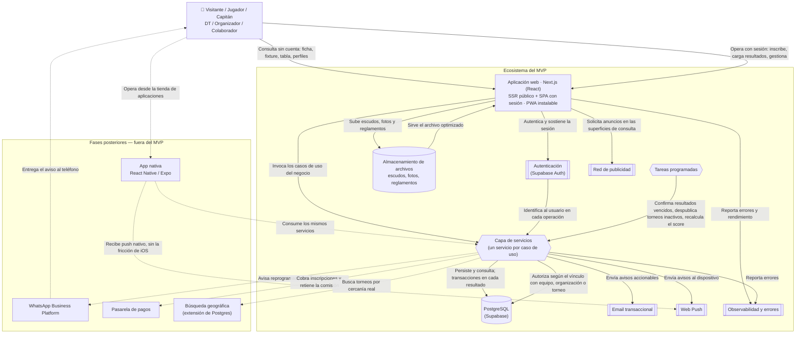

# Diagrama de Arquitectura — INVICTOS

## 1. Objetivo del documento

Este documento muestra, en una sola vista, **cómo interactúan entre sí las tecnologías** que componen la plataforma: quién le habla a quién, y **para qué**. A diferencia del Diagrama de Entidad-Relación —que describe el negocio de forma agnóstica a la tecnología—, este documento **sí está atado a decisiones técnicas concretas**: es la vista del "cómo" que complementa la del "qué".

Cada elemento tiene declarada su **responsabilidad**; cada conector, su **motivo**.

**[Definido] El stack no se eligió por preferencia: se derivó de decisiones de producto ya tomadas.** La sección 3 muestra esa derivación, y es lo primero que hay que leer — porque es lo que permite revisar la elección el día que alguna de esas decisiones cambie.

Se apoya en:
- **`06-reglas-negocio-y-decisiones-pendientes.md`**: las decisiones de producto que condicionan el stack (D-76 a D-79).
- **`03-diagrama-entidad-relacion.md`**: qué se persiste.
- **`02-casos-de-uso.md`**: qué ejecuta la capa de servicios.
- **`08-brief-diseno.md`**: qué se renderiza y en qué superficie.

---

## 2. Las cinco restricciones que determinaron el stack

| Decisión de producto | Qué le exige al stack |
|---|---|
| **El descubrimiento es el activo del producto** (D-02, D-51) | Los torneos, equipos y perfiles tienen que **indexarse**. Obliga a renderizado en servidor |
| **La ficha se comparte por mensajería y el visitante no tiene cuenta** (D-04b) | Web pública rápida con **previsualización propia por torneo**. Un link compartido no puede abrir una tienda de aplicaciones |
| **Publicidad de red desde el inicio** (D-31, D-63) | Los anuncios son elementos del documento y viven en la web |
| **Mobile-first para todos los actores** (D-67) | Experiencia de aplicación en el teléfono, y notificaciones push |
| **Tabla, estadísticas y score cruzados entre torneos** (UC-31, UC-37, UC-39) | Consultas relacionales con agregación, y **transacciones**: cargar un resultado actualiza tabla, estadísticas y score de forma atómica |

**[Definido] Las dos primeras son las que más recortan las opciones**, y son las que explican por qué **no** se repite el stack del sistema de referencia (ver 7.1).

---

## 3. Diagrama

> **Cómo leerlo:** el recuadro de la izquierda agrupa lo que forma parte del MVP. El de la derecha agrupa lo que está diseñado pero **fuera de esta primera entrega** (líneas punteadas también en sus conectores). La aplicación web se representa como un único bloque porque un mismo proyecto sirve las superficies públicas renderizadas en servidor y la aplicación con sesión.

---

## 4. Responsabilidad de cada componente

| Componente | Responsabilidad | Estado |
|---|---|---|
| **Aplicación web (Next.js / React)** | Es la interfaz. Renderiza **en el servidor** las superficies públicas —ficha del torneo, fixture, tabla, perfiles— para que se indexen y tengan previsualización propia al compartirse, y funciona como aplicación de una sola página en la parte con sesión. Es **instalable como PWA** | MVP |
| **Capa de servicios** | Concentra **toda la lógica de negocio**: valida reglas, ejecuta los casos de uso y es lo único autorizado a escribir en la base. Vive dentro del mismo proyecto, pero **separada de la interfaz** | MVP |
| **Autenticación (Supabase Auth)** | Autentica a la persona y sostiene la sesión. Gestiona el correo de acceso y **la confirmación de email que habilita la verificación básica** de una organización (D-76) | MVP |
| **PostgreSQL (Supabase)** | Persiste todo el modelo de `03`. Ejecuta las **transacciones** que mantienen consistentes resultado, tabla, estadísticas y score. No contiene lógica de negocio | MVP |
| **Almacenamiento de archivos** | Escudos de equipo, fotos de perfil y archivos de reglamento. Entrega versiones optimizadas por tamaño — importa porque el escudo aparece en casi todas las pantallas | MVP |
| **Email transaccional** | Entrega las notificaciones accionables y los correos de acceso. Es el canal que **sobrevive a que alguien desinstale la aplicación o apague las notificaciones** (D-53) | MVP |
| **Web Push** | Entrega las notificaciones al dispositivo. En iOS **exige que la persona instale la PWA** en su pantalla de inicio — ver el riesgo en 8.1 | MVP |
| **Tareas programadas** | Ejecuta lo que ocurre sin que nadie lo pida. En el MVP: **confirmar resultados vencidos a las 72 horas** (D-60) y dejar agendado el **recálculo del score** (UC-39, con los umbrales de D-61). En la segunda etapa se suma **despublicar torneos inactivos** (D-51): no entra al MVP porque un falso positivo despublicaría el torneo del primer organizador (D-80). No es infraestructura opcional: son requisitos que salen de decisiones ya tomadas | MVP |
| **Red de publicidad** | Sirve los anuncios en las tres superficies de consulta. **Nunca** en los flujos de tarea del organizador ni en la inscripción (D-63) | MVP |
| **Observabilidad** | Captura errores y rendimiento. Con el producto construido por un agente, es la única forma de enterarse de una regresión que los tests no cubrieron (7.3) | MVP |
| **App nativa (React Native / Expo)** | Misma experiencia en las tiendas, con push sin la fricción de iOS. Comparte lenguaje y lógica con la web | Fuera del MVP |
| **WhatsApp Business Platform** | Canal de aviso **solo para reprogramaciones** (D-53), que es donde su costo por mensaje se justifica | Fuera del MVP |
| **Pasarela de pagos** | Cobro de inscripciones y retención de la comisión — etapas 3 y 4 de la monetización (D-31) | Fuera del MVP |
| **Búsqueda geográfica** | Solo si alguna vez se pasa de zonas predefinidas a radio real en kilómetros. Es una **extensión de la misma base**, no un motor nuevo | Fuera del MVP |

---

## 5. Conectores — motivo de cada interacción

| Origen | Destino | Motivo | Estado |
|---|---|---|---|
| Usuario | Aplicación web | Consulta sin cuenta (ficha, fixture, tabla, perfiles) y operación con sesión | MVP |
| Aplicación web | Autenticación | Autentica y sostiene la sesión antes de permitir operar | MVP |
| Aplicación web | Capa de servicios | Invoca los casos de uso del negocio | MVP |
| Autenticación | Capa de servicios | Identifica al usuario en cada operación, para poder resolver sus permisos | MVP |
| Capa de servicios | PostgreSQL | Persiste y consulta; **cada carga de resultado ocurre dentro de una transacción** | MVP |
| Aplicación web | Almacenamiento | Sube escudos, fotos y reglamentos, y recibe la referencia para guardarla | MVP |
| Capa de servicios | Email | Envía avisos accionables y correos de acceso | MVP |
| Capa de servicios | Web Push | Envía avisos al dispositivo de quien tiene la PWA instalada | MVP |
| Tareas programadas | Capa de servicios | Dispara los tres procesos automáticos, **ejecutando la misma lógica que un usuario**, no una copia paralela | MVP |
| Aplicación web | Red de publicidad | Solicita los anuncios de las superficies de consulta | MVP |
| App nativa | Capa de servicios | Consume exactamente los mismos servicios: **el canal cambia, las reglas de negocio no** | Fuera del MVP |
| Capa de servicios | WhatsApp | Avisa reprogramaciones | Fuera del MVP |
| Capa de servicios | Pasarela de pagos | Cobra la inscripción y retiene la comisión | Fuera del MVP |

---

## 6. Dos decisiones de arquitectura que conviene entender

### 6.1 La lógica de negocio vive en servicios, no en las pantallas

**[Definido]** Aunque el MVP sea un solo proyecto desplegado junto, **la lógica de negocio está en una capa de servicios separada de la interfaz**, con **un servicio por caso de uso**.

Tres razones:

1. **El set de documentación ya está escrito así.** Los 53 casos de uso son unidades con precondiciones, reglas y resultado esperado: se mapean uno a uno a servicios. Esa correspondencia es lo que hace que la futura Especificación Técnica sea una traducción y no una reinterpretación.
2. **Las tareas programadas ejecutan la misma lógica.** Confirmar un resultado por vencimiento del plazo tiene que pasar por el mismo código que confirmarlo a mano, o las dos formas se van a desincronizar.
3. **Es la única forma barata de extraer un backend propio después**, si alguna vez hace falta. Sin esa separación, la lógica queda pegada a las pantallas y el día que aparezca la app nativa hay que reescribirla.

### 6.2 La autorización vive en el backend; la base es la última línea de defensa

**[Definido]** Los permisos de este producto **no se pueden expresar solo con reglas de base de datos**: dependen del vínculo de la persona con **una cosa puntual** —este equipo, esta organización, **este torneo**— y de estados que cambian (D-23, D-32). Toda esa lógica vive en la capa de servicios.

Las reglas de la base se configuran igual, con un criterio acotado: **impedir cualquier acceso directo que no venga de los servicios**. Es exactamente el mismo criterio con que el sistema de referencia trató sus reglas de seguridad — una red defensiva, no el mecanismo principal.

---

## 7. Decisiones de stack registradas

### 7.1 Firebase / Firestore + Flutter — el stack del sistema de referencia

**Evaluado y descartado.** No por moda: **los dos productos son estructuralmente opuestos**.

Aquel sistema era multi-tenant con datos jerárquicos y aislados: cada comercio consultaba lo suyo y nada más. Acá, **las consultas que definen el producto son cruzadas**: ranking por zona, historial de un equipo a través de torneos de organizadores distintos, tabla con criterios de desempate configurables, score comparable entre competencias. En una base documental eso obliga a desnormalizar y mantener agregados a mano — que es justamente el tipo de complejidad que este set intenta evitar.

### 7.2 Flutter — evaluado con más detalle, y por qué igual no

**[Definido]** El argumento **no** es que Flutter obligue a instalar una aplicación: **Flutter también compila a web**. El problema es más específico, y cae **todo sobre las mismas tres pantallas** — ficha del torneo, fixture y descubrimiento, que son las que sostienen la adquisición y la monetización:

| Lo que el producto necesita | Qué pasa con Flutter en la web |
|---|---|
| **Previsualización del link en el chat**, con el nombre y la imagen del torneo | Es una sola página: las etiquetas por torneo no existen sin sumar una capa de renderizado en servidor aparte |
| **Indexación** de torneos, equipos y perfiles | El contenido se dibuja en un lienzo, no en el documento. Es mitigable, pero es trabajo permanente en contra de la herramienta |
| **Peso de la primera carga** | Alto. Y el momento crítico del producto es alguien abriendo un link con datos móviles, en la cancha |
| **Publicidad de red** | Los anuncios son elementos del documento; el lienzo no los compone bien |

**La salida que sí existe, y su costo:** Flutter para la aplicación **más** un sitio público aparte con renderizado en servidor. Funciona, y varios productos lo hacen. Cuesta **dos bases de código y dos lenguajes**, lo que con un equipo de una persona es el factor decisivo.

**[Definido] Cuándo se daría vuelta esta decisión:** si el producto virara a **app-first**, con la web como folleto y sin depender del descubrimiento orgánico ni de la publicidad, Flutter pasaría a ser la mejor opción — es más maduro para estar en las dos tiendas. Queda registrado para no tener que reconstruir el razonamiento.

### 7.3 Lo construye un agente, y eso cambió la elección

**[Definido — D-78]** El producto lo construye un agente de IA, no un equipo humano. Es un dato de contexto con consecuencias técnicas reales, y **refuerza el stack elegido por razones distintas a las de producto**:

| Consecuencia | Por qué |
|---|---|
| **Elegir lo más documentado que exista** | TypeScript, React, Next.js y PostgreSQL son de lo más representado en código público. Un agente escribe mucho mejor donde hay más ejemplos y patrones estables — Dart y Flutter están bastante menos representados, y el código de interfaz de Flutter es verboso y con mucho estado |
| **Tipado de punta a punta, obligatorio** | Un error de tipos es la forma más barata y rápida de feedback. Un error de lógica descubierto en producción, la más cara |
| **Los tests dejan de ser opcionales** | Un agente rompe cosas en silencio. Son la red que evita que arreglar el fixture rompa la tabla — y el set ya tiene los criterios de aceptación escritos para poder derivarlos |
| **Arquitectura aburrida y explícita** | Un monolito con carpetas por dominio se mantiene correcto más fácil que abstracciones ingeniosas |
| **Migraciones de base como código, versionadas** | El esquema tiene que vivir en el repositorio y cambiar de forma reproducible |
| **El set de documentación es la especificación** | Por eso conviene **terminar el embudo antes de escribir código**: los criterios en formato *dado / cuando / entonces* y el "cómo demostrarlo" de cada ticket son la diferencia entre código que hace lo pedido y código que compila |

### 7.4 Backend separado desde el día uno

**Evaluado y descartado para el MVP.** Correcto en teoría, caro en la práctica para este tamaño. Se extrae después, y la capa de servicios (6.1) es lo que lo mantiene barato.

---

## 8. Riesgos declarados

### 8.1 Notificaciones push en iOS

**El riesgo técnico más concreto del stack.** La PWA solo puede notificar en iOS si la persona **la agrega a su pantalla de inicio**. Es fricción real, y cae sobre la notificación de mayor valor del producto: la reprogramación de un partido.

**Mitigación ya definida:** el email es el segundo canal de las notificaciones accionables (D-53), justamente porque no depende de eso. **Es también el argumento más fuerte para adelantar la app nativa** si se ve que la instalación de la PWA no ocurre.

### 8.2 La publicidad no paga al principio

Una red publicitaria requiere aprobación y **contenido suficiente**. Con pocos torneos, los ingresos de la primera etapa son casi simbólicos. **El plan financiero no debería contar con ellos** — la publicidad de la etapa 1 es una infraestructura que se deja lista, no una fuente de ingresos.

### 8.3 Dependencia de un proveedor

Concentrar base, autenticación y archivos en un solo proveedor simplifica mucho el arranque. El riesgo está acotado porque **abajo es PostgreSQL estándar**: la base se muda a cualquier proveedor gestionado sin reescribir el modelo. Lo que sí costaría migrar es la autenticación.

---

## 9. Escalabilidad — dónde aprieta y por dónde se sale

| Dónde | Cuándo aprieta | Salida |
|---|---|---|
| **Base de datos** | Muy tarde. El dominio es chico: aun con cien mil torneos y millones de partidos, PostgreSQL con índices no se inmuta | — |
| **Tráfico de las pantallas públicas** | **Es lo primero que crece**, porque es lo que se comparte | Caché en el borde. Una tabla se recalcula al cargar un resultado, no en cada visita |
| **Recálculo del score** | Cuando haya muchos equipos con historial | Ya está diseñado incremental y versionado (D-61) |
| **Búsqueda por cercanía** | Solo si se pasa de zonas a radio en kilómetros | Extensión geográfica de la misma base; no hay que cambiar de motor |
| **El monolito** | Cuando haya **muchas personas** tocando el mismo código | Es un límite organizativo, no técnico. Con un agente construyendo, no es la restricción |

**[Definido] El riesgo de escala real de este producto no es de infraestructura, es de contenido:** que el descubrimiento se llene de torneos abandonados. Por eso la verificación básica y la despublicación automática entraron temprano en el roadmap (D-51).

---

## 10. Notas de lectura

- Este documento **se actualiza cada vez que se suma una tecnología al ecosistema**. Los bloques punteados son el plan conocido, no una lista cerrada.
- La **capa de servicios** aparece una sola vez pero cumple el mismo papel para tres invocadores distintos: la aplicación web, las tareas programadas y —a futuro— la aplicación nativa. En los tres casos se ejecutan **exactamente las mismas reglas de negocio**: cambia quién invoca, no qué se valida.
- Nada de este documento define **cómo se expone** cada caso de uso. Eso es la Especificación Técnica, el eslabón siguiente del embudo.
