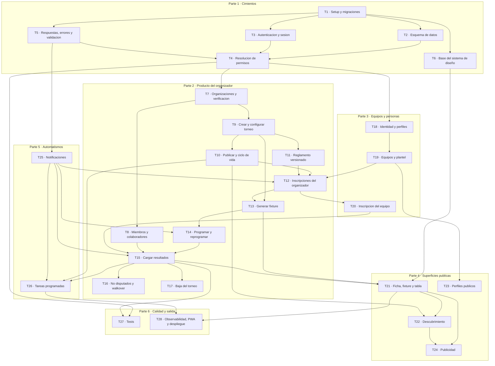

# Backlog Detallado — INVICTOS (MVP)

## 1. Cómo usar este documento

Este documento traduce la **Especificación Técnica** (`10`) en **unidades ejecutables**: 33 tickets que se pueden tomar de a uno, construir y dar por terminados sin ambigüedad.

**La Especificación sigue siendo la fuente de verdad de cada contrato.** Si un ticket y `10` dicen cosas distintas sobre qué recibe un servicio, qué valida o qué devuelve, manda `10`. Acá no se define ninguna regla de negocio nueva: todo lo que se afirma sale de `10`, de `06` (por qué cada regla es como es), de `02` (los casos de uso), de `03` (el modelo), de `04` (los valores exactos) y de `08` (la interfaz). Lo que este documento agrega es el **corte** —qué entra en cada unidad de trabajo y qué no—, el **orden** y el **criterio de terminado**.

**Leyenda de estado**

| Marca | Significado |
|---|---|
| 🟢 **MVP** | Entra en la primera versión. Los 33 tickets de este documento son MVP |

Lo que queda para etapas posteriores no tiene ticket: se lista sin desarrollar en la sección 6, tal como lo clasifica `07`.

**Las marcas de certeza del set siguen vigentes** (`06`, sección 1): `[Definido]`, `[Supuesto]` y `[Pendiente de definición]`. A esta altura del proyecto **no queda ninguna decisión pendiente** (`06`, sección 2), así que ningún ticket arranca bloqueado. Lo que sí queda son **tres valores de arranque a calibrar** y **tres catálogos a completar** con los datos del primer mercado; los tickets que dependen de ellos lo dicen en su contexto.

**Cómo leer un ticket.** El encabezado declara dominio, prioridad, estado, referencias y dependencias. El **contexto** explica por qué existe el ticket y qué se rompe si no está. El **alcance técnico** dice qué construir. El apartado **fuera de alcance** dice qué no, y en qué ticket vive eso otro. Los **criterios de aceptación** son la definición ejecutable de lo correcto. **Cómo demostrarlo** describe qué se hace en vivo para que alguien no técnico vea que está terminado.

---

## 2. El backlog con un agente construyendo

`09`, 7.3 registra que el producto lo construye un agente de IA (`06`, D-78). No es un dato de color: cambia qué tiene que traer un ticket para ser trabajable. Cinco consecuencias concretas:

1. **Los criterios de aceptación dejan de ser documentación y pasan a ser la definición ejecutable de lo correcto.** Un equipo humano completa con criterio propio lo que un ticket no dice; un agente completa con lo primero que compila. Por eso cada criterio nombra el código de error exacto, el estado exacto y la tabla exacta: lo que no está escrito en formato *dado / cuando / entonces* no se va a verificar.

2. **Los tests no son un ticket al final: son parte del alcance de cada ticket.** Un agente rompe cosas en silencio, y la regresión que aparece no es la del código que acaba de tocar. Cada ticket entrega los tests de sus propias reglas junto con la funcionalidad. T27 no es "escribir los tests", es la infraestructura de pruebas y la cobertura de las reglas que atraviesan varios tickets.

3. **El orden importa más que en un backlog humano.** Una persona que encuentra media dependencia sin construir levanta la mano; un agente inventa el pedazo que falta y sigue. Por eso los cimientos (Parte 1) bloquean todo lo demás de forma literal, y cada ticket declara de qué depende: la dependencia no es una sugerencia de planificación, es una precondición de corrección.

4. **"Cómo demostrarlo" es lo que evita dar por terminado algo que compila pero no funciona.** Es el filtro que separa código que hace lo pedido de código que pasa los tipos. Si un ticket no se puede mostrar a alguien que no lee código, no está terminado.

5. **El esquema y los contratos viven en el repositorio, no en un panel.** Migraciones versionadas (`10`, 3.4), tipos de punta a punta y un módulo central de errores: es lo que hace que el estado del sistema sea reproducible y revisable en vez de un efecto lateral de lo que alguien tocó en un proveedor.

---

## 3. Dependencias entre tickets

> **Cómo leerlo:** una flecha significa "no se puede terminar el destino sin el origen". Los cimientos apuntan hacia afuera de su recuadro porque nada del producto se sostiene sin ellos. T15 es el nudo del grafo: entra en él casi toda la Parte 2 y sale de él casi toda la Parte 4.

---

## 4. Los tickets

### Parte 1 — Cimientos

---

## Ticket 1 — Setup del proyecto, estructura por dominio y migraciones versionadas

**Dominio:** Plataforma | **Prioridad:** Alta | **Estado:** 🟢 MVP
**Referencia:** Especificación secciones 2.1, 3.4 · Decisiones D-77, D-78, T-01, T-07
**Depende de:** nada. Es el primer ticket del backlog.

### Contexto y objetivo

Todo el resto del backlog asume una forma de proyecto: una carpeta de servicios que la interfaz puede importar pero que nunca importa de vuelta, y un esquema que vive en el repositorio y se aplica en orden. Si esa forma no está fijada antes del primer servicio, se decide sola —peor— en el momento de escribir el primero, y después cada ticket la reinterpreta.

Lo que se rompe si no está: la lógica de negocio queda pegada a las pantallas, las tareas programadas terminan con una segunda implementación de las mismas reglas, y el esquema pasa a existir solo dentro del proveedor, donde nadie lo puede revisar ni reproducir.

### Alcance técnico

- Proyecto Next.js con TypeScript en modo estricto, y la estructura de carpetas de `10`, 2.1: `src/services/` con una carpeta por dominio funcional, `src/db/`, `src/lib/` y `src/app/`.
- Regla de dependencia verificada de forma automática: `app/` puede importar de `services/`; `services/` no puede importar de `app/`. Se aplica con configuración de lint, no con un acuerdo verbal.
- Firma común de todo servicio: `(input, contexto) → resultado`, con el tipo de `contexto` definido en `lib/` — nunca objetos de petición ni de respuesta HTTP.
- Herramienta de migraciones versionadas, con las migraciones como archivos numerados en el repositorio y un comando para aplicarlas en orden desde cero.
- Conexión a PostgreSQL (Supabase) por variables de entorno, con entornos separados para desarrollo y producción.
- Formato, lint y verificación de tipos corriendo en un único comando.

### Fuera de alcance de este ticket

- El contenido del esquema: tablas, claves y restricciones son T2. Acá solo va la maquinaria de migraciones.
- El módulo de errores y el formato de respuesta: T5.
- Tokens y componentes de interfaz: T6.
- Integración continua, observabilidad y despliegue: T28.

### Criterios de aceptación

**Historia:** Como agente que construye este producto, quiero un proyecto con la estructura y las migraciones ya fijadas, para que cada ticket siguiente se apoye en una forma conocida en vez de inventar la suya.

- **Dado** un archivo dentro de `src/services/`, **cuando** intenta importar algo de `src/app/`, **entonces** la verificación falla con un error explícito.
- **Dado** un archivo dentro de `src/app/`, **cuando** importa un servicio, **entonces** la verificación pasa.
- **Dado** una base vacía, **cuando** se corre el comando de migraciones, **entonces** el esquema queda aplicado en orden y el comando es repetible sin efecto.
- **Dado** el proyecto recién clonado, **cuando** se corre el comando único de verificación, **entonces** formato, lint y tipos pasan sin errores.
- **Dado** un servicio de ejemplo, **cuando** se lo invoca, **entonces** recibe `(input, contexto)` y no tiene acceso a objetos HTTP.

### Cómo demostrarlo

Se clona el repositorio en una máquina limpia, se corre el comando de instalación y el de migraciones contra una base vacía, y se muestra que el esquema queda armado. Después se agrega a mano un `import` de una pantalla dentro de un servicio, se corre la verificación y se ve que falla nombrando el archivo y la regla. Se borra el import y se ve que vuelve a pasar. La demostración es que la estructura no depende de que alguien se acuerde.

---

## Ticket 2 — Esquema de datos completo: tablas, claves determinísticas, restricciones e índices

**Dominio:** Plataforma / Datos | **Prioridad:** Alta | **Estado:** 🟢 MVP
**Referencia:** Especificación secciones 3.1, 3.2, 3.3 · Modelo `03` completo · Enumeraciones `04` · Decisiones D-13, D-23, D-28, D-51, D-54, D-59, T-06
**Depende de:** T1

### Contexto y objetivo

El esquema de este producto hace más que guardar datos: es el que vuelve **estructuralmente imposible** una lista de errores que después nadie podría corregir sin reconstruir la historia. Un equipo con dos filas en la misma tabla de posiciones, un jugador habilitado dos veces en la misma lista de buena fe, un equipo sin capitán, un partido con un equipo que no está inscripto en ese torneo: ninguno de esos estados puede ser una validación que un servicio recuerde hacer, porque el día que se olvide el dato ya está mal.

Este ticket traduce el modelo conceptual de `03` a tablas, y sube al esquema las restricciones que sostienen reglas de negocio centrales. Sin él, cada ticket posterior escribiría en tablas que todavía no existen.

### Alcance técnico

- Todas las tablas del MVP con los nombres y atributos de `03`: tabla en minúscula y singular, columnas con el nombre del atributo del modelo.
- **Las seis tablas sin `id` propio**, cada una con su clave primaria compuesta y determinística (`10`, 3.1 — la tabla enumera seis filas aunque su título diga cinco; van las seis):

| Tabla | Clave primaria | Qué vuelve imposible |
|---|---|---|
| `integrante_equipo` | `(equipo_id, perfil_id, rol_equipo)` | Que la misma persona figure dos veces con el mismo rol en un equipo |
| `miembro_organizacion` | `(organizacion_id, usuario_id, rol)` | Lo mismo a nivel organización |
| `colaborador_torneo` | `(torneo_id, usuario_id)` | Que alguien quede asignado dos veces al mismo torneo |
| `inscripcion` | `(torneo_id, equipo_id)` | Que un equipo aparezca dos veces en la misma tabla de posiciones |
| `integrante_habilitado` | `(torneo_id, equipo_id, perfil_id)` | Que un jugador figure dos veces en la misma lista de buena fe |
| `posicion` | `(grupo_id, equipo_id)` | Que un equipo tenga dos filas en la misma tabla |

- **Las restricciones del esquema** de `10`, 3.2: `equipo.perfil_capitan_id` no nulo; `organizacion.usuario_titular_id` no nulo; único parcial sobre `(torneo_id, perfil_id)` en `integrante_habilitado` donde el rol es jugador, aplicado según el parámetro del torneo; `partido.goles_local` y `goles_visitante` mayores o iguales a cero; clave foránea de `partido` hacia `inscripcion` y no hacia `equipo`; `reglamento` único por `(torneo_id, numero_version)`.
- Columna `version` en `partido` y en `torneo`, para el control optimista de T15.
- Las enumeraciones de `04` como tipos del esquema, con exactamente los valores documentados.
- Los índices críticos de `10`, 3.3, cada uno con la consulta que sostiene — incluido el de `ciudad`.
- **Tablas `provincia` y `ciudad`** (`03`, 3.22): dos niveles y una clave foránea, nada más. Las cinco entidades que las usan —torneo, equipo, sede, organización, perfil_deportivo— referencian **`ciudad_id`**, no texto. El **torneo suma además `direccion`** en texto libre.
- **Nada de árboles, rutas materializadas, `ltree` ni PostGIS** (`10`, 3.3): con dos niveles, filtrar es igualdad y el escalón a provincia es un `join`. **Sin coordenadas** (`06`, D-89).
- El catálogo de ciudades es **de solo lectura para la aplicación**: se carga una vez y solo lo toca la administración de la plataforma (`06`, D-88).
- Reglas de acceso de la base configuradas con criterio acotado: impedir cualquier acceso directo que no venga de la capa de servicios (`09`, 6.2).

### Fuera de alcance de este ticket

- La lógica que escribe en estas tablas: cada dominio en su ticket.
- La función de permisos que lee los tres vínculos: T4.
- **La carga del catálogo nacional** de provincias y ciudades, y los motivos de baja y de cancelación (`04`, sección 8): son datos, no esquema. Este ticket crea las tablas; poblarlas es una tarea de datos por única vez.
- La administración del catálogo —altas y bajas de ciudades—: es herramienta interna de plataforma (`06`, D-88), no producto de usuario, y no entra en este backlog.
- Las tablas de score: los insumos se registran desde el día uno, pero el cálculo es de una etapa posterior (`10`, 11). La tabla `score_equipo` se crea con sus columnas —`valor`, `desglose_componentes`, `version_formula`, `partidos_computados`, `estado`—; quien la llena no es este backlog.

### Criterios de aceptación

**Historia:** Como responsable del dato, quiero que los errores que arruinarían una tabla de posiciones sean imposibles en el esquema, para no depender de que cada servicio se acuerde de validarlos.

- **Dado** una fila de `posicion` para un equipo en un grupo, **cuando** se intenta insertar otra fila para el mismo equipo y el mismo grupo, **entonces** la base la rechaza por clave primaria duplicada.
- **Dado** un equipo cualquiera, **cuando** se intenta guardarlo con `perfil_capitan_id` nulo, **entonces** la base lo rechaza.
- **Dado** un partido, **cuando** se intenta referenciar un equipo que no tiene inscripción en ese torneo, **entonces** la clave foránea hacia `inscripcion` lo rechaza.
- **Dado** un torneo con la regla de jugador único activa, **cuando** se intenta habilitar al mismo perfil con rol de jugador por dos equipos del mismo torneo, **entonces** el único parcial lo rechaza.
- **Dado** un reglamento con `numero_version` 2 en un torneo, **cuando** se intenta insertar otra versión 2 del mismo torneo, **entonces** la base lo rechaza.
- **Dado** el filtro de descubrimiento con ciudad, modalidad, categoría, estado y fecha, **cuando** se explica el plan de la consulta, **entonces** usa el índice de `torneo` y no recorre la tabla entera.

### Cómo demostrarlo

Con una consola de base a la vista, se corren de a una las inserciones que el esquema tiene que rechazar: el equipo duplicado en una tabla de posiciones, el equipo sin capitán, el partido con un equipo no inscripto, el jugador habilitado en dos equipos del mismo torneo, la versión de reglamento repetida. Cada una devuelve un rechazo de la base, no un mensaje de la aplicación. Después se muestra el plan de la consulta de descubrimiento sobre datos de prueba, y se ve que entra por el índice. Lo que se está demostrando es que estos errores no dependen del código.

---

## Ticket 3 — Autenticación y sesión

**Dominio:** D1 Identidad | **Prioridad:** Alta | **Estado:** 🟢 MVP
**Referencia:** Especificación secciones 2.2, 9 · Casos de uso UC-01 · Decisiones D-04b, D-52, D-76
**Depende de:** T1, T2

### Contexto y objetivo

La sesión es la que responde una única pregunta, en cada invocación: **quién es esta persona**, resuelta en el servidor y nunca recibida del cliente. Todo el modelo de permisos de este producto (T4) se apoya en esa respuesta, así que si el identificador de usuario pudiera llegar desde afuera, los tres vínculos de autorización no protegerían nada.

Además, este producto se consulta mayormente **sin sesión**: la ficha del torneo, el fixture, la tabla y los perfiles se sirven a quien llegó por un link de mensajería y no tiene cuenta (`06`, D-04b). Eso no es una excepción a manejar, es el caso normal, y la capa de sesión tiene que estar construida para que la ausencia de sesión sea un estado válido y no un error.

### Alcance técnico

- Integración de Supabase Auth: alta de cuenta, inicio y cierre de sesión, recuperación de acceso.
- Resolución del `usuario_id` en el servidor en cada invocación con sesión. El cliente nunca lo envía.
- Contexto de invocación (`10`, 2.1) construido a partir de la sesión, listo para que T4 le agregue los vínculos resueltos.
- Contexto **sin sesión** como valor de primera clase: las rutas públicas de `10`, sección 5 se sirven con él.
- **Contexto de sistema** para las tareas programadas (`10`, 2.10), que ejecutan los mismos servicios que un usuario.
- Servicio `registrar` (UC-01) con **únicamente identificador de acceso y nombre visible** (`06`, D-52), que crea el `perfil_deportivo` en el mismo movimiento (`10`, 4.1).
- Ejecución de la **acción pendiente**: si el registro se disparó desde "seguir" o "inscribirse", el servicio recibe esa intención y la ejecuta al terminar.
- Límite de frecuencia en registro y en envío de correos (`10`, sección 9).

### Fuera de alcance de este ticket

- Resolver qué puede hacer la persona: eso es T4, y ningún servicio de este ticket decide permisos.
- Perfil deportivo editable, visibilidad y perfil público: T18.
- La confirmación de correo que habilita la verificación de una organización: T7 (usa este mecanismo, no lo define).
- Pantallas de entrada terminadas: la maquetación vive en T6 y en los tickets de cada superficie.

### Criterios de aceptación

**Historia:** Como persona que llega por un link compartido, quiero poder mirar todo lo público sin cuenta y registrarme solo cuando quiero hacer algo, para no tener que decidir si me interesa el producto antes de haberlo visto.

- **Dado** un visitante sin sesión, **cuando** pide una ruta pública de `10`, sección 5, **entonces** la recibe completa y sin ningún pedido de registro.
- **Dado** un visitante sin sesión, **cuando** invoca un servicio que requiere sesión, **entonces** la operación se rechaza con `NO_AUTENTICADO`.
- **Dado** un alta con identificador de acceso y nombre visible, **cuando** se completa el registro, **entonces** existen la cuenta y su `perfil_deportivo`, sin ningún otro dato obligatorio.
- **Dado** un cliente que envía un `usuario_id` en el cuerpo de la petición, **cuando** el servicio se ejecuta, **entonces** ese valor se ignora y se usa el de la sesión.
- **Dado** un registro disparado desde la acción de seguir un torneo, **cuando** termina el alta, **entonces** el torneo queda seguido sin que la persona vuelva a apretar nada.
- **Dado** más intentos de registro que el límite configurado desde el mismo origen, **cuando** se supera, **entonces** los siguientes se rechazan.

### Cómo demostrarlo

Se abre un link de torneo en una ventana privada, sin cuenta, y se muestra que la ficha carga entera. Se aprieta "seguir": el producto pide registrarse, se completa con dos datos, y al volver el torneo ya aparece seguido, sin un segundo clic. Después, desde una herramienta de red, se manda una invocación con un `usuario_id` ajeno en el cuerpo y se muestra que el sistema responde con los datos del usuario de la sesión, no con los del identificador enviado.

---

## Ticket 4 — Resolución de permisos: la función compartida sobre los tres vínculos

**Dominio:** Transversal | **Prioridad:** Alta | **Estado:** 🟢 MVP
**Referencia:** Especificación sección 2.3 · Casos de uso UC-07, UC-13, UC-52 · Decisiones D-23, D-25, D-32, D-34, D-64, T-02
**Depende de:** T2, T3, T5

### Contexto y objetivo

En este producto los permisos **no viven en la cuenta: viven en el vínculo de la persona con una cosa puntual** (`06`, D-23, D-32). La misma persona puede ser capitana de un equipo, jugadora de otro, administradora de una organización y colaboradora de un torneo de otra organización, todo al mismo tiempo. No hay un "tipo de usuario" que responda qué puede hacer: hay tres vínculos y un recurso.

Este ticket construye **una única función compartida**, `resolverPermisos(usuario_id, recurso)`, que combina los tres. La razón por la que es un ticket propio y no una utilidad que cada dominio arma a su manera está escrita en `10`, 2.3 y en T-02: si la lógica de permisos se reimplementa por servicio, **en algún lado va a quedar mal**, y el lugar donde quede mal no se va a descubrir por un error sino por alguien que hizo algo que no debía.

**Ningún servicio de este backlog consulta las tablas de vínculos por su cuenta.** Es una regla del backlog, no una recomendación: un servicio que lee `miembro_organizacion` o `colaborador_torneo` directamente está mal construido aunque su resultado sea correcto hoy.

### Alcance técnico

- La función `resolverPermisos(usuario_id, recurso)`, que devuelve el conjunto de capacidades de esa persona sobre ese recurso combinando los tres vínculos:

| Vínculo | Tabla | Alcance | Roles |
|---|---|---|---|
| Persona ↔ equipo | `integrante_equipo` | Ese equipo | `captain`, `delegate`, `player`, `coach` |
| Persona ↔ organización | `miembro_organizacion` | Todos los torneos de esa organización | `owner`, `admin` |
| Persona ↔ torneo | `colaborador_torneo` | **Un torneo puntual** | Permisos fijos, sin rol |

- Las reglas que la función garantiza (`10`, 2.3):
  - El **Administrador** puede todo lo de su organización **excepto** crear o quitar Administradores (`06`, D-64) → `ADMIN_NO_PUEDE_GESTIONAR_ADMINS`.
  - El rol de **Titular** no se asigna ni se quita por la vía general de gestión de miembros → `ROL_TITULAR_NO_GESTIONABLE`.
  - El **Colaborador** puede cargar resultados y eventos, programar y reprogramar partidos y registrar partidos no disputados, **solo en los torneos a los que está asignado**, y nada más. No es configurable (`06`, D-32).
  - El rol **`coach`** no otorga ninguna capacidad de gestión (`06`, D-25).
  - El **Capitán** es único por equipo y no puede quitarse a sí mismo sin designar reemplazo → `CAPITAN_SIN_REEMPLAZO`.
- Incorporación de los vínculos resueltos al `contexto` que recibe cada servicio (`10`, 2.1), para que un servicio no tenga que ir a buscarlos.
- Traducción a error: sin permiso → `SIN_PERMISO`; y **el mensaje nunca revela si el recurso existe** cuando el actor no debería saberlo → `NO_ENCONTRADO`.
- Verificación automática de que ningún archivo de `src/services/` consulta las tres tablas de vínculos fuera de esta función.

### Fuera de alcance de este ticket

- Crear los vínculos: los de organización y torneo son T8, los de equipo son T19.
- Las reglas de la base como última línea de defensa: son parte de T2.
- La interfaz que oculta acciones que la persona no puede hacer: vive en cada ticket de superficie. Ocultar un botón no es un permiso.

### Criterios de aceptación

**Historia:** Como sistema, quiero resolver todo permiso en un solo lugar, para que no exista un servicio donde la regla haya quedado distinta.

- **Dado** un Administrador de una organización, **cuando** intenta crear o quitar otro Administrador, **entonces** la operación se rechaza con `ADMIN_NO_PUEDE_GESTIONAR_ADMINS`.
- **Dado** un Colaborador asignado al torneo A, **cuando** intenta cargar un resultado del torneo B de la misma organización, **entonces** la operación se rechaza con `SIN_PERMISO`.
- **Dado** un Colaborador asignado a un torneo, **cuando** intenta resolver una inscripción de ese mismo torneo, **entonces** la operación se rechaza con `SIN_PERMISO`.
- **Dado** un integrante con rol `coach` en un equipo, **cuando** intenta invitar a alguien al plantel, **entonces** la operación se rechaza con `SIN_PERMISO`.
- **Dado** un capitán que es el único de su equipo, **cuando** intenta quitarse sin designar reemplazo, **entonces** la operación se rechaza con `CAPITAN_SIN_REEMPLAZO`.
- **Dado** un usuario cualquiera, **cuando** pide un torneo en `draft` de una organización ajena, **entonces** recibe `NO_ENCONTRADO` y no un mensaje que confirme que ese torneo existe.
- **Dado** el código de `src/services/`, **cuando** corre la verificación, **entonces** ningún archivo fuera de la función de permisos consulta `integrante_equipo`, `miembro_organizacion` ni `colaborador_torneo` para decidir acceso.

### Cómo demostrarlo

Se prepara una organización con dos torneos y una persona asignada como colaboradora **solo** al primero. Con su sesión se carga un resultado del torneo A: funciona. Se intenta cargar uno del torneo B: el producto responde que no tiene permiso. Se intenta resolver una inscripción del torneo A —donde sí está asignada— y también responde que no. Después se repite con un DT: puede ver el equipo, no puede invitar a nadie. Cierra la demostración el reporte de la verificación automática, mostrando que ningún servicio consulta los vínculos por su cuenta.

---

## Ticket 5 — Formato de respuesta, errores tipados y validación de entrada

**Dominio:** Plataforma | **Prioridad:** Alta | **Estado:** 🟢 MVP
**Referencia:** Especificación secciones 2.4, 8, 9 · Brief `08`, sección 8
**Depende de:** T1

### Contexto y objetivo

Un error de este producto no es un detalle de implementación: es el texto que lee un capitán a las diez de la noche cuando no puede inscribir a su equipo. Si cada servicio inventa su forma de fallar, la interfaz no puede distinguir "el cupo está lleno" de "algo salió mal", y termina mostrando lo mismo para las dos cosas — que es exactamente cómo un producto pierde a alguien que sí quería usarlo.

Este ticket fija tres cosas de una vez: la forma de toda respuesta, el módulo central de códigos de error, y la validación de entrada en el borde de cada servicio. Los tres tickets siguientes ya no pueden apartarse de eso, y los criterios de aceptación del resto del backlog pueden nombrar códigos exactos porque este ticket los define.

### Alcance técnico

- Forma de respuesta única (`10`, 2.4): éxito `{ ok: true, data }`, error `{ ok: false, error: { codigo, mensaje, detalle? } }`.
- **Módulo central de constantes de error** con los códigos de `10`, sección 8, sus códigos HTTP y ningún otro. Los seis transversales: `NO_AUTENTICADO`, `SIN_PERMISO`, `NO_ENCONTRADO`, `DATOS_INVALIDOS`, `CONFLICTO_DE_VERSION`, `ERROR_INTERNO`. Los dieciocho de negocio de 8.2.
- Errores tipados que los servicios lanzan y que la capa de rutas traduce a HTTP. Ningún servicio devuelve un código HTTP.
- Un error no controlado se traduce a `ERROR_INTERNO` **sin exponer nada del interior**.
- El `mensaje` es texto para la interfaz, en español rioplatense y accionable (`08`, sección 8): explica qué pasó y ofrece salida. El `codigo` es para el código y no se muestra crudo.
- Validación de entrada con esquemas tipados en el borde de cada servicio; falla → `DATOS_INVALIDOS` con el detalle de qué campo.
- Paginación por **cursor** para todo listado que pueda crecer (`10`, 2.7), como utilidad compartida.

### Fuera de alcance de este ticket

- Los servicios que lanzan estos errores: cada uno en su ticket.
- El diseño visual del bloque de error en pantalla: T6.
- Registro y alertas de errores en producción: T28.

### Criterios de aceptación

**Historia:** Como persona usando el producto, quiero que cuando algo no se puede hacer me digan qué pasó y cómo seguir, para no quedarme mirando un mensaje que no significa nada.

- **Dado** un servicio que lanza un error de negocio, **cuando** la ruta lo traduce, **entonces** la respuesta tiene `ok: false`, el código exacto de `10`, sección 8, y el código HTTP que ese código declara.
- **Dado** un error no controlado dentro de un servicio, **cuando** llega a la ruta, **entonces** la respuesta es `ERROR_INTERNO` con HTTP 500 y sin ningún detalle del interior.
- **Dado** una entrada con un campo faltante o con el tipo equivocado, **cuando** el servicio la recibe, **entonces** se rechaza con `DATOS_INVALIDOS` y el detalle nombra el campo.
- **Dado** cualquier código del módulo central, **cuando** se lo revisa, **entonces** tiene un `mensaje` en español, accionable, que no contiene el nombre del código ni vocabulario del modelo de datos.
- **Dado** un listado paginado, **cuando** se pide la página siguiente con el cursor devuelto, **entonces** no se repiten ni se saltean filas aunque se hayan insertado registros nuevos entre las dos lecturas.

### Cómo demostrarlo

Se recorre la lista completa de códigos de `10`, sección 8 y se muestra, para cada uno, el mensaje que vería una persona. Después se fuerzan tres respuestas en vivo: una entrada inválida, que devuelve `DATOS_INVALIDOS` señalando el campo; un error de negocio, que devuelve su código y un texto que explica y ofrece salida; y una falla interna provocada a propósito, que devuelve `ERROR_INTERNO` sin filtrar nada. Se termina paginando un listado mientras se insertan filas nuevas, para ver que el cursor no duplica ni saltea.

---

## Ticket 6 — Base del sistema de diseño: tokens, tema claro y componentes clave

**Dominio:** Diseño / Interfaz | **Prioridad:** Alta | **Estado:** 🟢 MVP
**Referencia:** Brief `08`, secciones 6, 7, 9, 11.10 · Enumeraciones `04`, sección 6 · Decisiones D-69 a D-75, DIS-01 a DIS-08
**Depende de:** T1

### Contexto y objetivo

Ocho de las pantallas del MVP muestran lo mismo con formas distintas: una fila de partido, una fila de tabla, un badge de estado, un escudo, un marcador. Si cada pantalla los resuelve por su cuenta, el producto se ve armado por partes y —más grave— el badge que distingue "se jugó" de "ganó por presentación" termina siendo distinto en el fixture y en la tabla, que es donde alguien lo lee mal.

Este ticket construye la base compartida antes que cualquier pantalla. Incluye el tokenizado completo del color, que es lo que permite que el tema oscuro de la segunda etapa sea un cambio de valores y no un rediseño (`08`, 6.1), y el contenedor de publicidad, que tiene que existir en el sistema y no resolverse anuncio por anuncio (`06`, D-75).

### Alcance técnico

- **Tokens de color**: escala de neutros amplia, neutro oscuro de marca, acento vibrante único —ni verde ni rojo (`06`, D-74)— y los cinco semánticos de `04`, sección 6. Ningún color escrito directo en un componente.
- **Tema claro completo** como tema de arranque, con las superficies de identidad en oscuro: hero de la ficha del torneo, cabeceras de perfil, pantalla de entrada, tarjeta compartible (`08`, 6.1).
- **Tipografía**: familia de display con carácter deportivo y familia de texto neutra, con **números tabulares obligatorios en las dos** — es criterio de descarte, no preferencia (`08`, sección 7).
- **Tres densidades** —compacta, estándar y amplia— aplicables por pantalla (`08`, 6.5).
- **Los ocho componentes clave** de `08`, 11.10: tarjeta de torneo, fila de partido con sus cuatro variantes, fila de tabla, badge de estado con etiqueta siempre visible, escudo o avatar con placeholder digno, marcador, contenedor de publicidad y estado vacío que siempre ofrece el paso siguiente.
- **Etiquetas visibles** de `04` cableadas a cada valor de enumeración: la interfaz nunca muestra el valor técnico ni vocabulario del modelo (`08`, sección 8).
- Base mobile-first: ninguna tarea puede requerir escritorio (`06`, D-67); áreas táctiles accesibles incluso en densidad compacta.

### Fuera de alcance de este ticket

- Las pantallas armadas: cada una en su ticket de dominio.
- La red de publicidad y qué superficies la muestran: T24. Acá va el contenedor vacío, no el anuncio.
- El tema oscuro completo: es de la segunda etapa (`08`, 6.1). Este ticket solo garantiza que llegue sin rediseño.
- Logo, isotipo e identidad gráfica: fuera de esta fase de diseño (`08`, sección 13).

### Criterios de aceptación

**Historia:** Como persona que mira la tabla de posiciones al sol, en la calle, quiero números alineados y estados legibles sin adivinar, para entender cómo va mi equipo de un vistazo.

- **Dado** cualquier componente del sistema, **cuando** se inspecciona su hoja de estilos, **entonces** todo color proviene de un token y ninguno está escrito literal.
- **Dado** una tabla de posiciones con valores de distinta cantidad de dígitos, **cuando** se la muestra, **entonces** las columnas numéricas quedan alineadas por el uso de cifras tabulares.
- **Dado** un badge de cualquier estado de `04`, **cuando** se lo renderiza, **entonces** muestra su etiqueta visible y su color semántico, y el estado se entiende sin leer el color.
- **Dado** un badge de "jugado" y uno de "ganado por presentación" en la misma lista, **cuando** se los ve a tamaño real de una fila de fixture, **entonces** se distinguen a primera vista.
- **Dado** un equipo sin escudo cargado, **cuando** aparece en cualquier listado, **entonces** se muestra un placeholder consistente y no un espacio roto.
- **Dado** una lista sin contenido, **cuando** se la muestra, **entonces** el estado vacío ofrece el paso siguiente en vez de decir que no hay nada.
- **Dado** el acento de marca junto a los colores de éxito y de error, **cuando** se los compara, **entonces** un botón primario no se confunde con un estado.

### Cómo demostrarlo

Se abre una página de catálogo con todos los componentes del sistema en sus variantes, y se recorre: las cuatro variantes de la fila de partido, la fila de tabla con números de distinto largo, los badges de todos los estados de `04` con su etiqueta, el escudo con y sin imagen, el marcador, el contenedor de publicidad vacío y los estados vacíos. Después se cambian los valores de los tokens de color en vivo y se muestra que todo el catálogo cambia sin tocar un solo componente — que es la prueba de que el tema oscuro va a llegar sin rediseño.

---

### Parte 2 — El producto del organizador

---

## Ticket 7 — Organizaciones y verificación básica por email

**Dominio:** D2 Organizadores | **Prioridad:** Alta | **Estado:** 🟢 MVP
**Referencia:** Especificación sección 4.2 · Casos de uso UC-06 · Decisiones D-51, D-76 · Enumeraciones `04`, 3.9
**Depende de:** T4

### Contexto y objetivo

Sin organización no hay torneo: es la entidad de la que cuelga todo el producto de gestión. Y la verificación de esa organización es la única defensa que el descubrimiento tiene desde el día uno (`06`, D-51), así que entra al MVP aunque sea un solo paso.

El principio que hay que respetar acá, y que es fácil de romper por comodidad: **la verificación no gatea crear ni gestionar un torneo, gatea aparecer en la búsqueda.** Poner la fricción en el alta castiga al organizador legítimo justo en el momento en que todavía no invirtió nada y es más fácil que abandone. Una organización sin verificar arma su torneo completo, carga equipos, genera el fixture y lo comparte por link; lo único que no puede es aparecer en el descubrimiento.

### Alcance técnico

- `crearOrganizacion` (UC-06): libre y automático, nace en `unverified`, con `usuario_titular_id` no nulo.
- `actualizarOrganizacion` para Titular y Administrador.
- `solicitarVerificacionBasica` y `confirmarVerificacionBasica`: confirmación de la **dirección de correo de acceso, sin SMS** (`06`, D-76), que lleva la organización a `basic`. El segundo es público con token.
- Los tres niveles de `04`, 3.9 como estado de la organización: `unverified`, `basic`, `trusted`. El nivel `trusted` existe en el catálogo pero **no se otorga en el MVP** (`07`, sección 4).
- El **control de límite de torneos publicados** de una organización `unverified`: uno a la vez, con valor de arranque configurable → `LIMITE_TORNEOS_PUBLICADOS`.
- Límite de frecuencia en el envío de correos de verificación (`10`, sección 9).
- Subida de logo al almacenamiento desde el cliente, con validación de tipo y tamaño antes de aceptar la referencia (`10`, 2.9).

### Fuera de alcance de este ticket

- Miembros y colaboradores: T8.
- Publicar un torneo y decidir su visibilidad según el nivel: T10, que consulta este nivel pero no lo define.
- El perfil público del organizador: T23.
- El nivel `trusted` con distintivo y la despublicación automática por inactividad: son de la segunda etapa (`07`, sección 4). La tarea programada de despublicación se construye en T26 con el valor de arranque de `10`, 6.2.

### Criterios de aceptación

**Historia:** Como organizador que llega con un torneo para armar, quiero poder crear mi organización y empezar sin esperar la aprobación de nadie, para no abandonar en el primer paso.

- **Dado** una persona con sesión, **cuando** crea una organización, **entonces** queda creada en `unverified`, con esa persona como Titular, y sin ningún paso de aprobación de por medio.
- **Dado** una organización `unverified`, **cuando** su titular crea, configura y gestiona un torneo, **entonces** puede hacerlo todo sin restricciones.
- **Dado** una organización `unverified` con un torneo ya publicado, **cuando** intenta publicar un segundo, **entonces** la operación se rechaza con `LIMITE_TORNEOS_PUBLICADOS`.
- **Dado** un titular que pidió la verificación, **cuando** abre el enlace del correo, **entonces** la organización pasa a `basic` sin ninguna intervención manual.
- **Dado** una organización sin titular, **cuando** se intenta guardarla, **entonces** la base la rechaza.

### Cómo demostrarlo

Se crea una organización desde cero y se muestra que queda operativa en el mismo momento, marcada como sin verificar y sin que eso le impida nada de la gestión. Se pide la verificación, se abre el correo que llega, se hace clic y se vuelve a la pantalla: la organización ahora figura como verificada. Después, con una segunda organización sin verificar que ya tiene un torneo publicado, se intenta publicar otro y se lee el mensaje que explica el límite y ofrece verificarse ahí mismo.

---

## Ticket 8 — Miembros de la organización y colaboradores por torneo

**Dominio:** D2 Organizadores | **Prioridad:** Alta | **Estado:** 🟢 MVP
**Referencia:** Especificación sección 4.2 · Casos de uso UC-07, UC-52 · Decisiones D-32, D-34, D-64 · Modelo `03`, 3.4, 3.21
**Depende de:** T7

### Contexto y objetivo

Cargar resultados es la tarea más frecuente del producto y la primera que un organizador delega. Este ticket construye las dos formas de delegar, que son deliberadamente distintas: **el Administrador es de la organización** y alcanza a todos sus torneos; **el Colaborador es de un torneo puntual** y no alcanza a ningún otro, ni siquiera de la misma organización (`06`, D-32, D-34).

Sin UC-52 no existe manera de que alguien que no sea el organizador cargue un resultado, que es justamente el caso que motiva el rol: el planillero contratado para un torneo, que además suele trabajar para más de un complejo.

### Alcance técnico

- `invitarMiembro`, `quitarMiembro` y `listarMiembros` (UC-07), acotados a los roles de organización: `owner` y `admin`. El rol `staff` **no existe** en esta enumeración (`04`, 3.2).
- `asignarColaborador` y `quitarColaborador` (UC-52), con alcance de **un torneo**.
- **`quitarColaborador` no borra el vínculo: lo pasa a `removed`** (`10`, 4.2). Su historial de cargas tiene que seguir siendo atribuible: es el dato que resuelve una discusión sobre quién cargó qué.
- **Idempotencia por clave determinística** (`10`, 2.6): invitar dos veces a la misma persona con el mismo rol, o asignar dos veces al mismo colaborador, **confirma el vínculo existente** en vez de duplicarlo o fallar.
- Estados del colaborador de `04`, 3.8: `invited`, `active`, `removed`.
- La entidad `colaborador_torneo` **no tiene atributo de rol ni de permisos**: son fijos e iguales para todos (`03`, 3.21). No se construye ninguna pantalla de configuración de permisos.
- Un Administrador puede asignar y quitar colaboradores en los torneos que administra (`06`, D-64), y no puede crear ni quitar Administradores.

### Fuera de alcance de este ticket

- La resolución de qué puede hacer cada vínculo: es T4. Este ticket **crea** vínculos; no decide permisos.
- Transferir la titularidad de la organización: UC-09 es de una etapa posterior (`07`, sección 4).
- Las operaciones que el colaborador ejecuta: T14, T15, T16.

### Criterios de aceptación

**Historia:** Como organizador con dos torneos en paralelo, quiero darle acceso a la planillera solo al torneo que le toca, para no tener que confiarle el otro.

- **Dado** un Titular, **cuando** invita a alguien como Administrador, **entonces** el vínculo queda creado con rol `admin`.
- **Dado** un Administrador, **cuando** intenta invitar a otro Administrador, **entonces** la operación se rechaza con `ADMIN_NO_PUEDE_GESTIONAR_ADMINS`.
- **Dado** alguien ya invitado con el mismo rol, **cuando** se lo invita de nuevo, **entonces** la operación confirma el vínculo existente y no crea un segundo ni falla.
- **Dado** un colaborador asignado a un torneo que ya cargó resultados, **cuando** se lo quita, **entonces** su vínculo pasa a `removed` y los resultados que cargó siguen atribuidos a él.
- **Dado** una misma persona asignada como colaboradora a dos torneos, **cuando** se la quita de uno, **entonces** conserva su acceso al otro.
- **Dado** cualquier vínculo de colaborador, **cuando** se lo inspecciona, **entonces** no tiene campos de permisos configurables.

### Cómo demostrarlo

Con dos torneos de la misma organización a la vista, se asigna a una persona como colaboradora del primero. Se entra con su sesión y se ve que solo aparece un torneo. Se la asigna también al segundo y ahora ve los dos. Se la quita del primero: sigue viendo el segundo, y el resultado que había cargado en el primero sigue mostrando su nombre como responsable de la carga. Se intenta invitarla dos veces con el mismo rol y se muestra que no queda duplicada.

---

## Ticket 9 — Torneos: crear, configurar y definir formato

**Dominio:** D4 Torneos | **Prioridad:** Alta | **Estado:** 🟢 MVP
**Referencia:** Especificación sección 4.4 · Casos de uso UC-16, UC-17 · Decisiones D-20b, D-30b, D-38b, D-59 · Enumeraciones `04`, 4.2, 4.3, 5
**Depende de:** T7

### Contexto y objetivo

El torneo es el núcleo del producto: de él cuelgan inscripciones, fixture, partidos, tabla y todo lo público. Y su configuración no es cosmética, porque define reglas que después se aplican solas: cuántos puntos vale una victoria, qué criterios de desempate ordenan la tabla, cuántos jugadores admite una lista de buena fe, con qué resultado se computa un walkover.

El formato, además, es la decisión que determina cómo se genera el fixture y cómo se lee la tabla. Por eso `definirFormato` deja de estar disponible en cuanto hay partidos jugados: cambiarlo entonces invalidaría el fixture y la tabla que ya se disputaron.

**Fase y Grupo existen incluso en el formato más simple** (`03`, 3.8): un torneo de liga tiene una única fase con un único grupo. Sin esa uniformidad, cada consulta de tabla o de fixture necesitaría un camino distinto según el formato.

### Alcance técnico

- `crearTorneo` (UC-16): datos generales, cupo, categorías, puntajes, desempates y mínimo/máximo de lista. Nace en `draft`.
- Configuración con sus defaults documentados: puntos **3/1/0** (`06`, D-20b); desempates en orden **diferencia de gol → goles a favor → enfrentamiento directo**; `categoria_edad` con **`open`** por defecto (`06`, D-38b); walkover **3-0** (`06`, D-33b); cierre de incorporaciones a la lista **"siempre abierta"** (`06`, D-30b); mínimo y máximo de lista **ambos opcionales** (`06`, D-59).
- Parámetros configurables por torneo que otros tickets consultan: jugador habilitado en dos equipos (`06`, D-17b), qué pasa con los partidos de un equipo que abandona (`06`, D-08b), y si solo el organizador carga resultados (`06`, D-07b). **No hay parámetro de aprobación automática de inscripciones**: se eliminó (`06`, D-93).
- `definirFormato` (UC-17): crea **fases y grupos** según el formato elegido de `04`, 4.2 — `league`, `knockout`, `groups_knockout`. Falla con `TORNEO_YA_EMPEZADO` si hay partidos jugados.
- `actualizarTorneo` (UC-19), con la regla de que el cupo **no puede bajarse** por debajo de los equipos ya aprobados (`06`, A-04, confirmado en D-68).
- Columna `version` del torneo, en uso para el control optimista (`10`, 2.5).

### Fuera de alcance de este ticket

- Publicar y avanzar de estado: T10.
- Reglamento: T11.
- Generar los partidos: T13. Este ticket crea la **estructura** de fases y grupos, no el fixture.
- Qué campos disparan notificación al modificar un torneo publicado: la regla vive acá, el envío es T25.

### Criterios de aceptación

**Historia:** Como organizador, quiero configurar mi torneo con las reglas de mi reglamento, para que la tabla se arme sola de la forma en que la vengo armando a mano.

- **Dado** un Titular o Administrador, **cuando** crea un torneo, **entonces** queda en `draft` y visible solo para su organización.
- **Dado** un torneo nuevo sin tocar la configuración, **cuando** se lo inspecciona, **entonces** tiene 3/1/0, categoría `open`, walkover 3-0, lista siempre abierta y ningún mínimo ni máximo de plantel.
- **Dado** un torneo de formato liga, **cuando** se define el formato, **entonces** quedan creadas una fase y un grupo, igual que en cualquier otro formato.
- **Dado** un torneo con partidos ya jugados, **cuando** se intenta cambiar el formato, **entonces** la operación se rechaza con `TORNEO_YA_EMPEZADO`.
- **Dado** un torneo con seis equipos aprobados, **cuando** se intenta bajar el cupo a cuatro, **entonces** la operación se rechaza y el cupo no cambia.
- **Dado** un torneo de grupos más eliminatoria, **cuando** se define el formato con la cantidad de zonas y de clasificados por zona, **entonces** quedan creadas las fases en orden y los grupos de la primera.

### Cómo demostrarlo

Se crea un torneo desde el teléfono, sin tocar nada más que el nombre y la modalidad, y se muestra que ya quedó configurado con los defaults del amateur: 3/1/0, categoría libre, lista abierta. Después se abre la configuración avanzada y se cambian los puntajes y los criterios de desempate, para ver que son del torneo y no del sistema. Se define un formato de grupos más eliminatoria y se muestran las zonas creadas. Por último, sobre un torneo que ya tiene una fecha jugada, se intenta cambiar el formato y se lee el mensaje que explica por qué no se puede.

---

## Ticket 10 — Publicar torneo y ciclo de vida completo

**Dominio:** D4 Torneos | **Prioridad:** Alta | **Estado:** 🟢 MVP
**Referencia:** Especificación sección 4.4 · Casos de uso UC-18, UC-20, UC-21 · Decisiones D-21b, D-22b, D-23b, D-51, D-58, D-66 · Enumeraciones `04`, 4.1, 4.16
**Depende de:** T9

### Contexto y objetivo

El estado del torneo es **el atributo que habilita o bloquea al resto del sistema** (`03`, 3.7): si se aceptan inscripciones, si se puede generar el fixture, si se pueden cargar resultados, si aparece como activo en el descubrimiento. Todo el backlog posterior consulta este estado, así que las transiciones tienen que ser explícitas y las que no están permitidas tienen que fallar, no simplemente no ocurrir.

Publicar, además, es el momento donde se cruza la verificación de la organización con la visibilidad del torneo. Un organizador sin verificar publica igual, pero su torneo queda **no listado**, y la respuesta tiene que decir por qué para que la interfaz pueda explicarlo y ofrecer la verificación ahí mismo. El caso está señalado en `08`, sección 8 como el mensaje de bloqueo más delicado del producto: no puede leerse como "tu torneo no existe".

### Alcance técnico

- `publicarTorneo` (UC-18): valida los **datos mínimos** —nombre, modalidad, formato, **ciudad y dirección**, fecha estimada y cupo—; falta alguno → `DATOS_MINIMOS_INCOMPLETOS` con el detalle de cuál. **El reglamento no es requisito** (`06`, D-29).
- Visibilidad al publicar: organización `basic` o superior → `public`; `unverified` → **`unlisted`**, con la respuesta indicando el motivo. Intentar forzar `public` sin verificación → `ORGANIZACION_NO_VERIFICADA`.
- Publicar **abre las inscripciones**: pasa a `registration_open`. No hay estado intermedio (`06`, D-58).
- `avanzarEstado` (UC-20) con las transiciones de `10`, 4.4 y las cuatro reglas: no se pasa a `in_progress` sin fixture generado; no se genera fixture con inscripciones abiertas; `registration_open → registration_closed` ocurre **automáticamente al alcanzar el cupo**, y el organizador puede reabrirlas o cerrarlas antes; `finished` es **manual**, con sugerencia del sistema cuando no quedan partidos pendientes (`06`, D-23b). Transición inválida → `TRANSICION_NO_PERMITIDA`.
- `suspended` como estado reversible desde `registration_open`, `registration_closed` e `in_progress`; `cancelled` como terminal.
- `cancelarTorneo` (UC-21): motivo de la lista cerrada de `04`, 4.16 más texto libre en `other`.
- Los **cinco campos que notifican** al modificar un torneo publicado (`06`, D-22b): fecha de inicio, sede, formato, cupo y reglamento. El resto se guarda en silencio.
- Invalidación de la caché de las superficies públicas del torneo ante cada cambio de estado (`10`, 2.8).

### Fuera de alcance de este ticket

- El envío de las notificaciones: T25. Acá se define **qué** las dispara.
- La búsqueda que solo muestra torneos `public`: T22.
- La acreditación de posición final al score al pasar a `finished`: el cálculo del score es de una etapa posterior (`10`, 11).
- La despublicación automática por inactividad: segunda etapa (`06`, D-80); la infraestructura que la va a alojar se arma en T26.

### Criterios de aceptación

**Historia:** Como organizador sin verificar, quiero publicar mi torneo y compartirlo por link igual, para poder arrancar hoy y verificarme cuando quiera aparecer en la búsqueda.

- **Dado** un torneo sin cupo cargado, **cuando** se intenta publicar, **entonces** la operación se rechaza con `DATOS_MINIMOS_INCOMPLETOS` y el detalle nombra el cupo.
- **Dado** un torneo sin reglamento, **cuando** se lo publica, **entonces** se publica igual.
- **Dado** una organización `unverified`, **cuando** publica un torneo, **entonces** el torneo queda en `registration_open` con visibilidad `unlisted` y la respuesta indica que el motivo es la falta de verificación.
- **Dado** un torneo con el cupo alcanzado, **cuando** se aprueba la última inscripción, **entonces** el torneo pasa solo a `registration_closed`.
- **Dado** un torneo sin fixture generado, **cuando** se intenta pasarlo a `in_progress`, **entonces** la operación se rechaza con `TRANSICION_NO_PERMITIDA`.
- **Dado** un torneo `in_progress` sin partidos pendientes, **cuando** el organizador abre el panel, **entonces** el sistema le sugiere finalizarlo y no lo finaliza solo.
- **Dado** un torneo publicado, **cuando** se le cambia la sede, **entonces** queda registrado un cambio que notifica; **cuando** se le cambia la descripción, **entonces** se guarda sin notificar.

### Cómo demostrarlo

Se toma el torneo configurado en T9 y se intenta publicarlo con un dato faltante: el producto dice exactamente cuál falta. Se completa y se publica: como la organización todavía no está verificada, la pantalla explica que el torneo quedó accesible por link pero no aparece en la búsqueda, y ofrece verificarse en el mismo lugar. Se copia el link y se abre en otra ventana para ver que el torneo funciona. Después se recorre el ciclo completo en vivo: se cierran inscripciones, se intenta pasar a "en curso" sin fixture y el producto lo impide, y al final se muestra la sugerencia de finalizar cuando ya no quedan partidos.

---

## Ticket 11 — Reglamento del torneo, versionado

**Dominio:** D4 Torneos | **Prioridad:** Media | **Estado:** 🟢 MVP
**Referencia:** Especificación sección 4.4 · Casos de uso UC-51 · Decisiones D-19, D-28, D-29 · Modelo `03`, 3.20 · Enumeraciones `04`, 4.13
**Depende de:** T9

### Contexto y objetivo

El reglamento es lo único que le da respaldo al organizador cuando aparece una objeción: sin un texto al que remitirse, cada decisión suya queda como arbitraria. Entra al MVP porque es **opcional y de bajo costo** —texto y/o archivo, sin reglas derivadas (`06`, D-28, D-29)—, no porque sea una funcionalidad grande.

Lo que sí es innegociable es el versionado. En un dominio donde las decisiones se justifican contra un texto, tiene que poder responderse **qué reglamento regía cuando pasó esto**. Un reglamento que cambia en silencio a mitad de torneo es la peor versión posible de esta funcionalidad.

### Alcance técnico

- `publicarReglamento` (UC-51): crea una versión nueva con `numero_version` incremental y pasa la anterior a `superseded`. **Las versiones anteriores nunca se borran ni se pisan.**
- Texto cargado en la plataforma y/o archivo adjunto: **no son excluyentes** (`06`, D-28).
- Exactamente una versión `current` por torneo con reglamento cargado (`04`, 4.13).
- Si el torneo tiene equipos inscriptos, la publicación de una versión nueva **los notifica** (`06`, D-22b).
- Consulta de la versión vigente y de las anteriores, con su fecha de publicación y quién la publicó.
- Subida del archivo desde el cliente al almacenamiento, con validación de tipo y tamaño (`10`, 2.9).

### Fuera de alcance de este ticket

- La aceptación del reglamento al inscribirse y el registro de qué versión se aceptó: T20.
- El envío de la notificación: T25.
- La resolución de disputas contra el reglamento vigente: **T29** (UC-32 entró al MVP en la revisión 13, `06`, D-94).
- Cualquier regla derivada del texto del reglamento: el reglamento es texto, la plataforma no lo interpreta.

### Criterios de aceptación

**Historia:** Como organizador, quiero poder corregir el reglamento a mitad de torneo sin que se pierda el anterior, para poder mostrar qué texto regía cuando pasó cada cosa.

- **Dado** un torneo sin reglamento, **cuando** se publica el primero, **entonces** queda como versión 1 en estado `current`.
- **Dado** un torneo con reglamento vigente, **cuando** se publica uno nuevo, **entonces** la versión anterior pasa a `superseded`, la nueva queda `current` con el número siguiente, y la anterior sigue siendo consultable.
- **Dado** un torneo con equipos inscriptos, **cuando** se publica una versión nueva, **entonces** se dispara la notificación a esos equipos.
- **Dado** un reglamento cargado solo como archivo, **cuando** se lo publica, **entonces** se acepta sin texto; y a la inversa.
- **Dado** un intento de crear dos versiones con el mismo número en el mismo torneo, **cuando** se ejecuta, **entonces** la base lo rechaza.

### Cómo demostrarlo

Se carga un reglamento como texto en un torneo que ya tiene equipos inscriptos y se muestra en la ficha pública. Se lo edita y se publica una segunda versión: los equipos reciben el aviso, la ficha pasa a mostrar la nueva, y desde el historial se abre la versión 1 con su fecha, para ver que sigue entera. La demostración es que en una discusión futura se puede abrir el texto exacto que regía ese día.

---

## Ticket 12 — Inscripciones: resolver, inscribir a mano y lista de espera

**Dominio:** D6 Inscripciones | **Prioridad:** Alta | **Estado:** 🟢 MVP
**Referencia:** Especificación sección 4.6 · Casos de uso UC-25, UC-26 · Decisiones D-27b, D-29b, D-32, D-82, D-93 · Enumeraciones `04`, 4.4
**Depende de:** T10, T11, T19, T25

### Contexto y objetivo

Este ticket construye el lado del organizador de las inscripciones, y contiene la funcionalidad que `07` declara **innegociable en el MVP**: la inscripción manual. El primer organizador llega con equipos que no tienen cuenta. Si el producto exige que doce capitanes se registren para poder armar un fixture, no sirve para el primer torneo de nadie — y sin un primer torneo no hay segundo.

La otra pieza es quién decide: el organizador **siempre** decide quién entra a su torneo, aunque haya cupo. Conoce a los equipos de su ciudad y tiene criterios propios. Por eso resolver inscripciones no está entre los permisos del Colaborador, aunque esté asignado a ese torneo: se delega la operación de la fecha, no la potestad de definir quién compite.

### Alcance técnico

- `resolverInscripcion` (UC-25): aprobar o rechazar, con motivo. Es una de las **cuatro operaciones transaccionales** del MVP (`10`, 2.5): escribe la inscripción y **cierra automáticamente el torneo si se alcanzó el cupo**, en la misma transacción.
- **No hay aprobación automática de inscripciones** (`06`, D-93, que supera a D-28b): toda inscripción solicitada por un equipo queda `pending` hasta que alguien la resuelva. **No construir el parámetro ni la rama de código.** El costo de inscripción se paga fuera de la aplicación, así que esta aprobación es la única confirmación de que el equipo entró — y el fixture se genera desde las aprobadas.
- `inscribirEquipoManual` (UC-26): equipo existente **o** datos mínimos. Si el equipo no existe, lo crea **sin capitán asignado**, reclamable después con el mismo mecanismo del perfil de jugador (`06`, D-29b). Queda `approved` en un solo paso.
- **Lista de espera** (`06`, D-27b): al alcanzarse el cupo las solicitudes entran en `waitlisted`. Si el torneo no admite lista de espera → `CUPO_COMPLETO`.
- Promoción desde la lista de espera cuando se libera un cupo.
- Panel de inscripciones del organizador, apoyado en el índice `inscripcion (torneo_id, estado)`. **Cada solicitud con `advertencia_categoria = true` se muestra marcada** (`06`, D-82, `08`, 11.5): el género del equipo no coincide con el del torneo. **Es información para decidir, no un bloqueo** — el organizador aprueba o rechaza igual con ese dato a la vista.
- Notificación al capitán en cada resolución (`04`, 4.12, `registration_resolved`).
- Estados de `04`, 4.4: `pending`, `approved`, `rejected`, `withdrawn`, `excluded`, `waitlisted`.

### Fuera de alcance de este ticket

- Solicitar la inscripción desde el equipo y aceptar el reglamento: T20.
- La lista de buena fe: T20.
- Dar de baja a un equipo del torneo: T17.
- El reclamo del equipo creado por el organizador: UC-05 es de una etapa posterior (`07`, sección 4). Acá el equipo queda reclamable, no se construye el reclamo.
- Publicidad en este flujo: **no lleva**, por ser un flujo de tarea del organizador (`06`, D-63).

### Criterios de aceptación

**Historia:** Como organizador que ya tiene sus doce equipos de siempre, quiero cargarlos yo mismo, para poder armar el fixture sin esperar que nadie se registre.

- **Dado** un torneo en `registration_open`, **cuando** el organizador carga un equipo que no existe en la plataforma, **entonces** el equipo queda creado sin capitán y su inscripción queda `approved` en un solo paso.
- **Dado** una inscripción `pending`, **cuando** el organizador la rechaza con un motivo, **entonces** queda `rejected` con su motivo y el capitán recibe la notificación.
- **Dado** un torneo con una vacante y una inscripción pendiente, **cuando** el organizador la aprueba, **entonces** en la misma operación la inscripción queda `approved` y el torneo pasa a `registration_closed`.
- **Dado** un torneo con el cupo lleno y lista de espera habilitada, **cuando** llega una solicitud nueva, **entonces** queda `waitlisted`.
- **Dado** un torneo con el cupo lleno y sin lista de espera, **cuando** llega una solicitud nueva, **entonces** la operación se rechaza con `CUPO_COMPLETO`.
- **Dado** un Colaborador asignado al torneo, **cuando** intenta resolver una inscripción, **entonces** la operación se rechaza con `SIN_PERMISO`.
- **Dado** cualquier torneo con inscripciones abiertas, **cuando** un equipo solicita inscribirse, **entonces** la inscripción queda `pending` — **no existe configuración alguna que la deje `approved` sin que el organizador intervenga**.

### Cómo demostrarlo

Se arma un torneo de ocho equipos usando solo la carga manual, escribiendo nombres de equipos que no existen en la plataforma, y se muestra que quedan los ocho aprobados y con perfil propio. Después se abre el cupo a nueve y llega una solicitud real desde un capitán: aparece en el panel, se la aprueba y el torneo se cierra solo al llenarse. Con el cupo lleno llega otra solicitud y se ve entrar en lista de espera. Por último, con la sesión de un colaborador del mismo torneo, se muestra que ese panel no le permite resolver nada.

---

## Ticket 13 — Generar fixture para los tres formatos

**Dominio:** D7 Competencia | **Prioridad:** Alta | **Estado:** 🟢 MVP
**Referencia:** Especificación sección 4.7 · Casos de uso UC-29 · Decisiones D-31b · Enumeraciones `04`, 4.2, 4.3
**Depende de:** T9, T12

### Contexto y objetivo

Generar el fixture es el caso de uso que más trabajo manual le ahorra al organizador y, por eso, uno de los principales motivos de adopción del producto. Pero la decisión que define este ticket es la contraria a la que parece obvia: **el fixture generado es una propuesta editable, no una verdad**.

El fundamento está en `06`, D-31b y hay que respetarlo aunque tiente automatizar más: **ningún generador conoce las restricciones reales del organizador** —qué canchas tiene, qué días, qué equipos comparten jugadores, qué clásico conviene separar—. Un fixture que no se puede tocar se abandona en la primera excepción, y el organizador vuelve a su planilla. Por eso el sorteo no admite criterios: la edición manual los cubre a todos con menos complejidad.

### Alcance técnico

- `generarFixture` (UC-29): devuelve los enfrentamientos **sin persistir**.
- `confirmarFixture`: recibe los partidos ya ajustados por el organizador y los crea. Es una de las **cuatro operaciones transaccionales** (`10`, 2.5): escribe todos los `partido` de la fase **y** la asignación de `grupo` en cada `inscripcion`, junto.
- Los tres formatos de `04`, 4.2:
  - **Liga**: todos contra todos, ida o ida y vuelta según `Fase.ida_y_vuelta`, con **fecha libre** resuelta cuando la cantidad de equipos es impar.
  - **Eliminación**: llaves según la cantidad de clasificados.
  - **Grupos + eliminatoria**: liga dentro de cada zona; las llaves de la fase siguiente se generan **al cerrar la anterior**, con los clasificados ya definidos.
- Los partidos nacen en `unscheduled` o `scheduled` según corresponda (`04`, 4.6).
- Falla con `INSCRIPCIONES_ABIERTAS` si el torneo todavía las tiene abiertas: un equipo que entra después obliga a rehacerlo todo.
- Falla con `FIXTURE_CON_PARTIDOS_JUGADOS` al regenerar sobre partidos ya disputados; es una acción destructiva y requiere confirmación explícita sobre lo que se pierde.
- Edición de la propuesta antes de confirmar: cambiar cruces, mover partidos de fecha, reasignar equipos a zonas.

### Fuera de alcance de este ticket

- Asignar fecha, hora y sede a cada partido: T14. Un partido puede quedar sin programar sin bloquear al resto del fixture.
- Cargar resultados: T15.
- La vista pública del fixture: T21. Acá se construye la pantalla de **armado**, que es de tarea y no lleva publicidad (`06`, D-63).
- Criterios de sorteo —cabezas de serie, separar equipos del mismo club, zonas geográficas—: **decidido que no existen** (`06`, D-31b).

### Criterios de aceptación

**Historia:** Como organizador, quiero que el sistema me proponga el fixture y después me deje acomodarlo, para no tener que armarlo de cero ni pelearme con lo que el sistema decidió.

- **Dado** un torneo con inscripciones abiertas, **cuando** se intenta generar el fixture, **entonces** la operación se rechaza con `INSCRIPCIONES_ABIERTAS`.
- **Dado** un torneo de liga con ocho equipos aprobados, **cuando** se genera el fixture, **entonces** la propuesta tiene siete fechas con cuatro partidos cada una y ningún partido persistido todavía.
- **Dado** un torneo de liga con nueve equipos, **cuando** se genera el fixture, **entonces** cada fecha deja un equipo libre y ningún equipo queda libre dos veces antes que otro.
- **Dado** una propuesta generada, **cuando** el organizador cambia un cruce y confirma, **entonces** los partidos creados son los ajustados y no los propuestos.
- **Dado** un fixture confirmado, **cuando** se consultan las inscripciones, **entonces** cada una tiene su `grupo_id` asignado.
- **Dado** un fixture con partidos ya jugados, **cuando** se intenta regenerar, **entonces** la operación se rechaza con `FIXTURE_CON_PARTIDOS_JUGADOS` salvo confirmación explícita que enumere lo que se pierde.
- **Dado** un torneo de grupos más eliminatoria con la fase de grupos cerrada, **cuando** se genera el fixture de la fase siguiente, **entonces** las llaves se arman con los clasificados ya definidos.

### Cómo demostrarlo

Con las inscripciones todavía abiertas se intenta generar el fixture y el producto explica que primero hay que cerrarlas. Se cierran y se genera: aparece la propuesta completa en pantalla, con todas las fechas, y sin haber guardado nada. Se cambia un cruce a mano —el clásico que conviene mover a otra fecha— y recién ahí se confirma. Se muestra el fixture creado con el cambio aplicado. Después, sobre un torneo con una fecha ya jugada, se intenta regenerar y se lee la advertencia que enumera qué resultados se perderían.

---

## Ticket 14 — Programar y reprogramar partidos

**Dominio:** D7 Competencia | **Prioridad:** Alta | **Estado:** 🟢 MVP
**Referencia:** Especificación sección 4.7 · Casos de uso UC-30 · Decisiones D-20, D-30, D-32, D-32b · Modelo `03`, 3.11, 3.16
**Depende de:** T13, T25

### Contexto y objetivo

Mover partidos es la regla y no la excepción en el fútbol amateur: llueve, se cae una cancha, dos equipos no juntan gente. Un calendario que se congela al iniciar el torneo se abandona en la primera lluvia, y si la reprogramación no se puede hacer en la plataforma se hace por mensajería — y el fixture publicado queda mintiendo, que es peor que no tenerlo.

La reprogramación también genera **la notificación más valiosa del producto**: es exactamente el mensaje que hoy se pierde en un grupo de chat. Y conservar la fecha original no es un detalle de auditoría: es el insumo de cualquier discusión sobre por qué un equipo no se presentó.

### Alcance técnico

- `programarPartido` (UC-30): fecha, hora y sede, para un partido o para toda una fecha del fixture.
- Reprogramación mientras el torneo esté **en curso** y el partido **no se haya jugado** (`06`, D-30).
- **Conservación de `fecha_hora_original`** junto a la nueva `fecha_hora_programada`, y registro de `reprogramado_por_usuario_id`.
- Un partido puede quedar **sin programar** sin bloquear al resto del fixture (`04`, 4.6, `unscheduled`).
- Notificación a **ambos equipos y a los seguidores del torneo** en cada programación y reprogramación (`04`, 4.12: `match_scheduled`, `match_rescheduled`, ambas accionables → push y email).
- Sede con el dato mínimo de `03`, 3.16: nombre, dirección en texto libre y ciudad del catálogo.
- Permiso: Titular, Administrador y **Colaborador asignado a ese torneo** (`06`, D-32), resuelto por T4.
- Invalidación de la caché del fixture del torneo (`10`, 2.8).

### Fuera de alcance de este ticket

- Reprogramación **propuesta por los equipos**: es de la segunda etapa (`06`, D-32b). En el MVP la reprogramación es potestad del organizador.
- Gestión de disponibilidad de canchas y reservas: es un producto aparte (`06`, D-12b).
- Registrar que un partido no se jugó: T16. Un partido suspendido se reprograma con este mismo servicio, pero el registro de la suspensión vive allá.
- El envío efectivo por los dos canales: T25.

### Criterios de aceptación

**Historia:** Como capitán, quiero enterarme por el producto de que me movieron el partido, para no depender de que alguien se acuerde de avisar en el grupo.

- **Dado** un partido sin programar, **cuando** se le asigna fecha, hora y sede, **entonces** pasa a `scheduled` y se guarda esa fecha como programada y como original.
- **Dado** un partido ya programado, **cuando** se lo reprograma, **entonces** cambia la fecha programada, **se conserva** la original, y queda registrado quién lo movió.
- **Dado** una reprogramación, **cuando** se completa, **entonces** se notifica a los dos equipos y a los seguidores del torneo.
- **Dado** un partido ya jugado, **cuando** se intenta reprogramarlo, **entonces** la operación se rechaza.
- **Dado** un fixture con partidos sin programar, **cuando** se consulta, **entonces** los partidos programados se muestran igual y los sin programar no bloquean nada.
- **Dado** un Colaborador asignado al torneo, **cuando** reprograma un partido de ese torneo, **entonces** la operación se completa.

### Cómo demostrarlo

Se programa una fecha entera desde el teléfono, asignando hora y cancha a los cuatro partidos. Se abre el fixture público en otra ventana y se ve la fecha publicada. Después se mueve un partido al domingo: en la ventana pública aparece la fecha nueva con la original al lado, y en el teléfono de un capitán llega el aviso. Se repite la reprogramación con la sesión de un colaborador del torneo, para mostrar que también puede.

---

## Ticket 15 — ⭐ Cargar resultados: transacción, tabla de posiciones y concurrencia

**Dominio:** D7 Competencia | **Prioridad:** Alta | **Estado:** 🟢 MVP
**Referencia:** Especificación secciones 2.5, 2.8, 4.7, 7.1 · Casos de uso UC-31 · Decisiones D-07b, D-20b, D-35b, T-03, T-04, T-05
**Depende de:** T8, T14, T20

### Contexto y objetivo

**Es el ticket más importante del backlog.** Es el servicio más invocado del sistema y del que dependen la tabla, las estadísticas y el score; es el flujo que decide si el organizador se queda o vuelve a su planilla; y es donde se concentran las tres decisiones técnicas más delicadas del producto: la transacción, el control de concurrencia y la invalidación de caché.

La regla de negocio que lo ordena todo está en `02`, UC-31 y no admite matices: **nunca puede existir un resultado cargado que no se refleje en la tabla, ni una tabla que no se explique por los resultados cargados.** De ahí sale que la escritura sea atómica y que la tabla sea un valor calculado y guardado, no una suma que se rehace en cada consulta.

Y hay un escenario que no es un borde sino el caso real: **dos colaboradores cargando la misma fecha desde dos teléfonos, parados en el mismo complejo, al mismo tiempo** (`06`, T-03). Sin control optimista de versión, el segundo pisa al primero y nadie se entera hasta que un capitán reclama.

### Alcance técnico

- `cargarResultado` (UC-31), completo, **dentro de una única transacción** y en este orden (`10`, 4.7):
  1. Verifica permiso con T4: capitán de alguno de los dos equipos, u organizador o colaborador asignado.
  2. Verifica la `version` del partido → `CONFLICTO_DE_VERSION` si cambió desde que se leyó.
  3. Verifica que el torneo esté `in_progress` → `TORNEO_NO_EN_CURSO`; y que el partido no esté `cancelled`.
  4. Escribe goles, `estado = played`, `cargado_por_usuario_id` y `fecha_carga_resultado`.
  5. Fija `estado_resultado`: **`loaded`** si cargó un capitán, **`confirmed`** si cargó el organizador o un colaborador (`06`, D-07b).
  6. **Recalcula la `posicion` de los dos equipos**.
  7. Invalida la caché del torneo y de los dos equipos.
  8. Notifica a ambos equipos y a los seguidores.
- **Recálculo de la tabla** (`10`, 7.1), sobre los dos equipos y solo sobre ellos: `partidos_jugados`, `ganados`, `empatados`, `perdidos`, `goles_favor`, `goles_contra`, `diferencia_gol`, y `puntos` con **los puntajes configurados del torneo** (default 3/1/0). Orden: `puntos + ajuste_puntos`, y después los criterios de desempate configurados en su orden.
- **Corrección de un resultado ya cargado**: permitida y registrada. Se **revierte el efecto anterior sobre la tabla y se aplica el nuevo, en la misma transacción**. Nunca se recalcula la tabla entera: es la diferencia entre una operación instantánea y una que traba la pantalla más usada del producto. **Nunca se corrige en silencio** — queda quién la hizo y cuándo.
- `ajustarPuntos` (UC-35): escribe en **`ajuste_puntos`, nunca en `puntos`** (`06`, D-35b). La tabla suma ambas columnas al mostrar, pero se ve cuánto ganó en la cancha y cuánto le sacaron.
- `obtenerTabla` (UC-35), leyendo del índice `posicion (grupo_id, puntos DESC, diferencia_gol DESC, goles_favor DESC)`.
- Pantalla de carga diseñada **para el pulgar**: se resuelve de pie, con una mano, en pocos toques, y no cambia en pantalla grande (`08`, sección 9, DIS-07). **Sin publicidad** (`06`, D-63).

### Fuera de alcance de este ticket

- Eventos del partido, goleadores y tarjetas: **T30**. El paso 7 de `10`, 4.7 —registrar eventos y actualizar `estadistica_jugador`— **no se construye acá**, pero **ya es MVP** (`06`, D-94).
- Confirmación y disputa por parte del otro equipo: **T29**. Lo que sí entra acá es el `estado_resultado` que distingue `loaded` de `confirmed` —incluido que **nazca `confirmed` si lo carga el organizador** (`06`, D-95)—, porque de él dependen T29 y la tarea de T26.
- Partidos que no se jugaron: T16.
- El alimento del score: solo computa lo `confirmed`, y el cálculo es de una etapa posterior.
- La vista pública de la tabla: T21.

### Criterios de aceptación

**Historia:** Como organizador parado en la cancha con el partido recién terminado, quiero cargar el resultado en pocos toques y ver la tabla cambiar, para saber que el trabajo que acabo de hacer sirvió para algo.

- **Dado** un partido programado de un torneo `in_progress`, **cuando** el organizador carga 2 a 1, **entonces** en una sola operación el partido queda `played` con `estado_resultado = confirmed`, y las dos filas de la tabla reflejan tres puntos para uno y cero para el otro.
- **Dado** un partido cargado por el **capitán** de uno de los equipos, **cuando** se completa la carga, **entonces** el `estado_resultado` queda en `loaded` y no en `confirmed`.
- **Dado** dos colaboradores que abrieron el mismo partido al mismo tiempo, **cuando** el segundo guarda después de que el primero ya guardó, **entonces** su operación se rechaza con `CONFLICTO_DE_VERSION` y la interfaz le muestra el resultado vigente en vez de pisarlo.
- **Dado** un resultado 2 a 1 ya cargado y reflejado en la tabla, **cuando** se lo corrige a 2 a 2, **entonces** en la misma transacción se revierte el efecto anterior y se aplica el nuevo: los dos equipos quedan con un punto cada uno, `partidos_jugados` sigue en uno, y queda registrado quién hizo la corrección y cuándo.
- **Dado** una falla provocada en medio de la operación, **cuando** la transacción aborta, **entonces** ni el partido ni ninguna de las dos filas de la tabla quedan modificados.
- **Dado** un torneo que no está `in_progress`, **cuando** se intenta cargar un resultado, **entonces** la operación se rechaza con `TORNEO_NO_EN_CURSO`.
- **Dado** un resultado recién cargado, **cuando** se abre la ficha pública del torneo desde otro dispositivo, **entonces** la tabla y el fixture ya muestran el cambio, sin esperar ningún vencimiento de caché.
- **Dado** un torneo con puntajes configurados en 2/1/0, **cuando** se carga una victoria, **entonces** el equipo ganador suma dos puntos y no tres.
- **Dado** un ajuste de menos tres puntos aplicado por sanción, **cuando** se consulta la tabla, **entonces** el equipo muestra sus puntos ganados y su ajuste por separado, y el orden usa la suma de los dos.

### Cómo demostrarlo

Es la demostración central del producto y se hace con dos teléfonos.

En el primero, un colaborador abre la fecha, entra al partido y carga el resultado en tres toques. En una pantalla grande, al lado, está abierta la tabla de posiciones pública: al terminar la carga, la tabla ya cambió. Esa es la recompensa inmediata que sostiene todo el flujo.

Después, la parte que importa: los dos teléfonos abren **el mismo partido** al mismo tiempo. El primero carga 2 a 1 y guarda. El segundo, que tenía la pantalla abierta desde antes, intenta guardar 1 a 1: el producto no lo deja pisar, le avisa que ese partido ya se cargó, le muestra el resultado vigente y le ofrece corregirlo si corresponde. Se corrige a 2 a 2 y se ve la tabla actualizarse otra vez, con el historial mostrando las dos cargas y sus responsables. Por último, se aplica una quita de puntos y se muestra que la tabla sigue explicando de dónde sale cada número.

---

## Ticket 16 — Partidos no disputados y walkover

**Dominio:** D7 Competencia | **Prioridad:** Alta | **Estado:** 🟢 MVP
**Referencia:** Especificación secciones 2.5, 4.7 · Casos de uso UC-33 · Decisiones D-32, D-33b · Enumeraciones `04`, 4.6
**Depende de:** T15

### Contexto y objetivo

Los partidos que no se juegan son parte normal del fútbol amateur, no una excepción: por eso UC-33 entra al MVP. Si el producto no sabe registrar qué pasó con un partido que no se disputó, el fixture queda con agujeros y la tabla deja de explicarse.

La distinción que sostiene este ticket es que **el walkover es un estado propio y no "un resultado más"** (`04`, 4.6). Ganar por presentación no es lo mismo que ganar en la cancha, ni para la lectura de un rival, ni para las estadísticas de jugadores, ni para el score. Un 3-0 por presentación que se ve igual que un 3-0 jugado desinforma a todos los que miran la tabla.

### Alcance técnico

- `registrarNoDisputado` (UC-33), con motivo y resolución: **reprogramarlo** (pasa por T14), **darlo por ganado a uno de los equipos** (`walkover`) o **anularlo** (`cancelled`).
- Es una de las **cuatro operaciones transaccionales** (`10`, 2.5): escribe `partido` **y** la `posicion` de ambos equipos, junto.
- Estados de `04`, 4.6: `walkover`, `postponed`, `cancelled`, cada uno con su efecto sobre la tabla.
- El walkover se computa con el **resultado configurado del torneo** (default 3-0). **Cuenta para la diferencia de gol.**
- **No cuenta** para estadísticas individuales —los goles no los hizo nadie— ni como partido jugado a efectos del score (`06`, D-33b).
- El estado se distingue **visualmente** del resultado jugado, tanto en el fixture como en la tabla (`08`, 6.3): badge propio, con etiqueta visible y distinguible a primera vista en una fila de fixture.
- Permiso: Titular, Administrador y **Colaborador asignado a ese torneo** (`06`, D-32).
- Invalidación de la caché del torneo y de los dos equipos.

### Fuera de alcance de este ticket

- Reprogramar el partido suspendido: T14.
- La baja de un equipo del torneo, que genera walkovers en cadena: T17.
- Sanciones automáticas por acumulación de tarjetas: **decidido que no van en esta versión** (`06`, D-34b).

### Criterios de aceptación

**Historia:** Como organizador, quiero registrar que un equipo no se presentó, para que la tabla siga siendo correcta y el fixture no quede con un partido colgado.

- **Dado** un partido programado que no se jugó, **cuando** se lo registra como ganado por presentación al local, **entonces** el partido queda en `walkover` con el resultado configurado del torneo y ambas filas de la tabla quedan actualizadas en la misma operación.
- **Dado** un torneo con walkover configurado en 2-0, **cuando** se registra uno, **entonces** la diferencia de gol de los dos equipos se mueve en dos y no en tres.
- **Dado** un partido registrado como `walkover`, **cuando** se lo mira en el fixture y en la tabla, **entonces** se distingue de un partido jugado sin necesidad de leer el detalle.
- **Dado** un partido `cancelled`, **cuando** se consulta la tabla, **entonces** no computa para ninguno de los dos equipos.
- **Dado** un partido `postponed`, **cuando** se lo reprograma, **entonces** vuelve a `scheduled` con fecha nueva y la original conservada.
- **Dado** una falla en medio del registro, **cuando** la transacción aborta, **entonces** ni el partido ni la tabla quedan modificados.

### Cómo demostrarlo

Sobre una fecha del torneo se registran tres cosas distintas: un partido suspendido por lluvia, que se reprograma para el sábado siguiente; un partido en el que un equipo no se presentó, que se da por ganado al rival; y un partido anulado. Después se abre el fixture y la tabla: el suspendido aparece con fecha nueva, el ganado por presentación tiene su marca propia y se distingue del 3-0 jugado que está dos filas más arriba, y el anulado no sumó nada a nadie.

---

## Ticket 17 — Baja de un equipo del torneo

**Dominio:** D6 Inscripciones | **Prioridad:** Media | **Estado:** 🟢 MVP
**Referencia:** Especificación sección 4.6 · Casos de uso UC-28 · Decisiones D-08b, D-33b, D-66 · Enumeraciones `04`, 4.4, 4.15
**Depende de:** T15

### Contexto y objetivo

Los equipos se bajan, y el torneo tiene que poder seguir. Entra al MVP por eso: sin esto, la primera baja deja el fixture sin salida y el organizador vuelve a resolverlo a mano.

Es el caso difícil del dominio de inscripciones porque la baja **con el torneo en curso** no afecta solo al equipo que se va: dar por ganados sus partidos pendientes **recalcula la posición de todos sus rivales**, no la suya. Un torneo de ocho equipos donde uno se baja en la fecha 3 mueve la tabla de los siete restantes.

### Alcance técnico

- `darDeBajaDelTorneo` (UC-28), con dos iniciadores: el Capitán se retira (`withdrawn`) o el Titular o Administrador lo excluye (`excluded`).
- Motivo de la lista cerrada de `04`, 4.15 —`withdrew`, `no_show`, `roster_incomplete`, `disciplinary`— más `other` con texto libre (`06`, D-66).
- **Antes de empezar el torneo**: libera el cupo y **promueve al primero de la lista de espera** si hay.
- **Con el torneo en curso**, según el parámetro configurado del torneo, con este default (`06`, D-08b):
  - Los partidos **ya jugados se mantienen**.
  - Los **pendientes se dan por ganados a sus rivales** como `walkover`, lo que **recalcula la posición de todos ellos**.
  - El resultado del walkover usa el configurado del torneo; cuenta para diferencia de gol y **no** como partido jugado a efectos del score (`06`, D-33b).
- La operación es transaccional: inscripción, partidos y posiciones afectadas se escriben juntos.
- Invalidación de la caché del torneo y de todos los equipos cuya posición cambió.

### Fuera de alcance de este ticket

- Archivar el equipo en sí: T19, que falla con `EQUIPO_EN_TORNEO_EN_CURSO` justamente hasta que esta baja ocurra.
- El indicador de confiabilidad —torneos terminados contra abandonados—: es parte del score, de una etapa posterior (`06`, S-05).
- La promoción automática desde lista de espera con el torneo ya en curso: la lista de espera cubre el cupo antes de empezar.

### Criterios de aceptación

**Historia:** Como organizador al que se le bajó un equipo en la fecha 3, quiero que el torneo siga con la tabla correcta, para no tener que rehacer el fixture entero.

- **Dado** un torneo en `registration_open` y un equipo aprobado, **cuando** el capitán retira al equipo, **entonces** la inscripción queda `withdrawn` con su motivo y el cupo queda liberado.
- **Dado** un torneo con lista de espera y un cupo recién liberado, **cuando** se procesa la baja, **entonces** el primero de la lista pasa a `approved`.
- **Dado** un torneo `in_progress` y un equipo con dos partidos jugados y cuatro pendientes, **cuando** el organizador lo excluye, **entonces** los dos jugados se mantienen y los cuatro pendientes quedan en `walkover` a favor de sus rivales.
- **Dado** esa misma baja, **cuando** se consulta la tabla, **entonces** las posiciones de los **cuatro rivales** quedaron recalculadas, no solo la del equipo que se fue.
- **Dado** una baja con motivo `other`, **cuando** se la registra, **entonces** el texto libre queda guardado junto al motivo.
- **Dado** una falla en medio de la operación, **cuando** la transacción aborta, **entonces** ni la inscripción ni ningún partido ni ninguna posición quedan modificados.

### Cómo demostrarlo

Con un torneo de ocho equipos en la fecha 3, se muestra primero la tabla completa. Se excluye a un equipo indicando el motivo, y se vuelve a la tabla: los partidos pendientes de ese equipo aparecen como ganados por presentación en el fixture, y los cuatro rivales que todavía no lo habían enfrentado subieron sus puntos. Se muestra que sus partidos ya jugados siguen intactos. Antes de eso, en un torneo que todavía no empezó, se retira un equipo y se ve entrar automáticamente al primero de la lista de espera.

---

### Parte 3 — Equipos y personas

---

## Ticket 18 — Identidad y perfiles

**Dominio:** D1 Identidad | **Prioridad:** Alta | **Estado:** 🟢 MVP
**Referencia:** Especificación sección 4.1 · Casos de uso UC-02, UC-03, UC-04 · Decisiones D-12, D-14b, D-22, D-52 · Enumeraciones `04`, 3.3, 3.4, 3.10
**Depende de:** T4

### Contexto y objetivo

Hay una distinción que sostiene medio modelo y que este ticket construye: **la cuenta no es lo mismo que la identidad deportiva**. Un perfil deportivo puede existir **sin cuenta**, creado por un capitán que carga su plantel o por un organizador que inscribe un equipo a mano. Sin eso, cargar un plantel exigiría que quince personas se registren el mismo día, y el producto no serviría para el primer torneo de nadie.

La otra pieza es la visibilidad, y tiene un matiz que hay que respetar exactamente: un perfil restringido oculta el perfil, **pero nunca la participación**. Las estadísticas del torneo que esa persona jugó siguen siendo públicas porque **son del torneo, no del perfil** (`02`, UC-04). Es la distinción que hay que comunicar en la interfaz y también la que hay que respetar en el servicio.

### Alcance técnico

- `obtenerMiPerfil` y `actualizarMiPerfil` (UC-02): nombre visible, foto, posición y ciudad. **Todo opcional** salvo lo que ya trae el registro (`06`, D-52); un perfil incompleto nunca bloquea nada.
- `posicion` con los cinco valores de `04`, 3.10, incluido `unspecified`.
- `configurarVisibilidad` (UC-04): binaria, `public` o `restricted` (`06`, D-14b).
- `obtenerPerfilPublico` (UC-03): filtra según visibilidad, y un perfil `restricted` devuelve **nombre visible y sus equipos**, con las estadísticas del torneo igualmente públicas.
- Perfiles en `unclaimed` (`04`, 3.3), creados por terceros, con historial que se acumula igual.
- Subida de foto al almacenamiento desde el cliente, con validación de tipo y tamaño y ruta ligada a su dueño (`10`, 2.9).

### Fuera de alcance de este ticket

- El registro y la sesión: T3.
- **Reclamar un perfil creado por un tercero**: UC-05 es de una etapa posterior (`07`, 3.1). Los perfiles sin cuenta se crean desde el MVP y el historial se acumula igual; el reclamo llega después sin perder nada.
- El historial completo del jugador con estadísticas: **T31** (UC-38 depende de UC-34, ambos MVP desde la revisión 13).
- La página pública del perfil renderizada en servidor: T23.
- Seguir jugadores: UC-45, de una etapa posterior.

### Criterios de aceptación

**Historia:** Como jugador al que su capitán anotó en el plantel, quiero que mi historial exista aunque yo todavía no tenga cuenta, para encontrarlo ya armado el día que me registre.

- **Dado** una cuenta recién creada, **cuando** se consulta su perfil, **entonces** existe con el nombre visible y nada más, y ninguna pantalla se bloquea por eso.
- **Dado** un perfil creado por un capitán para alguien sin cuenta, **cuando** se lo consulta, **entonces** está en `unclaimed` y aparece en el plantel del equipo.
- **Dado** un perfil con visibilidad `restricted`, **cuando** un visitante sin cuenta lo consulta, **entonces** ve el nombre visible y sus equipos, y no ve el resto de los datos del perfil.
- **Dado** ese mismo perfil restringido, **cuando** se consultan las estadísticas del torneo que jugó, **entonces** su participación y sus números siguen siendo públicos.
- **Dado** un perfil sin posición declarada, **cuando** se lo muestra, **entonces** figura como "sin especificar" y no como un campo vacío.
- **Dado** una foto que excede el tamaño permitido, **cuando** se intenta asociarla al perfil, **entonces** la referencia se rechaza con `DATOS_INVALIDOS`.

### Cómo demostrarlo

Se crea una cuenta con dos datos y se muestra que el perfil ya existe y funciona sin completar nada más. Se completan posición y ciudad y se ve el perfil público. Después se pasa la visibilidad a restringida y se abre el mismo perfil desde una ventana sin sesión: aparecen el nombre y los equipos, y no aparece el resto. Se entra entonces a la ficha del torneo que esa persona jugó, y se muestra que ahí sigue figurando con sus datos de participación — porque son del torneo.

---

## Ticket 19 — Equipos, plantel y cuerpo técnico

**Dominio:** D3 Equipos | **Prioridad:** Alta | **Estado:** 🟢 MVP
**Referencia:** Especificación sección 4.3 · Casos de uso UC-10, UC-11, UC-12, UC-13, UC-15, **UC-53** · Decisiones D-13, D-16b, D-18, D-23, D-25, D-27, D-57, D-68, D-81, D-83, **D-85, D-86, D-87** · Enumeraciones `04`, 3.5, 3.6
**Depende de:** T18

### Contexto y objetivo

El equipo es una **entidad permanente y transversal a los torneos** (`06`, D-10, D-13), y esa es la decisión de modelado más importante del producto: es lo que permite que existan el historial y el score. Si el equipo fuera una fila dentro de un torneo, no habría nada que acumular.

La segunda pieza es cómo funcionan los roles, y conviene tenerla clara antes de construir: **el rol vive en el vínculo, no en la persona** (`06`, D-23). Hay un registro por cada combinación de equipo, perfil y rol. Es lo que permite, sin ningún cambio estructural, que alguien sea DT en un equipo y jugador en otro, o jugador y DT del mismo equipo con dos vínculos, que es habitual en el amateur.

Y una regla que es fácil de romper por comodidad: **el rol `coach` no otorga ninguna capacidad de gestión** (`06`, D-25). Sumar un DT no puede entregarle el control del equipo sin que el capitán lo haya decidido. Si además tiene que gestionar, se le asigna también `delegate`.

### Alcance técnico

- `crearEquipo` (UC-10): nombre, escudo, colores, ciudad, modalidad habitual y **`categoria_genero`**. Quien lo crea queda como `captain`. El nombre **no es único globalmente**: el sistema avisa sin bloquear si ya existe uno igual en la misma ciudad (`06`, D-16b).
- **`categoria_genero` es obligatoria y sin default** (`06`, D-81): `male`, `female` o `mixed`, la misma enumeración que el torneo (`04`, 5.2). Es la única validación dura del alta además del nombre, y el motivo no es formal: es una de las tres dimensiones del recorte del ranking (UC-41, junto con `ciudad_id` y `modalidad_habitual`) y el insumo de la advertencia de inscripción (T20). **No preseleccionar un valor** — un default deja cargados como masculinos a la mitad de los equipos femeninos, y eso ensucia el ranking sin que nadie lo note.
- **No existe entidad "club"** (`06`, D-83). Dos equipos de una misma institución son dos registros independientes que comparten nombre y escudo; el agrupador es de la segunda etapa. **No adelantar ningún campo `club_id`**.
- `actualizarEquipo` para Capitán y Delegado.
- `invitarIntegrante` (UC-11), con los **tres caminos** de `10`, 4.3:

| Caso | Qué hace |
|---|---|
| La persona **tiene cuenta** | Crea el vínculo en `invited` y notifica. **Nunca entra al plantel sin aceptar**: aparecer en un plantel tiene consecuencias públicas |
| La persona **no tiene cuenta** | Crea un `perfil_deportivo` en `unclaimed` y el vínculo directo en `active` |
| El vínculo **ya existe** | Idempotente: confirma el existente |

- **El rol viaja en la invitación**, y una invitación puede traer varios roles: se crea **un vínculo por cada uno** (`06`, D-23).
- `responderInvitacion` (UC-12) y `cancelarInvitacion` (UC-11). **Las invitaciones no vencen** (`06`, D-57): se muestra hace cuánto están pendientes y el capitán puede cancelarlas, lo que las deja en `cancelled`, distinto de `declined`.
- `cambiarRolIntegrante` y `quitarIntegrante` (UC-13). El capitán es **único** y no puede quitarse sin designar reemplazo → `CAPITAN_SIN_REEMPLAZO`.
- **`quitarIntegrante` no toca la lista de buena fe de un torneo en curso** (`06`, D-18b): la persona sale del plantel permanente pero sigue habilitada donde ya lo estaba, hasta que el torneo termine.
- La baja **nunca borra** el vínculo: se marca con estado y fecha.
- `archivarEquipo` (UC-15): falla con `EQUIPO_EN_TORNEO_EN_CURSO` si el equipo participa de un torneo activo (`06`, D-68).
- Cuerpo técnico: **opcional y sin restricción de unicidad** — cero, uno o varios por equipo (`06`, D-27).
- **El camino inverso a la invitación** (UC-53, `10`, 4.3): `solicitarIngreso`, `resolverSolicitudIngreso` y `retirarSolicitudIngreso`. Estado nuevo `requested` en `04`, 3.6.

**Las tres reglas de este bloque que es fácil implementar mal:**

1. **`requested` e `invited` no se pueden colapsar en un único "pendiente"** (`06`, D-85). Describen el mismo vínculo a medio hacer en direcciones opuestas, y la pantalla del plantel tiene que poder separar *"lo invitamos y no contesta"* de *"nos pidió entrar y no le contestamos"*. Los **estados terminales sí se comparten**: `declined` = quien recibió dijo que no; `cancelled` = quien propuso se echó atrás.
2. **Invitación y solicitud cruzadas son la misma fila.** La identidad determinística es `equipo + perfil + rol`, así que invitar a quien ya solicitó —o al revés— **pasa el vínculo existente a `active`**, sin crear un segundo registro y sin pedir un paso más. Es el mismo mecanismo de idempotencia de `10`, 2.6, no una excepción.
3. **La solicitud siempre pide `player`.** No es parametrizable: `captain`, `delegate` y `coach` son designaciones del capitán (UC-13). Y **la resuelven Capitán o Delegado** — los mismos que invitan (`06`, D-86).

- **Darse de baja de un equipo es inmediato y unilateral** (`06`, D-87): `quitarIntegrante` sobre uno mismo escribe `left` y termina. **No construir** estado de "baja pendiente" ni aprobación del capitán. Las dos validaciones existentes se mantienen y ninguna es una confirmación: `CAPITAN_SIN_REEMPLAZO`, y la permanencia en `integrante_habilitado` de los torneos en curso (D-18b), que **no bloquea la baja** y se devuelve como advertencia para que la interfaz la explique.
- **Sin interruptor de "acepto solicitudes"** en el equipo (`06`, D-87): cualquiera puede solicitar y el capitán rechaza. No adelantar el campo.
- Notificaciones nuevas: `team_join_requested` y `team_join_resolved`, ambas **accionables** (`04`, 4.12), o sea por ambos canales (D-53).

### Fuera de alcance de este ticket

- La lista de buena fe por torneo: T20. Este ticket construye el **plantel permanente**, que es otra cosa.
- Inscribir al equipo en un torneo: T20.
- El perfil público del equipo renderizado en servidor: T23.
- El score y el historial acumulado del equipo: el score es de una etapa posterior; el historial básico vive en T23.
- El reclamo de un equipo creado por un organizador: UC-05, etapa posterior.

### Criterios de aceptación

**Historia:** Como capitán, quiero armar mi plantel invitando a quien tiene cuenta y anotando a quien no la tiene, para no tener que esperar a que quince personas se registren.

- **Dado** una persona con cuenta, **cuando** se la invita al plantel, **entonces** el vínculo queda en `invited` y la persona no aparece en el plantel hasta que acepta.
- **Dado** una persona sin cuenta, **cuando** se la invita, **entonces** se crea su perfil en `unclaimed` y el vínculo queda `active` de inmediato.
- **Dado** una invitación a la misma persona con el mismo rol que ya existe, **cuando** se la repite, **entonces** confirma la existente sin duplicar ni fallar.
- **Dado** una invitación que trae los roles de jugador y de DT, **cuando** se la acepta, **entonces** quedan **dos vínculos**, uno por rol.
- **Dado** un integrante con rol `coach` y nada más, **cuando** intenta invitar a alguien o inscribir al equipo, **entonces** la operación se rechaza con `SIN_PERMISO`.
- **Dado** el capitán de un equipo, **cuando** intenta quitarse sin designar reemplazo, **entonces** la operación se rechaza con `CAPITAN_SIN_REEMPLAZO`.
- **Dado** un jugador habilitado en un torneo en curso, **cuando** se lo quita del plantel permanente, **entonces** sigue habilitado en ese torneo y su vínculo con el equipo queda en `left` sin borrarse.
- **Dado** un equipo que participa de un torneo activo, **cuando** se intenta archivarlo, **entonces** la operación se rechaza con `EQUIPO_EN_TORNEO_EN_CURSO`.
- **Dado** una persona sin vínculo con un equipo, **cuando** solicita sumarse, **entonces** el vínculo queda en `requested` con rol `player`, **no figura en el plantel**, y le llega la notificación al capitán y a los delegados.
- **Dado** esa solicitud pendiente, **cuando** la resuelve **un Delegado**, **entonces** se aplica igual que si la resolviera el capitán.
- **Dado** una solicitud aceptada, **cuando** se consultan los seguimientos, **entonces** la persona sigue al equipo con `origen = automatico`.
- **Dado** una invitación `invited` pendiente para esa misma persona y rol, **cuando** la persona solicita sumarse, **entonces** el vínculo pasa a `active` **sin crear una segunda fila** y sin pedir confirmación adicional.
- **Dado** una solicitud rechazada, **cuando** la persona vuelve a solicitar, **entonces** la **misma fila** vuelve a `requested`, y el estado `declined` **nunca aparece en ninguna superficie pública**.
- **Dado** un jugador activo en un equipo, **cuando** se da de baja a sí mismo, **entonces** el vínculo pasa a `left` **de inmediato**, sin intervención del capitán y sin estado intermedio.
- **Dado** ese mismo jugador habilitado en un torneo en curso, **cuando** se da de baja, **entonces** la baja **se aplica igual** y la respuesta devuelve la advertencia de que sigue habilitado en ese torneo.
- **Dado** un nombre de equipo que ya existe en la misma zona, **cuando** se crea el equipo, **entonces** el sistema avisa y **lo crea igual**.
- **Dado** un alta de equipo sin categoría de género elegida, **cuando** se intenta confirmar, **entonces** la operación se rechaza: el campo es obligatorio y **no viene con ningún valor preseleccionado** (`06`, D-81).
- **Dado** un equipo masculino y uno femenino creados con el mismo nombre y el mismo escudo, **cuando** se los consulta, **entonces** son **dos equipos independientes**, cada uno con su plantel y su capitán, y **ninguna entidad los agrupa** (`06`, D-83).

### Cómo demostrarlo

Se crea un equipo y se arma el plantel de las tres maneras: invitando a alguien que tiene cuenta —que recibe el aviso y aparece recién cuando acepta—, anotando a tres personas sin cuenta, que entran directo, y **desde el perfil público del equipo, con otra sesión, solicitando sumarse**: el capitán ve la solicitud en una lista separada de las invitaciones enviadas, la acepta con un toque y la persona aparece en el plantel. Después esa misma persona **se da de baja sola** y sale en el acto, sin que el capitán intervenga. Se invita a alguien como jugador y DT a la vez y se muestran los dos vínculos. Con la sesión del DT se muestra que no le aparecen acciones de gestión. Se saca del plantel a un jugador que está habilitado en un torneo en curso y se abre la lista de buena fe de ese torneo, donde sigue figurando. Por último se intenta archivar el equipo y el producto explica que primero hay que resolver su participación en el torneo.

---

## Ticket 20 — Inscripción del equipo, aceptación del reglamento y lista de buena fe

**Dominio:** D6 Inscripciones | **Prioridad:** Alta | **Estado:** 🟢 MVP
**Referencia:** Especificación sección 4.6 · Casos de uso UC-24, UC-27 · Decisiones D-17b, D-24, D-27b, D-30b, D-54, D-59, D-82 · Modelo `03`, 3.9, 3.10
**Depende de:** T12, T19

### Contexto y objetivo

Este es el lado del capitán de la inscripción, y es la bisagra entre el producto público y el de gestión: el momento en que alguien que llegó por un link compartido se convierte en participante.

Contiene dos piezas que parecen chicas y no lo son. La **aceptación del reglamento** cuesta un clic y guarda **qué versión** se aceptó (`06`, D-54): es lo único que le da respaldo al organizador cuando aparece una objeción, y sumarla después obligaría a decidir qué hacer con todas las inscripciones que ya existen. Y la **lista de buena fe**, que no es el plantel del equipo: un equipo de veinte jugadores puede anotar doce en un torneo y quince en otro, y sin esta separación sería imposible responder quién estaba habilitado en aquel torneo.

### Alcance técnico

- `solicitarInscripcion` (UC-24), con las reglas de `10`, 4.6:
  1. El torneo tiene que estar en `registration_open` → si no, `INSCRIPCIONES_CERRADAS`.
  2. Si ya existe inscripción vigente de ese equipo, es **idempotente**: devuelve la existente.
  3. Si el torneo tiene reglamento, **registra qué versión se aceptó** en `reglamento_version_aceptada` y su fecha. Sin aceptación → `REGLAMENTO_NO_ACEPTADO`.
  4. Si se alcanzó el cupo → `waitlisted`, o `CUPO_COMPLETO` si el torneo no admite lista de espera.
  5. **El equipo pasa a seguir el torneo automáticamente**, con `origen = automatico` (`03`, 3.18).
  6. **Compatibilidad de categoría** (`06`, D-82): si `torneo.categoria_genero != 'mixed'` y no coincide con la del equipo, la inscripción se crea igual con `advertencia_categoria = true`. **No es un error tipado** — no devuelve código y no bloquea. La bandera se **calcula al crear y se guarda** (`03`, 3.9), no se deriva al leer: si el equipo cambia su categoría después, el organizador tiene que seguir viendo la advertencia que había cuando aprobó.
- La respuesta de `solicitarInscripcion` devuelve la bandera para que la pantalla pueda **pedir confirmación antes de enviar** (`08`, 11.7). El servicio no exige esa confirmación: la decisión es del organizador al resolver (T12).
- Un torneo **sin** reglamento no agrega ningún paso a la inscripción (`06`, D-29).
- Si el reglamento cambia después, **no se pide re-aceptar** (`06`, D-54): se notifica, y queda registrado que la vigente es posterior a la aceptada.
- `confirmarPlantel` (UC-27): lista de perfiles con su **rol en el torneo** —`player`, `coach`, `delegate` (`04`, 3.7)— y número de camiseta opcional. Con sus validaciones:

| Validación | Comportamiento |
|---|---|
| Máximo de jugadores configurado | **Bloquea** → `EXCEDE_MAXIMO_PLANTEL` |
| Mínimo de jugadores configurado | **Avisa, no bloquea** — devuelve una advertencia en la respuesta |
| Jugador ya habilitado en otro equipo del mismo torneo | **Bloquea al confirmar la lista** → `JUGADOR_YA_HABILITADO_EN_EL_TORNEO`, salvo que el torneo lo permita |
| Cuerpo técnico | **No cuenta para el cupo de jugadores** (`06`, D-24) |

- Cierre de incorporaciones **configurable por torneo**, con "siempre abierta" como default (`06`, D-30b).
- Los integrantes del plantel siguen a su equipo automáticamente, con `origen = automatico`.
- **Sin publicidad** en este flujo (`06`, D-63).

### Fuera de alcance de este ticket

- Resolver la inscripción del lado del organizador: T12.
- Publicar y versionar el reglamento: T11.
- Dar de baja al equipo del torneo: T17.
- Seguir torneos y equipos de forma explícita: el seguimiento automático se registra acá; el resto de UC-42 y UC-43 vive con T25, que lo consume.

### Criterios de aceptación

**Historia:** Como capitán que encontró un torneo en la búsqueda, quiero inscribir a mi equipo y presentar mi lista sin llamar a nadie, para poder resolverlo desde el teléfono en cinco minutos.

- **Dado** un torneo en `registration_open` **sin** reglamento, **cuando** el capitán inscribe a su equipo, **entonces** la inscripción queda `pending` sin ningún paso adicional.
- **Dado** un torneo **con** reglamento, **cuando** el capitán inscribe sin aceptarlo, **entonces** la operación se rechaza con `REGLAMENTO_NO_ACEPTADO`.
- **Dado** ese mismo torneo, **cuando** el capitán acepta e inscribe, **entonces** la inscripción guarda el número de versión aceptada y la fecha de aceptación.
- **Dado** un torneo que ya no está en `registration_open`, **cuando** se intenta inscribir, **entonces** la operación se rechaza con `INSCRIPCIONES_CERRADAS`.
- **Dado** un equipo con inscripción vigente en ese torneo, **cuando** se vuelve a solicitar, **entonces** se devuelve la existente y no se crea una segunda.
- **Dado** una inscripción completada, **cuando** se consultan los seguimientos, **entonces** el equipo sigue al torneo con `origen = automatico`.
- **Dado** un torneo con máximo de catorce jugadores, **cuando** se confirma una lista de quince, **entonces** la operación se rechaza con `EXCEDE_MAXIMO_PLANTEL`.
- **Dado** ese mismo torneo, **cuando** se confirma una lista de catorce jugadores más dos del cuerpo técnico, **entonces** se acepta, porque el cuerpo técnico no ocupa cupo.
- **Dado** un torneo con mínimo de diez y una lista de ocho, **cuando** se la confirma, **entonces** se acepta y la respuesta devuelve la advertencia.
- **Dado** un jugador ya habilitado por otro equipo del mismo torneo, **cuando** se confirma la lista que lo incluye, **entonces** la operación se rechaza con `JUGADOR_YA_HABILITADO_EN_EL_TORNEO`.
- **Dado** un torneo femenino y un equipo masculino, **cuando** el capitán lo inscribe, **entonces** la inscripción **se crea igual** con `advertencia_categoria = true` y sin código de error, y la advertencia aparece en el panel del organizador.
- **Dado** un torneo mixto, **cuando** se inscribe un equipo de cualquier categoría, **entonces** `advertencia_categoria` queda en `false`.
- **Dado** una inscripción creada con advertencia, **cuando** el equipo cambia después su categoría a la del torneo, **entonces** la inscripción **sigue marcada**: la bandera se guardó al crearse y no se recalcula (`06`, D-82).

### Cómo demostrarlo

Desde el teléfono de un capitán se entra a la ficha de un torneo con reglamento, se lee el texto, se acepta con un clic y se inscribe el equipo. En el panel del organizador aparece la solicitud, y en la inscripción se ve registrada la versión exacta que se aceptó. El organizador la aprueba y el capitán arma su lista de buena fe eligiendo del plantel: se intenta anotar quince jugadores en un torneo que admite catorce y el producto lo impide explicando el máximo; se anotan catorce más el DT y lo acepta. Después se intenta anotar en otro equipo del mismo torneo a un jugador que ya está en esta lista, y el producto lo bloquea antes de que el partido se juegue, que es el punto.

---

### Parte 4 — Las superficies públicas

---

## Ticket 21 — Ficha del torneo, fixture y tabla con renderizado en servidor

**Dominio:** D5 Descubrimiento / D8 Posiciones | **Prioridad:** Alta | **Estado:** 🟢 MVP
**Referencia:** Especificación secciones 2.8, 5, 7.1 · Casos de uso UC-23, UC-35 · Decisiones D-02, D-04b, D-51, T-05 · Brief `08`, 11.4
**Depende de:** T6, T13, T15

### Contexto y objetivo

**De esto depende la adquisición del producto.** La ficha del torneo es la pieza que se pega en un grupo de mensajería, y el visitante que la abre no tiene cuenta, está con datos móviles y probablemente esté parado en la calle. Es el actor cuyo primer segundo de pantalla más importa (`08`, sección 10), y es la razón concreta por la que el stack tiene renderizado en servidor y no otra cosa (`09`, sección 2).

Dos cosas tienen que salir bien acá y no admiten "después lo mejoramos". La primera es la **previsualización al compartir**: un link pegado en un chat que no muestra el nombre y la imagen del torneo se lee como spam y nadie lo abre. La segunda es la **invalidación de caché por evento**: si el organizador carga un resultado y no ve la tabla cambiar, la percepción es que el producto no funciona (`10`, T-05) — y la tabla es la recompensa inmediata de su trabajo de carga (`08`, 11.5).

### Alcance técnico

- Las rutas públicas de `10`, sección 5, renderizadas en servidor e indexables:

| Ruta | Contenido | Previsualización al compartir |
|---|---|---|
| `/torneo/[id]` | Ficha del torneo (UC-23) | **La más importante del producto**: nombre, modalidad, zona, estado e imagen |
| `/torneo/[id]/fixture` | Fixture y resultados | Nombre del torneo más la fecha vigente |
| `/torneo/[id]/tabla` | Tabla de posiciones (UC-35) | Nombre del torneo más el líder |
| `/torneo/[id]/reglamento` | Reglamento vigente (UC-51) | Nombre del torneo |

- **Contenido de la ficha según el estado del torneo** (`02`, UC-23): con inscripciones abiertas destaca la inscripción; en curso destaca la próxima fecha y la tabla; finalizado destaca el campeón. Un torneo sin reglamento no muestra esa sección.
- Acciones que requieren cuenta —seguir, inscribirse— **visibles para el visitante**: el registro se pide en el momento de la acción, no antes (`06`, D-04b).
- La ficha muestra siempre el **reglamento vigente**, no el que regía al inscribirse.
- Tabla ordenada por `puntos + ajuste_puntos` y después por los criterios de desempate configurados, con las dos columnas visibles por separado, y **marca de provisorio** cuando corresponde.
- **Caché con invalidación por evento** (`10`, 2.8): cargar un resultado invalida la ficha, el fixture y la tabla de ese torneo, y los perfiles de los dos equipos. Nunca por tiempo.
- Torneos `unlisted` accesibles **por identificador directo**, nunca por búsqueda (`06`, D-21b).
- Densidad compacta en tabla y fixture, amplia en el hero (`08`, 6.5).

### Fuera de alcance de este ticket

- La búsqueda y los filtros: T22.
- Perfiles públicos de equipo, jugador y organizador: T23.
- Los bloques de publicidad: T24, aunque el **contenedor** ya existe desde T6.
- Estadísticas del torneo, goleadores y tarjetas: **T30 y T31**.
- La pantalla de **armado** del fixture: T13. Esta es la de consulta.

### Criterios de aceptación

**Historia:** Como alguien a quien le pasaron un link por chat, quiero entender de qué torneo se trata antes de abrirlo y ver todo apenas entro, para no tener que registrarme para averiguar si me sirve.

- **Dado** el link de un torneo pegado en una aplicación de mensajería, **cuando** se genera la previsualización, **entonces** muestra el nombre del torneo, su modalidad, su zona, su estado y una imagen.
- **Dado** un visitante sin cuenta, **cuando** abre la ficha, el fixture, la tabla y el reglamento, **entonces** los ve completos y sin ningún pedido de registro.
- **Dado** el mismo visitante, **cuando** aprieta "seguir" o "inscribir a mi equipo", **entonces** recién ahí se le pide registrarse, y al terminar la acción se completa.
- **Dado** un torneo con inscripciones abiertas y otro en curso, **cuando** se abren sus fichas, **entonces** la primera destaca la inscripción y la segunda la próxima fecha y la tabla.
- **Dado** un resultado que se acaba de cargar, **cuando** se recarga la tabla pública en otro dispositivo, **entonces** ya refleja el cambio, sin esperar ningún vencimiento de tiempo.
- **Dado** un torneo `unlisted`, **cuando** se lo abre por su link, **entonces** carga completo; **cuando** se lo busca, **entonces** no aparece.
- **Dado** una tabla con un ajuste de puntos aplicado, **cuando** se la consulta, **entonces** se ven los puntos ganados y el ajuste por separado.

### Cómo demostrarlo

Se pega el link del torneo en un chat real y se muestra la previsualización con el nombre y la imagen. Se abre desde el teléfono, sin cuenta: carga la ficha entera, con el fixture y la tabla. Al lado, en otro dispositivo, el organizador carga un resultado; se recarga la pantalla del visitante y la tabla ya cambió. Se aprieta "seguir": recién ahí aparece el registro, y al terminar el torneo queda seguido. Por último se abre el link de un torneo no listado, que funciona igual, y se lo busca en el descubrimiento, donde no aparece.

---

## Ticket 22 — Descubrimiento: búsqueda, filtros y orden

**Dominio:** D5 Descubrimiento | **Prioridad:** Alta | **Estado:** 🟢 MVP
**Referencia:** Especificación secciones 2.7, 4.5 · Casos de uso UC-22 · Decisiones D-02, D-21b, D-25b, D-26b, D-51, D-65 · Brief `08`, 11.3
**Depende de:** T10, T21

### Contexto y objetivo

El descubrimiento es **el activo del producto** (`06`, D-51) y lo que lo diferencia de una planilla compartida: es donde un equipo encuentra dónde jugar sin depender de conocer al organizador.

Los criterios están definidos y no son negociables. **La zona es filtro de primer nivel** y usa el catálogo de zonas, no texto libre (`06`, D-65): nadie viaja dos horas para jugar un torneo amateur, y esconder la ubicación detrás de una búsqueda por texto rompe el primer criterio del capitán. El orden por defecto sigue el orden en que se hace las preguntas: dónde, ¿puedo entrar?, ¿llego a tiempo? (`06`, D-26b).

Y hay una pantalla que merece atención especial: **sin resultados no es un error**. Es donde más se pierden usuarios con intención real (`08`, 11.3), así que devuelve la lista vacía **más sugerencias de ampliación**.

### Alcance técnico

- `buscarTorneos` (UC-22): **la ciudad como contexto** más los cuatro filtros que operan dentro de ella — modalidad, categoría, estado de inscripción y fecha de inicio.
- **Solo devuelve torneos `public`.** Los `unlisted` son accesibles por identificador directo, nunca por búsqueda (`06`, D-21b).
- **Orden dentro de la ciudad** (`06`, D-26b, D-51): inscripciones abiertas → fecha de inicio cercana, con las organizaciones **verificadas por delante** a igualdad de condiciones.
- Paginación **por cursor** (`10`, 2.7): el listado se ordena por fecha y se le insertan filas mientras alguien scrollea.
- **La pantalla abre con los torneos de la ciudad de la persona, sin que pida nada** (`06`, D-90). **`ciudad_id` no es un filtro opcional: es el contexto de la consulta**, y el llamador lo resuelve desde el perfil o lo pide.
- **Sin torneos en esa ciudad**: lista vacía más **la provincia y cuántos torneos hay en ella**. Con catálogo nacional va a pasar seguido — la mayoría de las ciudades va a estar vacía por mucho tiempo, y es un estado normal, no un error.
- **Nada de coordenadas, radios ni cálculo de cercanía** (`06`, D-89), y **nunca inferir la ciudad por IP ni por el último uso** (D-90).
- **Selector de ciudad**: búsqueda por nombre, **ciudades con torneos primero**, agrupadas por provincia y con la provincia siempre visible. Es el mismo componente que usan el alta de torneo, la de equipo y el perfil (`08`, 11.3).
- Ruta `/torneos` renderizada en servidor, con caché corta (`10`, 2.8).
- Tarjeta de torneo que se entienda **sin abrirla** (`08`, 11.10).

### Fuera de alcance de este ticket

- La ficha del torneo: T21.
- Los bloques de publicidad de esta superficie: T24.
- Búsqueda geográfica por radio en kilómetros, mapas y coordenadas: **decidido que no existen** (`06`, D-89).
- Aviso cuando se publique un torneo que coincida con una búsqueda: no está definido como MVP.
- Cargar el catálogo nacional de provincias y ciudades: es trabajo de datos por única vez (`04`, sección 8), no de este ticket.

### Criterios de aceptación

**Historia:** Como capitán buscando dónde jugar, quiero filtrar por mi zona y ver primero lo que tiene inscripciones abiertas cerca, para no revisar torneos a los que no puedo llegar ni entrar.

- **Dado** una búsqueda sin filtros, **cuando** se ejecuta, **entonces** devuelve solo torneos con visibilidad `public`.
- **Dado** un torneo `unlisted`, **cuando** se busca por su nombre exacto, **entonces** no aparece en los resultados.
- **Dado** un conjunto de torneos de la misma ciudad, **cuando** se aplica el orden por defecto, **entonces** los de inscripciones abiertas van antes que los demás, y a igualdad de condiciones los de organizaciones verificadas van primero.
- **Dado** una persona con ciudad indicada, **cuando** abre el descubrimiento, **entonces** ve los torneos de su ciudad **sin haber aplicado ningún filtro**.
- **Dado** una ciudad sin torneos, **cuando** se la consulta, **entonces** la respuesta es exitosa con lista vacía y trae **la provincia con su cantidad de torneos**.
- **Dado** una persona sin ciudad indicada, **cuando** abre el descubrimiento, **entonces** el producto la pide **dentro de la pantalla**, sin bloquear el acceso y sin inferirla.
- **Dado** un listado paginado por cursor, **cuando** se publica un torneo nuevo entre dos páginas, **entonces** no se repiten ni se saltean torneos.
- **Dado** la pantalla de descubrimiento, **cuando** se la abre, **entonces** la ciudad actual está visible en el encabezado y cambiarla es una acción evidente.

### Cómo demostrarlo

Se abre el descubrimiento desde un teléfono y **ya se ven los torneos de la ciudad de la persona**, sin haber tocado nada. En el encabezado se lee la ciudad actual. Se aplica una modalidad y la lista se acota: cada tarjeta dice sin abrirla si sirve o no. Se muestra que los torneos con inscripciones abiertas van arriba y que un torneo de una organización verificada aparece antes que uno equivalente sin verificar. Después se cambia a otra ciudad para explorar, y se vuelve a la propia de un toque. Se elige una ciudad sin torneos: en vez de un vacío, el producto ofrece ver los de la provincia diciendo cuántos hay. Se termina buscando por nombre un torneo no listado y mostrando que no aparece, aunque su link funcione.

---

## Ticket 23 — Perfiles públicos de equipo, jugador y organizador

**Dominio:** D1 / D2 / D3 | **Prioridad:** Media | **Estado:** 🟢 MVP
**Referencia:** Especificación secciones 4.1, 4.2, 4.3, 5 · Casos de uso UC-03, UC-08, UC-14, UC-37 · Decisiones D-03b, D-14b, D-51
**Depende de:** T19, T21

### Contexto y objetivo

Los perfiles públicos son la otra mitad del contenido indexable del producto, y cumplen dos funciones distintas: **el del organizador** es lo que un capitán mira antes de inscribir a su equipo con alguien que no conoce, y **el del equipo** es lo que empieza a acumular el historial del que después sale el score.

El historial del equipo entra al MVP porque **no requiere ninguna decisión nueva**: el dato ya se registra desde el primer resultado cargado. Publicar primero el historial y calcular el score después es exactamente el camino que fija `06`, 5.4.

En el del organizador hay una regla que hay que respetar: en el MVP se muestra **solo trayectoria factual** —torneos organizados y finalizados—. Los torneos cancelados se hacen visibles recién cuando haya volumen suficiente para que una cancelación se lea en contexto y no como una condena pública (`06`, D-03b).

### Alcance técnico

- Las tres rutas públicas de `10`, sección 5, renderizadas en servidor y con previsualización propia:

| Ruta | Contenido | Previsualización |
|---|---|---|
| `/equipo/[id]` | Perfil del equipo (UC-14) | Escudo, nombre, zona |
| `/jugador/[id]` | Perfil público (UC-03) | Nombre visible y foto, **según visibilidad** |
| `/organizador/[id]` | Perfil del organizador (UC-08) | Nombre, logo, distintivo |

- `obtenerEquipoPublico` (UC-14, UC-37): equipo, plantel, cuerpo técnico e historial de torneos con desempeño por torneo y acumulado.
- `obtenerPerfilOrganizador` (UC-08): datos públicos, torneos y **trayectoria factual**. El distintivo del nivel `trusted` se muestra si existe, aunque en el MVP no se otorgue.
- `obtenerPerfilPublico` (UC-03) con el filtrado por visibilidad de T18: un perfil `restricted` muestra nombre y equipos, y su participación en torneos sigue siendo pública.
- **Score del equipo mostrado como "sin score todavía"**, nunca como cero (`08`, DIS-08, `06`, S-04). En el MVP no hay score calculado: se muestra el estado, no un número.
- Caché con invalidación por evento: un resultado invalida los perfiles de los dos equipos (`10`, 2.8).
- Cabeceras de perfil en superficie oscura de identidad, cuerpo en claro (`08`, 6.1).

### Fuera de alcance de este ticket

- El cálculo del score: etapa posterior (`07`, sección 5).
- Historial y estadísticas completas del jugador: **T31**.
- Historial público del cuerpo técnico: segunda etapa (`06`, D-55).
- Publicidad: **estas rutas no la llevan nunca** (`06`, D-63).
- Reclamar un perfil o un equipo: UC-05, etapa posterior.

### Criterios de aceptación

**Historia:** Como capitán al que un organizador desconocido le ofrece un torneo, quiero ver qué torneos organizó y cómo terminaron, para decidir si le confío mi equipo.

- **Dado** un equipo con torneos jugados, **cuando** se abre su perfil público sin cuenta, **entonces** muestra plantel, cuerpo técnico e historial por torneo.
- **Dado** ese mismo equipo, **cuando** se muestra su score, **entonces** dice "sin score todavía" y nunca cero.
- **Dado** un organizador con dos torneos finalizados y uno cancelado, **cuando** se abre su perfil en el MVP, **entonces** muestra los finalizados como trayectoria y no expone el cancelado.
- **Dado** un perfil de jugador `restricted`, **cuando** se abre su ruta pública, **entonces** muestra nombre visible y equipos, y su participación en torneos sigue siendo consultable.
- **Dado** un resultado recién cargado, **cuando** se abre el perfil de cualquiera de los dos equipos, **entonces** el historial ya lo refleja.
- **Dado** cualquiera de estas tres rutas, **cuando** se la inspecciona, **entonces** no contiene ningún bloque de publicidad.

### Cómo demostrarlo

Se abre el perfil de un equipo desde una ventana sin sesión: aparecen el escudo, el plantel y el historial de los torneos que jugó, con su desempeño en cada uno. Se carga un resultado desde otro dispositivo y se recarga el perfil: el historial ya cambió. Después se abre el perfil del organizador, que muestra los torneos que llevó adelante. Se pega el link de un equipo en un chat para ver la previsualización con su escudo. Se termina abriendo el perfil de un jugador restringido, donde se ven el nombre y los equipos pero no el resto.

---

## Ticket 24 — Publicidad: contenedor propio y superficies habilitadas

**Dominio:** Monetización | **Prioridad:** Media | **Estado:** 🟢 MVP
**Referencia:** Especificación sección 5 · Decisiones D-31, D-35, D-63, D-75, DIS-06 · Brief `08`, 6.4
**Depende de:** T21, T22

### Contexto y objetivo

La publicidad de red es la primera etapa del modelo de ingresos y la única que puede arrancar con el MVP (`07`, sección 6). Pero conviene tener clara la expectativa que el propio set fija: con pocos torneos, los ingresos son casi simbólicos, y **el plan financiero no debería contar con ellos** (`09`, 8.2). Lo que este ticket construye es infraestructura que se deja lista, no una fuente de ingresos.

Lo que sí es una decisión de producto y hay que respetar exactamente es **dónde va y dónde no**. El corte es entre mirar y trabajar: monetizar una pantalla de consulta no le cuesta nada al producto, y monetizar la tarea que lo alimenta sí (`06`, D-63). El flujo de carga de resultados es el más repetido y el que decide si el organizador se queda: degradarlo pondría en riesgo justamente el dato del que vive todo lo demás.

Y hay una consecuencia de diseño que hay que resolver desde el sistema: un anuncio es contenido ajeno de color impredecible en medio de las tres pantallas más consultadas. Sin un contenedor que lo separe, **cada anuncio parece una tarjeta de torneo más**, y eso destruye la confianza en el descubrimiento (`06`, D-75).

### Alcance técnico

- Integración de la red de publicidad externa.
- **Exactamente tres superficies** (`06`, D-63): `/torneos`, `/torneo/[id]` y `/torneo/[id]/fixture`. Ninguna otra ruta la lleva.
- **Ninguna ruta con sesión la lleva nunca**, y en particular ninguno de estos flujos: cargar resultados, armar el fixture, resolver inscripciones, inscripción del capitán.
- El **contenedor de publicidad** de T6 aplicado: se lee como contenido ajeno sin texto que lo explique.
- Verificación automática de que ningún componente de anuncio aparece fuera de las tres rutas habilitadas.
- Reserva de espacio en el diseño para que el bloque no desplace el contenido al cargar.

### Fuera de alcance de este ticket

- Sponsors vendidos directamente: es la segunda etapa de monetización (`07`, sección 6).
- Suscripciones y pasarela de pagos: etapas 3 y 4, fuera del MVP.
- El diseño del contenedor: T6.
- Cualquier segmentación por usuario: no está definida.

### Criterios de aceptación

**Historia:** Como visitante del descubrimiento, quiero distinguir de un vistazo qué es un torneo y qué es un anuncio, para no entrar a algo pensando que es otra cosa.

- **Dado** el descubrimiento, la ficha del torneo y el fixture público, **cuando** se los abre, **entonces** muestran el bloque de publicidad dentro de su contenedor.
- **Dado** cualquier otra ruta pública —tabla, reglamento, perfiles—, **cuando** se la abre, **entonces** no contiene ningún bloque de publicidad.
- **Dado** cualquier ruta con sesión, y en particular la de cargar resultados, **cuando** se la abre, **entonces** no contiene ningún bloque de publicidad.
- **Dado** un bloque de publicidad junto a tarjetas de torneo, **cuando** se los ve, **entonces** el bloque se distingue del contenido del producto sin leer ningún texto.
- **Dado** una página con bloque publicitario, **cuando** el anuncio termina de cargar, **entonces** el contenido de la página no se desplaza.
- **Dado** el código de la interfaz, **cuando** corre la verificación, **entonces** el componente de anuncio no aparece fuera de las tres rutas habilitadas.

### Cómo demostrarlo

Se recorren en el teléfono las tres superficies habilitadas y se muestra el anuncio dentro de su contenedor, claramente separado de las tarjetas de torneo. Después se recorren la tabla, el reglamento, los tres perfiles públicos y el flujo de carga de resultados, y se muestra que ninguno lo lleva. Se recarga el descubrimiento con la red lenta para ver que el contenido no salta cuando el anuncio aparece. Cierra el reporte de la verificación automática.

---

### Parte 5 — Automatismos y comunicación

---

## Ticket 25 — Notificaciones: servicio compartido, push y email

**Dominio:** D11 Notificaciones | **Prioridad:** Alta | **Estado:** 🟢 MVP
**Referencia:** Especificación sección 4.9 · Casos de uso UC-42, UC-43, UC-46 · Decisiones D-53, D-67, T-08 · Enumeraciones `04`, 4.12, 4.14
**Depende de:** T5

### Contexto y objetivo

Sin notificaciones, todos los flujos que dependen de que alguien responda se rompen: una invitación a un plantel que nadie ve, una inscripción que nadie resuelve, una reprogramación que nadie se entera. Por eso el MVP incluye el subconjunto accionable, y solo ese.

La decisión que ordena el ticket es que **`notificar(tipo, destinatarios, origen)` es interno y compartido**: ningún servicio arma notificaciones por su cuenta. Es la misma lógica que la función de permisos — si cada dominio resuelve destinatarios y canales a su manera, en algún lado va a quedar mal, y el error se manifiesta como alguien que no se enteró de algo.

La otra pieza es el registro **por canal**: es la única forma de responder "¿le llegó el mail o solo lo vio en la app?" cuando alguien dice que no se enteró de una reprogramación (`06`, T-08).

Y hay un riesgo declarado que este ticket tiene que manejar de frente: **en iOS el push solo funciona si la persona instaló la PWA** en su pantalla de inicio (`09`, 8.1). Es fricción real y cae sobre el aviso de mayor valor del producto. La mitigación ya está decidida: el email es el segundo canal de las accionables, justamente porque no depende de eso.

### Alcance técnico

- `notificar(tipo, destinatarios, origen)` interno y compartido, que resuelve destinatarios —partes involucradas y seguidores—, aplica la regla de canal y **registra un `notificacion` por canal**.
- **Regla de canal** (`06`, D-53): las **accionables** van por push y email; las **informativas**, solo push.
- Los tipos de `04`, 4.12 que el MVP dispara: `team_invitation`, `registration_received`, `registration_resolved`, `roster_required`, `match_scheduled`, `match_rescheduled`, `tournament_cancelled`, `tournament_rules_updated` entre las accionables; `tournament_published`, `tournament_started`, `tournament_finished`, `result_published` entre las informativas.
- Web Push con instalación de PWA, y **email transaccional** como segundo canal de las accionables.
- `listarNotificaciones` y `marcarLeida` (UC-46), con paginación por cursor.
- `seguir` y `dejarDeSeguir` (UC-42, UC-43), y el **seguimiento automático** con `origen = automatico`: el equipo inscripto sigue el torneo, los integrantes siguen su equipo. No se cuentan como popularidad (`03`, 3.18).
- Estados de la notificación: pendiente, entregada, leída.

### Fuera de alcance de este ticket

- **Preferencias de notificación**: **T33** (UC-47 entró al MVP en la revisión 13). Este ticket deja el default sensato sobre el que T33 construye.
- **WhatsApp**: segunda etapa y solo para reprogramaciones (`06`, D-53, D-79).
- Notificaciones de confirmación y disputa de resultado —`result_pending_confirmation`, `result_disputed`—: se disparan desde **T29**; este ticket construye el servicio que las entrega.
- El feed de actividad: **T32**. Este ticket registra el seguimiento del que el feed se alimenta.

### Criterios de aceptación

**Historia:** Como capitán, quiero enterarme de lo que necesita algo de mí por dos vías, para que no se me pase por tener las notificaciones apagadas.

- **Dado** una notificación accionable, **cuando** se la emite, **entonces** quedan registrados **dos** registros de notificación, uno por push y otro por email.
- **Dado** una notificación informativa, **cuando** se la emite, **entonces** queda un solo registro, por push.
- **Dado** un servicio de cualquier dominio, **cuando** se revisa su código, **entonces** no arma notificaciones por su cuenta y llama a la función compartida.
- **Dado** una reprogramación de partido, **cuando** se la registra, **entonces** los destinatarios incluyen a los dos equipos y a los seguidores del torneo.
- **Dado** un equipo que se inscribe en un torneo, **cuando** la inscripción se completa, **entonces** queda un seguimiento con `origen = automatico` que no se cuenta como seguidor a efectos de popularidad.
- **Dado** una persona con la PWA no instalada en iOS, **cuando** se le emite una notificación accionable, **entonces** igual la recibe por email.
- **Dado** una notificación entregada, **cuando** la persona la abre, **entonces** queda marcada como leída y lleva directo al hecho que la originó.

### Cómo demostrarlo

Con dos teléfonos, uno con la PWA instalada y otro sin instalar, se dispara una reprogramación de partido. En el primero llega el push; en los dos llega el email. Se abre el aviso desde el centro de notificaciones y lleva directo al partido, no a una lista genérica. Después se muestra el registro interno de esa notificación, con sus dos entradas por canal, que es lo que permite responder por dónde salió. Se termina inscribiendo un equipo en un torneo y mostrando que quedó siguiéndolo automáticamente, marcado como tal.

---

## Ticket 26 — Las tres tareas programadas

**Dominio:** Plataforma | **Prioridad:** Alta | **Estado:** 🟢 MVP
**Referencia:** Especificación secciones 2.10, 6 · Decisiones D-51, D-60, D-61 · Enumeraciones `04`, 4.7, 4.10
**Depende de:** T10, T15, T25

### Contexto y objetivo

Los procesos automáticos salen de decisiones de negocio ya tomadas, no de conveniencia técnica (`10`, sección 6). **De los tres especificados, el MVP construye uno** —la confirmación de resultados vencidos— y deja agendado el recálculo del score sin su fórmula; la despublicación por inactividad es de la segunda etapa (`06`, D-80). El que importa acá es el primero: **sin confirmación automática, el organizador que no persigue a nadie termina con media tabla sin computar**, y el plazo de 72 horas está elegido para que la tabla quede firme antes de que se juegue la fecha siguiente (`06`, D-60).

La regla que define cómo se construyen es una sola y no admite atajos: **invocan los mismos servicios que un usuario**, con un contexto de sistema. No existe una segunda implementación de la misma regla. Confirmar un resultado por vencimiento del plazo pasa exactamente por donde pasa confirmarlo a mano (`09`, 6.1) — si hubiera dos caminos, se desincronizan.

### Alcance técnico

- Infraestructura de tareas programadas que invoca la capa de servicios con **contexto de sistema** (`10`, 2.10), sin una ruta paralela ni lógica duplicada.
- **6.1 · Confirmación de resultados vencidos.** Cada hora: busca partidos en `loaded` con `fecha_carga_resultado` anterior a **72 horas** y **sin disputa abierta**, y los pasa a `confirmed`. Se apoya en el índice `partido (estado_resultado, fecha_carga_resultado)` para no recorrer toda la tabla. **Registra cómo quedó firme**: por vencimiento, no por confirmación de alguien — es información distinta ante un reclamo.
- **6.2 · Despublicación por inactividad — no se construye acá.** Es de la segunda etapa (`06`, D-80): con pocos torneos el problema todavía no existe, el límite de un torneo publicado a la vez ya acota el daño, y **un falso positivo despublicaría el torneo del primer organizador**, que es el peor error posible en esa etapa. La infraestructura que deja este ticket es la que después la va a alojar sin rediseño; el detalle del proceso está especificado en `10`, 6.2.
- **6.3 · Recálculo del score.** La tarea queda declarada y agendada —diaria, y ante cada resultado que pasa a `confirmed` o torneo que pasa a `finished`— y solo computa resultados `confirmed`. **La fórmula no se construye en el MVP** (ver fuera de alcance).
- Registro de cada ejecución: cuántos registros procesó, cuántos cambió y qué falló.
- Reintento seguro: una tarea que corre dos veces sobre el mismo registro no produce un efecto distinto.

### Fuera de alcance de este ticket

- **El cálculo del score**: es de una etapa posterior (`07`, sección 5; `10`, sección 11). Las ponderaciones no se fijan sobre el papel y se calibran con datos reales (`06`, 5.4). Lo que el MVP garantiza es **no perder el insumo**, que ya está resuelto en T2 y T15.
- La confirmación manual por el otro equipo y la disputa: **T29**. Esta tarea trabaja sobre el `estado_resultado` que T15 escribe.
- **La despublicación por inactividad y la verificación con distintivo**: van juntas en la segunda etapa (`06`, D-80; `07`, sección 4).
- Alertas cuando una tarea falla: T28.

### Criterios de aceptación

**Historia:** Como organizador que no quiere perseguir a nadie, quiero que los resultados queden firmes solos, para que la tabla sea definitiva antes de la fecha siguiente.

- **Dado** un partido en `loaded` cargado hace 73 horas y sin disputa abierta, **cuando** corre la tarea horaria, **entonces** pasa a `confirmed` y queda registrado que quedó firme **por vencimiento**.
- **Dado** un partido en `loaded` cargado hace 20 horas, **cuando** corre la tarea, **entonces** no se toca.
- **Dado** que la tarea confirma un resultado, **cuando** se revisa el camino de ejecución, **entonces** pasó por el mismo servicio que usa una confirmación manual, con contexto de sistema.
- **Dado** un torneo `public` de una organización `unverified`, publicado hace 31 días, sin inscripciones aprobadas ni fixture, **cuando** corre la tarea diaria, **entonces** vuelve a `unlisted` y su organizador recibe el aviso.
- **Dado** ese mismo torneo pero con una inscripción aprobada, **cuando** corre la tarea, **entonces** no se toca.
- **Dado** una tarea que se ejecuta dos veces sobre el mismo registro, **cuando** termina la segunda, **entonces** el estado final es el mismo que después de la primera.

### Cómo demostrarlo

Se carga un resultado con la sesión de un capitán, de modo que quede sin confirmar. Se adelanta el reloj del entorno de prueba más de 72 horas y se ejecuta la tarea a mano: el resultado queda confirmado, y en el detalle del partido se lee que quedó firme por vencimiento del plazo y no porque alguien lo haya confirmado. Se repite con un partido cargado hace unas horas, que no se toca. Después se muestra un torneo de prueba publicado hace más de un mes sin nada cargado, se corre la tarea diaria y se ve que salió del descubrimiento, con el aviso que le llegó al organizador explicando por qué y cómo volver.

---

### Parte 6 — Calidad y salida

---

## Ticket 27 — Tests como red de seguridad

**Dominio:** Calidad | **Prioridad:** Alta | **Estado:** 🟢 MVP
**Referencia:** Arquitectura `09`, 7.3 · Especificación secciones 2.3, 2.5, 2.6, 7.1 · Decisiones D-78, T-02, T-03, T-04, T-06
**Depende de:** T4, T15

### Contexto y objetivo

**Este ticket no es "escribir los tests al final".** Cada ticket de este backlog entrega los tests de sus propias reglas junto con su funcionalidad: es parte de su alcance, no de este. Un ticket sin tests no está terminado, y por eso no hay un ticket que los agrupe al final.

Lo que sí es este ticket son dos cosas. Primero, **la infraestructura de pruebas**: el entorno, los datos de prueba, las utilidades y la ejecución automática que hace que escribir un test cueste poco. Segundo, **los tests de las reglas críticas que atraviesan varios tickets** y que por lo tanto no son de ninguno: las que, si se rompen, se rompen en silencio.

El fundamento está en `09`, 7.3 y es concreto: **un agente rompe cosas en silencio**, y la regresión que aparece no es la del código que acaba de tocar. Los tests son la red que evita que arreglar el fixture rompa la tabla. Además, el set ya tiene los criterios de aceptación escritos en formato *dado / cuando / entonces*: los tests se derivan de ellos, no se inventan aparte.

### Alcance técnico

- Infraestructura: entorno de pruebas con base efímera, migraciones aplicadas desde cero, utilidades para armar escenarios (una organización, un torneo, ocho equipos inscriptos, un fixture generado), y ejecución en un solo comando.
- **Tests de permisos** (T4): la matriz de los tres vínculos contra las operaciones del sistema. Es lo que garantiza que la función compartida no se degrade cuando se agregue una capacidad nueva.
- **Tests de la transacción de resultado** (T15): atomicidad ante falla en cada paso, control optimista de versión con dos escrituras concurrentes, y corrección que revierte y reaplica.
- **Tests del cálculo de la tabla** (T15): puntajes configurados distintos del default, criterios de desempate en su orden, ajuste de puntos separado de puntos, y equivalencia entre la tabla guardada y la que se obtiene recalculando desde los partidos.
- **Tests de idempotencia** (T8, T19, T20): invitar dos veces con el mismo rol, asignar dos veces al mismo colaborador, solicitar dos veces la misma inscripción.
- Tests de las restricciones del esquema (T2): cada una de las de `10`, 3.2 verificada contra la base real, no contra un simulacro.
- Ejecución automática en cada cambio, con el resultado visible antes de integrar.

### Fuera de alcance de este ticket

- Los tests propios de cada ticket: viven en su ticket. Este no los recolecta ni los reescribe.
- Pruebas de carga y de rendimiento: no están definidas como MVP.
- Observabilidad en producción: T28. Los tests cubren lo que se puede anticipar; la observabilidad, lo que no.

### Criterios de aceptación

**Historia:** Como agente que construye este producto, quiero una red que avise cuando toqué algo que no debía, para no descubrir en producción que arreglar el fixture rompió la tabla.

- **Dado** una máquina limpia, **cuando** se corre el comando de tests, **entonces** se levanta la base, se aplican las migraciones y la batería completa corre sin configuración manual.
- **Dado** un cambio que le da a un Colaborador una capacidad que no le corresponde, **cuando** corren los tests, **entonces** falla el test de la matriz de permisos nombrando la operación.
- **Dado** una falla inyectada en cualquiera de los pasos de la carga de resultado, **cuando** corre el test de atomicidad, **entonces** verifica que ni el partido ni la tabla quedaron modificados.
- **Dado** dos escrituras concurrentes sobre el mismo partido, **cuando** corre el test de concurrencia, **entonces** una de las dos falla con `CONFLICTO_DE_VERSION` y la otra deja el dato consistente.
- **Dado** un torneo con veinte resultados cargados y dos correcciones, **cuando** corre el test de equivalencia, **entonces** la tabla guardada coincide exactamente con la recalculada desde los partidos.
- **Dado** cualquiera de las seis claves determinísticas, **cuando** corre el test de idempotencia, **entonces** la segunda operación confirma el vínculo existente sin duplicar ni fallar.
- **Dado** un cambio integrado, **cuando** corre la verificación automática, **entonces** el resultado de los tests es visible antes de que el cambio se dé por bueno.

### Cómo demostrarlo

Se corre la batería completa en una máquina limpia y se muestra que pasa. Después, en vivo, se rompe una regla a propósito: se le da al Colaborador la capacidad de resolver inscripciones. Se corre de nuevo y el test falla nombrando exactamente esa operación. Se revierte. Se repite con la tabla: se comenta la reversión del resultado anterior en la corrección, y el test de equivalencia falla mostrando la diferencia entre la tabla guardada y la recalculada. Lo que se está demostrando no es que los tests existan, es que **avisan**.

---

## Ticket 28 — Observabilidad, PWA y despliegue

**Dominio:** Plataforma | **Prioridad:** Alta | **Estado:** 🟢 MVP
**Referencia:** Arquitectura `09`, sección 4, 7.3, 8.1 · Especificación secciones 2.8, 5 · Decisiones D-67, D-77, D-78
**Depende de:** T21, T26

### Contexto y objetivo

Con el producto construido por un agente, **la observabilidad es la única forma de enterarse de una regresión que los tests no cubrieron** (`09`, sección 4). No es infraestructura opcional que se suma cuando haya tiempo: es la contraparte de T27 para todo lo que no se pudo anticipar.

La PWA, por su parte, es lo que hace que el producto sea instalable y —en iOS— lo que habilita las notificaciones push (`09`, 8.1). Es el riesgo técnico más concreto del stack, y cae sobre la notificación de mayor valor del producto. Este ticket construye la instalación y el momento en que se la ofrece; la mitigación por email ya está en T25.

Y el despliegue cierra el circuito: el esquema como migraciones versionadas solo sirve si aplicarlas es parte del despliegue y no un paso que alguien hace a mano.

### Alcance técnico

- Observabilidad: captura de errores y de rendimiento en la aplicación web **y** en la capa de servicios (`09`, sección 5), con alertas para lo que no puede pasar desapercibido —una tarea programada que falla, un pico de `ERROR_INTERNO`—.
- PWA instalable, con el momento de la invitación a instalar puesto donde tiene sentido y no al entrar.
- Comportamiento aceptable con conexión mala: es el momento crítico del producto, alguien abriendo un link con datos móviles en la cancha (`09`, 7.2).
- Despliegue con **migraciones aplicadas como parte del proceso**, entornos separados y variables de entorno gestionadas fuera del repositorio.
- Verificación previa a integrar: tipos, lint y la batería de T27.
- Metadatos de indexación y de previsualización al compartir para las ocho rutas públicas de `10`, sección 5.
- Medición del peso y del tiempo de la primera carga de la ficha del torneo, que es la pantalla de la que depende la adquisición.

### Fuera de alcance de este ticket

- App nativa: fuera del MVP (`09`, sección 4). El email como segundo canal es la mitigación decidida mientras tanto.
- Tema oscuro completo: segunda etapa (`08`, 6.1).
- Pruebas de carga: no definidas como MVP.
- Administración de plataforma y moderación: UC-48 a UC-50, etapa posterior.

### Criterios de aceptación

**Historia:** Como responsable del producto, quiero enterarme de que algo se rompió antes de que me lo diga un organizador, para no descubrir un problema por un reclamo.

- **Dado** un error no controlado en un servicio, **cuando** ocurre en producción, **entonces** queda registrado con su contexto y **sin exponer nada al usuario** más allá de `ERROR_INTERNO`.
- **Dado** una tarea programada que falla, **cuando** termina su ejecución, **entonces** se dispara una alerta.
- **Dado** un teléfono, **cuando** se abre el producto, **entonces** se lo puede instalar en la pantalla de inicio y, una vez instalado, recibe notificaciones push.
- **Dado** un despliegue con una migración nueva, **cuando** se ejecuta, **entonces** la migración se aplica como parte del proceso y no como un paso manual.
- **Dado** un cambio que rompe los tipos o un test, **cuando** se intenta integrar, **entonces** la verificación lo impide.
- **Dado** la ficha de un torneo abierta con conexión móvil lenta, **cuando** se mide la primera carga, **entonces** el contenido principal se ve sin esperar a que cargue todo lo demás.
- **Dado** cualquiera de las ocho rutas públicas, **cuando** se comparte su link, **entonces** genera la previsualización que `10`, sección 5 le asigna.

### Cómo demostrarlo

Se despliega un cambio de punta a punta y se muestra que la migración se aplicó sola. Se provoca un error a propósito en producción de prueba: el usuario ve un mensaje genérico y, en el panel de observabilidad, aparece el error completo con su contexto. Se hace fallar una tarea programada y llega la alerta. Después, desde un teléfono, se instala el producto en la pantalla de inicio y se recibe una notificación push. Se termina abriendo la ficha de un torneo con la conexión limitada a propósito, para ver que el contenido principal aparece rápido.

---

### Parte 7 — Lo que la revisión 13 sumó al MVP

> **[Definido — `06`, D-94]** Estos cinco tickets cubren los seis casos de uso que pasaron de la segunda etapa al MVP después de que el diseño los construyera. **T29 es el más importante de los cinco**: `00`, 5.3 identificó como el riesgo más serio del proyecto que el dato lo declare una parte interesada, y confirmar o disputar es lo que lo convierte en dato validado.
>
> **Lo que NO entró y conviene no confundir:** el **score y los rankings** (UC-39 a UC-41) siguen siendo de etapa futura. Sus ponderaciones se calibran con datos reales de uso (`06`, 5.4), no se fijan sobre el papel. **No construir `SCORE_EQUIPO` más allá de la tabla vacía que crea T2.**

---

## Ticket 29 — Confirmar o disputar un resultado

**Dominio:** D7 Competencia | **Prioridad:** Alta | **Estado:** 🟢 MVP *(desde la revisión 13)*
**Referencia:** Casos de uso UC-32 · Decisiones D-07b, D-60, D-94, **D-95** · Enumeraciones `04`, 4.7 · Modelo `03`, 3.11, 3.13
**Depende de:** T15, T25

### Contexto y objetivo

Este ticket cierra el riesgo más serio del producto. El resultado de un partido amateur **lo declara una parte interesada**, y hasta que la otra lo valide es un dato que alguien escribió, no un hecho. `04`, 4.7 lo dice en una línea: la distinción entre `loaded` y `confirmed` es la distinción central del dominio de competencia, y **solo lo `confirmed` alimenta el score**.

La pieza que hay que entender antes de escribir código son **los cuatro caminos a `confirmed`** (`04`, 4.7), porque el ticket implementa tres de ellos y el cuarto ya lo escribió T15.

### Alcance técnico

- `confirmarResultado` y `disputarResultado` (UC-32): actor **Capitán o Delegado de cualquiera de los dos equipos**.
- `resolverDisputa`: actor **Titular, Admin o Colaborador asignado** — el organizador tiene la última palabra (`06`, D-07b).
- **[Definido — D-95] La ventana de objeción también aplica a lo que nació `confirmed`.** Un resultado cargado por el organizador computa desde el primer momento, **pero se puede objetar durante 72 horas desde `fecha_carga_resultado`**. Es **el mismo plazo y el mismo campo** que D-60, con otro significado: allá es hasta cuándo se puede confirmar, acá hasta cuándo se puede objetar. **No implementar dos relojes.**
- **Disputar es transaccional**: escribe `disputa_resultado`, pasa el partido a `disputed` y **revierte su aporte a la `posicion`** de los dos equipos — `disputed` no alimenta el score (`04`, 4.7). Se suma a las cuatro operaciones transaccionales de `10`, 2.5.
- **La tabla sigue mostrando el partido, marcado como provisorio** (`05`, 5). Congelar la tabla ante cada disputa la vuelve inútil justo cuando más se la consulta.
- **Con disputa abierta el plazo de confirmación automática se congela** (`06`, D-60), y la tarea programada de T26 tiene que respetarlo.
- Notificaciones `result_pending_confirmation` y `result_disputed` (`04`, 4.12), ambas accionables.

### Fuera de alcance de este ticket

- Cargar el resultado: T15.
- La confirmación automática por vencimiento: es la tarea programada de T26; este ticket le da la regla de congelamiento.
- Escalar una disputa que el organizador no resuelve: UC-50, administración de plataforma, fuera del set.

### Criterios de aceptación

**Historia:** Como capitán del equipo que perdió por un resultado que no es el que pasó, quiero objetarlo y que quede constancia, para que la tabla no dé por cerrado algo que está en discusión.

- **Dado** un resultado `loaded` por el capitán rival, **cuando** el otro capitán lo confirma, **entonces** pasa a `confirmed` y se registra `fecha_confirmacion_resultado`.
- **Dado** ese mismo resultado, **cuando** el otro capitán lo disputa con motivo, **entonces** pasa a `disputed`, **deja de alimentar el score** y la tabla lo muestra marcado como provisorio.
- **Dado** un resultado que **nació `confirmed` porque lo cargó el organizador**, **cuando** un capitán lo objeta dentro de las 72 horas, **entonces** pasa a `disputed` igual que cualquier otro (`06`, D-95).
- **Dado** ese mismo resultado, **cuando** un capitán intenta objetarlo pasadas las 72 horas, **entonces** la operación se rechaza: la ventana venció.
- **Dado** una disputa abierta, **cuando** corre la tarea de confirmación automática, **entonces** **no** la confirma: el plazo está congelado.
- **Dado** una disputa abierta, **cuando** el organizador la resuelve, **entonces** el partido vuelve a `confirmed` con el marcador que él fije y la tabla se reaplica en la misma transacción.

### Cómo demostrarlo

Con dos sesiones de capitán y una de organizador: uno carga un 2-1, el rival lo objeta explicando por qué, y en la tabla del torneo el partido aparece computado pero marcado como provisorio. Se muestra que la tarea automática pasa de largo mientras la disputa está abierta. El organizador la resuelve y la tabla se reacomoda sola. Después el organizador carga otro resultado, que queda confirmado al instante, y se muestra que **el rival igual puede objetarlo** — que es lo que evita que un organizador que también es parte cierre la discusión escribiendo.

---

## Ticket 30 — Eventos del partido: goles y tarjetas

**Dominio:** D7 Competencia | **Prioridad:** Alta | **Estado:** 🟢 MVP *(desde la revisión 13)*
**Referencia:** Casos de uso UC-34 · Decisiones D-24, D-26, D-94 · Enumeraciones `04`, 4.8 · Modelo `03`, 3.12, 3.13
**Depende de:** T15, T20

### Contexto y objetivo

La tabla de goleadores es, después de la de posiciones, **el contenido más consultado y más compartido** de un torneo amateur. Entra al MVP porque los dos tickets que lo siguen —T31— dependen de él: sin eventos cargados, las estadísticas del torneo y el historial del jugador son pantallas vacías.

La regla que ordena todo el ticket: **un evento solo puede atribuirse a alguien de la lista de buena fe de ese torneo** (`06`, D-26), no al plantel permanente. Es lo que hace que el goleador de un torneo sea un dato y no una declaración.

### Alcance técnico

- `cargarEventos` (UC-34): goles y tarjetas, atribuidos a un `integrante_habilitado` de la inscripción de ese torneo (`03`, 3.10).
- Es el **paso 7 de `cargarResultado`** (`10`, 4.7), y va **en la misma transacción**: escribe `evento_partido` y actualiza `estadistica_jugador`.
- **Los eventos son opcionales**: un resultado sin eventos es válido y no bloquea nada. El organizador amateur no siempre tiene el dato.
- **El cuerpo técnico no recibe goles** pero sí puede recibir tarjetas (`06`, D-24): está en la lista de buena fe sin ocupar cupo de jugadores.
- Corregir eventos revierte y reaplica sobre `estadistica_jugador`, igual que el marcador (`10`, 4.7).

### Fuera de alcance de este ticket

- La tabla de goleadores y el historial del jugador que consumen estos datos: T31.
- Sanciones automáticas por acumulación de tarjetas: **decidido que no existen** (`06`, D-34b). Se registran las tarjetas; no se aplica nada solo.
- La votación de figura del partido: no está en el set.

### Criterios de aceptación

**Historia:** Como organizador que ya cargó el marcador, quiero anotar quién hizo los goles, para que la tabla de goleadores exista sin que yo lleve una planilla aparte.

- **Dado** un resultado cargado, **cuando** se le agregan goles atribuidos a jugadores habilitados, **entonces** `estadistica_jugador` refleja el acumulado de cada uno.
- **Dado** un intento de atribuir un gol a alguien **que no está en la lista de buena fe** de ese torneo, **entonces** la operación se rechaza.
- **Dado** un integrante con rol `coach` en la lista, **cuando** se le atribuye un gol, **entonces** se rechaza; **cuando** se le atribuye una tarjeta, se acepta.
- **Dado** un resultado sin ningún evento cargado, **entonces** es válido y la tabla de posiciones funciona igual.
- **Dado** un evento cargado por error, **cuando** se lo corrige, **entonces** el acumulado del jugador se revierte y se reaplica en la misma transacción.

### Cómo demostrarlo

Se carga una fecha completa con marcadores y goleadores desde el teléfono, y se muestra la tabla de goleadores armándose sola. Se intenta anotarle un gol a alguien que no está en la lista de buena fe y el producto lo impide explicando por qué. Se le carga una tarjeta al DT y se acepta. Por último se corrige un gol mal atribuido y se ve que los dos acumulados cambian.

---

## Ticket 31 — Estadísticas del torneo e historial del jugador

**Dominio:** D8 Posiciones y Estadísticas | **Prioridad:** Media | **Estado:** 🟢 MVP *(desde la revisión 13)*
**Referencia:** Casos de uso UC-36, UC-38 · Decisiones D-94 · Modelo `03`, 3.13
**Depende de:** T30, T23

### Contexto y objetivo

Las dos vistas que consumen lo que T30 registra. Ninguna calcula nada nuevo: **leen `estadistica_jugador`** y lo presentan por torneo y por persona.

Lo que hay que tener claro es qué **no** son: `06`, S-05 y `07` dejaron establecido que **el score existe solo a nivel equipo**, nunca por jugador. El historial de una persona es **factual** —qué jugó, con quién, cuántos goles— y no lleva ningún indicador de reputación individual.

### Alcance técnico

- `obtenerEstadisticasTorneo` (UC-36): goleadores y tarjetas del torneo, ordenados. **Público, sin sesión** (`06`, D-04b).
- `obtenerHistorialJugador` (UC-38): torneo por torneo —equipo, partidos, goles, tarjetas—, **no un acumulado plano**. Respeta `visibilidad` del perfil (`06`, D-14b): en `restricted` se muestran solo los datos mínimos con que la persona figura en planteles y planillas.
- **Estado vacío explicado**: si nadie cargó eventos, la pantalla dice eso, no muestra una lista vacía (`05`, 5).
- Renderizado en servidor con caché invalidada por evento (`10`, 2.8), como el resto de las superficies públicas.

### Fuera de alcance de este ticket

- **Score de jugador: no existe** (`06`, S-05). No agregar ningún indicador de reputación individual.
- El score del equipo y los rankings: **etapa futura** (UC-39 a UC-41).
- El historial del cuerpo técnico: segunda etapa (`06`, D-55).

### Criterios de aceptación

**Historia:** Como jugador, quiero ver lo que hice torneo por torneo, para tener en un lugar lo que hoy solo existe en la memoria de mis compañeros.

- **Dado** un torneo con eventos cargados, **cuando** se abre sin sesión, **entonces** la tabla de goleadores se ve completa.
- **Dado** un torneo sin ningún evento, **entonces** la pantalla explica que todavía nadie cargó goleadores, con una acción sugerida.
- **Dado** un jugador que jugó tres torneos, **cuando** se abre su historial, **entonces** aparecen los tres por separado, con su equipo en cada uno — **no un total acumulado**.
- **Dado** un perfil en `restricted`, **cuando** lo abre alguien sin sesión, **entonces** se ven los datos mínimos y **no** el historial completo.
- **Dado** cualquiera de las dos pantallas, **entonces** **no aparece ningún score ni puntaje individual**.

### Cómo demostrarlo

Se abre la tabla de goleadores de un torneo desde una ventana sin sesión y se comparte el link. Se entra al perfil de uno de los goleadores y se ve su historial separado por torneo. Se pasa ese perfil a restringido y se muestra qué desaparece y qué sigue estando en la planilla del torneo, que es dato del torneo y no del perfil.

---

## Ticket 32 — Feed de actividad

**Dominio:** D10 Social | **Prioridad:** Media | **Estado:** 🟢 MVP *(desde la revisión 13)*
**Referencia:** Casos de uso UC-44 · Decisiones D-11b, D-94 · Modelo `03`, 3.18
**Depende de:** T25, T23

### Contexto y objetivo

La razón por la que alguien vuelve a la aplicación sin tener partido. Se alimenta de los seguimientos que el MVP ya registra desde el día uno (`03`, 3.18).

**La regla que define el ticket, y es una decisión de producto, no una limitación técnica:** el feed es **derivado, no editorial** (`06`, D-11b). Se construye a partir de **hechos del sistema** —un resultado, una reprogramación, un torneo que empieza—, y **no hay publicaciones, comentarios ni mensajería**. Contenido generado por usuarios trae moderación, y el set decidió no abrir ese dominio.

### Alcance técnico

- `obtenerActividad` (UC-44): hechos de lo que la persona sigue —torneos (UC-42), equipos (UC-43)— y de sus propios equipos, ordenados por relevancia temporal.
- Los hechos que entran: resultados, próximos partidos, cambios de programación, inicios y finales de torneo.
- Paginación **por cursor** (`10`, 2.7): es un listado por fecha al que se le insertan filas mientras alguien scrollea.
- **Estado vacío que invita a descubrir** (`05`, 5). Es la razón por la que UC-44 estaba en la segunda etapa —un feed vacío hace parecer abandonado al producto— y es lo que lo hace viable en el MVP: **el estado vacío es parte del ticket, no un detalle**.

### Fuera de alcance de este ticket

- **Publicaciones, comentarios y mensajería: decidido que no existen** (`06`, D-11b).
- Seguir jugadores: fase futura (`07`).
- El score en las tarjetas del feed: etapa futura.

### Criterios de aceptación

**Historia:** Como jugador, quiero abrir la app un lunes y ver qué pasó con lo que sigo, para enterarme sin preguntar en el grupo.

- **Dado** una persona que sigue dos torneos, **cuando** se carga un resultado en uno, **entonces** aparece en su actividad.
- **Dado** una persona que no sigue nada, **entonces** el feed **no está vacío**: explica qué es y ofrece descubrir torneos de su ciudad.
- **Dado** un feed paginado por cursor, **cuando** ocurre un hecho nuevo entre dos páginas, **entonces** no se repiten ni se saltean entradas.
- **Dado** cualquier entrada del feed, **entonces** **corresponde a un hecho del sistema** y no hay ninguna forma de publicar, comentar ni responder.

### Cómo demostrarlo

Con una cuenta que sigue un torneo y un equipo, se carga un resultado y se reprograma un partido desde otra sesión, y se ve aparecer las dos cosas en la actividad. Después se abre una cuenta nueva, sin seguir nada, y se muestra que el feed explica qué es y lleva al descubrimiento en vez de mostrar un vacío.

---

## Ticket 33 — Preferencias de notificación

**Dominio:** D11 Notificaciones | **Prioridad:** Media | **Estado:** 🟢 MVP *(desde la revisión 13)*
**Referencia:** Casos de uso UC-47 · Decisiones D-53, D-94 · Enumeraciones `04`, 4.12, 4.14
**Depende de:** T25

### Contexto y objetivo

Le da a la persona control sobre lo que recibe, **sin permitir que rompa los flujos de los demás**. Esa tensión es todo el ticket.

**La regla que la resuelve** (`06`, D-53 y `02`, UC-47): las notificaciones **accionables** —te invitaron a un equipo, resolvieron tu inscripción, cambió el horario de tu partido— **no se pueden desactivar por completo**, como máximo se cambia de canal. Las **informativas** sí. Fundamento: si alguien apaga las accionables, el flujo del que forma parte se rompe **para otra persona**, que se queda esperando una respuesta que no va a llegar.

### Alcance técnico

- `obtenerPreferencias` y `actualizarPreferencias` (UC-47), sobre `usuario.preferencias_notificacion` (`03`, 3.1).
- Granularidad **por tipo de notificación** (`04`, 4.12), no un interruptor global.
- **Accionables:** se puede elegir canal, **no se pueden apagar las dos**. Intentarlo → error de validación.
- **Informativas:** se pueden apagar por completo.
- **Vocabulario unificado** (`06`, D-53): los canales son **dentro del producto** y **email** (`04`, 4.14). "Push" es la forma que toma el canal *dentro del producto* en un dispositivo móvil, **no un tercer canal** — no modelarlo como tal.
- Default sensato para quien nunca entra a esta pantalla, que es la mayoría: es el que ya deja puesto T25.

### Fuera de alcance de este ticket

- WhatsApp como canal: segunda etapa y solo para reprogramaciones (`06`, D-53). **No agregarlo a la enumeración todavía.**
- El envío en sí: T25.

### Criterios de aceptación

**Historia:** Como alguien que recibe muchos avisos, quiero elegir qué me llega por dónde, sin dejar de enterarme de lo que tengo que responder.

- **Dado** una notificación accionable, **cuando** se intentan apagar sus dos canales, **entonces** la operación se rechaza explicando por qué.
- **Dado** esa misma notificación, **cuando** se apaga solo el email, **entonces** se guarda y sigue llegando dentro del producto.
- **Dado** una notificación informativa, **cuando** se la apaga por completo, **entonces** se guarda y deja de llegar.
- **Dado** un usuario que nunca tocó esta pantalla, **entonces** recibe según el default y ninguna preferencia vacía rompe el envío.

### Cómo demostrarlo

Se apaga el email de un aviso informativo y se muestra que deja de llegar. Se intenta apagar por completo el aviso de "cambió el horario de tu partido" y el producto lo impide, explicando que alguien del otro lado depende de que eso llegue. Se cambia de canal y se verifica que sigue llegando por el otro.

---

## 5. Orden sugerido de ejecución

El camino crítico son **cuatro hitos**. Cada uno termina en algo que se puede mostrar; ninguno termina en "avanzamos".

### Hito 1 — Los cimientos están puestos

**Tickets:** T1 a T6.

Al final de este hito no hay producto todavía, y eso está bien: lo que hay es una base sobre la que los veintidós tickets siguientes no tienen que decidir nada estructural. Se puede demostrar el esquema rechazando por sí solo los errores que arruinarían una tabla de posiciones, la función de permisos negando y habilitando sobre los tres vínculos, el catálogo de componentes cambiando de tema con solo tocar los tokens, y un proyecto que se levanta desde cero en una máquina limpia.

**Por qué va primero, entero:** los cimientos bloquean literalmente a todo lo demás, y un agente que encuentra media dependencia sin construir la inventa y sigue. T4 en particular: si el primer servicio de dominio se escribe antes que la función de permisos, va a resolver los permisos por su cuenta y va a marcar el camino para todos los que vengan atrás.

### Hito 2 — Un torneo se puede terminar de punta a punta

**Tickets:** T7 a T20, con T25 entrando cuando lo necesitan T12, T14 y T15, y **T29 y T30 inmediatamente después de T15**.

Es el hito más grande y el que define si el producto sirve. Al final se puede tomar un torneo real y llevarlo completo delante de alguien: crear la organización, configurar el torneo, publicarlo, cargar los equipos a mano —sin que ninguno tenga cuenta—, generar y ajustar el fixture, programar la primera fecha, cargar los resultados desde el teléfono, ver la tabla moverse, registrar el equipo que no se presentó y dar de baja al que abandonó, hasta finalizar el torneo.

**Es el criterio de MVP de `07` cumplido:** un organizador que no puede terminar su torneo en la plataforma vuelve a su planilla y no regresa. Dentro del hito, el orden importa: T15 es el nudo, y T13 y T14 existen para que T15 tenga sobre qué operar. Conviene llegar a T15 lo antes posible y no dejarlo para el final, porque es el ticket que más puede sorprender.

### Hito 3 — Lo que pasó se puede ver sin cuenta

**Tickets:** T21 a T24.

Al final de este hito el torneo del hito 2 se puede compartir por chat: el link muestra su previsualización, quien lo abre ve la ficha, el fixture y la tabla sin registrarse, y cuando el organizador carga un resultado la pantalla del visitante ya lo refleja. Se puede además encontrar el torneo buscando por zona, y entrar al perfil del equipo y del organizador.

**Por qué después y no antes:** sin el hito 2 no hay nada que mostrar, y una superficie pública vacía no demuestra nada. Con el hito 2 hecho, este hito convierte un producto de gestión en un producto de descubrimiento, que es la diferencia estructural que `06`, D-02 le pide a la plataforma.

### Hito 4 — Funciona solo y se puede soltar

**Tickets:** T26 a T28.

Al final, los resultados quedan firmes sin que nadie persiga a nadie, los torneos de prueba abandonados salen solos del descubrimiento, la batería de tests avisa cuando algo se rompió, el producto se instala en el teléfono y recibe notificaciones, y un despliegue aplica sus migraciones sin intervención.

**Qué se demuestra:** que el producto se sostiene sin alguien mirándolo. Es lo que separa algo que funciona en una demostración de algo que se puede poner a andar con organizadores reales.

---

## 6. Fuera del MVP

Lo que sigue está documentado en `02` y clasificado en `07`, secciones 4 y 5. No tiene ticket en este backlog y no se desarrolla acá.

**Segunda etapa — hacer mejor lo que el MVP ya hace**

- UC-32 Confirmar o disputar resultados, en su variante completa.
- UC-34 Eventos del partido: goleadores y tarjetas.
- UC-44 Feed de actividad.
- UC-05 Reclamar perfil de jugador, y el reclamo de equipo con el mismo mecanismo.
- UC-36 Estadísticas del torneo y UC-38 Historial del jugador.
- UC-47 Preferencias de notificación.
- Reprogramación propuesta por los equipos.
- Verificación con distintivo, nivel `trusted`.
- Historial público del cuerpo técnico.
- WhatsApp como canal, solo para reprogramaciones.
- UC-09 Transferir titularidad de la organización.
- Sanciones automáticas por acumulación de tarjetas: **decidido que no van en esta versión**.
- Tema oscuro completo y app nativa.

**Tercera etapa — comunidad y reputación**

- UC-39 Calcular score y UC-40 Consultar su desglose.
- UC-41 Rankings, acotados por zona, modalidad y categoría.
- UC-45 Seguir jugadores.
- Reputación del organizador más allá de la trayectoria factual.
- UC-48 a UC-50 Administración de plataforma.
- **Score del cuerpo técnico: no se construye** (`06`, D-55).

**Fuera del roadmap de producto**

- Pasarela de pagos y pagos de inscripción dentro de la plataforma: etapas 3 y 4 de la monetización.
- Sponsors vendidos directamente y suscripción de grandes organizadores.
- Búsqueda geográfica por radio real en kilómetros.
- Competencias recurrentes con ediciones: **decidido que no en esta versión**, con el vínculo previsto en el modelo.
- Gestión de canchas y disponibilidad.
- Canal conversacional para cargar resultados, búsqueda de jugadores y amistosos entre equipos: ideas anotadas sin etapa asignada (`07`, sección 7).

---

## 7. Mantenimiento de este documento

- Un ticket se modifica cuando cambia la Especificación, nunca al revés. Si al construir aparece una contradicción, se corrige `10` primero y después el ticket.
- **Ninguna regla de negocio nace acá.** Si un ticket necesita una regla que no está en `10` ni en `06`, no se inventa: se registra la decisión en `06` con su número y recién entonces se escribe el ticket.
- Los apartados **"Fuera de alcance de este ticket"** y **"Cómo demostrarlo"** no se omiten. El primero es lo que evita que un ticket crezca en silencio hasta ser irrealizable; el segundo, lo que evita dar por terminado algo que compila y no funciona.
- Un ticket sin sus tests no está terminado: T27 es la infraestructura y las reglas críticas, no el lugar donde se juntan los tests que cada ticket no escribió.
